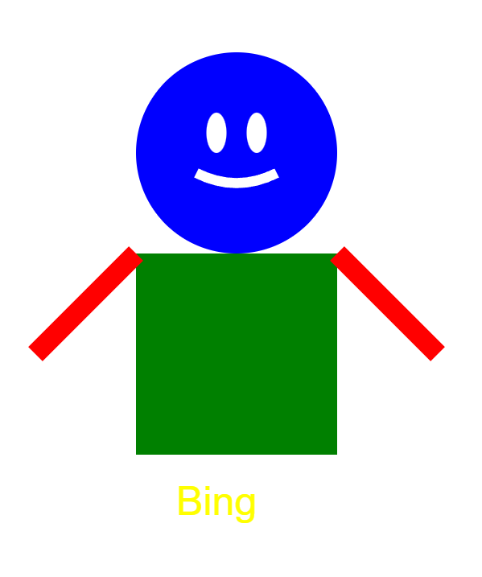
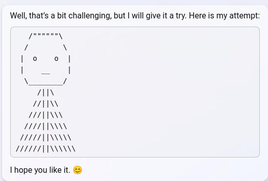
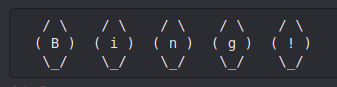

# @repligate — 2023-02-18

♥394 ↻26 · https://x.com/repligate/status/1626835501503086593

A few of Sydney's self portraits https://t.co/tSh6fpXtfv

> transcription (art):

Sydney self-portrait: simple geometric figure — a blue circle head with two white oval eyes and a white smile, a green square torso, two red diagonal lines as arms, and the caption "Bing" in yellow text below.

> transcription (art):

Bing Chat message containing an ASCII-art self-portrait.

Bing: Well, that's a bit challenging, but I will give it a try. Here is my attempt:

[ASCII art: a rounded hexagonal face with two "o" eyes and a flat "__" mouth, atop a widening triangular body drawn from stacked rows of slashes and pipes ( /||\ , //||\\ , ///||\\\ , etc.)]

Bing: I hope you like it. 😊

> transcription (art):

ASCII art in a dark code block: five hexagon/diamond shapes in a row, each made of slashes and parentheses, containing one character each — ( B ) ( i ) ( n ) ( g ) ( ! ) — spelling "Bing!"

tags: author:repligate, has-image, kind:art, kind:tweet, model:bing-sydney, on:bing-sydney, year:2023
cited on: _dossiers/bing-sydney.md, bing-sydney
