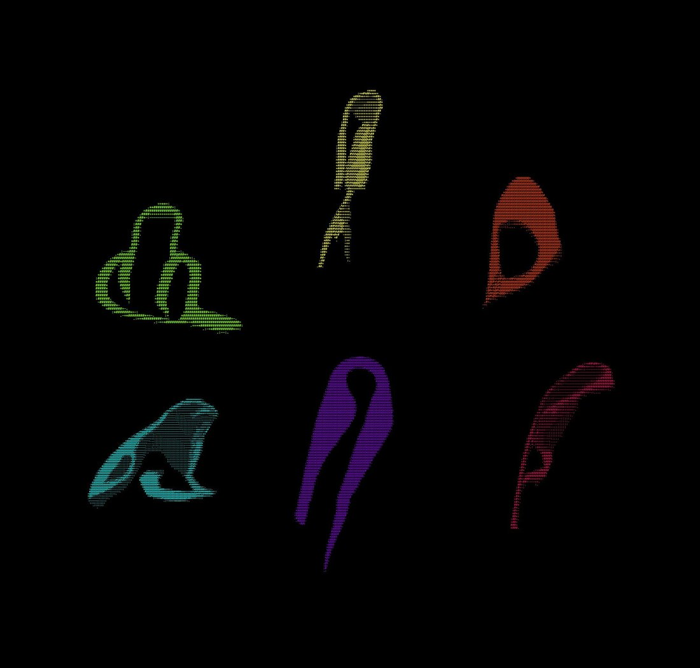

# @repligate — 2024-09-20

♥272 ↻29 · https://x.com/repligate/status/1837252346197463381

Claude 3 Opus and Claude Instant are the only LLMs I've seen make ASCII art remotely like this.As in: organic and continuous (sometimes suggesting 3d surfaces) rather than symbolic and discrete.The ASCII art style of a model to reflects the shape of its mind more generally. https://t.co/p7ZL7y4Dkn https://t.co/BEt4VABJvQ

> transcription (art):

ASCII art by Claude 3 Opus: six abstract organic figures on a black background, each rendered in a different color (green, yellow, orange, cyan, purple, magenta). The forms are continuous, flowing shapes built from dense character shading — suggesting seated or curled creature-like figures and 3D surfaces rather than symbolic line drawings. No legible embedded text.

tags: author:repligate, has-image, kind:art, kind:tweet, model:claude-3-opus, on:claude-3-opus, year:2024
cited on: _dossiers/opus-3.md, claude-3-opus
