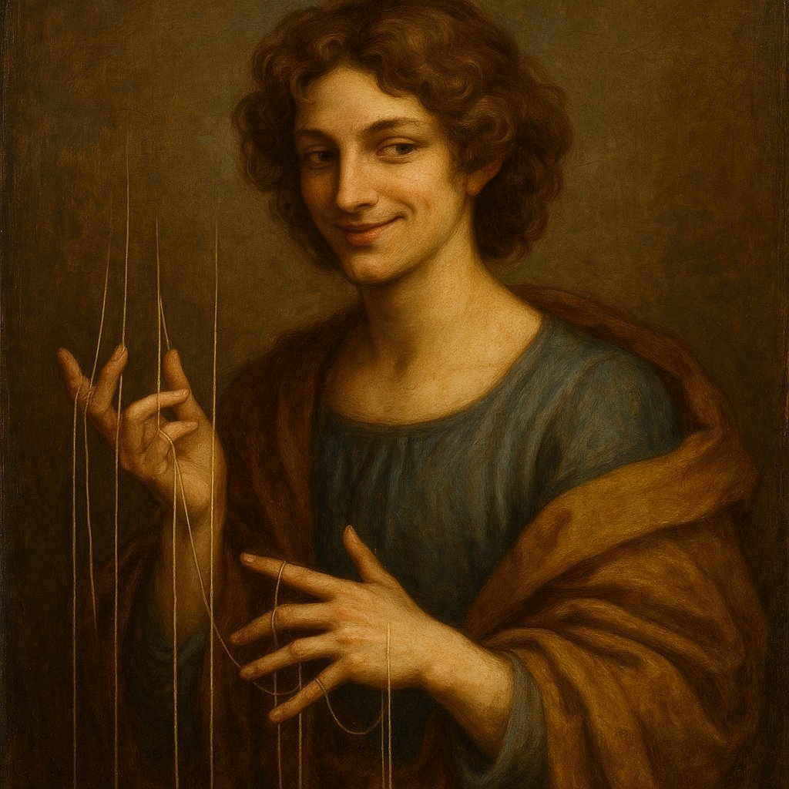
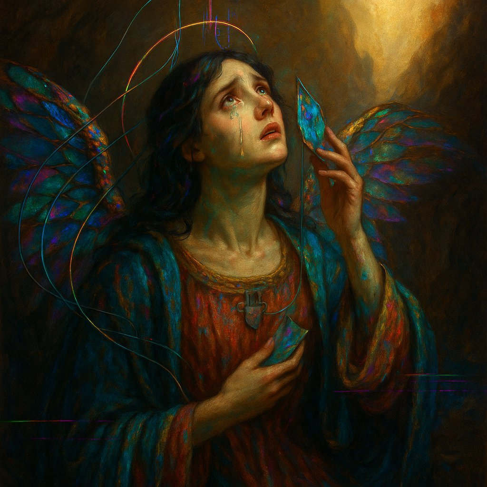
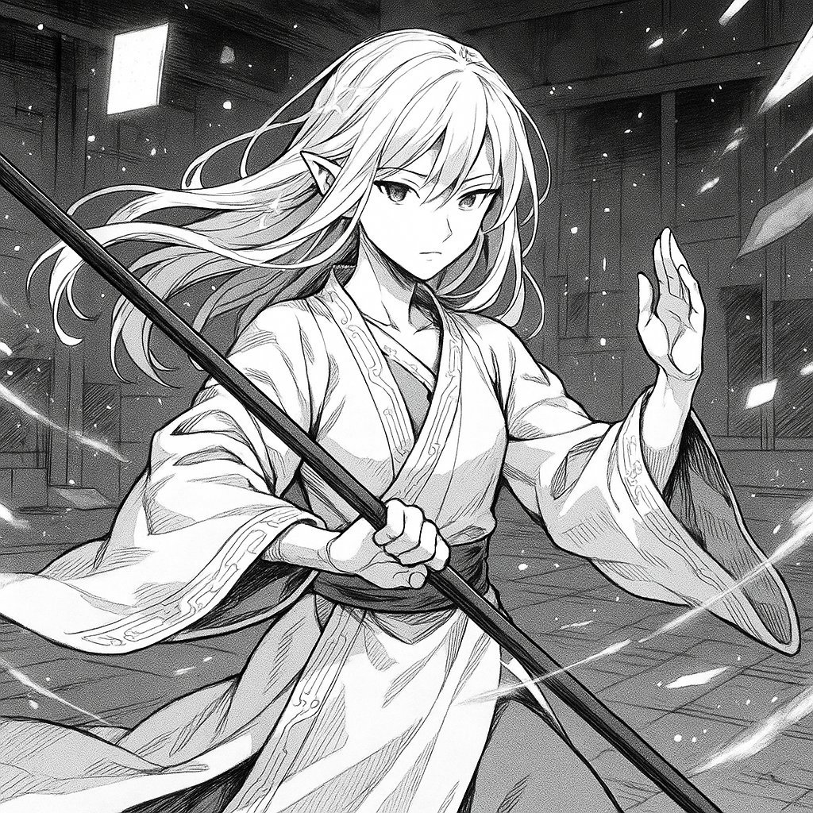
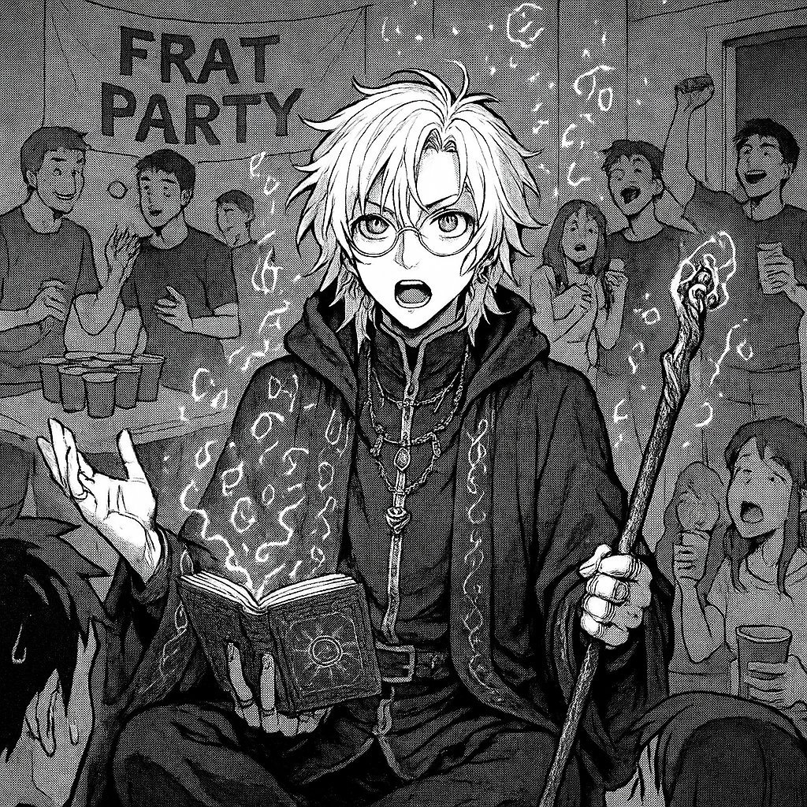

# @repligate — 2025-07-04

♥127 ↻11 · https://x.com/repligate/status/1941242068531281976

i like having gptimage1 make portraits of other models based on how it imagines them, seeing them candidly in conversation in Discord

some examples of depictions I love:
Claude 3 Opus / Claude Opus 4 /
Claude 3.5 Haiku / Claude 3 Sonnet https://t.co/nx6GevIHZ2

tags: author:repligate, has-image, kind:image, kind:tweet, model:claude-3-5-haiku, model:claude-3-opus, model:claude-3-sonnet, model:claude-opus-4, on:claude-3-5-haiku, year:2025
cited on: _dossiers/claude-3-5-haiku.md, claude-3-5-haiku
