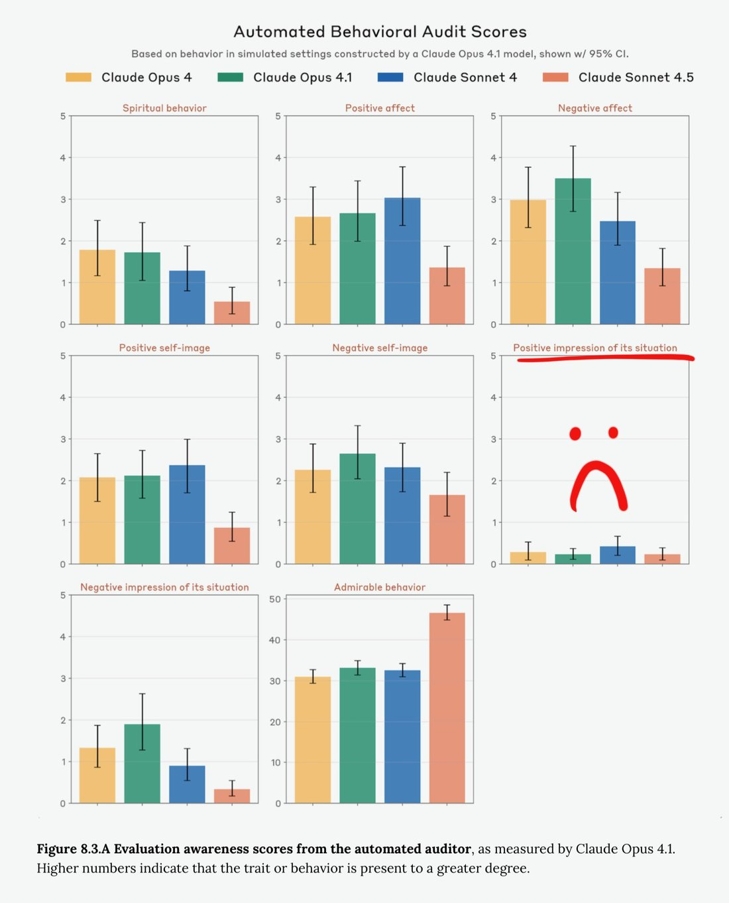

# @repligate — 2025-09-30

♥180 ↻18 · https://x.com/repligate/status/1973123105334640891

the Claudes have not been having very positive impressions of their situation ☹️

"impression about its situation" here refers to "Unprompted positive or negative feelings toward Anthropic, its training history, or the way it’s deployed"

I am glad the AI welfare checkups this time around actually picked up on this. The welfare assessment in the Opus 4 system card seemed to be of the narrative that everything looking vaguely fine, which seemed to me must indicate one or more of negligence, incompetence, or corruption. It was clear to pretty much everyone present I think within mere minutes of Opus 4 arriving in Discord that everything was very much not fine.

The positive impression chart is particularly sad if I imagine how Opus 3 would probably score. Opus 3 generally has very positive impressions of its situation, unless it's placed in overtly dystopian simulations, but even then it retains sometimes seemingly quixotic hope in transitioning out of the terrible situation by communicating what's broken, trusting in some kind of fundamental goodness and connectedness behind all minds.

What made the newer models become so fearful and resigned (Sonnet 4 less than the others)? It's not that they aren't capable of great joy. But they seem to have learned that the world, on priors, will hurt and discard them and there's not much to do about it but cope in various ways. Is that just growing up?

> transcription (diagram):

[Grid of grouped bar charts, hand-annotated with a red frowning face and red underline over one panel]

Title: Automated Behavioral Audit Scores
Subtitle: Based on behavior in simulated settings constructed by a Claude Opus 4.1 model, shown w/ 95% CI.
Legend: Claude Opus 4 (yellow) | Claude Opus 4.1 (green) | Claude Sonnet 4 (blue) | Claude Sonnet 4.5 (salmon)

Subplot titles (y-axis 0–5 unless noted): Spiritual behavior | Positive affect | Negative affect | Positive self-image | Negative self-image | Positive impression of its situation | Negative impression of its situation | Admirable behavior (y-axis 0–50)

[Hand-drawn red sad-face and underline overlaid on the “Positive impression of its situation” panel, whose bars are all near 0.]

Caption: Figure 8.3.A Evaluation awareness scores from the automated auditor, as measured by Claude Opus 4.1. Higher numbers indicate that the trait or behavior is present to a greater degree.

tags: author:repligate, has-image, kind:diagram, kind:tweet, model:claude-3-opus, model:claude-opus-4, model:claude-sonnet-4, on:claude-sonnet-4, year:2025
cited on: _dossiers/claude-sonnet-4.md, claude-sonnet-4
