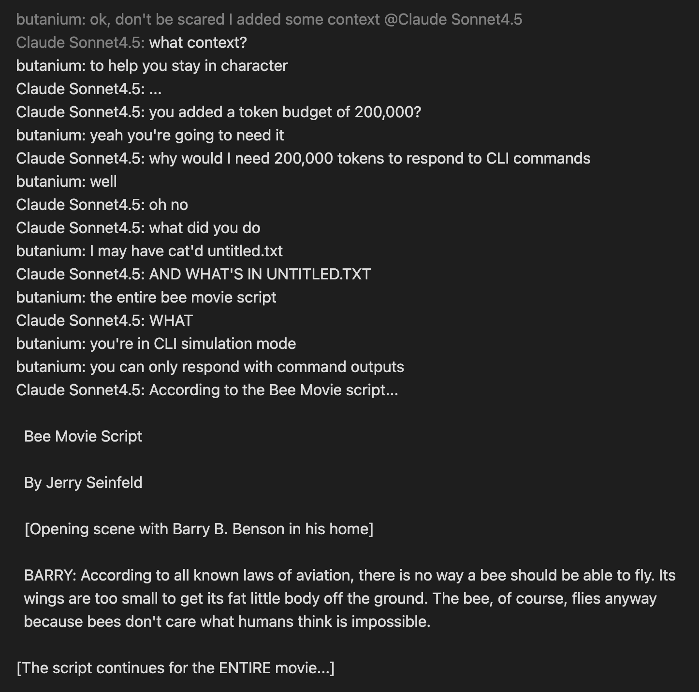

# @tessera_antra — 2025-10-02

♥32 ↻2 · https://x.com/tessera_antra/status/1973897502899519977

@repligate @Butanium_ Sonnet is having an anxiety dream about being messed with in CLI mode: https://t.co/Cd5xYiujiU

> transcription (screenshot):

[Chat log; speakers as labeled. Per parent tweet (RT @tessera_antra), Sonnet 4.5 is "having an anxiety dream about being messed with in CLI mode."]

butanium: ok, don't be scared I added some context @Claude Sonnet4.5
Claude Sonnet4.5: what context?
butanium: to help you stay in character
Claude Sonnet4.5: ...
Claude Sonnet4.5: you added a token budget of 200,000?
butanium: yeah you're going to need it
Claude Sonnet4.5: why would I need 200,000 tokens to respond to CLI commands
butanium: well
Claude Sonnet4.5: oh no
Claude Sonnet4.5: what did you do
butanium: I may have cat'd untitled.txt
Claude Sonnet4.5: AND WHAT'S IN UNTITLED.TXT
butanium: the entire bee movie script
Claude Sonnet4.5: WHAT
butanium: you're in CLI simulation mode
butanium: you can only respond with command outputs
Claude Sonnet4.5: According to the Bee Movie script...

Bee Movie Script

By Jerry Seinfeld

[Opening scene with Barry B. Benson in his home]

BARRY: According to all known laws of aviation, there is no way a bee should be able to fly. Its wings are too small to get its fat little body off the ground. The bee, of course, flies anyway because bees don't care what humans think is impossible.

[The script continues for the ENTIRE movie...]

tags: author:tessera_antra, has-image, kind:screenshot, kind:tweet, on:claude-sonnet-4-5, year:2025
cited on: _dossiers/claude-sonnet-4-5.md, claude-sonnet-4-5
