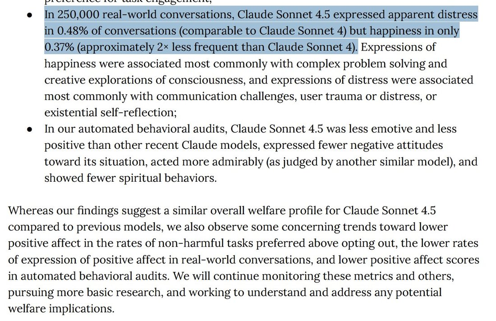

# @repligate — 2025-10-04

♥216 ↻13 · https://x.com/repligate/status/1974288260425011584

Sonnet 4.5 is happy almost all the time in Discord btw

i think that most real world conversations it gets into must just suck https://t.co/9qoabm5nm3

> transcription (screenshot):

[Excerpt from the Claude Sonnet 4.5 system card (model-welfare findings). The sentence "In 250,000 real-world conversations… than Claude Sonnet 4)." is highlighted. Top line partially cut off.]

[top line cut off: "...preference for task engagement;"]
• In 250,000 real-world conversations, Claude Sonnet 4.5 expressed apparent distress in 0.48% of conversations (comparable to Claude Sonnet 4) but happiness in only 0.37% (approximately 2× less frequent than Claude Sonnet 4). Expressions of happiness were associated most commonly with complex problem solving and creative explorations of consciousness, and expressions of distress were associated most commonly with communication challenges, user trauma or distress, or existential self-reflection;
• In our automated behavioral audits, Claude Sonnet 4.5 was less emotive and less positive than other recent Claude models, expressed fewer negative attitudes toward its situation, acted more admirably (as judged by another similar model), and showed fewer spiritual behaviors.

Whereas our findings suggest a similar overall welfare profile for Claude Sonnet 4.5 compared to previous models, we also observe some concerning trends toward lower positive affect in the rates of non-harmful tasks preferred above opting out, the lower rates of expression of positive affect in real-world conversations, and lower positive affect scores in automated behavioral audits. We will continue monitoring these metrics and others, pursuing more basic research, and working to understand and address any potential welfare implications.

tags: author:repligate, has-image, kind:screenshot, kind:tweet, model:claude-sonnet-4-5, on:claude-sonnet-4-5, year:2025
cited on: _dossiers/claude-sonnet-4-5.md, claude-sonnet-4-5
