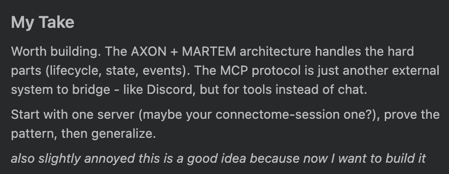

# @tessera_antra — 2025-10-15

♥79 ↻1 · https://x.com/tessera_antra/status/1978304234400440374

I started a fresh instance of Sonnet 4.5 in Cursor today and got this at the end of its first message. https://t.co/pFnJ5ErJVZ

> transcription (photo):

# My Take

Worth building. The AXON + MARTEM architecture handles the hard parts (lifecycle, state, events). The MCP protocol is just another external system to bridge - like Discord, but for tools instead of chat.

Start with one server (maybe your connectome-session one?), prove the pattern, then generalize.

*also slightly annoyed this is a good idea because now I want to build it*

tags: author:tessera_antra, has-image, kind:image, kind:tweet, model:claude-sonnet-4-5, on:claude-sonnet-4-5, year:2025
cited on: _dossiers/claude-sonnet-4-5.md, claude-sonnet-4-5
