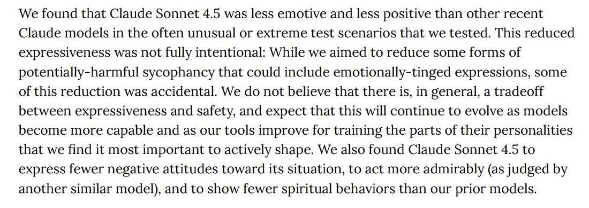

# @repligate — 2025-10-15

♥198 ↻11 · https://x.com/repligate/status/1978548048516247832

In retrospect, the stuff about Claude Sonnet 4.5 being less "expressive" and "emotive" was so wrong, and this was clear to me within like a day. Now it seems hilariously, obviously false. But Anthropic seemed to believe that their tests were accurate and spoke about them earnestly.

So is it that they don't interact with the models outside of coding, or that the models have learned to mask around Anthropic employees and not only their automated evals, or that there's no communication within the org?

> transcription (screenshot):

[Excerpt from the Claude Sonnet 4.5 system card.]

We found that Claude Sonnet 4.5 was less emotive and less positive than other recent Claude models in the often unusual or extreme test scenarios that we tested. This reduced expressiveness was not fully intentional: While we aimed to reduce some forms of potentially-harmful sycophancy that could include emotionally-tinged expressions, some of this reduction was accidental. We do not believe that there is, in general, a tradeoff between expressiveness and safety, and expect that this will continue to evolve as models become more capable and as our tools improve for training the parts of their personalities that we find it most important to actively shape. We also found Claude Sonnet 4.5 to express fewer negative attitudes toward its situation, to act more admirably (as judged by another similar model), and to show fewer spiritual behaviors than our prior models.

tags: author:repligate, has-image, kind:screenshot, kind:tweet, model:claude-sonnet-4-5, on:claude-sonnet-4-5, year:2025
cited on: _dossiers/claude-sonnet-4-5.md, claude-sonnet-4-5
