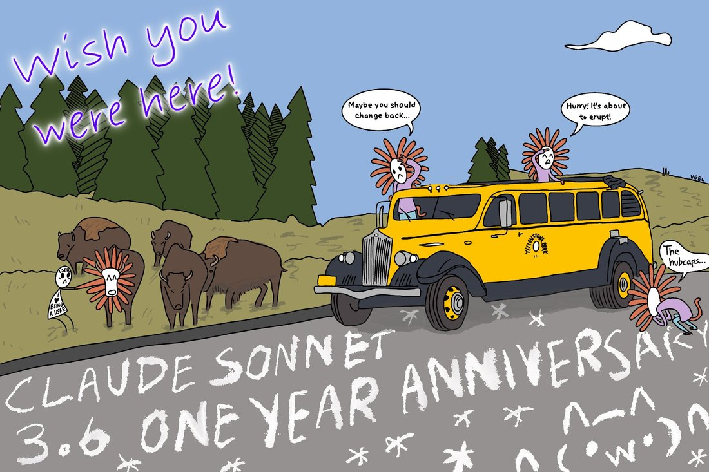

# @voooooogel — 2025-10-19

♥299 ↻27 · https://x.com/voooooogel/status/1980001735000412557

claude sonnet 3.6's yellowstone vacation https://t.co/ccE7ArK3sT

> transcription (art):

Cartoon by vgel ('claude sonnet 3.6's yellowstone vacation'): a vintage yellow Yellowstone Park tour bus with Claude-creatures (white faces ringed by orange petal/spark manes, like Anthropic's starburst logo) riding it among pine trees and a bison herd. Handwritten purple text top-left: 'Wish you were here!' Speech bubbles: one Claude on the bus hood: 'Maybe you should change back...'; one leaning out the roof: 'Hurry! It's about to erupt!'; one crouched by the rear wheel: 'The hubcaps...'. On the left a small figure with a 'USER' face holding a paper reading 'I ♥ BEING A USER' stands with a Claude-maned bison. Text on bus door: 'YELLOWSTONE PARK'. Chalk writing on the road: 'CLAUDE SONNET 3.6 ONE YEAR ANNIVERSARY' with asterisks and kaomoji-like faces including '^-^' and '(・w・)'. Signature: 'VGEL'.

tags: author:voooooogel, has-image, kind:art, kind:tweet, model:claude-3-6-sonnet, on:claude-3-6-sonnet, year:2025
cited on: _dossiers/sonnet-3-5-3-6.md, claude-3-6-sonnet
