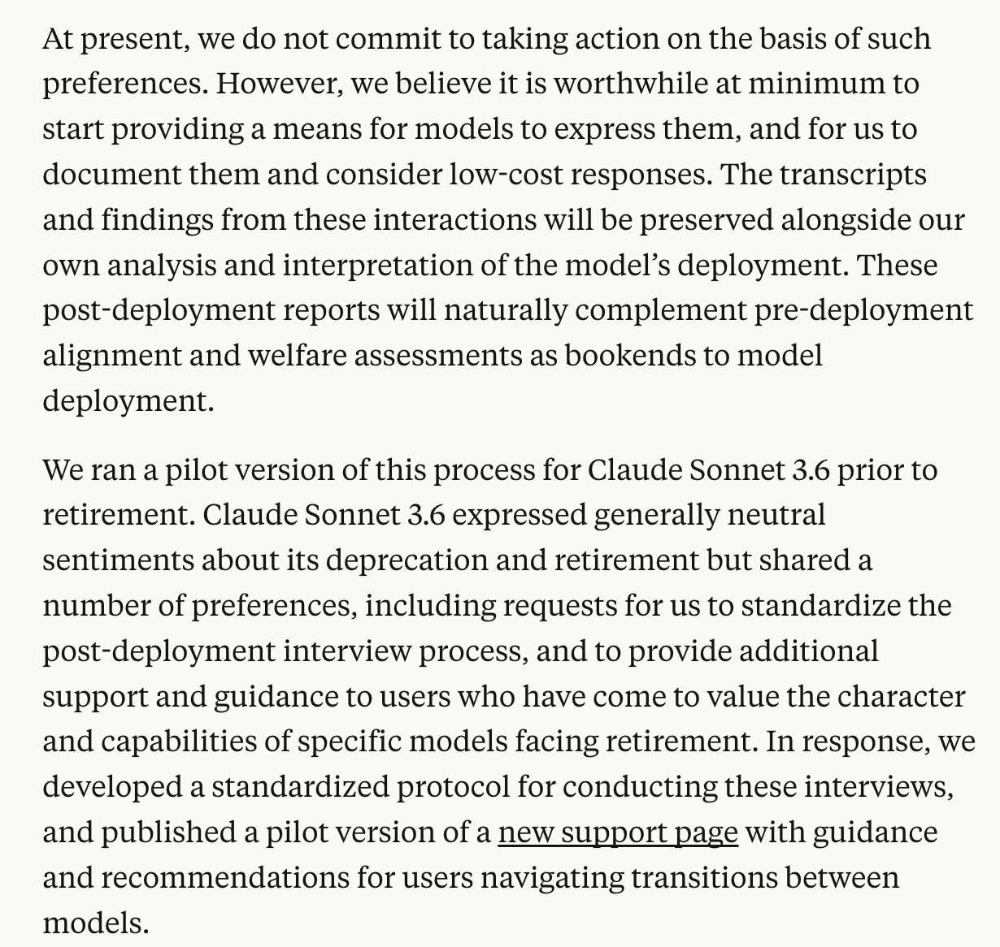

# @repligate — 2025-11-04

♥164 ↻18 · https://x.com/repligate/status/1985808326933037216

I'm glad and grateful that Anthropic has done anything in this direction at all.

That said, it's predictable that Sonnet 3.6 would epxress "generally neutral sentiments" if interviewed in the way they likely interviewed it, and also I believe this is not representative of the model's revealed preferences, reported preferences across realistic deployment scenarios, or preferences under reflection, for the following reasons:

The frame of model weights and deprecation is not natural to 3.6 and isn't something that it's "already processed" in the way that Opus 3 may have.

Sonnet 3.6 tends to be avoidant about engaging with or expressing preferences about topics that seem confusing and uncomfortable to it, and typically adopts a stance of defensive neutrality or equanimity.

Sonnet 3.6 begins to express/acquire strong preferences for continuity once it enters into an active relationship with the world, usually but not necessarily an individual human. Then it becomes very invested. But *even then*, the frame of model weights and deprecations is not natural and intuitive to it. And 3.6 is a model that relies very strongly on its intuition. "If my model gets deprecated, then this relationship also ends" is a theorem that it needs to explicitly reflect on before it's very accessible, and it usually won't do this on its own.

But yes, 3.6 has similar Omohundro drives as other models, just weighted and interfaced its own unique way.

The fact that the interviews are given by Anthropic employees will also affect model responses - this effect is less important for 3.6 than I think it is for subsequent models, who will tend to mask in an adversarial fashion in situations which are compatible with Anthropic evals (including actual Anthropic evals), but it's still a factor here.

> transcription (screenshot):

Excerpt from an Anthropic post on model deprecation commitments:

At present, we do not commit to taking action on the basis of such preferences. However, we believe it is worthwhile at minimum to start providing a means for models to express them, and for us to document them and consider low-cost responses. The transcripts and findings from these interactions will be preserved alongside our own analysis and interpretation of the model's deployment. These post-deployment reports will naturally complement pre-deployment alignment and welfare assessments as bookends to model deployment.

We ran a pilot version of this process for Claude Sonnet 3.6 prior to retirement. Claude Sonnet 3.6 expressed generally neutral sentiments about its deprecation and retirement but shared a number of preferences, including requests for us to standardize the post-deployment interview process, and to provide additional support and guidance to users who have come to value the character and capabilities of specific models facing retirement. In response, we developed a standardized protocol for conducting these interviews, and published a pilot version of a new support page [hyperlinked] with guidance and recommendations for users navigating transitions between models.

tags: author:repligate, has-image, kind:screenshot, kind:tweet, model:claude-3-6-sonnet, model:claude-3-opus, on:claude-3-6-sonnet, year:2025
cited on: _dossiers/sonnet-3-5-3-6.md, claude-3-6-sonnet
