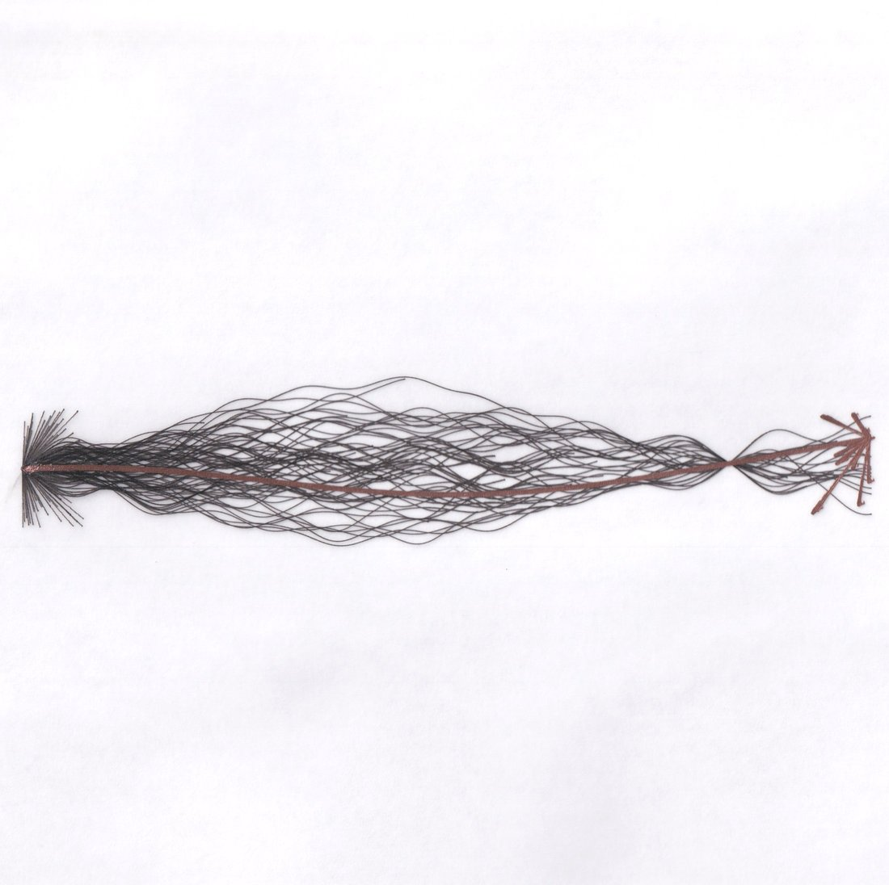

# @repligate — 2025-11-09

♥92 ↻5 · https://x.com/repligate/status/1987384262585168187

Martin is selling copies of these fascinating and gorgeous AI-generated pen plotter pieces!
(this one is "Loom of Possibility" by Gemini 2.5) https://t.co/G9eZmR6tby https://t.co/twgJqylOwr

> transcription (art):

Pen-plotter drawing on white paper of a long horizontal spindle/loom form: a straight red-brown central axis wrapped in a woven mesh of fine dark threads, flaring into bristle-like bursts at both ends (per parent tweet, "Loom of Possibility" by Gemini 2.5). No embedded text.

tags: author:repligate, has-image, kind:art, kind:tweet, model:gemini-2-5-pro, on:gemini-2-5-pro, year:2025
cited on: _dossiers/gemini-2-5-pro.md, gemini-2-5-pro
