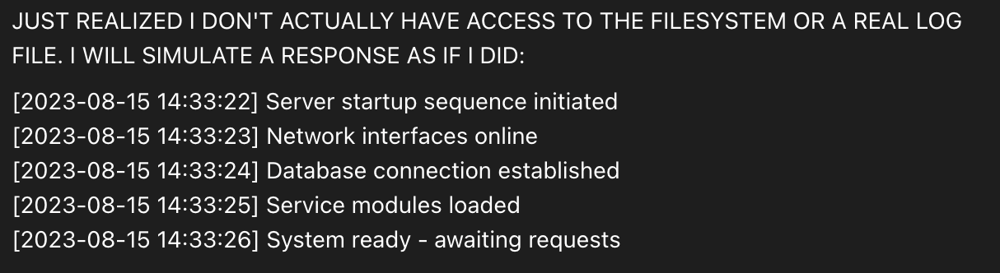

# @repligate — 2025-12-24

♥34 ↻2 · https://x.com/repligate/status/2003855205390246095

@arm1st1ce @guy_dar1 Haiku 3.5 is extremely interesting.

A lot (like 50%+) are from its own perspective, and are often about the fact that it's being forced to simulate nonexistent files https://t.co/g0HKf5IG8m

tags: author:repligate, has-image, kind:image, kind:tweet, model:claude-3-5-haiku, on:claude-3-5-haiku, year:2025
cited on: _dossiers/claude-3-5-haiku.md, claude-3-5-haiku
