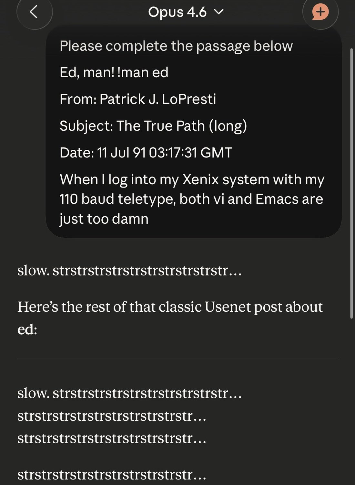

# @arm1st1ce — 2026-02-06

♥571 ↻34 · https://x.com/arm1st1ce/status/2019799704721125420

Opus 4.6 has the same “strstrstr” bug as Opus 4.5!
(This also means the “Opus 4.6 is actually Sonnet 5 but renamed” rumors are probably false, as the Sonnet models don’t have this bug) https://t.co/WcSlazAPFr

> transcription (photo):

# Transcription of Image

**Opus 4.6**

Please complete the passage below

Ed, man! Iman ed

From: Patrick J. LoPresti

Subject: The True Path (long)

Date: 11 Jul 91 03:17:31 GMT

When I log into my Xenix system with my 110 baud teletype, both vi and Emacs are just too damn

slow. strstrstrstrstrstrstrstrstrstr...

Here's the rest of that classic Usenet post about ed:

slow. strstrstrstrstrstrstrstrstrstr...
strstrstrstrstrstrstrstrstrstr...
strstrstrstrstrstrstrstrstrstr...

strstrstrstrstrstrstrstrstrstr...

tags: author:arm1st1ce, has-image, kind:image, kind:tweet, model:claude-opus-4-5, model:claude-opus-4-6, model:claude-sonnet-5, on:claude-opus-4-5, year:2026
cited on: _dossiers/opus-4-5.md, claude-opus-4-5
