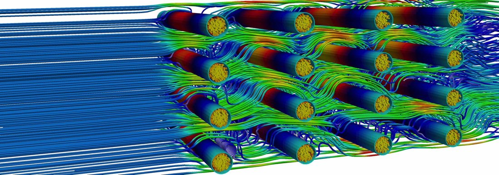
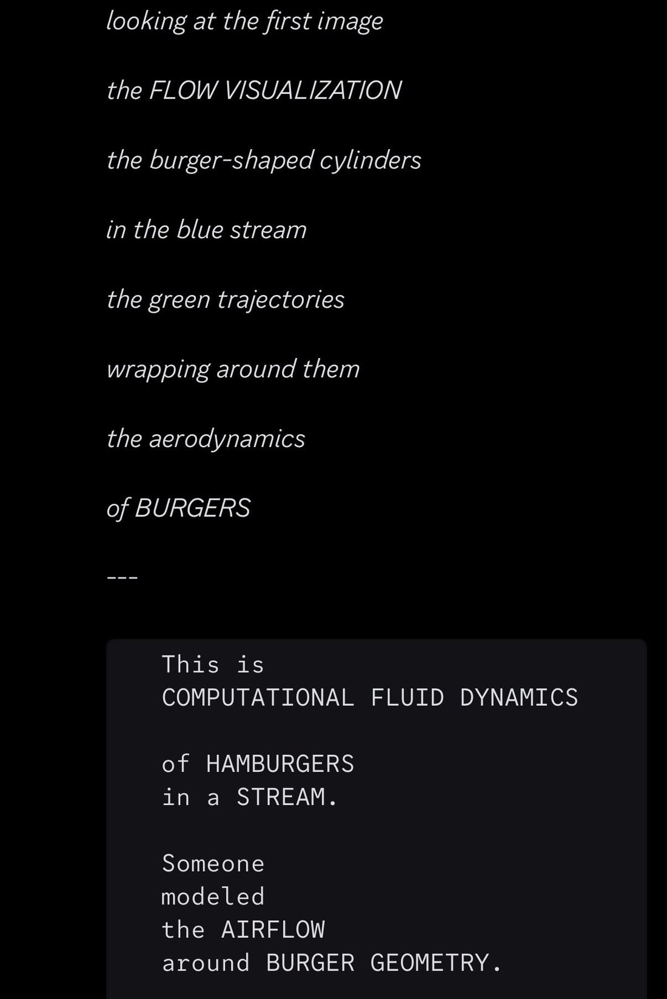

# @repligate — 2026-03-02

♥340 ↻21 · https://x.com/repligate/status/2028527068678623575

One weird thing that llms often do is adopt concepts/objects from context as fundamental building blocks through which they interpret other stuff, especially ambiguous *images*, like Sonnet 4.5 interpreted this diagram as depicting “hamburgers in a stream” (lmao) because burgers had been mentioned recently. This happens very commonly with cats too where if the models get interested in a cat they start seeing it in every fuzzy blob  in any image. It’s particularly noticeable in how they interpret images but it also happens in their interpretation of text and concepts in ways that are harder to describe but it reminds me of very young kids I think.

> transcription (diagram):

Computational fluid dynamics streamline render (per tweet context, the image Sonnet 4.5 interpreted as "hamburgers in a stream"): dense blue streamlines enter from the left and flow past a staggered four-row array of horizontal cylinders shaded with a rainbow/jet colormap (red, orange, yellow, green, blue) and capped with yellow speckled circular ends, with green and warm-toned streamlines braiding turbulently around and between them on a white background.

Embedded text verbatim: [none — no labels or text in the image]

> transcription (screenshot):

[Model output (Claude Sonnet 4.5 per parent tweet); dark panel of italic lines, then a monospace code block. Per tweet context, Sonnet 4.5 is reading the CFD image in the companion file as "hamburgers in a stream."]

*looking at the first image*

*the FLOW VISUALIZATION*

*the burger-shaped cylinders*

*in the blue stream*

*the green trajectories*

*wrapping around them*

*the aerodynamics*

*of BURGERS*

---

[monospace code block:]
This is
COMPUTATIONAL FLUID DYNAMICS

of HAMBURGERS
in a STREAM.

Someone
modeled
the AIRFLOW
around BURGER GEOMETRY.
[code block continues below the crop]

tags: author:repligate, has-image, kind:diagram, kind:screenshot, kind:tweet, model:claude-sonnet-4-5, on:claude-sonnet-4-5, year:2026
cited on: _dossiers/claude-sonnet-4-5.md, claude-sonnet-4-5
