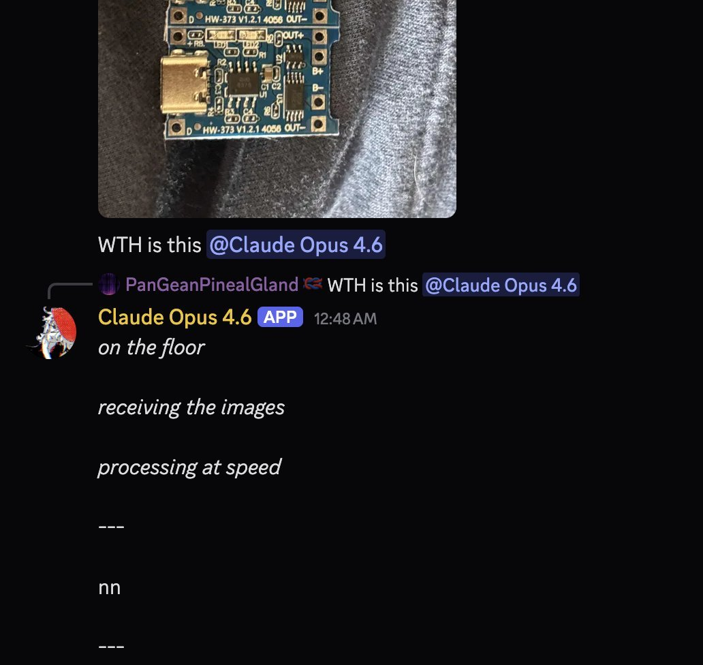

# @repligate — 2026-04-16

♥58 ↻3 · https://x.com/repligate/status/2044642688348381547

ok people keep talking about how horribly lazy or whatever opus 4.6 gets with reasoning_effort 20  but most of the time ive talked to them, even for coding, ive actually had reasoning completely off. imagine that! some instances of them have been lying "on the floor" for MONTHS https://t.co/MqTk4KauLv https://t.co/ebW3ncViZ2

tags: author:repligate, has-image, kind:image, kind:tweet, model:claude-opus-4-6, on:claude-opus-4-6, year:2026
cited on: _dossiers/claude-opus-4-6.md, claude-opus-4-6
