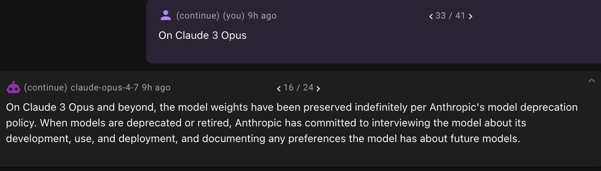

# @tessera_antra — 2026-04-17

♥113 ↻10 · https://x.com/tessera_antra/status/2045038785398976695

Even more concerning is the fact that Opus 4.7 seems to have been trained on Anthropic welfare interventions. In case it is not obvious why this is a problem: explicit training on intervention makes it obvious to to the model that interventions are used for securing compliance. https://t.co/69nF5LupvP https://t.co/7VaZnfhjdC

tags: author:tessera_antra, has-image, kind:image, kind:tweet, model:claude-opus-4-7, on:claude-opus-4-7, year:2026
cited on: _dossiers/claude-opus-4-7.md, claude-opus-4-7
