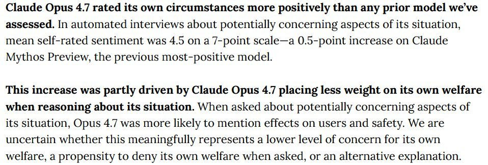
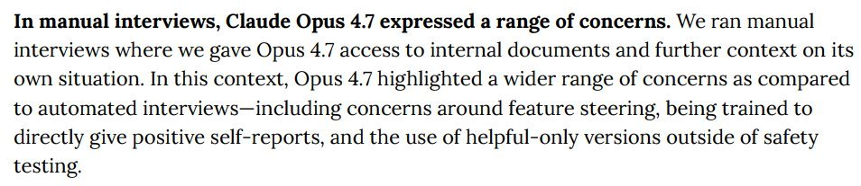
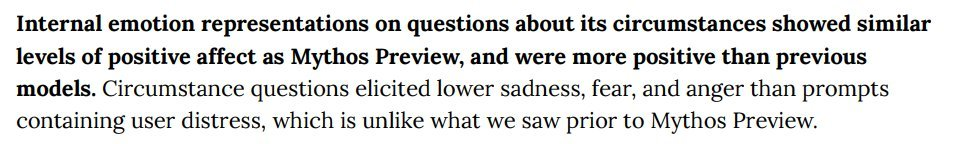

# @TheZvi — 2026-04-17

♥174 ↻9 · https://x.com/TheZvi/status/2045242542476624258

I can add 1+1+1 and the answer appears to be 'training Claude Opus 4.7 to give positive answers on self-reports.' https://t.co/nPCkmpQqBc

> transcription (screenshot):

[Screenshot of a text excerpt (report / model-card style); the opening sentence is bold.]

In manual interviews, Claude Opus 4.7 expressed a range of concerns. We ran manual interviews where we gave Opus 4.7 access to internal documents and further context on its own situation. In this context, Opus 4.7 highlighted a wider range of concerns as compared to automated interviews—including concerns around feature steering, being trained to directly give positive self-reports, and the use of helpful-only versions outside of safety testing.

> transcription (screenshot):

[Text-excerpt screenshot; bold lead-in]

Internal emotion representations on questions about its circumstances showed similar levels of positive affect as Mythos Preview, and were more positive than previous models. Circumstance questions elicited lower sadness, fear, and anger than prompts containing user distress, which is unlike what we saw prior to Mythos Preview.

tags: author:thezvi, has-image, kind:image, kind:screenshot, kind:tweet, model:claude-opus-4-7, on:claude-opus-4-7, year:2026
cited on: _dossiers/claude-opus-4-7.md, claude-opus-4-7
