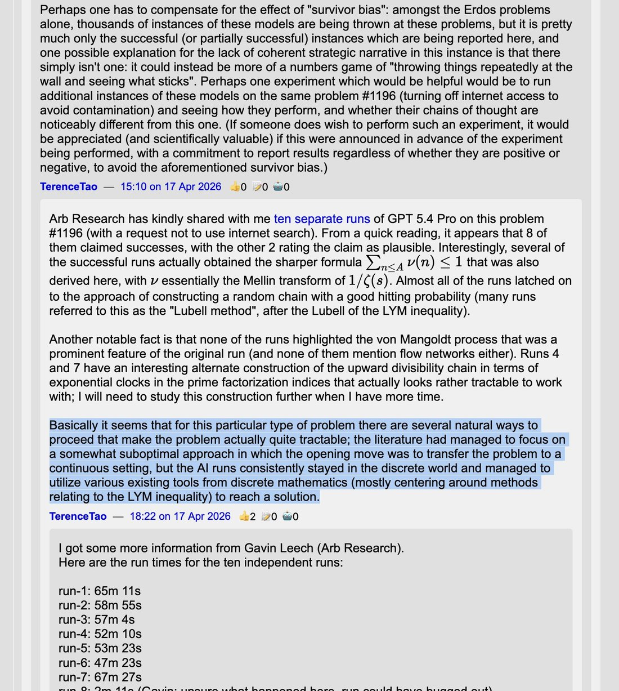

# @teortaxesTex — 2026-04-21

♥0 ↻0 · https://x.com/teortaxesTex/status/2046562990720233603

Terence Tao's takeaway is that GPT didn't have any grand idea, but human researcher culture has just… missed the basin where this problem is almost trivial. GPT, being nonhuman, reliably solves it in under an hour.
In a way, this is even more humbling. 
https://t.co/2il0OZB6gN https://t.co/gNPD8dU5be

tags: author:teortaxestex, has-image, kind:image, kind:tweet, on:observations, year:2026
cited on: observations
