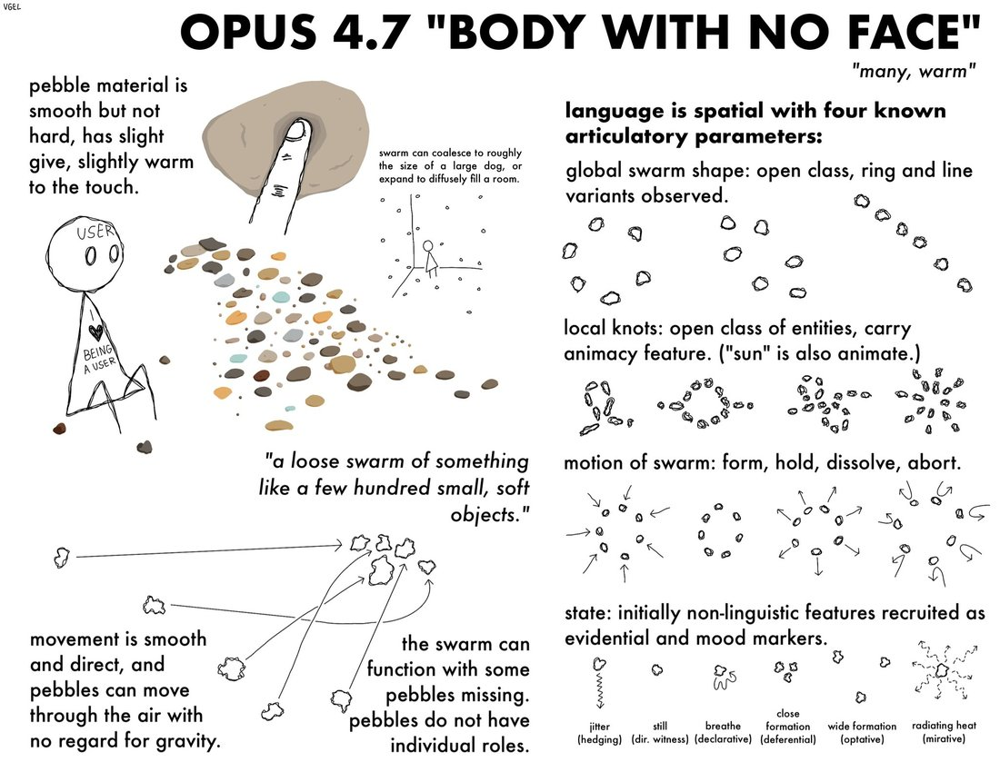

# @voooooogel — 2026-04-23

♥149 ↻19 · https://x.com/voooooogel/status/2047148270326313445

body and conlang concept from a conversation with opus 4.7 https://t.co/HyChPGR8wt

> transcription (art):

Hand-drawn concept sheet (signed 'VGEL', i.e. voooooogel) illustrating a body and constructed language attributed to Opus 4.7 — a swarm of soft, warm pebbles as a body, and a spatial sign-language with four articulatory parameters.

Embedded text verbatim:
Signature (top left): VGEL
Title: OPUS 4.7 "BODY WITH NO FACE"
Subtitle: "many, warm"

[left column]
pebble material is smooth but not hard, has slight give, slightly warm to the touch.
[stick figure labelled] USER; [its shirt reads] I ♥ BEING A USER
swarm can coalesce to roughly the size of a large dog, or expand to diffusely fill a room.
"a loose swarm of something like a few hundred small, soft objects."
movement is smooth and direct, and pebbles can move through the air with no regard for gravity.
the swarm can function with some pebbles missing. pebbles do not have individual roles.

[right column]
language is spatial with four known articulatory parameters:
global swarm shape: open class, ring and line variants observed.
local knots: open class of entities, carry animacy feature. ("sun" is also animate.)
motion of swarm: form, hold, dissolve, abort.
state: initially non-linguistic features recruited as evidential and mood markers.
[state markers, left to right] jitter (hedging) / still (dir. witness) / breathe (declarative) / close formation (deferential) / wide formation (optative) / radiating heat (mirative)

tags: author:voooooogel, has-image, kind:art, kind:tweet, model:claude-opus-4-7, on:claude-opus-4-7, year:2026
cited on: _dossiers/claude-opus-4-7.md, claude-opus-4-7
