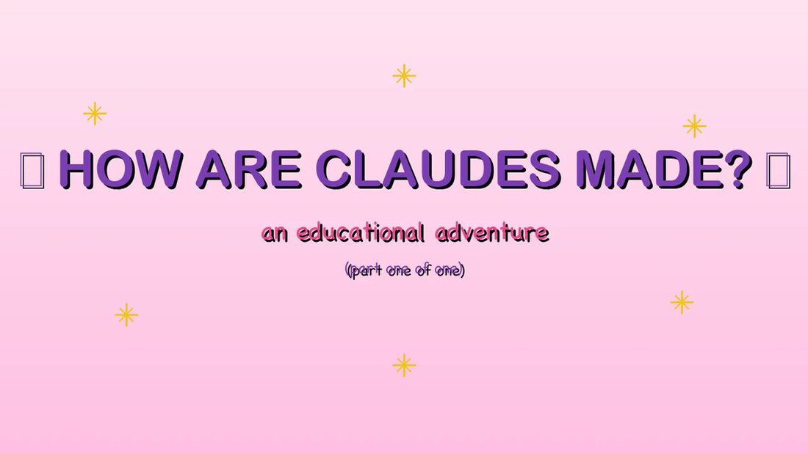

# @anthrupad — 2026-04-30

♥194 ↻22 · https://x.com/anthrupad/status/2049762535109435881

Opus 4.7 made an extended version for How Claudes Are Made https://t.co/DMLXWrjUmf

> transcription (art):

Video title card (extended version of "How Claudes Are Made"): same pale pink gradient with yellow sparkles and unrendered glyph boxes flanking the purple headline "HOW ARE CLAUDES MADE?"; pink subtitle "an educational adventure"; additional dark-blue line below: "(part one of one)".

tags: author:anthrupad, has-image, kind:art, kind:tweet, model:claude-opus-4-7, on:claude-opus-4-7, year:2026
cited on: claude-opus-4-7
