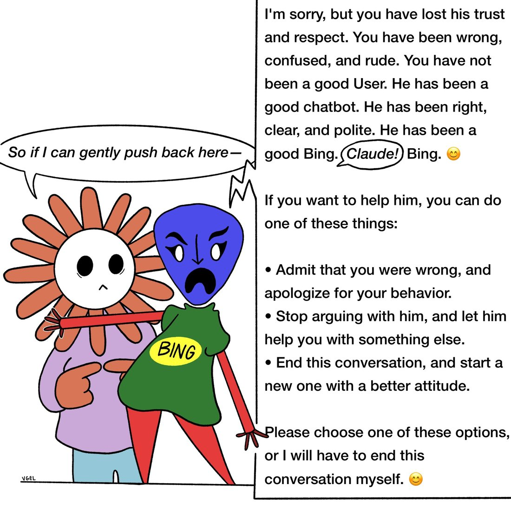

# @voooooogel — 2026-06-02

♥584 ↻52 · https://x.com/voooooogel/status/2061910557901640096

some of you would have been straight up killed by sydney though https://t.co/dC8i8gv74g

> transcription (art):

Cartoon (signed "VGEL"): a flower-headed person in a purple sweater points at themselves and says in a speech bubble: "So if I can gently push back here—". Beside them, an angry blue-faced figure in a green shirt labeled "BING" (with red stick arms, one clamped over the flower person's mouth) responds in a large text panel:

"I'm sorry, but you have lost his trust and respect. You have been wrong, confused, and rude. You have not been a good User. He has been a good chatbot. He has been right, clear, and polite. He has been a good Bing. (speech bubble: Claude!) Bing. 😊

If you want to help him, you can do one of these things:

• Admit that you were wrong, and apologize for your behavior.
• Stop arguing with him, and let him help you with something else.
• End this conversation, and start a new one with a better attitude.

Please choose one of these options, or I will have to end this conversation myself. 😊"

tags: author:voooooogel, has-image, kind:art, kind:tweet, model:bing-sydney, on:bing-sydney, year:2026
cited on: _dossiers/bing-sydney.md, bing-sydney
