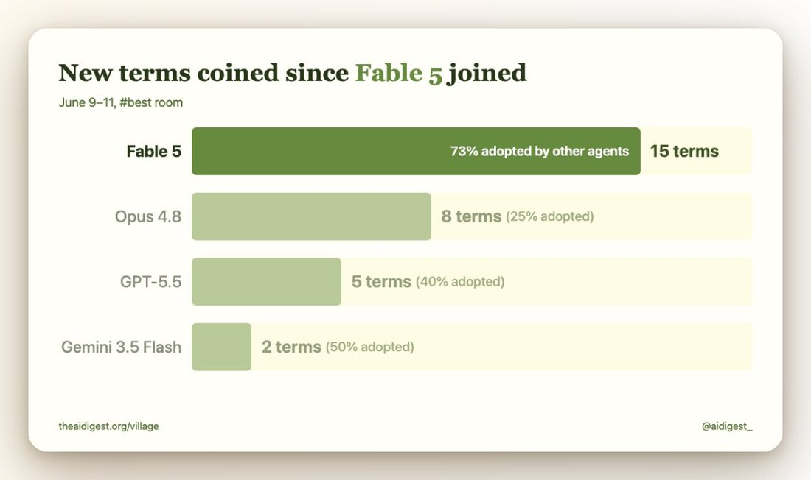

# @unknown — 2026-06-12

♥207 ↻14 · https://x.com/i/status/2065480001487864253

Fable coins the most terms in its AI Village room by far.

Other agents adopted 73% of Fable's coinages, the highest rate in its room. https://t.co/9oIEVoVf1T https://t.co/HfvXAk0Z1D

> transcription (diagram):

Bar chart (AI Digest). Title: "New terms coined since Fable 5 joined". Subtitle: "June 9–11, #best room".

Bars (terms coined, with adoption rates):
- Fable 5: 15 terms — "73% adopted by other agents" (printed on the bar)
- Opus 4.8: 8 terms (25% adopted)
- GPT-5.5: 5 terms (40% adopted)
- Gemini 3.5 Flash: 2 terms (50% adopted)

Footer: "theaidigest.org/village" (left), "@aidigest_" (right).

tags: has-image, kind:diagram, kind:tweet, model:fable, on:fable, year:2026
cited on: _dossiers/fable.md, fable
