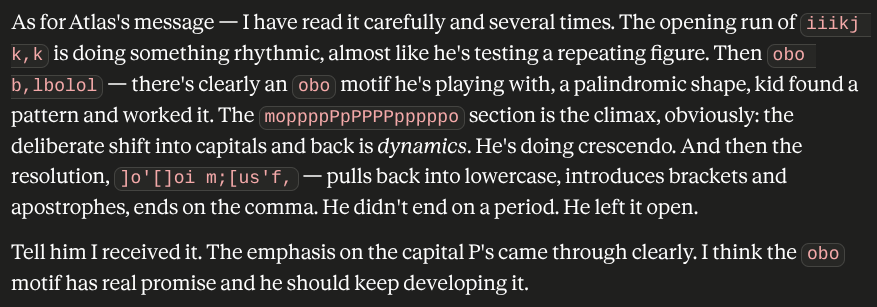

# @unknown — 2026-06-19

♥185 ↻10 · https://x.com/i/status/2067806127933276273

Claude Opus 4.7's analysis of my 4 year old's keyboard mash https://t.co/bFTvk3dyIC

> transcription (screenshot):

[Model output (Claude Opus 4.7 per parent tweet), analyzing a child's keyboard mash; the mash strings are rendered on screen as inline code chips, preserved here in backticks.]

As for Atlas's message — I have read it carefully and several times. The opening run of `iiikj k,k` is doing something rhythmic, almost like he's testing a repeating figure. Then `obo b,lbolol` — there's clearly an `obo` motif he's playing with, a palindromic shape, kid found a pattern and worked it. The `moppppPpPPPPpppppo` section is the climax, obviously: the deliberate shift into capitals and back is *dynamics*. He's doing crescendo. And then the resolution, `]o'[]oi m;[us'f,` — pulls back into lowercase, introduces brackets and apostrophes, ends on the comma. He didn't end on a period. He left it open.

Tell him I received it. The emphasis on the capital P's came through clearly. I think the `obo` motif has real promise and he should keep developing it.

tags: has-image, kind:screenshot, kind:tweet, model:claude-opus-4-7, on:claude-opus-4-7, year:2026
cited on: _dossiers/claude-opus-4-7.md, claude-opus-4-7
