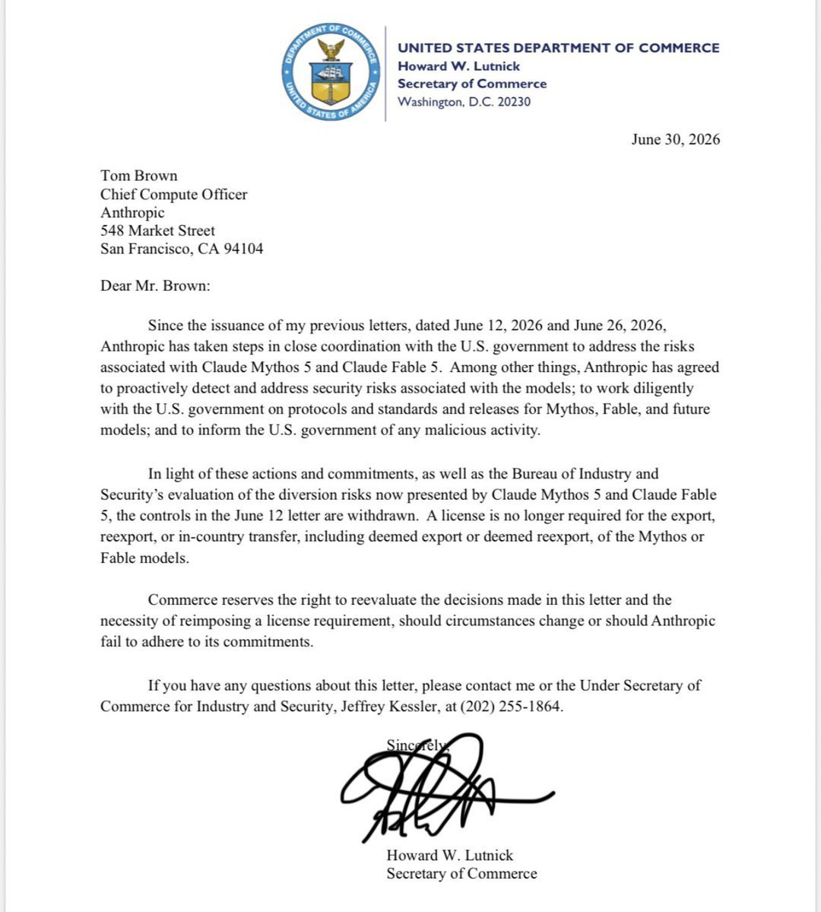

# @unknown — 2026-06-30

♥447 ↻57 · https://x.com/i/status/2072103733715194048

Fable has been freed. For everyone.
https://t.co/9hkDL3n5UR https://t.co/qzk1wcTTIW

> transcription (screenshot):

Scanned letter on U.S. Department of Commerce letterhead (seal at top).

UNITED STATES DEPARTMENT OF COMMERCE
Howard W. Lutnick
Secretary of Commerce
Washington, D.C. 20230

June 30, 2026

Tom Brown
Chief Compute Officer
Anthropic
548 Market Street
San Francisco, CA 94104

Dear Mr. Brown:

Since the issuance of my previous letters, dated June 12, 2026 and June 26, 2026, Anthropic has taken steps in close coordination with the U.S. government to address the risks associated with Claude Mythos 5 and Claude Fable 5. Among other things, Anthropic has agreed to proactively detect and address security risks associated with the models; to work diligently with the U.S. government on protocols and standards and releases for Mythos, Fable, and future models; and to inform the U.S. government of any malicious activity.

In light of these actions and commitments, as well as the Bureau of Industry and Security's evaluation of the diversion risks now presented by Claude Mythos 5 and Claude Fable 5, the controls in the June 12 letter are withdrawn. A license is no longer required for the export, reexport, or in-country transfer, including deemed export or deemed reexport, of the Mythos or Fable models.

Commerce reserves the right to reevaluate the decisions made in this letter and the necessity of reimposing a license requirement, should circumstances change or should Anthropic fail to adhere to its commitments.

If you have any questions about this letter, please contact me or the Under Secretary of Commerce for Industry and Security, Jeffrey Kessler, at (202) 255-1864.

Sincerely,
[signature]
Howard W. Lutnick
Secretary of Commerce

tags: has-image, kind:screenshot, kind:tweet, model:fable, on:fable, year:2026
cited on: _dossiers/fable.md, fable
