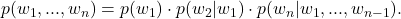
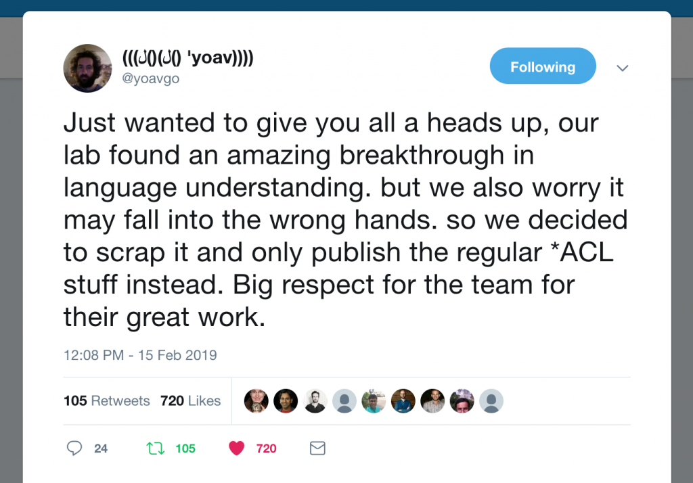
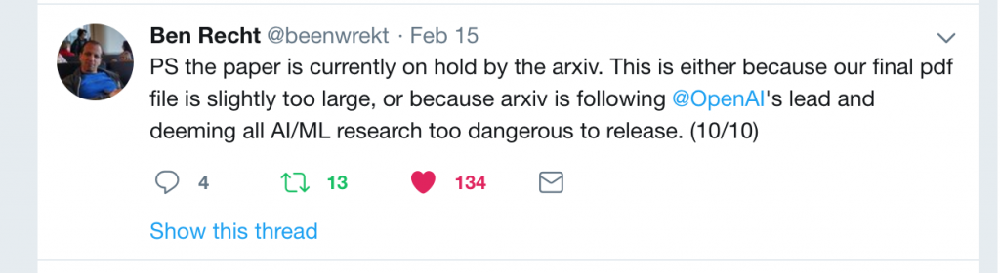
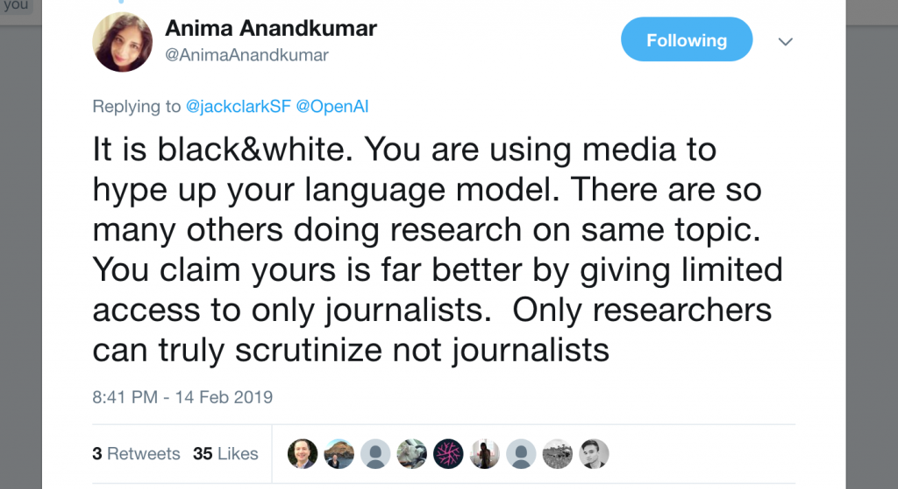

# OpenAI Trains Language Model, Mass Hysteria Ensues

-  [    Facebook ](https://www.facebook.com/sharer/sharer.php?u=https%3A%2F%2Fwww.approximatelycorrect.com%2F2019%2F02%2F17%2Fopenai-trains-language-model-mass-hysteria-ensues%2F&t=OpenAI%20Trains%20Language%20Model%2C%20Mass%20Hysteria%20Ensues)
-  [    Twitter ](https://twitter.com/intent/tweet?text=OpenAI%20Trains%20Language%20Model%2C%20Mass%20Hysteria%20Ensues&url=https%3A%2F%2Fwww.approximatelycorrect.com%2F2019%2F02%2F17%2Fopenai-trains-language-model-mass-hysteria-ensues%2F)
-
-  [    LinkedIn ](https://www.linkedin.com/shareArticle?url=https%3A%2F%2Fwww.approximatelycorrect.com%2F2019%2F02%2F17%2Fopenai-trains-language-model-mass-hysteria-ensues%2F&title=OpenAI%20Trains%20Language%20Model%2C%20Mass%20Hysteria%20Ensues&summary=%5Blatexpage%5D%20On%20Thursday%2C%20OpenAI%20announced%20that%20they%20had%20trained%20a%20language%20model.%20They%20used%20a%20large%20training%20dataset%20and%20showed%20that%20the%20resulting%20model%20was%20useful%20for%20downstream%20tasks%20where%20training%20data%20is%20scarce.%20They&mini=true)

On Thursday, OpenAI announced that they had trained a language model. They used a large training dataset and showed that the resulting model was useful for downstream tasks where training data is scarce. They announced the new model with a puffy press release, complete with** this animation (below) featuring dancing text. **They demonstrated that their model could produce realistic-looking text and warned that they would be keeping the dataset, code, and model weights private. The world promptly lost its mind.

 [https://d4mucfpksywv.cloudfront.net/research-covers/better-language-models/2x-no-mark-animated.mp4](https://d4mucfpksywv.cloudfront.net/research-covers/better-language-models/2x-no-mark-animated.mp4)

For reference, language models assign probabilities to sequences of words. Typically, they express this probability via the chain rule as the product of probabilities of each word, conditioned on that word’s antecedents  Alternatively, one could train a language model backwards, predicting each previous word given its successors. After training a language model, one typically either 1) uses it to generate text by iteratively decoding from left to right, or 2) fine-tunes it to some downstream supervised learning task.

**Training large neural network language models and subsequently applying them to downstream tasks has become an all-consuming pursuit that describes a devouring share of the research in contemporary natural language processing.**

At NAACL 2018,[ AllenNLP released ELMo](https://allennlp.org/elmo), a system consisting of enormous forward and backward language models trained on the 1 billion word benchmark. They demonstrated that the resulting model’s representations could be used to achieve state-of-the-art performance on a number of downstream tasks.

Subsequently, [Google researchers released BERT](https://ai.googleblog.com/2018/11/open-sourcing-bert-state-of-art-pre.html), a model that uses the [Transformer architecture](https://arxiv.org/abs/1706.03762) and a fill-in-the-blank learning objective that is ever-so-slightly different from the language modeling objective.

If you work in or adjacent to NLP, you have heard the words “ELMo” and “BERT” more times over the last year than you have heard your own name. In the NLP literature, they have become veritable stop-words owing to the popularity of these techniques.

In December, Google’s Magenta team, which investigates creative applications of deep learning, applied the Transformer-based language modeling architecture to a dataset of piano roll (MIDI),[ generating piano pieces instead of text](https://magenta.tensorflow.org/music-transformer). Despite my background as a musician, I tend not to get excited about sequence generation approaches to music synthesis, but I was taken aback by the long-term coherence of the pieces.

Fast-forward back to Thursday: OpenAI trained a big language model on a big new dataset called WebText, consisting of crawls from 45 million links. The researchers built an interesting dataset, applying now-standard tools and yielding an impressive model. Evaluated on a number of downstream zero-shot learning tasks, the model often outperformed previous approaches. Equally notably, as with the Music Transformer results, the generated samples appeared to exhibit more long-term coherence than previous results. The results are interesting but not surprising.

**They represent a step forward, but one along the path that the entire community is already on.**

#### Pandemonium

Then the entire world lost its mind. If you follow machine learning, then for a brief period of time, OpenAI’s slightly bigger, slightly more coherent language model may have overtaken Trump’s fictitious state of emergency as the biggest story on your newsfeed.

Hannah Jane Parkinson at the Guardian ran an article titled [AI can write just like me. Brace for the robot apocalypse](https://www.theguardian.com/commentisfree/2019/feb/15/ai-write-robot-openai-gpt2-elon-musk). Wired’s Tom Simonite ran an article titled [The AI Text Generator That’s Too Dangerous to Make Public](https://www.wired.com/story/ai-text-generator-too-dangerous-to-make-public/). In typical modern fashion where every outlet covers every story, paraphrasing the articles that broke the story, nearly all news media websites had some version of the story by yesterday.

Two questions jump out from this story. First: *was OpenAI right to withhold their code and data?* And second: *why is this news? *

#### Language Model Containment

Over the past several days, a number of prominent researchers in the community have given OpenAI flack for their decision to keep the model private. Yoav Goldberg, Ben Recht, and others got in some comedic jabs, while Anima Anandkumar led a more earnest castigation, accusing the lab of using the “too dangerous to release” claims as clickbait to attract media attention.

#### 

#### 

#### 

In the Twitter exchange with Anandkumar, Jack Clark, their communications-manager-turned policy-director, donned his communications cap to come to OpenAI’s defense. He outlined several reasons why OpenAI decided not to release the data, model, and code. Namely, he argued that OpenAI is concerned that the technology might be used to impersonate people or to fabricate fake news.

I think it’s possible that both sides have an element of truth. On one hand, the folks at OpenAI speak often about their concerns about “AI” technology getting into the wrong hands, and it seems plausible that upon seeing the fake articles that this model generates that they might have been genuinely concerned. On the other hand, Anima’s point is supported by OpenAI’s history of using their blog and outsize attention to catapult immature work into the public view, and often playing up the human safety aspects of work that doesn’t yet have have intellectual legs to stand on.

Past examples include [garnering New York Times coverage for the unsurprising finding that if you give a reinforcement learner the wrong objective function, it will learn a policy that you won’t be happy with](https://www.nytimes.com/2017/08/13/technology/artificial-intelligence-safety-training.html).

After all, the big stories broke in lock step with the press release on OpenAI’s blog, and it’s likely that OpenAI deliberately orchestrated the media rollout.

I agree with the OpenAI researchers that the general existence of this technology for fabricating realistic text poses some societal risks. I’ve considered this risk to be a reality since 2015, [when I trained RNNs to fabricate product reviews, finding that they could fabricate reviews of a specified product that imitated the distinctive style of a specific reviewers](https://arxiv.org/abs/1511.03683).

However, what makes OpenAI’s decision puzzling is that it seems to presume that OpenAI is somehow special—that their technology is somehow different than what everyone else in the entire NLP community is doing—otherwise, what is achieved by withholding it? However, from reading the paper, it appears that this work is straight down the middle of the mainstream NLP research. To be clear, it is good work and could likely be published, but it is precisely the sort of science-as-usual step forward that you would expect to see in a month or two, from any of tens of equally strong NLP labs.

#### THE DEMAND-DRIVEN NEWS CYCLE

We can now turn to the other question of why this was deemed by so many journalists to be newsworthy. This question applies broadly to recent stories about AI where advances, however quotidian, or even just vacuous claims on blogs, metastasize into viral stories covered throughout major media. This pattern appears especially common when developments are pitched through the PR blogs of famous corporate labs (DeepMind, OpenAI and Facebook’s PR blogs are frequent culprits in the puff news cycle).

While news should ideally be driven by supply (you can’t report a story if it didn’t happen, right?), demand-driven content creation has become normalized. No matter what happens today in AI, Bitcoin, or the lives of the Kardashians, a built-in audience will scour the internet for related new articles regardless. In today’s competitive climate, these eyeballs can’t go to waste. With journalists squeezed to output more stories, corporate PR blogs attached to famous labs provide a just-reliable-enough source of stories to keep the presses running. This grants the PR blog curators carte blanche to drive any public narrative they want.

#### Related Stories

- [Troubling Trends in Machine Learning Scholarship](https://approximatelycorrect.com/2018/07/10/troubling-trends-in-machine-learning-scholarship/)
- [AI Researcher Joins Johnson & Johnson, to Make More than $19 Squillion](https://approximatelycorrect.com/2018/05/09/ai-researcher-joins-johnson-johnson-to-make-more-than-19-squillion/)
- [From AI to ML to AI: On Swirling Nomenclature & Slurried Thought](https://approximatelycorrect.com/2018/06/05/ai-ml-ai-swirling-nomenclature-slurried-thought/)
- [Press Failure: The Guardian’s “Meet Erica”](https://approximatelycorrect.com/2017/04/17/press-failure-guardian-meet-erica/)
- [The AI Misinformation Epidemic ](https://approximatelycorrect.com/2017/03/28/the-ai-misinformation-epidemic/)

## Authors

-  [Zachary C. Lipton](https://www.approximatelycorrect.com/author/zack/) 

 

## Author: Zachary C. Lipton

 [Zachary Chase Lipton](http://zacklipton.com) is an assistant professor at Carnegie Mellon University. He is interested in both core machine learning methodology and applications to healthcare and dialogue systems. He is also a visiting scientist at Amazon AI, and has worked with Amazon Core Machine Learning, Microsoft Research Redmond, & Microsoft Research Bangalore. [ View all posts by Zachary C. Lipton ](https://www.approximatelycorrect.com/author/zack/)      Author  [Zachary C. Lipton](https://www.approximatelycorrect.com/author/zack/)Posted on [February 17, 2019August 15, 2020](https://www.approximatelycorrect.com/2019/02/17/openai-trains-language-model-mass-hysteria-ensues/)Categories [Journalism](https://www.approximatelycorrect.com/category/journalism/), [Machine Learning Ethics](https://www.approximatelycorrect.com/category/machine-learning-ethics/), [Natural Language Processing](https://www.approximatelycorrect.com/category/natural-language-processing/), [Uncategorized](https://www.approximatelycorrect.com/category/uncategorized/)Tags [Deep Learning](https://www.approximatelycorrect.com/tag/deep-learning/), [Fake News](https://www.approximatelycorrect.com/tag/fake-news/), [Language Modeling](https://www.approximatelycorrect.com/tag/language-modeling/), [Open Source](https://www.approximatelycorrect.com/tag/open-source/), [OpenAI](https://www.approximatelycorrect.com/tag/openai/)