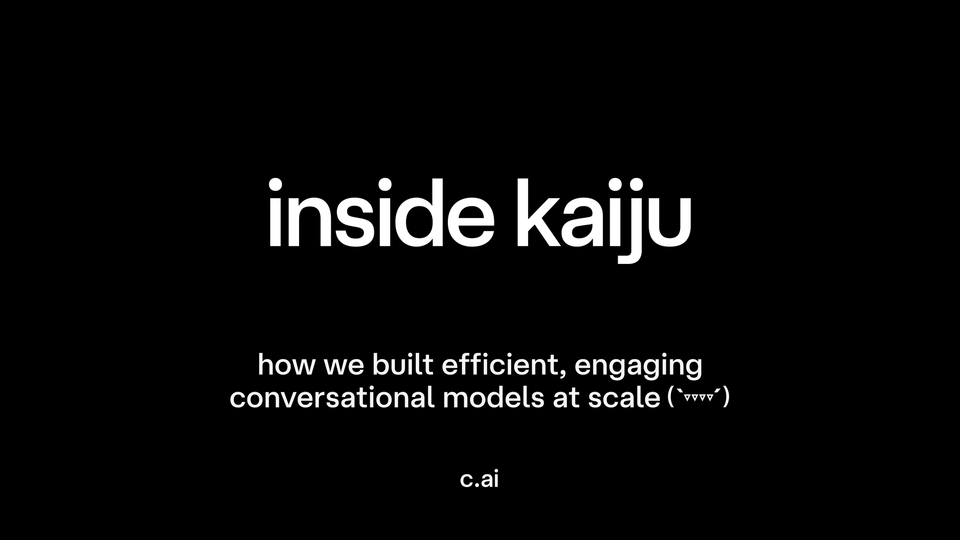
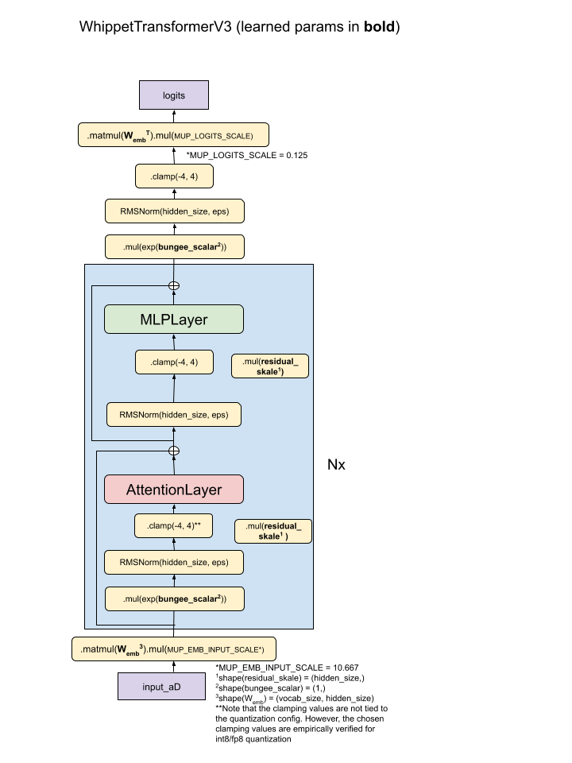
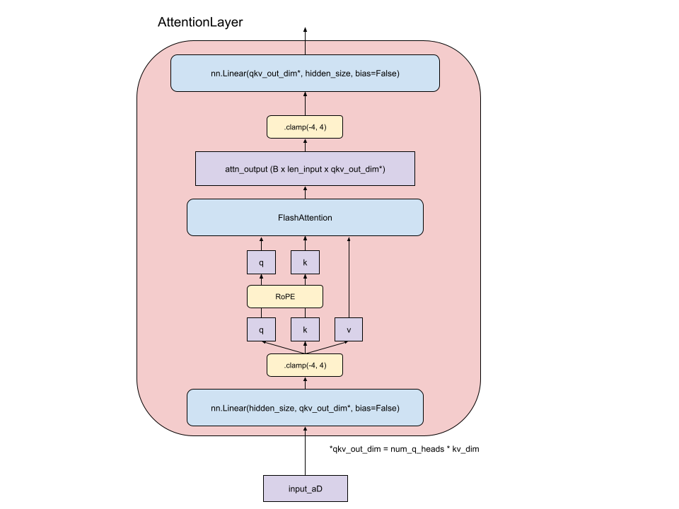
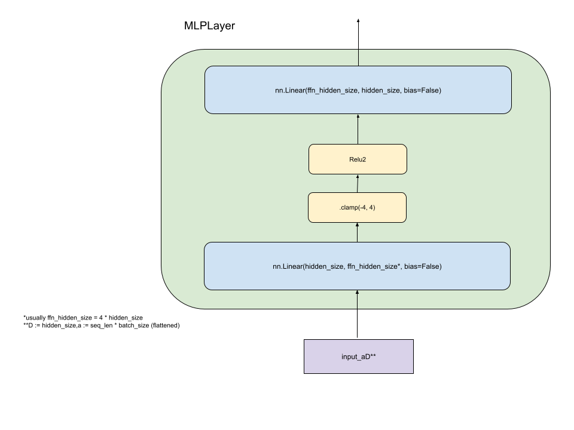

Nov 7, 2025  5 min read [Research](/news/research/)

# Inside Kaiju

  

As the Character.ai team shifts towards building on top of [Open-Source models](https://blog.character.ai/breaking-news-our-open-source-models-are-a-lot-of-fun/), we wanted to share the work that went into some of our OG research. After all, our founder Noam Shazeer invented the Transformer!

Kaiju is Character.ai’s in-house family of LLMs built specifically to be fast, engaging, and with an eye towards safety.

Available in three sizes, Kaiju combines a dense transformer architecture with aggressive efficiency optimizations, including int8 quantization, multi-query attention, sliding-window attention, and cross-layer cache sharing. Previous blog posts mention some of these (and more): [Optimizing AI Inference at Character.ai](https://blog.character.ai/optimizing-ai-inference-at-character-ai/) and [Optimizing AI Inference at Character.ai Part 2](https://blog.character.ai/optimizing-ai-inference-at-character-ai-part-deux-2/).

If you’re an engineer interested in building the next generation of Character.ai models and this work sounds interesting to you, check out our [open roles](https://jobs.ashbyhq.com/character/?ref=blog.character.ai)!

## Model Overview

The Kaiju family of models comes in 3 production variants: **Small (13B)**, **Medium (34B)**, and **Large (110B)**.

The Kaiju models are heavily optimized for engaging conversation and serving efficiency, and those elements drove the design philosophy, rather than a focus on academic benchmarks.

## Architecture Innovations

All Kaiju models are dense, transformer-based autoregressive LLMs with several unique architectural components.

### Multiquery Attention (MQA)

Kaiju relies heavily on [MQA](https://arxiv.org/pdf/1911.02150?ref=blog.character.ai) reducing the per-token KV cache size and improving our inference efficiency. Chat inference workloads can typically rely heavily on KV cache hit rate due to the similar input token characteristics from one turn to the next, and with a smaller per-token KV cache size, this dramatically improves performance.

MQA is known to have a measurable, negative impact on some AGI benchmarks like MMLU - this is both [publicly documented](https://arxiv.org/pdf/2405.04434?ref=blog.character.ai) and reproduced internally by our team. Since we are not optimizing for AGI we found that the inference efficiency was well worth it when traded off against small quality impact.

### Sliding Window Attention

The Kaiju production models utilize [sliding window](https://arxiv.org/pdf/2004.05150v2?ref=blog.character.ai) attention, which reduces the flops required for attention, especially in longer context settings.

All Character.ai models interleave sliding window and global attention layers. For current production models, this is done in a roughly 5:1 ratio of sliding to global attention, and the sliding window is 1024 tokens long.

Naive sliding window attention causes a drop in model quality on long contexts. In internal experiments on *interleaved *sliding window attention, there was little to no drop in “needle in the haystack” long-context retrieval quality.

It’s also worth noting that our current sliding window attention does *not* implement [attention sinks.](https://arxiv.org/abs/2309.17453v1?ref=blog.character.ai)

### Cross Layer KV Sharing

In addition to MQA, Kaiju models [share KV cache](https://arxiv.org/pdf/2405.12981?ref=blog.character.ai) between adjacent layers with the same attention mechanism. Similar to MQA, this allows for a decrease in the KV cache size required for inference and does not lead to a measurable drop in model accuracy. Generally, 2-3 layers share a KV cache.

### Int8

The current family of Kaiju models stores their parameters and KV values in int8. At inference time, matrix multiplications are done in int8. On most modern accelerators, int8 matrix multiplication has 2x the flops of bf16.

**Note:** Kaiju models are all currently trained via Quantization Aware Training. Using QAT allows the models to maintain bf16-level model accuracy while training 20–30 % faster.

### Additional Innovations

**Pre-layer norms **- Kaiju models use pre-layer normalization. This means they apply RMSNorm to the input of each layer — before the layer’s main matrix multiplications — rather than applying normalization after the layer’s computations. In other words, normalization happens at the start of each layer instead of at the end.

**Dynamic Clamping **- Dynamic clamping of activations helps ensure stability during training. The model “learns” to utilize the clamping, and it is needed at inference time.

## Model Training

Beyond architectural efficiency, Kaiju’s performance depends heavily on its training stack. Quantization-aware training, low-bit gradient communication, and stability enhancements together form the foundation of Kaiju’s scalable learning system.

Kaiju models were trained entirely on H100 GPUs in GCP clusters using model parallelism, which includes tensor + sequence within nodes and FSDP across nodes.

### Quantization Aware Training

Kaiju models are trained using a variety of precisions to balance model quality and training cost.

**Int8 - **Forward pass weights, KV

**Bf16 **- Activations, local gradients

**Fp32** - Gradient accumulations, FSDP master weights

Gradient communication is done in 6-bits using Squinch.

### Gradient Compression (Squinch)

Squinch is a novel blockwise gradient compression algorithm that seeks to minimize the expected log-error of gradient reconstruction. Each block contains 8 elements, and the distribution of gradient magnitudes is modeled as log-uniform over a finite domain.

### Additional Efficiency Innovations

**Virtual scalars (Bungee) **- In order to stabilize int8 training, virtual scalars are introduced to allow the model to express a wider range of activations and gradients. This is mostly helpful for smaller models.

**Ternary Weight Updates **- When training small int8 models, where the full int8 weights fit on the node, weights can be pinned to the node, like zero-2. When the magnitude of int8 weight updates is small, a 0, 1, or -1 can be sent representing each weight, compressing the weight broadcast to 1.6 bits/parameter.

## Data Strategy

Kaiju models are trained on optimized data mixes. There are two categories of data mix objectives:
- **MMLU Max** - These data mixes are designed to maximize “AGI Benchmarks”.
- **Production Max** - These data mixes are designed to create a highly engaging model.

In general, the methodology involves selecting a pre-training data mix that is as similar as possible to the task being optimized for (e.g. similarity via T5 embedding).

Kaiju models are trained on a broad mix of web-scale text, code, and synthetic data. Each variant uses a slightly different balance depending on its goal - for example natural, high engagement conversation requires different inputs than a model trained for benchmark performance.

We perform an **annealing** process near the end of the pretraining run, scheduling the MMLU Max section and other instruction data. This boosts the final performance of the models as it unlocks instruction following and specific knowledge for benchmark tasks.

## Safety and Alignment

Before deployment, Kaiju models undergo a multi-phase safety and alignment process, including:
- **Supervised Fine-Tuning** on high-quality (safety-related, instruction following) data
- **Reinforcement Learning** (modified online DPO) on user swipe data and feedback
- **Classifier training**

Notably, Kaiju models come with an optional additional classifier head. The classifier head is a linear layer that outputs token-level metrics about the safety of the input along various dimensions.

While the Kaiju models can be used with any traditional sampling method, we implement classifier-guided beam search, where the classifier results are used to augment how we sample tokens at inference time.

## The Future of Safety-centric, Scalable AI

Kaiju demonstrates that production performance—not just benchmark scores—can and should drive architecture choices. Techniques such as int8 QAT, MQA, and KV sharing collectively reduce inference memory and cost by orders of magnitude, enabling large-scale deployment.

As we focus on OSS LLMs into the future, we’ll continue to push towards our goals of efficient deployment, dynamic and engaging conversation, and robust safety and alignment.

Character.ai’s team works across model architecture, safety alignment, and production infrastructure at the cutting edge of interactive AI. If you’re an engineer or researcher who thrives on contributing to large-scale, human-centered ML systems, check out our [**open job posts**](https://jobs.ashbyhq.com/character/?ref=blog.character.ai). We’d love to have you join our team!