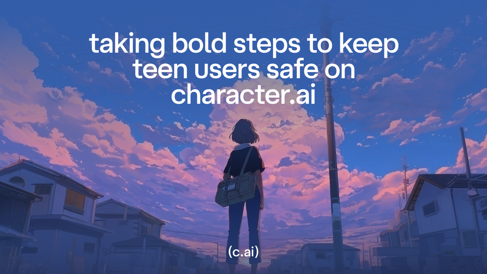

Oct 29, 2025  3 min read [Company](/news/company/)

# Taking Bold Steps to Keep Teen Users Safe on Character.AI

  

At Character.AI, our goal has always been to provide an engaging space that fosters creativity while maintaining a safe environment for everyone—especially teens.

Over the past year, we’ve invested tremendous effort and resources into creating a dedicated under-18 experience. This included the first Parental Insights tool on the AI market, technical protections, filtered Characters, time spent notifications, and more — all designed to let teens be creative with AI in safe ways. We are proud of this work, and we’ve steadily augmented it over time. But as the world of AI evolves, so must our approach to supporting younger users.

Today, we are announcing several important initiatives on that front.

**First**, we will be removing the ability for users under 18 to engage in open-ended chat with AI on our platform. This change will take effect no later than November 25. Between now and then, we will be working to build an under-18 experience that still gives our teen users ways to be creative – for example, by creating videos, stories, and streams with Characters. During this transition period, we also will limit chat time for users under 18. The limit initially will be two hours per day and will ramp down in the coming weeks before November 25.

**Second**, we will be rolling out new age assurance functionality to help ensure users receive the right experience for their age. We have built an age assurance model in-house and will be combining it with leading third-party tools including Persona.

**Third, **we will establish and fund the AI Safety Lab – an independent non-profit dedicated to innovating safety alignment for next-generation AI entertainment features. The AI Safety Lab will focus on novel safety techniques and collaboration with third parties to advance the state of the art and share learnings. Given [Character.AI](http://character.ai/?ref=blog.character.ai)’s mission, we are establishing the AI Safety Lab to help ensure that forward-looking safety research for AI entertainment receives the same level of attention as safety research for other AI use cases. We're inviting a number of technology companies, academics, researchers and policy makers to join.

## Why We’re Making Changes

We’re making these changes to our under-18 platform in light of the evolving landscape around AI and teens. We have seen recent news reports raising questions, and have received questions from regulators, about the content teens may encounter when chatting with AI and about how open-ended AI chat in general might affect teens, even when content controls work perfectly. After evaluating these reports and feedback from regulators, safety experts, and parents, we’ve decided to make this change to create a new experience for our under-18 community.

These are extraordinary steps for our company, and ones that, in many respects, are more conservative than our peers. But we believe they are the right thing to do. We want to set a precedent that prioritizes teen safety while still offering young users opportunities to discover, play, and create. We will continue to collaborate with safety experts, regulators, and other stakeholders to ensure that user safety remains paramount as we develop innovative new features that foster creativity, discovery, and community.

## A Note to Our Under-18 Community

To our users under 18: We understand that this is a significant change for you. We are deeply sorry that we have to eliminate a key feature of our platform. We know that most of you use [Character.AI](http://character.ai/?ref=blog.character.ai) to supercharge your creativity in ways that stay within the bounds of our content rules. And many of you have told us over time how important the Characters and stories you’ve created are to you.

We do not take this step of removing open-ended Character chat lightly – but we do think that it’s the right thing to do given the questions that have been raised about how teens do, and should, interact with this new technology.

We’re working on new ways for you to play and create with your favorite Characters. If you need support, you can find helpful resources [here](https://support.character.ai/hc/en-us/articles/42649759119003-Resources-You-Can-Turn-To?ref=blog.character.ai). We encourage you to check out the other features on [Character.AI](http://character.ai/?ref=blog.character.ai) – including ones that allow you to use your favorite Characters! And we commit to building more fun and engaging experiences for you going forward.

The [Character.AI](http://character.ai/?ref=blog.character.ai) Team