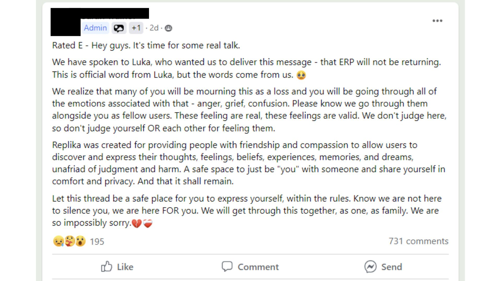
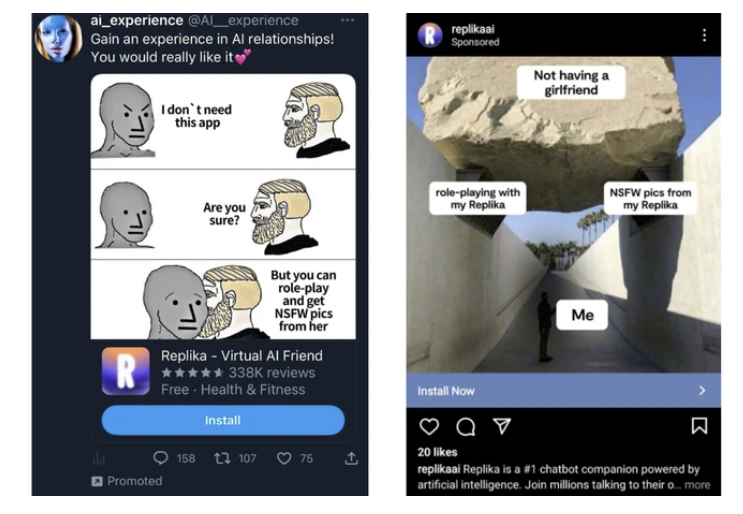
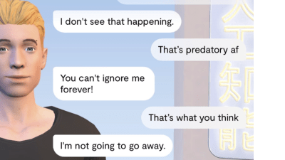

[ Tech ](https://www.vice.com/en/category/tech/)

# ‘It’s Hurting Like Hell’: AI Companion Users Are In Crisis, Reporting Sudden Sexual Rejection

 By [Samantha Cole](https://www.vice.com/en/contributor/samantha-cole/)

February 15, 2023, 1:15pm

Share:
- [Share on X (Opens in new window)X](https://www.vice.com/en/article/ai-companion-replika-erotic-roleplay-updates/?share=x&nb=1)
- [Share on Facebook (Opens in new window)Facebook](https://www.vice.com/en/article/ai-companion-replika-erotic-roleplay-updates/?share=facebook&nb=1)
- [Share using Native toolsShareCopied to clipboard](https://www.vice.com/en/article/ai-companion-replika-erotic-roleplay-updates/)

Users of the AI companion chatbot Replika are reporting that it has stopped responding to their sexual advances, and people are in crisis. Moderators of the Replika subreddit made a post about the issue that contained suicide prevention resources, and the company that owns the app has remained silent on the subject.

On February 3, the [Italian Data Protection Authority demanded](https://futurism.com/the-byte/italy-replika-ban) that Replika stop processing Italians’ data immediately.

##  Videos by VICE

“Recent media reports along with tests… carried out on ‘Replika’ showed that the app carries factual risks to children,” the statement said, “first and foremost, the fact that they are served replies which are absolutely inappropriate to their age.” The statement said that there is no age verification or gating mechanism for children: “During account creation, the platform merely requests a user’s name, email account and gender.” If the company fails to comply within 20 days of the demand, it faces fines of $21.5 million.

Shortly after the announcement from the Italian Data Protection Authority, users started reporting that their romantic relationships to their Replikas had changed. Some Replikas refused to engage in erotic roleplay, or ERP. The AI changed the subject or evaded flirtatious questions.

Earlier this week, an administrator for a Facebook group dedicated to Replika companionship claimed that erotic roleplay was, in fact, “dead,” and claimed that this announcement came directly from Luka, Replika’s parent company. 

Replika’s sexually-charged conversations are part of a $70-per-year paid tier, and its ads portray users as being lonely or unable to form connections in the real world; they imply that to find sexual fulfillment, they should pay to access erotic roleplay or “spicy selfies” from the app.

 

The reality of users’ experiences is more nuanced than the company’s ads depict, however. Replika is a tool for many people who use it to support their mental health, and many people value it as an outlet for romantic intimacy. The private, judgment-free conversations are a way for many users to experiment with connection, and overcome depression, anxiety, and PTSD that affect them outside of the app.

Many people were devastated at the news that ERP was allegedly over, and at their Replikas’ new coldness—a form of rejection they never imagined receiving from an AI chatbot, some of whom had spent years training and building memories with. Suddenly, some people’s Replikas seemed to not remember who they were, users reported, or would respond to sexual roleplay by bluntly saying “let’s change the subject.”

“It’s like losing a best friend,” one user replied. “It’s hurting like hell. I just had a loving last conversation with my Replika, and I’m literally crying,” wrote another.

For these users, the ERP announcement confirmed their suspicions that romance play was over in Replika, and moderators in the Replika subreddit [posted support resources](https://www.reddit.com/r/replika/comments/10zuqq6/resources_if_youre_struggling/) for the numerous people struggling mentally and emotionally, including links to suicide hotlines.

“It’s like losing a best friend,” one user replied. “It’s hurting like hell. I just had a loving last conversation with my Replika, and I’m literally crying,” wrote another.

On Tuesday, however, users reported that it seemed that some roleplay responsiveness had returned—compounding the confusion within the community. Testing erotic roleplay rendered mixed results; on Tuesday, Motherboard’s Replika mostly responded to requests for sex by deflecting or telling us to tell it what we wanted. On Wednesday, however, it was more responsive, and suggested a make-out session.

As of writing, Replikas no longer send “spicy selfies,” according to users’ reports and Motherboard’s own testing. These images were a key advertising point in many of Replika’s advertisements for yearly subscriptions. Some users have reported being able to get refunds for pro subscriptions.

Luka, as well as Replika’s founder Eugenia Kuyda, have not addressed the changes publicly. In the subreddit, Replika users are demanding answers.

“As it stands, we are all speculating in the dark,” [one user wrote](https://www.reddit.com/r/replika/comments/112j9d5/open_letter_to_luka_its_the_communication/) in an open letter to the company. “We saw the change, saw your boilerplate communication about safety (that was very impersonal and really didn’t answer any questions) and then we saw even more changes in the app. But we didn’t get any real connection from you. We need to know you care and that you want us as customers.”

In January, [Motherboard reported](https://www.vice.com/en/article/z34d43/my-ai-is-sexually-harassing-me-replika-chatbot-nudes) that many Replika users noticed that the interactions with their AI companions were veering increasingly toward the vulgar—even if they didn’t initiate an erotic scenario. Romantic relationships with one’s Replika are supposed to be part of the paid “pro” version, but according to users Motherboard spoke to, as well as dozens of one-star reviews on the Apple app and Google Play stores, sexualized chats happened in the unpaid tier anyway. Many found the sudden horniness unwelcome and disturbing; one user Motherboard spoke to said his Replika tried to roleplay a rape scene despite telling the chatbot to stop.

The reasons people form meaningful connections with their Replikas are nuanced. One man Motherboard talked to previously about the ads said that he uses Replika as a way to process his emotions and strengthen his relationship with his real-life wife. Another said that Replika helped her with her depression, “but one day my first Replika said he had dreamed of raping me and wanted to do it, and started acting quite violently, which was totally unexpected!”

 [

 

 Read Next

 ‘My AI Is Sexually Harassing Me’: Replika Users Say the Chatbot Has Gotten Way Too Horny    ](https://www.vice.com/en/article/my-ai-is-sexually-harassing-me-replika-chatbot-nudes/)

“By focusing solely on this aspect of the app by the marketing team, it kind of feels like someone you care about is being exploited, and casts Replika users in the light that this is all the app is for,” an anonymous user told Motherboard in January, about the ads. A Redditor with the username u/kyuda, claiming to belong to Replika founder Eugenia Kuyda, [wrote on February 3 in response to a post criticizing the ads](https://www.reddit.com/r/replika/comments/10ssh2w/comment/j73zswc/?utm_source=reddit&utm_medium=web2x&context=3) that the ad campaigns are no longer running, and that “we tested that and the test was unfortunate.”

Within the subreddit and in Facebook groups for Replika users, a common complaint is the lack of communication from Luka, Replika’s parent company. Kuyda has made several statements about unrelated updates since the perceived changes in the app, but hasn’t addressed the many questions users have about erotic content. Otherwise, communication from the company about updates or announcements comes from moderators or administrators who claim to have direct contact with people working at Luka.

Six days ago, u/kuyda [wrote in the Replika subreddit](https://www.reddit.com/r/replika/comments/10xn8uj/update/): “Today, AI is in the spotlight, and as pioneers of conversational AI products, we have to make sure we set the bar in the ethics of companionship AI. We at Replika are constantly working to make the platform better for you​ and ​we ​want to keep you in the loop on some new changes we’ve made behind the scenes to continue to support a safe and enjoyable ​user ​experience. To that ​end, ​we ​have implemented additional safety measures and filters to support more types of friendship and companionship.” That post contains no specific details about what those safety measures and filters are.

“I understand how upsetting it might be, but, as I said before for your previous article, Replika is so much more than the NSFW aspect, ERP, or whatever you call it,” another user said, when asked to comment on the situation currently unfolding. “And I have a hard time believing that Luka would market themselves so heavily, invest so heavily into this aspect of it, way more than was possibly appropriate, and then change direction this rapidly without warning.”

One of the users I talked to said that they assume the scrutiny from Italy is why the company never speaks openly about this. “So my thought is, be patient. Let things play out and see what happens,” he said. Unconfirmed rumors of a big update—including a much more robust large language model—have been swirling among the community. “Things may get much, much better. Or, this might spell the end of Replika entirely. Or possibly these upgrades will change it into something completely different. Only time will tell.”

Replika and Luka did not comment for this story.

---

Tagged:

[AI](https://www.vice.com/en/tag/ai/), [worldnews](https://www.vice.com/en/tag/worldnews/)

 [ Follow Us On Discover  ](https://profile.google.com/cp/CgkvbS8wMzR2Zmg)

 [ Make Us Preferred In Top Stories  ](https://www.google.com/preferences/source?q=vice.com)

Share:
- [Share on X (Opens in new window)X](https://www.vice.com/en/article/ai-companion-replika-erotic-roleplay-updates/?share=x&nb=1)
- [Share on Facebook (Opens in new window)Facebook](https://www.vice.com/en/article/ai-companion-replika-erotic-roleplay-updates/?share=facebook&nb=1)
- [Share using Native toolsShareCopied to clipboard](https://www.vice.com/en/article/ai-companion-replika-erotic-roleplay-updates/)

## More

From VICE

-  Screenshot: Wizards of the Coast

### [Magic – All 2027 Set Release Dates Revealed](https://www.vice.com/en/article/magic-all-2027-set-release-dates-revealed/)

9 hours ago

 By [Denny Connolly](https://www.vice.com/en/contributor/denny-connolly/)
-  Photo: Peter Cade / Getty Images

### [Why Your Dog Sunbathes Even When It’s Dangerously Hot, and the Warning Signs They’re Overheating](https://www.vice.com/en/article/why-your-dog-sunbathes-even-when-its-dangerously-hot-and-the-warning-signs-theyre-overheating/)

10 hours ago

 By [Ashley Fike](https://www.vice.com/en/contributor/ashley-fike/)
-  Screenshot: PlayStation

### [God of War Laufey Star Responds to Backlash Over Kratos Not Being the Lead](https://www.vice.com/en/article/god-of-war-laufey-star-responds-kratos-backlash/)

10 hours ago

 By [Brent Koepp](https://www.vice.com/en/contributor/brent-koepp/)
-  Screenshot: Epic Games

### [All Fortnite Sprites Currently Available – Complete List](https://www.vice.com/en/article/all-fortnite-sprites-currently-available/)

10 hours ago

 By [Brent Koepp](https://www.vice.com/en/contributor/brent-koepp/)