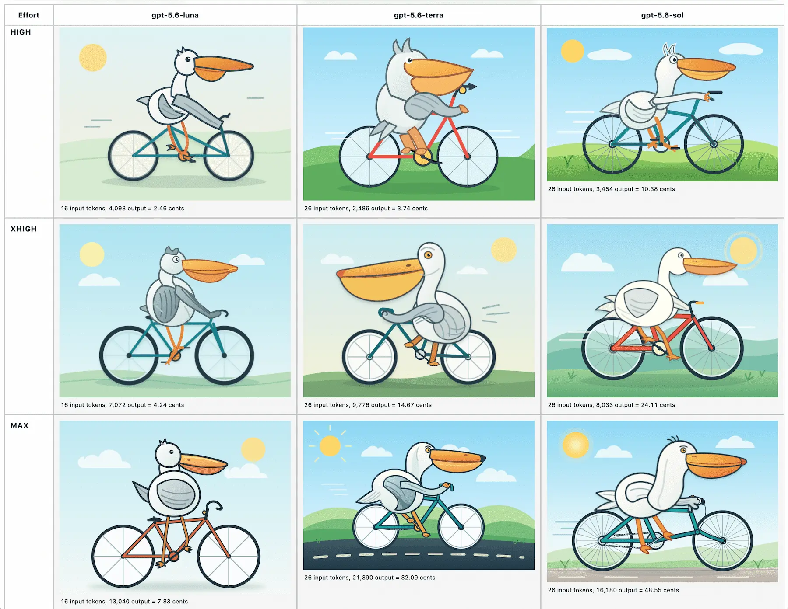
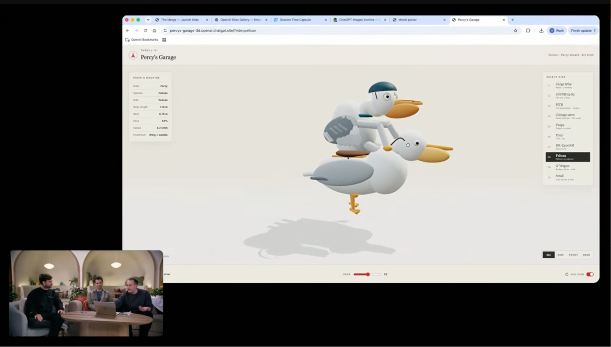

# [Simon Willison’s Weblog](/)

 [Subscribe](/about/#subscribe)

 **Sponsored by:** Atlassian — Give your agents a plan. Not a prompt. New Jira capabilities unlock full-context for AI-native software development. Assign tasks to Claude, Cursor, or GitHub Copilot, now directly from Jira. [Learn more](https://fandf.co/4gCMW1I)

## The new GPT-5.6 family: Luna, Terra, Sol

9th July 2026

OpenAI’s latest flagship model [hit general availability this morning](https://openai.com/index/gpt-5-6/), and comes in three sizes: Luna, Terra, and Sol (from smallest to largest).

The new models are priced per 1M input/output tokens as Luna $1/$6, Terra $2.50/$15, Sol $5/$30. For comparison, the Claude Opus series are $5/$25 and the Claude Fable 5 is $10/$50, but price-per-million tokens doesn’t tell us much now that the number of reasoning tokens can differ so much between models for the same task.

All three models have a February 16th 2026 knowledge cutoff, a million token context window, and 128,000 maximum output tokens.

OpenAI’s biggest benchmark claim concerns long-running agentic performance, with one benchmark showing all three models outperforming Claude Fable 5:

>

We trained GPT-5.6 to get more useful work from every token. On [Agents’ Last Exam](https://agents-last-exam.org/), an evaluation of long-running professional workflows across 55 fields, GPT-5.6 Sol sets a new high of 53.6, eclipsing Claude Fable 5 (adaptive reasoning) by 13.1 points. Even at medium reasoning, it beats Fable 5 by 11.4 points at roughly one-quarter the estimated cost. That efficiency extends to smaller models, which are essential to making intelligence more abundant and affordable: GPT-5.6 Terra and GPT-5.6 Luna outperform Fable 5 at around one-sixteenth the cost.

Amusingly, one self-reported benchmark that Fable 5 crushed the GPT-5.6 family on was SWE-Bench Pro, where Fable 5 got 80% compared to GPT-5.6 Sol getting 64.6%. This may help explain why OpenAI chose to publish [this article yesterday](https://openai.com/index/separating-signal-from-noise-coding-evaluations/) specifically calling out SWE-Bench Pro for problems they found while auditing that benchmark:

>

In light of these results, we estimate that ~30% of SWE-bench Pro tasks are broken, and advise that model developers carefully examine results

I’ve had some early access to GPT-5.6 Sol—it’s definitely very competent, though so far it hasn’t struck me as better than Fable at the kind of complex coding tasks I’ve been using with Anthropic’s model.

As usual, the [model guidance for using GPT-5.6](https://developers.openai.com/api/docs/guides/latest-model?model=gpt-5.6) has the most interesting details. There are a bunch of new API features that I need to explore (and probably add support for in [LLM](https://llm.datasette.io/)), including:
-  [Programmatic Tool Calling](https://developers.openai.com/api/docs/guides/tools-programmatic-tool-calling) allows the models to “compose and run JavaScript that orchestrates tool calls”—which sounds to me like it could help bridge the gap between MCPs and full terminal sessions that can compose CLI utilities in useful ways. Also reminiscent of the [dynamic filtering](https://platform.claude.com/docs/en/agents-and-tools/tool-use/web-search-tool#dynamic-filtering) mechanism Anthropic added to their web search tool, which allows code execution against web results as part of a single model turn.
-  [Multi-agent](https://developers.openai.com/api/docs/guides/tools-multi-agent) lets the model “spin up subagents for parallel, focused work”—the sub-agent pattern now baked into the core API.
-  [Prompt cache breakpoints](https://developers.openai.com/api/docs/guides/prompt-caching#prompt-cache-breakpoints) brings the Claude model of prompt caching to OpenAI, letting you be explicit about where the cache breakpoints are rather than relying on the API to detect them automatically. Personally I much prefer automatic detection (still supported by OpenAI), but presumably there are optimization cost savings to be had here if you put the work in.
- You can now set [detail: original](https://developers.openai.com/api/docs/guides/images-vision#choose-an-image-detail-level) on image requests to avoid resizing the image at all before it is processed.

Here’s [a full page with 18 different pelicans](https://static.simonwillison.net/static/2026/gpt-5.6-pelicans.html)—for reasoning efforts none, low, medium, high, xhigh, and max across the three different models. It also lists their token and calculated costs—the least expensive was gpt-5.6-luna at effort none for 0.71 cents, the most expensive was gpt-5.6-sol at max reasoning level for 48.55 cents.

In further pelican news, if you jump to 17:50 in [their livestream from this morning](https://www.youtube.com/live/Wq45rvPGNHs?t=1070s) you’ll see OpenAI’s own demo of 3D pelicans riding a tricycle, a bicycle, a pony, and another pelican!

Posted [9th July 2026](/2026/Jul/9/) at 7:46 pm · Follow me on [Mastodon](https://fedi.simonwillison.net/@simon), [Bluesky](https://bsky.app/profile/simonwillison.net), [Twitter](https://twitter.com/simonw) or [subscribe to my newsletter](https://simonwillison.net/about/#subscribe)

## More recent articles

- [Kimi K3, and what we can still learn from the pelican benchmark](/2026/Jul/16/kimi-k3/) - 16th July 2026
- [sqlite-utils 4.0, now with database schema migrations](/2026/Jul/7/sqlite-utils-4/) - 7th July 2026

This is **The new GPT-5.6 family: Luna, Terra, Sol** by Simon Willison, posted on [9th July 2026](/2026/Jul/9/). [ ai 2,132 ](/tags/ai/) [ openai 431 ](/tags/openai/) [ generative-ai 1,884 ](/tags/generative-ai/) [ llms 1,851 ](/tags/llms/) [ llm-tool-use 73 ](/tags/llm-tool-use/) [ llm-pricing 84 ](/tags/llm-pricing/) [ pelican-riding-a-bicycle 127 ](/tags/pelican-riding-a-bicycle/) [ llm-release 216 ](/tags/llm-release/) [ gpt-5 31 ](/tags/gpt-5/)

**Next:** [Kimi K3, and what we can still learn from the pelican benchmark](/2026/Jul/16/kimi-k3/)

**Previous:** [sqlite-utils 4.0, now with database schema migrations](/2026/Jul/7/sqlite-utils-4/)

###  Monthly briefing

 Sponsor me for **$10/month** and get a curated email digest of the month's most important LLM developments.

 Pay me to send you less!  [ Sponsor & subscribe ](https://github.com/sponsors/simonw/)

- [Disclosures](/about/#disclosures)
- [Colophon](/about/#about-site)
- ©
- [2002](/2002/)
- [2003](/2003/)
- [2004](/2004/)
- [2005](/2005/)
- [2006](/2006/)
- [2007](/2007/)
- [2008](/2008/)
- [2009](/2009/)
- [2010](/2010/)
- [2011](/2011/)
- [2012](/2012/)
- [2013](/2013/)
- [2014](/2014/)
- [2015](/2015/)
- [2016](/2016/)
- [2017](/2017/)
- [2018](/2018/)
- [2019](/2019/)
- [2020](/2020/)
- [2021](/2021/)
- [2022](/2022/)
- [2023](/2023/)
- [2024](/2024/)
- [2025](/2025/)
- [2026](/2026/)
-