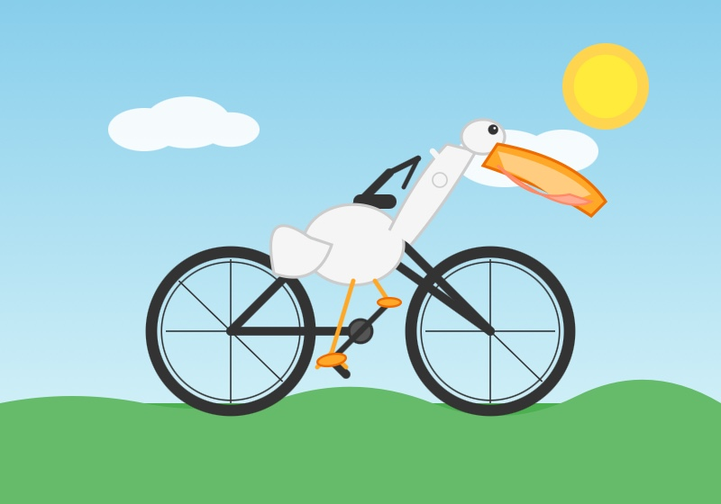

# [Simon Willison’s Weblog](/)

 [Subscribe](/about/#subscribe)


 **Sponsored by:** Atlassian — Give your agents a plan. Not a prompt. New Jira capabilities unlock full-context for AI-native software development. Assign tasks to Claude, Cursor, or GitHub Copilot, now directly from Jira. [Learn more](https://fandf.co/4gCMW1I)


16th July 2026 - Link Blog


**[Inkling: Our open-weights model](https://thinkingmachines.ai/news/introducing-inkling/)** ([via](https://news.ycombinator.com/item?id=48924912)) Mira Murati's Thinking Machines Lab just released their first open-weights model. Inkling is "a Mixture-of-Experts transformer with 975B total parameters, 41B active" - an Apache-2.0 licensed multimodal model trained on 45 trillion tokens of text, images, audio and video.

They're also promising Inkling-Small, a 276B (12B active) model, but that's still being tested and the weights will be released "once that work is complete".

The [model card](https://thinkingmachines.ai/model-card/inkling/) is much shorter than I've come to expect from US AI labs. It links to even shorter [Training Data Documentation](https://thinkingmachines.ai/training-data-documentation/) with almost nothing of interest in it - it's best summarized by these two paragraphs:

>

The datasets Thinking Machines Lab uses to develop its AI services includes content that is in the public domain as well as content that may be subject to intellectual property protection.

Thinking Machines Lab’s services were developed using publicly available content obtained from the open internet and publicly accessible data repositories. Certain datasets were also obtained from third parties.

By Thinking Machines' own admission, this is not a frontier model. It's instead intended as a strong base model for fine-tuning using their own [Tinker training platform](https://thinkingmachines.ai/tinker/):

>

Inkling is not the strongest overall model available today, open or closed. Instead, a combination of qualities makes it a good open-weights base for customization: multimodal capabilities, efficient thinking, and availability on Tinker for fine-tuning.

There's a lot to like about this release. It's Apache-2.0 licensed, and looks competitive with the open weight models coming out of China - it's good to see the US open weights ecosystem gain a new viable contender to join NVIDIA Nemotron and Gemma 4.

Here's its attempt at an SVG pelican riding a bicycle, which I generated using this `curl` command against the Thinking Machines API:

```
curl "https://tinker.thinkingmachines.dev/services/tinker-prod/oai/api/v1/chat/completions" \
  -H "Authorization: Bearer $TINKER_API_KEY" \
  -H "Content-Type: application/json" \
  -d '{
    "model": "thinkingmachines/Inkling",
    "messages": [
      {"role": "user", "content": "Generate an SVG of a pelican riding a bicycle"}
    ],
    "stream": false
  }'
```


Full [response here](https://gist.github.com/simonw/8117ac4376371dd3fc2b5dbce27e0855).



Since it's a multi-modal model I had it describe its own image (after I rendered it to a JPEG) by sending this JSON:

```
{
  "model": "thinkingmachines/Inkling",
  "messages": [{
    "role": "user",
    "content": [
      {"type": "image_url", "image_url": {"url": "data:image/jpeg;base64,$BASE_64_JPEG"}},
      {"type": "text", "text": "Describe this image in detail"},
    ],
  }],
  "stream": false
}
```


Here's [the full response](https://gist.github.com/simonw/dccebd0581f5c4056c5b0ca5bdc38cd9#reasoning_content). It thought it had drawn a "stork or seagull":

>

This is a cheerful, flat-vector cartoon illustration featuring a white bird riding a bicycle across a green landscape.

**The Bird:** The central figure is a stylized white bird—resembling a stork or seagull—with a plump, rounded body. It has a long, prominent orange beak that is slightly open, revealing a black line for the mouth. Its eye is small and black with a tiny white highlight. The bird has black wing and tail feathers with white edges, and thin orange legs ending in black feet that rest on the bicycle's orange pedals.

**The Bicycle:** The bike has a simple black frame with two large wheels featuring black tires, gray inner rims, and black spokes arranged in a cross pattern. The handlebars are black, and there are bright orange pedals attached to a black crank. A white seat is visible behind the bird's body.

**The Setting:** The scene is set against a clear, light blue sky. There are two fluffy white clouds—one on the left side and a smaller one near the bird's head on the right. A bright, solid yellow sun shines in the upper right corner. At the bottom, there are rolling green hills with a smooth, curved top edge where the bicycle rests.

The overall style is playful, simple, and colorful, with clean lines and a bright, sunny atmosphere.

Posted [16th July 2026](/2026/Jul/16/) at 3:35 pm


## Recent articles


- [Kimi K3, and what we can still learn from the pelican benchmark](/2026/Jul/16/kimi-k3/) - 16th July 2026
- [The new GPT-5.6 family: Luna, Terra, Sol](/2026/Jul/9/gpt-5-6/) - 9th July 2026
- [sqlite-utils 4.0, now with database schema migrations](/2026/Jul/7/sqlite-utils-4/) - 7th July 2026


This is a **link post** by Simon Willison, posted on [16th July 2026](/2026/Jul/16/). [ ai 2,132 ](/tags/ai/) [ generative-ai 1,884 ](/tags/generative-ai/) [ llms 1,851 ](/tags/llms/) [ training-data 65 ](/tags/training-data/) [ pelican-riding-a-bicycle 127 ](/tags/pelican-riding-a-bicycle/) [ llm-release 216 ](/tags/llm-release/)


###  Monthly briefing


 Sponsor me for **$10/month** and get a curated email digest of the month's most important LLM developments.

 Pay me to send you less!  [ Sponsor & subscribe ](https://github.com/sponsors/simonw/)


- [Disclosures](/about/#disclosures)
- [Colophon](/about/#about-site)
- ©
- [2002](/2002/)
- [2003](/2003/)
- [2004](/2004/)
- [2005](/2005/)
- [2006](/2006/)
- [2007](/2007/)
- [2008](/2008/)
- [2009](/2009/)
- [2010](/2010/)
- [2011](/2011/)
- [2012](/2012/)
- [2013](/2013/)
- [2014](/2014/)
- [2015](/2015/)
- [2016](/2016/)
- [2017](/2017/)
- [2018](/2018/)
- [2019](/2019/)
- [2020](/2020/)
- [2021](/2021/)
- [2022](/2022/)
- [2023](/2023/)
- [2024](/2024/)
- [2025](/2025/)
- [2026](/2026/)
-