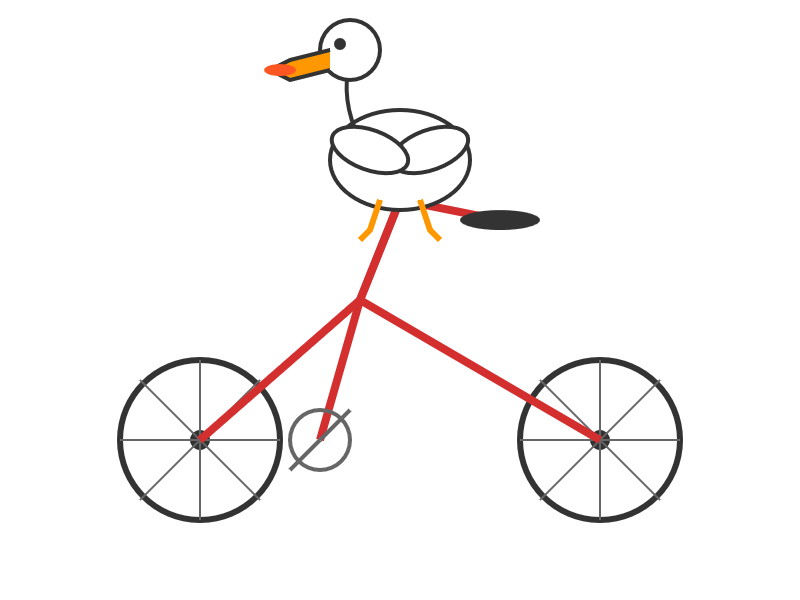

# [Simon Willison’s Weblog](/)

 [Subscribe](/about/#subscribe)


 **Sponsored by:** Atlassian — Give your agents a plan. Not a prompt. New Jira capabilities unlock full-context for AI-native software development. Assign tasks to Claude, Cursor, or GitHub Copilot, now directly from Jira. [Learn more](https://fandf.co/4gCMW1I)


11th July 2025 - Link Blog


**[moonshotai/Kimi-K2-Instruct](https://huggingface.co/moonshotai/Kimi-K2-Instruct)** ([via](https://news.ycombinator.com/item?id=44533403)) Colossal new open weights model release today from [Moonshot AI](https://en.wikipedia.org/wiki/Moonshot_AI), a two year old Chinese AI lab with a name inspired by Pink Floyd’s album The Dark Side of the Moon.

My [HuggingFace storage calculator](https://tools.simonwillison.net/huggingface-storage) says the repository is 958.52 GB. It's a mixture-of-experts model with "32 billion activated parameters and 1 trillion total parameters", trained using the Muon optimizer as described in Moonshot's joint paper with UCLA [Muon is Scalable for LLM Training](https://arxiv.org/abs/2502.16982).

I think this may be the largest ever open weights model? DeepSeek v3 is 671B.

I created [an API key for Moonshot](https://platform.moonshot.ai/console/api-keys), added some dollars and ran a prompt against it using my LLM tool. First I added this to the [extra-openai-models.yaml file](https://llm.datasette.io/en/stable/other-models.html#openai-compatible-models):

```
- model_id: kimi-k2
  model_name: kimi-k2-0711-preview
  api_base: https://api.moonshot.ai/v1
  api_key_name: moonshot

```


Then I set the API key:

```
llm keys set moonshot
# Paste key here

```


And ran a prompt:

```
llm -m kimi-k2 "Generate an SVG of a pelican riding a bicycle" \
  -o max_tokens 2000

```


(The default max tokens setting was too short.)



This is pretty good! The spokes are a nice touch. [Full transcript here](https://gist.github.com/simonw/39aba6a1d4895ad7516bffe9485031db).

This one is open weights but not open source: they're using a [modified MIT license](https://github.com/moonshotai/Kimi-K2/blob/main/LICENSE) with this non-OSI-compliant section tagged on at the end:

>

Our only modification part is that, if the Software (or any derivative works thereof) is used for any of your commercial products or services that have more than 100 million monthly active users, or more than 20 million US dollars (or equivalent in other currencies) in monthly revenue, you shall prominently display "Kimi K2" on the user interface of such product or service.

**Update**: MLX developer [Awni Hannun reports](https://x.com/awnihannun/status/1943723599971443134):

>

The new Kimi K2 1T model (4-bit quant) runs on 2 512GB M3 Ultras with mlx-lm and mx.distributed.

1 trillion params, at a speed that's actually quite usable

Posted [11th July 2025](/2025/Jul/11/) at 6:33 pm


## Recent articles


- [Kimi K3, and what we can still learn from the pelican benchmark](/2026/Jul/16/kimi-k3/) - 16th July 2026
- [The new GPT-5.6 family: Luna, Terra, Sol](/2026/Jul/9/gpt-5-6/) - 9th July 2026
- [sqlite-utils 4.0, now with database schema migrations](/2026/Jul/7/sqlite-utils-4/) - 7th July 2026


This is a **link post** by Simon Willison, posted on [11th July 2025](/2025/Jul/11/). [ ai 2,128 ](/tags/ai/) [ generative-ai 1,882 ](/tags/generative-ai/) [ llms 1,849 ](/tags/llms/) [ llm 610 ](/tags/llm/) [ mlx 43 ](/tags/mlx/) [ pelican-riding-a-bicycle 127 ](/tags/pelican-riding-a-bicycle/) [ llm-release 216 ](/tags/llm-release/) [ ai-in-china 98 ](/tags/ai-in-china/) [ moonshot 8 ](/tags/moonshot/) [ kimi 12 ](/tags/kimi/)


###  Monthly briefing


 Sponsor me for **$10/month** and get a curated email digest of the month's most important LLM developments.

 Pay me to send you less!  [ Sponsor & subscribe ](https://github.com/sponsors/simonw/)


- [Disclosures](/about/#disclosures)
- [Colophon](/about/#about-site)
- ©
- [2002](/2002/)
- [2003](/2003/)
- [2004](/2004/)
- [2005](/2005/)
- [2006](/2006/)
- [2007](/2007/)
- [2008](/2008/)
- [2009](/2009/)
- [2010](/2010/)
- [2011](/2011/)
- [2012](/2012/)
- [2013](/2013/)
- [2014](/2014/)
- [2015](/2015/)
- [2016](/2016/)
- [2017](/2017/)
- [2018](/2018/)
- [2019](/2019/)
- [2020](/2020/)
- [2021](/2021/)
- [2022](/2022/)
- [2023](/2023/)
- [2024](/2024/)
- [2025](/2025/)
- [2026](/2026/)
-