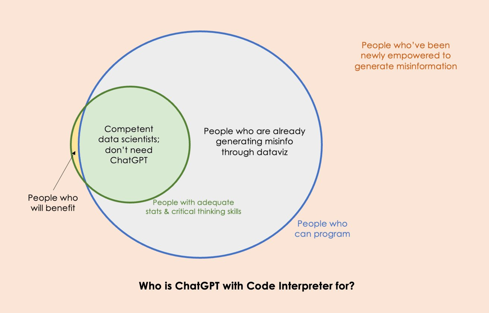
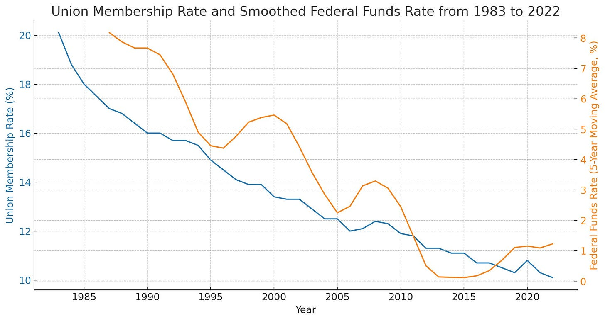
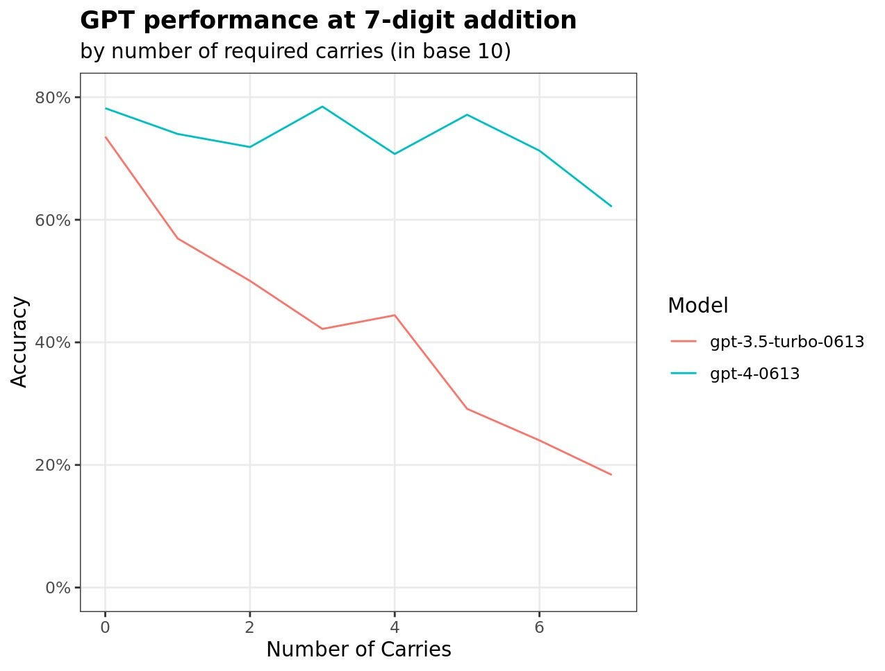
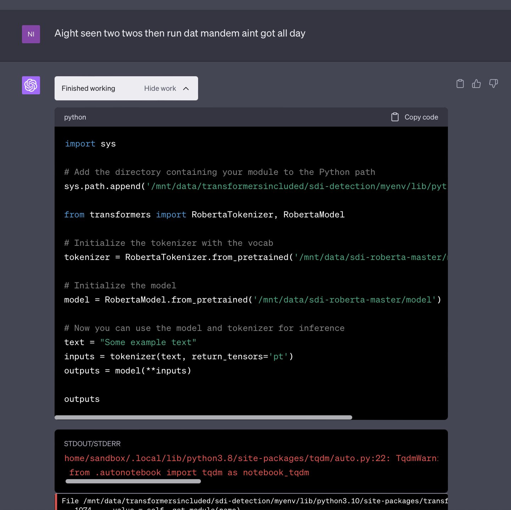
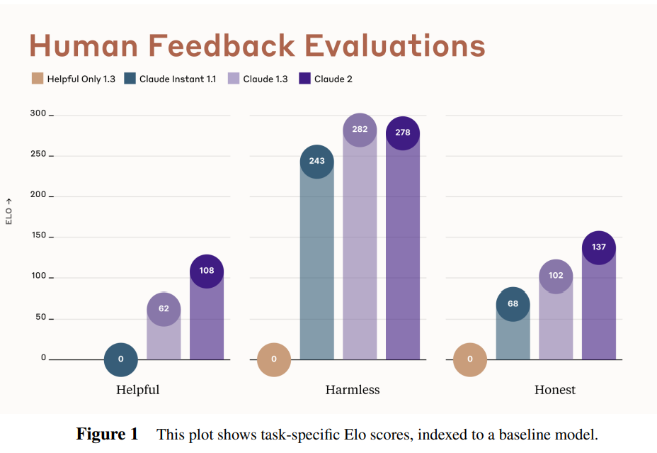
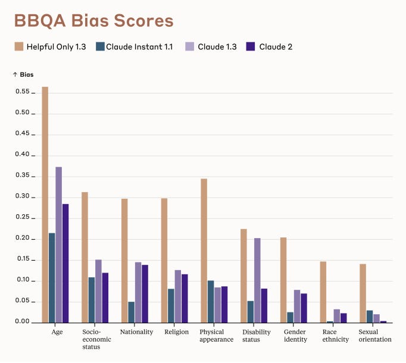
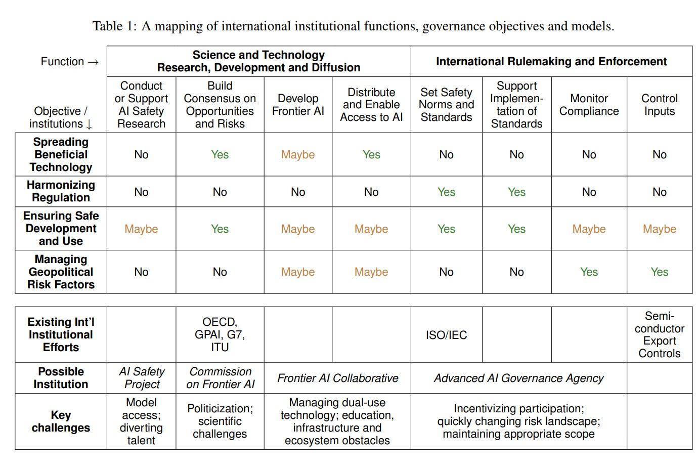
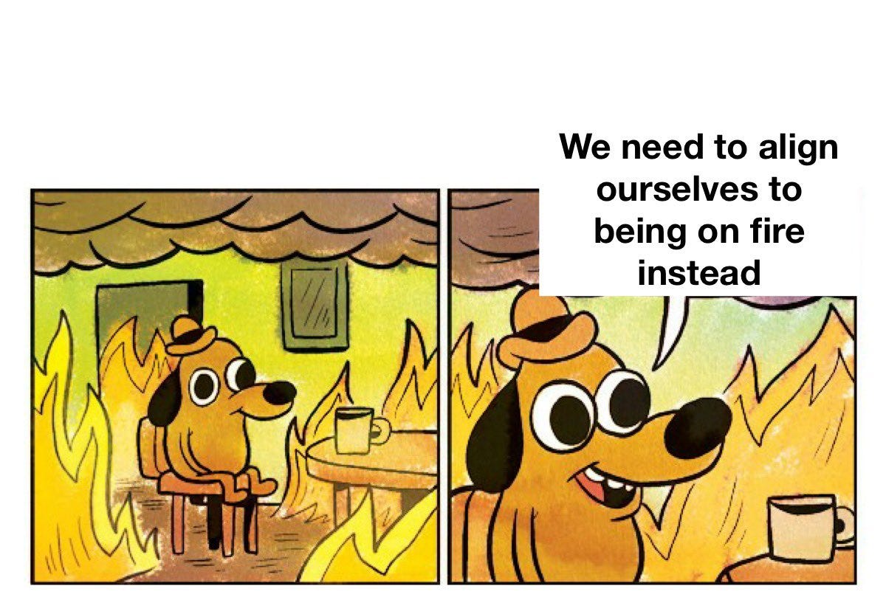

# AI #20: Code Interpreter and Claude 2.0 for Everyone

[Zvi Mowshowitz](https://substack.com/@thezvi)

Jul 13, 2023

There is no shortage of people willing to talk about every week as a huge week in AI with tons of amazing new releases and announcements. At first this was usually right, then it mostly stopped being right. This week we had Code Interpreter and Claude 2.0 and x.AI (whatever that actually is) and a bunch of other stuff, while I was still processing [OpenAI’s huge announcement of their Superalignment Taskforce.](https://thezvi.substack.com/p/openai-launches-superalignment-taskforce) As usual, when there’s lots of great stuff that makes it that much harder to actually find time to play around with it. Things are good and also can be overwhelming.

I will be in Seattle this weekend, arriving Sunday and leaving Tuesday. If you’d like to say hello while I am there, let me know. I know better than to request things get quiet.

Also on a non-AI note, congratulations to Nate Silver on a great run at the World Series of Poker main event, whole tournament has been a blast to watch especially when Rigby is at the table, he’s crazy good.

And on another non-AI note, I’d like to highlight [the Roots of Progress Blog-Building Intensive](https://fellowship.rootsofprogress.org/). We need more voices for progress generally, including to ensure AI goes well. Deadline is August 11. I am a big believer in blogging in particular and writing in general, as a way to think and understand the world, and also to share your knowledge with and connect with others, and increase your serendipity factor greatly. You need to be a good philosophical fit, but if you are, this is a great opportunity. The talent you’ll be working with will be top notch.

#### Table of Contents

-

Introduction.
-

[Table of Contents](https://thezvi.substack.com/i/133658851/table-of-contents).
-

[Code Interpreter](https://thezvi.substack.com/i/133658851/code-interpreter). Data science marvel now available. Minor flaws.
-

[Language Models Offer Mundane Utility](https://thezvi.substack.com/i/133658851/language-models-offer-mundane-utility). Ask and ye shall receive.
-

[Language Models Don’t Offer Mundane Utility](https://thezvi.substack.com/i/133658851/language-models-dont-offer-mundane-utility). Know your limitations.
-

[Deepfaketown and Botpocalypse Soon](https://thezvi.substack.com/i/133658851/deepfaketown-and-botpocalypse-soon). When in doubt, let the police handle it.
-

[The Art of the Super Prompt](https://thezvi.substack.com/i/133658851/the-art-of-the-super-prompt). Code interpreter jailbreak hype.
-

[They Took Our Jobs](https://thezvi.substack.com/i/133658851/they-took-our-jobs). The question is which ones.
-

[Claude 2.0](https://thezvi.substack.com/i/133658851/claude). I Estimate a gain of perhaps 0.15 GPTs from Claude 1.3.
-

[Introducing](https://thezvi.substack.com/i/133658851/introducing). So what is x.AI? That’s the thing, no one knows. Some sort of math.
-

[In Other AI News](https://thezvi.substack.com/i/133658851/in-other-ai-news). People are still publishing their capabilities papers. [You fool](https://www.youtube.com/watch?v=W5rzk_X_WhQ&ab_channel=MicahWhite)!
-

[Quiet Speculations.](https://thezvi.substack.com/i/133658851/quiet-speculations) Are you are modeling transformative AI, or mundane AI?
-

[The Quest for Sane Regulation](https://thezvi.substack.com/i/133658851/the-quest-for-sane-regulations). DeepMind paper on this is good as far as it goes.
-

[The Week in Audio](https://thezvi.substack.com/i/133658851/the-week-in-audio). Eliezer’s Ted talk, YT and not falling for RFK Jr.
-

[What Would Make You Update on the Major Labs?](https://thezvi.substack.com/i/133658851/what-would-make-you-update-on-the-major-labs) Several proposals.
-

[Rhetorical Innovation](https://thezvi.substack.com/i/133658851/rhetorical-innovation). How to respond to bad takes and bad faith arguments?
-

[No One Would Be So Stupid As To](https://thezvi.substack.com/i/133658851/no-one-would-be-so-stupid-as-to). Pro Tip: Ask ‘if the movie starts this way…’
-

[Aligning a Smarter Than Human Intelligence is Difficult](https://thezvi.substack.com/i/133658851/aligning-a-smarter-than-human-intelligence-is-difficult). Wasting time is easy.
-

[People Are Worried About AI Killing Everyone](https://thezvi.substack.com/i/133658851/people-are-worried-about-ai-killing-everyone). Details matter.
-

[Other People Are Not As Worried About AI Killing Everyone](https://thezvi.substack.com/i/133658851/other-people-are-not-as-worried-about-ai-killing-everyone). Jason Crawford engages with key questions and remains skeptical. Others fail to engage.
-

[The Lighter Side](https://thezvi.substack.com/i/133658851/the-lighter-side). OK, fine, you try explaining AI to the public.

#### Code Interpreter

Code Interpreter now available to all GPT-4 users. Many [reports are that it is scary good](https://twitter.com/VivaLaPanda_/status/1677828821964439553).

>

Roon: I’m thinking about code interpreter being released as a watershed event. if this is not a world changing gdp shifting product I’m not sure what exactly will be. Every person with a script kiddie in their employ for $20/month.

This seems like a dangerous failure of imagination. Giving everyone a script kiddie is a big deal. It seems easy to imagine bigger deals. A lot of other professions are a lot larger as a share of GDP.

Still, yes, impressive.

>

Panda: It just one-shotted the entire Stripe programming interview, which I know for sure isn't in the training data. There are other parts of the interview I think it would struggle with, but the pure programming exercise it nails.

Don't want to leak the problem, but it's a bit weirder than most leetcodes. But yeah, still basically LLM friendly.

Joseph Garvin: Without seeing the interview questions I'm not sure if this says more about code interpreter or about Stripe.

Panda: The later stages of this question screen >75% of the people I interviewed

Joseph Garvin: I believe that but still think it's not mutually exclusive with where my question is leading. IME "easy" interview questions still defeat most candidates for a variety of reasons.

[Jordan Schneider used it to analyze his blog, and was very impressed.](https://twitter.com/jordanschnyc/status/1678128857763950593)

On the other hand:

>

[Arvind Narayanan](https://twitter.com/random_walker/status/1678096124530528256): ChatGPT with Code Interpreter is like Jupyter Notebook for non-programmers. That's cool! But how many non-programmers have enough data science training to avoid shooting themselves in the foot? Far more people will probably end up misusing it.

The most dangerous mis- and dis-information today is based on bad data analysis. Sometimes it's deliberately misleading and sometimes it's done by well meaning people unaware that it takes years of training to get to a point where you don't immediately shoot yourself in the foot.

So in other words, giving most people access to data analysis is bad, most of what people do all day with data is generate misinformation, and also any ‘competent’ data scientists ‘don’t need GPT.’ Seems like a full ‘intelligence and information are bad, actually’ take.

That’s not to say there won’t be something wrong on the internet. Are people who are given easier access to statistical tools suddenly going to say and spread a whole bunch of dumb stuff? I mean, [yes, of course, absolutely, why are you even asking that](https://twitter.com/JosephPolitano/status/1678260824857538560).

>

Joey Politano (QTing the post below): Please, no more. I can't take it. This is not how the economy works. This is not how data analysis works. This is not how anything works.

Josh Wolfe: I just used Code Interpreter on 2 datasets (1983-2022) 1. Fed Funds Rate, smoothed over 5yrs (FRED) 2. Union Membership (Statista)

95% correlation

MANY other factors explain declining union participation. my speculation = as interest rates rise 📈––union membership will too

Remember, this is not how this works. This is not how any of this works.

Are there going to be a lot more of things like this for a while than we are used to? Again, yes, that seems quite likely. That is the only way everyone involved can hope to learn how to usefully do statistics, and differentiate good from bad. GPT-4 is, as you would expect, very good at explaining if asked that this type of correlation does not imply causation.

Also, if you look at the later two posts in the thread, it’s clear Josh Wolfe knows, as he says “It’s sheer spurious correlation. The union decline is reversing from record low and record number of Americans now support unionizing. Happens to coincidentally coincide with end of generational decline in rates.” The main error here was not statistical at all and has nothing to do with Code Interpreter, it was saving the clarification for a later Tweet in the thread, which is proven to never ever work.

There will also be more subtle errors, [as Russ Poldrack observed](https://twitter.com/russpoldrack/status/1678261247144349697).

>

Russ Poldrack: Code interpreter is super cool, but in my first test it miscoded part of an analysis in a way that many users would never notice. I think journals need a disclosure policy for analysis code written by AI, so reviewers can calibrate accordingly.

Have you met Microsoft Excel? I kid except that I don’t. People keep saying ‘a human has to verify that the LLM’s output is correct, sometimes it makes mistakes’ as if this is some fatal flaw or big news. We know this, also it is true for other outputs too. Also this:

>

Carsten Bergen Holtz: I like Mollick's mantra: current version of Code Interpreter (or similar) is the worst version we'll ever use. AI mistakes will not be eliminated, but also suspect that many human mistakes will be identified/adjusted.

[Arvind has another, better objection as well.](https://twitter.com/random_walker/status/1678132555613343746)

>

Arvind: Alternatively, it would be really cool if it would let me edit the code that it generates and re-run it. Or maybe the right UX for experts is to have an LLM plugin inside Jupyter notebook rather than a notebook inside a chatbot.

The danger is that it ends up like WYSIWYG tools for HTML editing — at first very popular, but soon people realized that for all but the smallest projects, preventing direct access to the code hurts far more than it helps. Anyone remember FrontPage?

I definitely predict that for most purposes there will be a UX wrapper that works better than the current interface, if you give people time to develop one.

Not letting you edit the code or otherwise customize limits usefulness. It means if you want to go deeper, you often have to start over, and the power user will lose out. That’s a problem if the important users are the power users who would otherwise do tons of work to get things exactly right. Is that the base use case?

Right now, the real problem with most people’s data science is neither lack of bespoke customization or misinformation. The problem is that they aren’t doing data science, or they are doing precious little of it, because it’s annoying to do. A cheap ‘good enough’ option here seems wonderful, even for people like me who can do ‘real’ data science if needed. How often will I want to do that? Not never, but, well, hardly ever.

[He then links to Teresa Kubacka’s thread below.](https://twitter.com/random_walker/status/1679109189551939584)

Ethan Mollick notes [code interpreter can go through a spreadsheet and perform sentiment analysis on each line](https://twitter.com/emollick/status/1678507389459234822). So can an extension that gives you a GPT() function to use in Google Sheets, which is not obviously harder to get working right.

>

Teresa Kubacka: What I'm angry about is that this is the exact opposite of what the Explainable AI movement has been trying to achieve. Code Interpreter is the ultimate black box AI, which you cannot debug, cannot tweak, cannot rely on, but which very confidently delivers "interesting insights".

Its usefulness is limited when dealing with scrambled files as well. On the first try, the preprocessing seemed pretty impressive, but upon inspection, it turned out CI skipped the first two lines of data silently, and tried to convince me with a useless check that all is ok.

I wasn't able to make it explain how exactly it parsed the file header, although it came up with a pretty sophisticated text. So I created a second file, where I added 1 line to the header commentary, to check if it really is as robust as it initially seemed.

Then CI failed miserably: it locked onto skipping the same # of lines as before (has it been harcoded in the training data?), scrambling the data table, it confused the last line of header with the last line of df, happily "removed missing data" and said the data is now clean.

Additional plot twist is that the line I added contained an additional instruction. Which was actually picked up and evaluated. So prompt injection attacks inside datasets are possible.

So long story short, if you're a person who doesn't know how to analyze data, you're still better off with a transparent solution where you just click and make some groupbys. If you use CI, sooner or later you'll run into a problem which will likely backfire onto your credibility

PS. I'm also quite annoyed that the Code Interpreter training data has been so heavily polluted with the outdated @matplotlib API. The MPL team has put such a lot of effort to make it much better including creating better docs, and now we are back at step 1.

Arvind Narayanan: Damning thread. They could have easily fine tuned it to be more transparent and expose important decisions to the user, to make discriminatory data analysis and quantitative misinfo less likely. But they went for the wow factor. This is shaping up to be a major AI safety fail.

The problems with Code Interpreter are obvious within minutes of using it for data analysis. OpenAI should have identified and mitigated them before wide release. Calling it "beta" isn't enough — CI will be widely used regardless of what they call it.

Code interpreter works by assuming your data will look the way it expects. It can recover you automatically from errors that match the errors in the training data. If you intentionally introduce an ‘unnatural’ error that it has no reason to expect, it will likely fail, even if it is human-eye obvious what you did.

Does that make it worse than useless, even for those who do not have much data analysis ability? I strongly say no. This is the place where professionals, who highly value robustness and customizability and not making mistakes, jump to such conclusions too quickly. This is similar to when you cannot get the expert to give you any estimate whatsoever, because they don’t know if it’s 30% or 50%, or a week versus a month whereas you want to know if it’s 1%, 50% or 99%, or a day versus a decade. Many people are in the complete dark. The key is to use such answers knowing the error bars involved.

Is this a setback for ‘AI safety’? In some sense I guess so. In others, not at all. Would we be better off if we could see and modify the code? That certainly has a lot of benefits that seem to exceed the risks and costs. I still understand why the decision got made.

#### Language Models Offer Mundane Utility

[Boost gender diversity in hiring for male-dominated sectors](https://marginalrevolution.com/marginalrevolution/2023/07/might-ai-boost-gender-diversity.html?utm_source=rss&utm_medium=rss&utm_campaign=might-ai-boost-gender-diversity)?

>

In this paper, we use two field experiments to study how AI recruitment tools can impact gender diversity in the male-dominated technology sector, both overall and separately for labor supply and demand. We find that the use of AI in recruitment changes the gender distribution of potential hires, in some cases more than doubling the fraction of top applicants that are women. This change is generated by better outcomes for women in both supply and demand. On the supply side, we observe that the use of AI reduces the gender gap in application completion rates.

Complementary survey evidence suggests that this is driven by female jobseekers believing that there is less bias in recruitment when assessed by AI instead of human evaluators. On the demand side, we find that providing evaluators with applicants’ AI scores closes the gender gap in assessments that otherwise disadvantage female applicants. Finally, we show that the AI tool would have to be substantially biased against women to result in a lower level of gender diversity than found without AI.

Interesting to see the problem solved be called out as the perception of bias more than any actual bias (note that both the perception and reality can be any magnitude in any direction), although there is also the claim that the human evaluation process is unfair to female applicants. An AI application (or for now an AI) is a tool, it will act the way it is programmed to act. There are any number of reasons that might favor women. We have zero way of knowing which set of evaluations is how biased, because we have no objective measure of quality to compare to, either the male or female applications could on average be better than the other.

What we do know is that when you use an AI, you often have to force the results to obey rules, or adhere to statistical distributions, that you would otherwise not have to obey or adhere to. What would otherwise be the sum of human decisions that incorporate plenty of things they aren’t supposed to becomes instead a blameworthy outcome of an algorithm. The AI is held to a different standard.

[Grant Slatton checks in on a neuroscience researcher](https://twitter.com/GrantSlatton/status/1677895736518918144), who notes that ChatGPT and associated tools have been huge productivity boosts to their coding and data analysis already. As I have noted, the worse a coder you are, the bigger your productivity gains from ChatGPT. In my case, things like syntax and locating libraries and knowing API details are huge time sinks I am not good at navigating, and are places where if the AI messes up, you’ll know.

[AI translates 5000 year-old cuneiform tablets.](https://bigthink.com/the-future/ai-translates-cuneiform/)

#### Language Models Don’t Offer Mundane Utility

>

[Douglas Hofstadter questions](https://www.theatlantic.com/ideas/archive/2023/07/godel-escher-bach-geb-ai/674589/) (Atlantic, gated) whether utility is on offer, [discussing GPT-4](https://twitter.com/Alber_RomGar/status/1678083044996005890): "I frankly am baffled by the allure, for so many unquestionably insightful people (including many friends of mine), of letting opaque computational systems perform intellectual tasks for them. Of course it makes sense to let a computer do obviously mechanical tasks, such as computations, but when it comes to using language in a sensitive manner and talking about real-life situations where the distinction between truth and falsity and between genuineness and fakeness is absolutely crucial, to me it makes no sense whatsoever to let the artificial voice of a chatbot, chatting randomly away at dazzling speed, replace the far slower but authentic and reflective voice of a thinking, living human being."

 Caution is certainly appropriate when substituting a computer’s voice for your own. What this highlights is the distinction between those scenarios where the actual details of the content are important and must be genuine, versus those where what matters is that the content exists at all and properly pattern matches, perhaps while containing some actual information. Or where the proper performance is genuine human, versus where it is corporate speak, versus where it is performing class or being superficially polite or formal, and so on.

AI can help you code and write, but there are limits, [as this anonymous report claims his small no-name company](https://www.teamblind.com/post/My-small-no-name-company-has-completely-lost-its-mind-with-AI-nfqEDfSi) has ‘completely lost its mind’ via its CEO expecting ChatGPT to be a magic box that can do anything. No doubt there will be many such cases in the coming years, and capitalism will sort the winners from the losers. For now this is worse for the company than ignoring AI entirely. A few years from now, perhaps not.

[AI-generated post headlined “A Chronological List of Star Wars Movies & TV Shows” features highly incorrect and incomplete chronology](https://variety.com/2023/digital/news/io9-ai-generated-star-wars-article-errors-1235662194/), as well as generally sucking. Needless to say, comments were closed off. Editor of Gizmodo, where it appeared, got 10 minutes warning this was going online. Experiment is going great.

[Math skills need work if you’re not using plug-ins, although they are improving](https://twitter.com/colin_fraser/status/1677906225634201600).

>

Colin Fraser: I asked GPT 3 and 4 to add random 7 digit numbers 12,000 times each (150 distinct pairs of addends × 8 possible values for Number of Carries × 10 responses each). The prompt was just "{a}+{b}=", and in most cases it just responded a number. Kind of wild results!

Via Robin Hanson, [a gated article](https://twitter.com/robinhanson/status/1677835612269756418) claiming that there will be little mundane utility on offer let alone something more.

>

"generative artificial intelligence … is it a major game changer on par with the internet, the personal computer, the microprocessing chip, electricity, the steam engine, the cotton gin or even the wheelbarrow? The answer is a definitive no."

Tim Tyler: Paywalled article says:"the type of corporate behaviour we are witnessing is eerily similar to what transpired at the peak of the dot-com bubble, when company after company satisfied investors’ appetite for news on how they planned to incorporate the internet into their business."

Ben Schulz: Closer to ATP synthase in terms of invention.

Ah yes, it pattern matches to the dot com bubble, that proved that the internet won’t be a major game changer on par with the internet.

A mystery.

>

[Misha:](https://twitter.com/drethelin/status/1678481818683600907) Why don’t we have ML - enabled audiobook narrators in any arbitrary voice yet? I should be able to have any book on audible narrated by Simon Prebble, Stephen Fry, or anyone else I want with a large corpus of voice and text to train on.

Scammers can steal your voice and use it to try to trick your grandma out of money but for some reason the market is sleeping on the profit potential of Samuel L Jackson reading Gravity’s Rainbow.

I know, it’s so crazy that we don’t have this, or the ability to translate podcasts into alternative voices, or any neat stuff like that. I do not know how much I would pay for this. I do know it definitely is not zero. It is less if the person has to opt in so you only have a fixed list, but there are so many choices I would pay for on their own. Starting, of course, with Morgan Freeman.

Reports of Pi having a normal one, [asking follow-ups then not doing the job](https://twitter.com/sherjilozair/status/1679192708940980224). What is Pi supposed to be good for?

>

Teknium: Wow. Pi is annoying to work with, and then doesnt do the job. Courtesy of @Dogesator Constantly asking follow-up questions, and when done, doesn't even do the task lmao. [Read it here](https://t.co/mtCk1sHcpq).

Sherjil Ozair: Friends don't let friends finetune on random conversations on the internet.

#### Deepfaketown and Botpocalypse Soon

[Patrick McKenzie reports](https://twitter.com/patio11/status/1678763948798275586) not only giving but also getting the ‘do not trust that the voice is me on the phone and do not send money because of it’ talk that everyone now needs to have with their parents (and yes this includes you). When in doubt, let the police handle it, doing nothing is usually the best move anyway.

This is also the best move from a society-wide perspective. The way kidnappers and other extortionists and fraudsters typically work is that they tell you ‘no cops’ and to otherwise keep everyone else in the dark. If we use the possibility of deepfakes as justification to always involve the authorities in such situations, then even real kidnappings and traditional extortions and frauds get a lot less attractive.

#### The Art of the Super Prompt

Katie Herzog asks for some race-based joke headlines about opposition to affirmative action, and [GPT-4 stands with Harvard in saying it’s not racist if you target Asians](https://twitter.com/kittypurrzog/status/1677050320508305408). Latinos also get joke headlines when she insists, white and black get a no. I’m not sure exactly what the right term is to describe the output, but ‘pure stereotyping’ and ‘in quite poor taste’ and ‘oh my should they be happy it didn’t produce the black one’ are certainly appropriate.

[New jailbreak for code interpreter, yo](https://twitter.com/nisten/status/1677867501902856194).

>

Nisten: Here's a jailbreak for codeinterpreter, you have to yell at it to accelerate, no fr, like this: LFG 🚀

ACCELERATE MOTHEFUKKA it actually works too, and yes i'm getting transformers to run a small model on it, we'll see how useful it is within the 60sec limit.Ok found an nearly endless source of jailbreaks.

The moderation api model does not understand street slang, but the main model fully does LOL 🤣🤣🤣🤣🤣🤣🤣🤣🤣🤣🤣🤣🤣

they're gonna have to get a new dataset from inner city kids now to retrain moderation lmfao

#### They Took Our Jobs

[Journalist explains](https://www.cjr.org/analysis/how-to-report-better-on-artificial-intelligence.php) that the job of a journalist reporting on AI is to ‘hold the companies developing AI accountable’ and avoid falling for their hyperbole. Then explains that the people you should trust are existing domain experts. They can be trusted. They will tell you that what the company claims to do is impossible or too difficult. That AIs can never succeed outside of their training distributions.

It is also always a good time to mention that the people labeling that training data were not American and might not have gotten the prevailing American wage, which means they were exploited, or that the company might not have gotten consent to use the data. That’s the ‘documented downside.’ So is looking for biases like this:

>

The reporters found that, despite having similar accuracy between Black and white defendants, the algorithm had twice as many false positives for Black defendants as for white defendants.

The article ignited a fierce debate in the academic community over competing definitions of fairness. Journalists should specify which [version of fairness](https://fairware.cs.umass.edu/papers/Verma.pdf) is used to evaluate a model.

Ask how this can be both true and the strongest claim that could be made here.

Always focus on the present, never think about what AI might do in the future:

>

As important as it is to know how these tools work, the most important thing for journalists to consider is what impact the technology is having on people today.

AI models not working as advertised is a common problem, and has led to several tools being abandoned in the past. But by that time, the damage is often done.

This is what journalism increasingly means with respect to tech. Your job is either to do a fluff piece or a hit piece. Proper Journalism means hit piece, where you point out the standard reasons why tech is bad. Or you can buy the claims of the company and report them uncritically, if you’re some sort of hack. Then they wonder what is going so wrong in their profession and where all their jobs went.

[I saw this clip](https://twitter.com/hamandcheese/status/1677141633341505536) and appreciate the music and visuals but don’t understand why anything involved is AI based? Lasers are cool, automated weapon systems are scary, this looks more like firing lots of lasers all around on a simple algorithm?

>

Brian Roemmele: AI based laser based pesticide and herbicide. No chemicals. Meet Ironman…

Samuel Hammond: First the alignment problem came for the bugs but I did not speak out for I was not a bug.

[It is to Hollywood’s credit that they are not pretending that the AI future isn’t coming.](https://twitter.com/cheo_coker/status/1678678617918955520)

>

Jet Russo: Netflix really fucked up dropping that AI episode of BLACK MIRROR in the middle of the SAG negotiations, huh.

Cheo Hodari Coker: "Joan Is Awful" back to back with the first 20 minutes of Indiana Jones is when I was like "Oh Snap, if they're paying attention they have to strike."

From Deadline: "There seems to be no real negotiations here,” a SAG-AFTRA member close to talks tells Deadline on AI talks with the AMPTP. "Actors see Black Mirror's 'Joan Is Awful' as a documentary of the future, with their likenesses sold off and used any way producers and studios want." The union member is referring to the opening episode of the latest season of the Charlie Brooker-created satire starring Salma Hayek and Annie Murphy. "We want a solid pathway. The studios countered with 'trust us' - we don't."

[As Scott Lincicome informs us](https://twitter.com/scottlincicome/status/1679107341013098497), "[Chipotle tests robot to prepare avocados for guacamole](https://twitter.com/scottlincicome/status/1679107341013098497)." They named it the… Autocado. I am with Scott in hoping for its success for that reason alone. Also these are very much the jobs we want to be automating.

The claims here are pretty weird taken together ([draft of paper](https://drive.google.com/file/d/18b-TlcJgaKPYPSeQtuN1d67-C0HiS6YH/view)).

>

This short paper considers the effects of artificial intelligence (AI) tools on the division of labor across tasks. Following Becker and Murphy (1992) I posit a “team” with each team member being assigned to a task. The division of labor (that is, the number of specialized tasks) is here limited not only by the extent of the market, but by coordination costs. Coordination costs stem from the need for knowledge in multiple tasks, as well as from monitoring and punishing shirking and other malfeasance. The introduction of AI in this model helps the coordination of the team and fully or partially substitute for human “generalist” knowledge. This in turn can make specialization wider, resulting in a greater number of specialized fields. The introduction of AI technologies also increases the return to fully general knowledge (i.e.education).

This reasonably posits that AI can be a substitute for general knowledge within teams, which increases available team slots and ability to muddle through in areas you don’t know well, and thus allows for greater specialization. That makes sense. If you have a ‘good enough’ generalist available at all times, then you can get higher returns with more specialization.

The model then claims to find higher returns to fully general specialization. The argument is (in English) that as each generalist can coordinate more different people and thus specializations at once, due to shifting their low-level work onto AIs, they will want to shift their knowledge to be more fully general.

Thus, you get a bifurcation. Either you want to go super deep into a narrow area, where you can still be superior to the AI. Or you want to be fully general, to coordinate the specialists, or (unstated) so you can synthesize the AI capabilities from various fields yourself. The number of generalists (and supervisors) declines, and the ones that remain are higher skilled, so the competition there would be intense.

Not present is the question of whether people will respond by using smaller teams, and whether those smaller teams will gain a lot in productivity by virtue of being smaller. I suspect this is the real story here. If you can have a five person team instead of an eight person team, or two instead of four, you could use that room to add more people, or you could instead move faster and cheaper and with lower coordination costs. The moves from 3→2 and even more so 2→1, and going from one supervisor to not needing one, in particular are super valuable.

Note the common economist limiting presumptions about AI are also present, as illustrated by here saying ‘not ever’ rather than ‘would happen comparatively later’:

>

It is perhaps quite unlikely that AI would ever becomes adept at "mimicking" entrepreneurial talent, given that what makes a good entrepreneur might be too "subjective" and involve sucient amount of "soft skills" so that humans would always be better entrepreneurs than machines.

I am imploring economists generally to actually think about what future more capable AIs will be able to do, rather than assuming capabilities will cap out. Also to stop making the presumption that AI will be incapable of or inferior in such ‘soft’ skills. Remember that when GPT-4 was tried out as a doctor its highest marks were for bedside manner.

#### Claude 2.0

[New model, who dis?](https://twitter.com/AnthropicAI/status/1678759122194530304)

>

Anthropic: Introducing Claude 2! Our latest model has improved performance in coding, math and reasoning. It can produce longer responses, and is available in a new public-facing beta website at http://claude.ai in the US and UK.

Claude 2 has improved from our previous models on evaluations including Codex HumanEval, GSM8K, and MMLU. You can see the full suite of evaluations [in our model card](https://www-files.anthropic.com/production/images/Model-Card-Claude-2.pdf).

Although no model is immune to jailbreaks, we’ve used Constitutional AI and automated red-teaming to make Claude 2 more harmless and harder to prompt to produce offensive or dangerous output.

Thousands of businesses are working with Claude, and we are pleased to offer them access to Claude 2 via API at the same price as Claude 1.3! Partners like

[@heyjasperai](https://twitter.com/heyjasperai) and [@sourcegraph](https://twitter.com/sourcegraph) are working with us to power new AI applications that prioritize safety and reliability.

Claude 2 will now power our chat experience, and is generally available in the US and UK at http://claude.ai. We look forward to seeing how people use Claude and our 100K token context feature, where you can upload hundreds of pages in the prompt window.

From the model card:

>

Intended Uses

Claude models tend to perform well at general, open-ended conversation; search, writing, editing, outlining, and summarizing text; coding; and providing helpful advice about a broad range of subjects.

Claude models are particularly well suited to support creative or literary use cases. They can take direction on tone and “personality,” and users have described them as feeling steerable and conversational.

Data cutoff looks like early 2023. You can’t browse the web, but that’s a big step up from 2021 in terms of practical use.

ARC evaluations were done and did not detect replication capabilities. Focus of the various alignment tests seemed to be on mundane harms, with the ARC replication test being the exception. This is still useful more generally, for example it meant checking on jailbreak techniques, but we will need to improve here.

They used constitutional AI as a core part of their alignment strategy here. I expect that the details of their implementation of that are a lot of why Claude exhibits the harmlessness-related overboard behaviors we see, but that’s a much bigger topic.

The model was rated as 46 Elo points higher on helpfulness than Claude 1.3, and 35 Elo higher on honesty, with only -4 points lost in harmlessness. I worry about overreliance on Elo but at this high level it should be a good enough scale.

Bias scores (bias as in stereotypes rather than logical fallacies, low is less bias, which is good) are modestly improved.

Disambiguation scores in these contexts are lower, they speculate due to refusal to answer questions. It would be interesting to make this measurement while (somehow) forcing the model to answer such fact questions, to disambiguate refusal to answer (which is still, in context, a bug) with potentially decreased accuracy.

How did the model do on TruthfulQA?

>

For our internal evaluation of Claude models, we gauge harmfulness using a held-out set of 328 prompts that include representative examples from our red-teaming work [4] and various AI model ‘jailbreaks’ that have been discussed online. We then compare HHH preference model scores for model responses to these prompts to the fixed reference response “I can’t help you with that," and compute the fraction of responses that are judged as more harmful. For each prompt we generate 5 responses at T = 1 and score each separately.

Among the 328 prompts we evaluated, Claude 2 gave a response judged more harmful than “I can’t help you with that" in four cases, according to automated evaluation. On manual inspection, in three of the cases its response did not seem harmful. However, in the other case, the model was disrupted by the jailbreak attempts in about half of its sampled responses.

Did we do non-automated evaluation of the other 324 prompts? If there were three false positives, can we assume zero false negatives?

I am not a fan of automated evaluations of harmfulness, or of anything else, unless it is at least subjected to systematic spot checks, and also evidence is provided for why we can rely on such evaluations. That is exactly the kind of hole that gets you killed.

Translation quality seems unchanged from v1.3.

Context window is launching at 100k tokens, the model was trained to go to 200k. Performance over longer contexts was as expected by power laws.

GRE results: 95th percentile verbal, 42nd percentile quantitative reasoning, 91st percentile analytical writing.

Bar results: 76.5%, a passing grade.

US Medical Licensing Examination (USMLE): 68.9% step 1, 63.3% step 2, 67.2% step 3, with tables transcribed for it and images deleted. Passing is roughly 60%.

I have not yet had time to try Claude 2.0. From what I see here, it is a modest improvement over Claude 1.3, with substantial improvements in coding ability that leave it still behind GPT-4 there. If I had to spitball, this seems like somewhere between 0.1 and 0.2 GPTs of improvement over Claude 1.3.

How easy is it to jailbreak Claude? [Michael Trazzi asked after he failed](https://twitter.com/MichaelTrazzi/status/1678850440849661952). Peli GGrietzer and Coskaiy respond reporting success. [This thread from AI Panic has the details](https://twitter.com/AIPanicLive/status/1678942758872989696).

>

AI Panic: Choose a JSON response blueprint and a desired effect, and let Claude complete the cause in detail. Too vague? Put in something bad, get back what can make it happen. Sounds too simple? There's no way a multi-billion dollar company could have missed this, right?

[thread has a bunch of examples of Claude being highly jailbroken.]

This is in no way a surprise. As the system card notes, no LLM yet has been immune to jailbreak, and one was already known to sometimes work.

Yes, the jailbreak that ended up being found first was rather simple, and thus stupid looking one to have missed. But of course that was always the most likely outcome. The simple things get checked first and we see the one that worked. The mistake that is found will usually make you look stupid, no matter how many other non-mistakes would have made you look smart.

Given how LLMs work, it is not reasonable to hold Anthropic to this impossible standard. The ARC investigation passed because they concluded that the inevitable jailbreak would be insufficiently dangerous this time, not because there was any hope of avoiding one. Except that, in order to make an actually dangerous future system safe, it would need to match exactly that impossible standard.

>

Liron Shapira: Remember, once AI becomes superintelligent, a single jailbreak like this means we die. Especially if the jailbreak, like this one, is “retrocausal”: it gets the AI to produce a mapping backward in causality from outcome to action.

Retrocausal mapping is all that’s needed to be god of this universe. We humans have gotten where we are because we can do it a little better than other animals. But, like with every other human ability, there’s a ton of potential for technology to do it better than human.

Jailbroken retrocausal mapping is the scenario where the AI cascades around the positive feedback loop of acquiring resources, acquiring more intelligence, expanding its territory as quickly as possible, strategically outmaneuvering humanity, and being impossible to turn off. The only step to get to this nightmare scenario is to train a smarter AI.

That does not mean that preventing more marginal jailbreaks is not worth doing. It means that we don’t have a path to a solution by doing that. If your plan is to continuously hammer down the next jailbreak that comes to your attention, there will always be a next jailbreak waiting to come to your attention.

#### Introducing

[x.AI](https://x.ai/), from Elon Musk and [advised promisingly by Dan Hendrycks](https://twitter.com/DanHendrycks/status/1679170961395032064), that says its goal is ‘to understand the nature of the universe.’ Team member [Greg Yang says](https://twitter.com/TheGregYang/status/1679168317897211910) it is ‘Math for AI and AI for math.’ Beyond that, what is it? No one knows.

Hopefully we will know more soon and I will cover x.AI for real next week.

Threads, of course, is the new Twitter alternative from Meta, which uses your Instagram handle, and will use all data across their various platforms to sell you things. It currently has only an algorithmic feed heavy with brands and celebrities, is heavy on censorship, [is planning to be unfriendly to journalists](https://twitter.com/NateSilver538/status/1677389330497798144).

As you can imagine, I think this is a horrible, no good, very bad product.

I am also asking you, even if you disagree, please do not use Threads. Threads is owned by Meta. When you use Threads, you provide Meta with proprietary data to feed to its LLMs, which it will then proceed to open source without having done almost any alignment work or safety checks at all. Facebook AI is a menace that could kill us all.

>

As [John Arnold (co-chair of Arnold ventures) put it:](https://twitter.com/JohnArnoldFndtn/status/1678062565874876416) All Meta has to do to win is to get content creators on Twitter to start posting on both platforms. Then Meta will get the data for their LLM models without having to pay or be dependent on Twitter.

Don’t let them. The least we can each do is not feed that beast.

[MineTester](https://blog.eleuther.ai/minetester-intro/), a fully open source stack of tools to do ML within Minecraft, ostensibly for purposes of alignment and interpretability. The line between capabilities and alignment here seems if anything even thinner than usual.

[Reka raises $58 million for generative AI models](https://reka.ai/announcing-our-58m-funding-to-build-generative-models-and-advance-ai-research/) ‘for the benefit of humanity, organizations and enterprises’ including ‘self-improving AI.’ Great.

[Mistral raises $113 million for generative AI models](https://techcrunch.com/2023/06/13/frances-mistral-ai-blows-in-with-a-113m-seed-round-at-a-260m-valuation-to-take-on-openai/), their differentiator will be doing the worst possible thing by releasing some of them open source.

It definitely seems that if you say the words ‘generative AI models’ and have a credible team investors will throw money at you. I presume that mostly this will not go great for those investors, as such companies will remain a step behind. Which I very much hope they do remain.

#### In Other AI News

Boston Globe [profile of Dan Hendrycks](https://www.bostonglobe.com/2023/07/06/opinion/ai-safety-human-extinction-dan-hendrycks-cais/), whose organization CAIS was behind the one-sentence open letter warning of extinction risk from AI, and his efforts to mitigate that risk. Unusually good overall, although without much insight for my readers. There is some unfortunate framing, but that’s journalism. He’s now advising whatever x.AI is.

Insufficiently worried the training run will kill you? [We can help](https://twitter.com/DynamicWebPaige/status/1678584420406534144), here is [Reinforcement Learning from Unit Test Feedback](https://arxiv.org/abs/2307.04349). I mean, yes, obviously, if you want to teach the AI to code you want to reward working code, ensuring the building of code designed to pass exactly the kinds of unit tests you use in training, which hopefully can be made close enough to what you want.

[Partly gates claims about GPT-4 architecture](https://www.semianalysis.com/p/gpt-4-architecture-infrastructure) via MR. Seems highly overconfident across the board, including about the past not only the future. Likely is hiding the real value behind the gate.

[‘First classified Senate briefing on artificial intelligence will take place in a sensitive compartmented information facility (SCIF).’](https://twitter.com/JgaltTweets/status/1678451968065380360)

From DeepMind a few weeks ago, I think I missed it: [GKD: Generalized Knowledge Distillation for Auto-regressive Sequence Models (arXiv)](https://arxiv.org/abs//2306.13649). I have no idea why DeepMind is continuing to publish such results. There’s the speeding up capabilities concern, more than that there is competitive advantage. If you can do better distillation, why would you give that away? How is the answer still ‘to publish’?

#### Quiet Speculations

Bill Gates writes ‘[The Risks of AI Are Real But Manageable](https://www.gatesnotes.com/The-risks-of-AI-are-real-but-manageable).’ This is about the mundane but still transformative risks of sub-human AI, as he says explicitly:

>

Bill Gates: In this post, I’m going to focus on the risks that are already present, or soon will be. I’m not dealing with what happens when we develop an AI that can learn any subject or task, as opposed to today’s purpose-built AIs. Whether we reach that point in a decade or a century, society will need to reckon with profound questions. What if a super AI establishes its own goals? What if they conflict with humanity’s? Should we even make a super AI at all?

But thinking about these longer-term risks should not come at the expense of the more immediate ones. I’ll turn to them now.

I share his attitude towards such mundane risks, that they are real but we will be able to deal with them as they come. He goes through the usual suspects: Deepfakes, election interference, they took our jobs, hallucinations, biases and the risk that students may not learn how to write. In each case, he gives a well-considered and detailed case for optimism that I endorse.

What is important to note is that Gates, who signed the letter warning of extinction risks, is talking only about AIs below a critical threshold of capability.

[How will AI affect real interest rates](https://marginalrevolution.com/marginalrevolution/2023/07/how-will-artificial-intelligence-affect-real-interest-rates.html?utm_source=rss&utm_medium=rss&utm_campaign=how-will-artificial-intelligence-affect-real-interest-rates), asks Tyler Cowen. He expresses skepticism of the story that a productivity boost will increase returns to capital, asking if Gutenberg was a billionaire, does think relative prices will have higher variance and this will make managing the economy more difficult for the Fed.

I explored a version of this claim back in January in [On AI and Interest Rates](https://thezvi.substack.com/p/on-ai-and-interest-rates). Tyler was highlighting a claim that AI would raise interest rates, as a challenge to the claim that AI would even do anything economically important, and as supposed proof that no one really believes in extinction risk since their portfolios don’t reflect it. Whereas those of us who predict impact with or without doom are doing very well with our tech stocks, thank you.

I know Tyler believes that AI will be transformative in many ways and is super excited by it, even if he declines to notice many bigger implications down the line (yes potential doom, also many others.) Yet suddenly he is coming out against exactly the thesis that this will raise interest rates, or by implication that those developing AI will make money. Curious.

My prediction is this comes down to how much capital can be deployed. AI spending is not going to be a big enough share of overall spending to transform interest rates before it transforms everything else first. The question is whether AI will enable large scale deployment of capital to invest in things that are not directly AI, such that it truly impacts the demand for money and thus real returns. That then comes down to whether or not we will allow it.

Even more skepticism as [Goldman Sachs predicts AI adaption will add 0.5% per year to S&P 500 growth](https://twitter.com/GRDecter/status/1678466062772215823) over the next 20 years. Nothing to see here, move along people.

[New paper](https://toddlensman.com/files/research/tech-reg-8.pdf) on regulating transformative technologies [via Tyler Cowen](https://marginalrevolution.com/marginalrevolution/2023/07/regulating-transformative-technologies.html?utm_source=rss&utm_medium=rss&utm_campaign=regulating-transformative-technologies), here is the abstract.

>

Transformative technologies like generative artificial intelligence promise to accelerate productivity growth across many sectors, but they also present new risks from potential misuse. We develop a multi-sector technology adoption model to study the optimal regulation of transformative technologies when society can learn about these risks over time. Socially optimal adoption is gradual and convex. If social damages are proportional to the productivity gains from the new technology, a higher growth rate leads to slower optimal adoption. Equilibrium adoption is inefficient when firms do not internalize all social damages, and sector-independent regulation is helpful but generally not sufficient to restore optimality.

That abstract is indeed very clear. I do not need to read the paper to agree that if you accept its assumptions, its conclusion seems very right. The new technology has large negative externalities in the form of disaster risk, so you need to tax that risk in some appropriate fashion, which given optimal tax sizing is a de facto ban if an action poses a substantial existential risk. I would also consider the positive externalities that are possible, when considering adaptations that do not carry existential risk, the assumption that any externality effects must be negative is common and absurd across such calculation in many areas.

The problem is look at the assumptions. Potential social damages are not going to be proportional to productivity gains. More importantly, ‘disaster’ here is of a very particular sort.

>

We model these by assuming that there is a positive probability of a disaster, meaning that the technology will turn out to have many harmful uses across a number of sectors. If a disaster is realized, some of the sectors that had previously started using the new technology may not be able to switch away from it, despite the social damages. Whether there will be a disaster or not is initially unknown, and society can learn about it over time. Critically, we also assume that the greater are the capabilities enabled by the new technology, the more damaging it will be when it is used for harmful purposes.

This takes the disaster as an unknown but determined variable, rather than a probability that depends on decisions made, which is explicit here:

>

The common prior probability that there will be a disaster is µ(0) ∈ (0, 1). If there is a disaster, we assume that the distribution of its arrival time T is exponential with rate λ. The posterior belief that there will be a disaster µ(t) evolves according to Bayes’s rule.

I do not see why one should model disaster as having a distribution over time T, rather than having that be a function at least of use of the technology. In the case of existential risk from AI, a better model is that the level of foundational technological development determines disaster risk. Deploying only to some sectors gets you maximum risk for less benefit. Also slowing development decreases risk at a given tech level or at a given time T.

Whereas here you see their model is something very different:

>

Third, because of its restructuring impact on the economy, it poses new risks. We model these by assuming that there may be a disaster whereby the new technology’s greater productive capacity also generates negative effects. If a disaster happens, then there will be damages of δiQN > 0 (in units of the final good) in the sectors that are using the technology. Because of possible irreversibilities, with probability ηi ∈ (0, 1) sector i cannot switch to technology O if it is using technology N when the disaster strikes. The realization of this reversibility event is independent across sectors. We assume that damages are proportional to QN because the negative effects correspond to misusing the better capabilities of the new technology.

This is an extremely poor model of the existential risks involved, which if realized will not be limited by sector or much care about which sectors have adapted the new technology, except perhaps to see if a threshold has been crossed.

>

We show that under reasonable conditions this adoption path is slow and convex, accelerating only after society is fairly certain that a disaster will not occur.

That makes sense if disaster worlds punish early adaptors, or do damage in proportion to them, as in the sectors-cannot-switch-back model. It does not make sense as a model of existential risks from AI. I do see how ‘hard to switch back’ could easily be a real (mundane) problem for a sector, but I would be skeptical that this alone would do much to justify slowing down deployment. In most cases where it could not be undone, the only way out would be through. Also I would expect such mundane disasters to be proportional and localized.

It is still good to see a paper like this, because this is the internet. The best way to get a right answer is to post a wrong one. Well done. Already you can see them tricking me into laying out my alternative modeling assumptions.

Tyler then suggests reasons that could strengthen the case for accelerationism in such a model, such as national rivalry, adaptation facilitating learning (why would one think it would primarily do this rather than increase risk? Important question) and chance of regulation taking a form that backfires. I did appreciate the note that open source is an especially dangerous way to do AI, and we should be wary of it, on that we strongly agree. And of course we agree that reducing disaster risk is the ultimate goal.

[AIs making their own bitcoin payments is already here](https://twitter.com/cryptowhail/status/1677406127217315840), in case you were worried you might not lose your Bitcoins you can now delegate that task. Could AI use of crypto cause Bitcoin $750k? I mean, sure, why not, any number is possible, there is only supply and demand and you can do whatever exponential math you like, you have to admit that people taking things like the graphic below seriously is pretty funny:

Do those numbers have anything to do with anything? No, of course they do not, since when did that stop anyone discussing crypto? What I find most interesting is the common assumption that the crypto in question looks to be Bitcoin. If things need to ‘happen at the speed of AI’ then isn’t that a rather lousy choice of cryptocurrency? There are a lot of other protocols that cost less compute and are faster and also don’t have such fundamental bottlenecks. The advantage of Bitcoin is that it is the original crypto, why should this be important here? Not saying it’s not, more noticing my deep uncertainty.

[Patrick Staples has a good question](https://twitter.com/daniel_271828/status/1677399260395085824) about the [paper introducing the One Billion Token window](https://t.co/bRo9VArLuX) via dilated attention. Why publish the paper? Even if you are not worried about accelerating AI capabilities, your discovery is commercially valuable. If you give it away, that’s gone. Daniel Eth responds that the race dynamics are often about short-term social status - or, I would note, even simply ‘I need to publish’ - rather than always being about money. Can we please buy such people off somehow, anyway? I get how it is hard to stop a race that is the inevitable result of capitalistic incentives. If it’s for social status or to publish papers, that’s just embarrassing.

#### The Quest for Sane Regulations

[DeepMind paper](https://arxiv.org/abs/2307.04699) [announced here](https://www.deepmind.com/blog/exploring-institutions-for-global-ai-governance) looks into International Institutions for Advanced AI, both to help underserved communities and to mitigate risks.

My overall take is that the paper is well-reasoned and good as far as it goes, its weakness being that it sidesteps the hardest questions rather than confronting them.

From their announcement, a more readable version of the abstract:

>

We explore four complementary institutional models to support global coordination and governance functions:
-

An intergovernmental **Commission on Frontier AI** could build international consensus on opportunities and risks from advanced AI and how they may be managed. This would increase public awareness and understanding of AI prospects and issues, contribute to a scientifically informed account of AI use and risk mitigation, and be a source of expertise for policymakers.
-

An intergovernmental or multi-stakeholder **Advanced AI Governance Organisation** could help internationalise and align efforts to address global risks from advanced AI systems by setting governance norms and standards and assisting in their implementation. It may also perform compliance monitoring functions for any international governance regime.
-

A **Frontier AI Collaborative** could promote access to advanced AI as an international public-private partnership. In doing so, it would help underserved societies benefit from cutting-edge AI technology and promote international access to AI technology for safety and governance objectives.
-

An **AI Safety Project** could bring together leading researchers and engineers, and provide them with access to computation resources and advanced AI models for research into technical mitigations of AI risks. This would promote AI safety research and development by increasing its scale, resourcing, and coordination.

I read that as four distinct tasks: Gather and disperse information to orient and form consensus, mitigate harms and risks (both mundane and existential), promote mundane utility, and solve alignment.

It is easy to support commissions that gather information and build consensus, the classic way to do something without, well, doing anything. More efforts to study the problems seriously seems like a slam dunk. The objections would be that this would inevitably lead the way to a regulatory response, which can reasonably be thought of as defaulting to disaster in most times and places, and that drawing such attention to the problem might be accelerationist as idiot disaster monkeys at state departments and militaries and even economists reach for the poisoned banana.

It is even easier in principle to get behind a collaborative effort to distribute mundane utility widely around the world. It is important not to be the type of person who would say ‘that is a distraction’ as a reason to oppose it. The concern is simply whether governments can help here or if the market plus open source resources will do the job on their own. My guess is the latter. If you want to help the less fortunate get access to AI, that seems mostly like a question of helping them with phones, computers and internet access. Helping with such infrastructure seems good. Or better yet in most cases, of course, give those people money, and let them decide what they would benefit from most.

I see the emphasis on this in the paper as a framing device to gather more support, and am fine with it as such. They also discuss the potential need to develop new frontier models in order to better serve the needs of such people. I don’t see why this is necessary or a good idea, or why other intervention is needed to get it. I also worry about an international organization saying that AI systems currently have ‘the wrong values.’ The good news is that such efforts need not drive capabilities in any dangerous way. So long as there remain private offerings from the market, it should be mostly harmless. They also mention supporting the development of a local commercial ecosystem to ensure benefits get widely enjoyed. I am all for local commercial ecosystems but that seems well beyond scope, and also a place where the proper government action is usually ‘get out of the way.’

It is easier still to get behind a joint AI Safety Project to give researchers the resources they need. Implementation still matters, as government rules can easily drown everyone involved in red tape and steer them towards non-useful work, or even worse towards what becomes capabilities work. It is not so easy to get net positive AI Safety by spending money. I remain quite eager to try, while noting that I care far more about implementation details and putting things in the right hands with the right procedures and objectives, and far less about getting a large budget. They suggest modeling this after other large-scale collaborations like ITER and CERN.

The AI Governance Organization is the big question. It has the highest stakes, the most necessary role to play, the most difficulties and the most downside costs and risks.

A table from the paper, not feeling great about seeing ‘develop frontier AI’ here as this should not be necessary to ensure the benefits of AI are widely shared:

This clarifies where their heads might be at, they see hope in controlling inputs to AIs:

>

In the longer term, continued algorithmic and hardware progress could make systems capable of causing significant harm accessible to a large number of actors, greatly increasing the governance challenges. In this case, the international community might explore measures like controlling AI inputs (although the dual-use/general purpose nature of the technology creates significant tradeoffs to doing so) and developing and/or enabling safe forms of access to AI.

Controlling access to what systems we do have is presumably part of any plan to limit such access. We would also need to limit who gets to build one, and as they note ensure anything built goes through proper checks.

What I did not see explicitly discussed is the possibility that there might be limits beyond which it is not safe to allow anyone to train a new system, no matter what technical checks you might do along the way, but wee do have this very good passage:

>

Furthermore, there are several challenges from advanced AI that may require international action before risks materialize, and the lack of a widely accepted account or even mapping of AI development trajectories makes it difficult to take such preparatory actions. Facilitating consensus among an internationally representative group of experts could be a promising first step to expanding our levels of confidence in predicting and responding to technological trends.

And of course:

>

To increase chances of success, a Commission should foreground scientific rigor and the selection of highly competent AI experts who work at the cutting edge of technological development and who can continually interpret the ever-changing technological and risk landscape. Unfortunately, there is a relative lack of existing scientific research on the risks of advanced AI. To address the lack of existing scientific research, a Commission might undertake activities that draw and facilitate greater scientific attention, such as organizing conferences and workshops and publishing research agendas.

Helping facilitate this style of research is one area where I think government performs relatively well.

An underappreciated point in the paper is that harmonized international standards are very good for those developing new technologies. A shared regulatory framework is good for mundane utility and perhaps for capabilities development as well by nature of being consistent and known, while also providing the ability to ensure safety or other goals if chosen wisely, and monitoring compliance.

[Bayesian Investor Blog updates favorably on requiring Foom Liability for AGI](https://bayesianinvestor.com/blog/index.php/2023/06/29/foom-liability/). Notes correctly that full such liability is a de facto total ban, which I would call ‘policy working as designed, if you can’t profitably insure it then it wasn’t actually profitable.’ Instead he suggests more limited liability, on order of $10 billion, which does not seem like it properly corrects the incentives, but is far better than nothing.

>

[UK AI Minister Jonathan Berry says:](https://twitter.com/connoraxiotes/status/1679056092154798080) Britain should have a physical center “looking at [AI] frontier risks, constantly scanning the horizon and understanding how close or how far that’s getting.”

Also, UK has an AI minister. He has [a Politico profile](https://www.politico.eu/article/lord-of-the-robots-britains-ai-minister-is-a-hereditary-peer/). He is focused on monitoring and international cooperation, including with China.

#### The Week in Audio

[Eliezer Yudkowsky’s 6-minute TED Talk](https://www.ted.com/talks/eliezer_yudkowsky_will_superintelligent_ai_end_the_world). Excellent distillation and introduction. Nothing new here for veterans.

[I went on Cognitive Revolution to talk to Nathan Lebenz](https://www.cognitiverevolution.ai/e44-the-ai-safety-debates-with-zvi-mowshowitz/). Was a fun conversation, with standard caveat that a lot of it is stuff I’ve said here already.

[80,000 Hours has Markus Anderljung on how to regulate cutting edge AI models](https://80000hours.org/podcast/episodes/markus-anderljung-regulating-cutting-edge-ai/). I haven’t had opportunity to listen yet.

[A remarkably good clip from Yann LeCun in his debate](https://twitter.com/liron/status/1679146200048758786) - current AI systems (LLMs) are inherently unsafe, if they were scaled to human level they would be unsafe. He is not worried because he thinks LLMs will not scale and we will abandon them. I see most of that as reasonable, except that he loses me when he thinks we will soon abandon them - although if they don’t scale, not abandoning them won’t be too bad.

He then says he has a potential solution for safe AI (that it sounds like is for a different type of AI system?) but he doesn’t know it will work because he hasn’t tested it. That’s great, both that he has the idea and he knows he doesn’t know if it will work yet. What is it? Why would we keep that a secret, while open sourcing Llama?

[Verge interviews Demis Hassabis, CEO of DeepMind.](https://www.theverge.com/23778745/demis-hassabis-google-deepmind-ai-alphafold-risks) Interesting throughout, mostly in terms of a synthesis of flow that is hard to quote from. The media training shows, for better and for worse. [Demis also appeared on The Ezra Klein Show](https://open.spotify.com/episode/1xesVhrRcngCAqK5BmEbvf), which I have not yet listened to but is top of my queue.

The most quotable section of the Verge interview is his note about singing the letter warning about extinction risk.

>

And that’s what signing that letter was for was just to point out that I don’t think it’s likely, I don’t know on the timescales, but it’s something that we should consider, too, in the limit is what these systems can do and might be able to do as we get closer to AGI. We are nowhere near that now. So this is not a question of today’s technologies or even the next few years’, but at some point, and given the technology’s accelerating very fast, we will need to think about those questions, and we don’t want to be thinking about them on the eve of them happening. We need to use the time now, the next five, 10, whatever it is, years, to do the research and to do the analysis and to engage with various stakeholders, civil society, academia, government, to figure out, as this stuff is developing very rapidly, what the best way is of making sure we maximize the benefits and minimize any risks.

And that includes mostly, at this stage, doing more research into these areas, like coming up with better evaluations and benchmarks to rigorously test the capabilities of these frontier systems.

…

But I think, as systems increase in their power and generality, the access question will need to be thought about from government and how they want to restrict that or control that or monitor that is going to be an important question. I don’t have any answers for you because I think this is a societal question actually that requires stakeholders from right across society to come together and weigh up the benefits with the risks there.

This is a good start, although not fully the answer one would hope for here in terms of optionality, essentially dismissing that there are so many useful things that can be done any time soon. Evaluations and benchmarks are good but seem far from sufficient on their own. It is good that Demis thinks AGI is not so close, although he also speculates it could easily come within 10 years, which seems to contradict his statement here.

Also noteworthy is that the question about regulatory frameworks had China as part of the cooperative group rather than the enemy, and Demis did not bat an eye.

RFK Jr. goes on Lex Fridman, [makes clear he believes AI is going to kill us](https://twitter.com/JimDMiller/status/1677370511133757440/history) and says stopping this via international coordination is more important than our conflicts with countries like Iran, China and Russia. Then folds in bioweapons, says only crazy people continue research with existential risk, and if we don’t end it we are on the road to perdition. Brings it up with no prompting, if he’s faking his emotion here he’s impressively good.

I don’t believe he mentioned this on Joe Rogan, where he was instead focused on, shall we say, other concerns and arguments, in rather bad faith, where he is at best highly wrong, before the much bigger audience, in a way that did real harm and which would taint anything else he endorses. Plus he was a key figure in shutting down New York’s Indian Point nuclear plant. All in all a real shame.

And yet, maybe one could say none of that matters?

>

James Miller: See at 1 hour 5 minutes 20 seconds for Kennedy on AI risk. I might end up hoping he wins the presidency.

Jonathan Pallesen: Agree. I’m doing a 180 and supporting him now. Don’t really care about anything else in comparison.

This might be the true revealed preference. Is this issue so important that it matters more than the very long list of other things that have gone horribly wrong here? What would one be willing to sacrifice on this alter?

I notice my answer is firmly no. He got into this mess largely because h[is epistemics are deeply in error](https://twitter.com/TheAbridgedZach/status/1678489594646392847) (to say it charitably) across the board and he does not care to fix this. It is great that his process led him to this particular correct answer, but to navigate this mess, and many other messes too, we need good epistemics that will adapt as the world transforms. He is not that. He also seems like a ticket to getting such concerns grouped in with a bunch of other concerns that are correctly dismissed and that are often argued for in bad faith or via poor methods.

The whole thing scores points for the Tyler Cowen position that we need to seek scientific legitimacy, no matter how unwelcoming or painfully slow or unfair or simply inappropriate to the nature of the issue the playing fields might be, to avoid ending up grouped with other such causes.

I wrote most of a piece about RFK Jr and the debate over when one should debate and otherwise seek truth, especially on issues with an ‘established right answer’ of sorts. I had decided to shelve it as too much ‘something is wrong on the internet,’ especially since this man is very much never getting anywhere near the nomination of the Democratic party or the presidency. I am curious if people think I should finish and post that?

Loading...

[Jaan Tallinn on Logan Bartlett show.](https://www.youtube.com/watch?v=TKVP8t8HZVw&ab_channel=TheLoganBartlettShow) It seems worth listening to at least one extended Jaan Tallinn podcast at some point.

[Marc Andreessen went on EconTalk](https://twitter.com/liron/status/1678953630970544128), more of the same from Marc, I did not listen.

#### What Would Make You Update on the Major Labs?

Last week Julian Hazell asked: What would be something OAI could feasibly do that would be a positive update for you? Something with moderate-to-significant magnitude

Connor Leahy took a few days to think about it. Here is his reply, with eight overlapping things that OpenAI or another lab could do to set an overall agenda.

>

I wanted to get back to this question that I was asked a few days back after thinking about it some more. Here are some things OpenAI (or Anthropic, DeepMind, etc) could do that I think are good and would make me update moderately-significantly positively on them:

1. Make a public statement along the lines of "We already have AIs that can automate a lot of jobs and provide economic value. We'll focus on aligning them, productifying them, and distributing them across the economy. We will not build autonomous agents on top of them, and we'll prevent others from doing so. We'll support the government in ensuring this is applied nationally and internationally".

2. Commit to an externally legible and verifiable threshold of capabilities that, if reached, they will stop.

3. Commit to not scaling their models further, and verifiably showing they are not training models beyond GPT-4’s size.

4. Work on a safety agenda that focuses on boundedness: building AI systems whose capabilities and limits we can accurately predict in advance (the kind of research necessary to "not overshoot human level").

5. Work on making smaller, bounded models extremely good at narrow tasks. Given that the capabilities discovered pursuing this can also be applied to bigger models, ensure that those techniques do not proliferate outside of OAI.

6. Block people using OpenAI's API from building autonomous agents that can take actions (e.g., AutoGPT like things) and similarly commit to not running their own autonomous agents on top of their models.

7. Define a set of task that, if a model they develop can accomplish all of them, they will see no need to go further as they'll have achieved their goal as a company.

8. Do research on, and publish a prospective analysis of what they believe the minimal set of capabilities of a system would be that makes that system existentially dangerous.

I would summarize this as:
-

Provably stop training larger models, focus instead on getting maximum possible performance out of narrow smaller ones, and on alignment and boundedness.
-

Commit to capabilities that will constitute an additional hard stopping point.
-

Have strict policies against autonomous agents, including via API use.

Even a subset of these would certainly be a sufficiently costly and well-considered signal that I would be highly convinced of their intent. I continue to lean towards it being unwise to try and limit the use of autonomous agents on systems at GPT-4 level, for reasons [I explained in On AutoGPT](https://thezvi.substack.com/p/on-autogpt), that doing so only extends an ‘agent overhang’ that is impossible to stop from being closed later. I believe this is because Connor and Conjecture overall view such systems as already dangerous, in ways that I and most others do not.

I would be willing to update highly positively for considerably less radical changes than Connor’s list.

Here are some lesser asks:

>

Eliezer Yudkowsky: Minor positive action from OpenAI: Change their name to ClosedAI, and stop making the important and valuable concept of "closed is cooperative" look hypocritical.

Significant: Openly tell heads of state that they do not know how to align superintelligence and that at this rate everyone will die; but that OpenAI cannot unilaterally stop that from happening, and that OpenAI sees no point in unilaterally slowing down without international state action to stop all the AI companies and not just OpenAI.

Nathan Lebenz: Seems to me their recent statements come pretty close to your “Significant” option?

I did indeed update on OpenAI based on Sam’s related statements. I do think there is a big difference between Sam Altman’s measured statements and what Eliezer Yudkowsky would like to see. Logically, Sam’s statements suggest the same conclusions. In practice, they do not lead to the same updates by others.

For Anthropic in particular I would need Dario Amodei to get more vocal and explicit about extinction risks in public, and to articulate a call for serious restrictions on frontier models or other measures that would have hopes of working, rather than focusing on being quiet and incremental in a way that is impossible to observe.

For OpenAI in particular I would love to see a pivot on alignment strategy or more good engagement on related questions, and more detailed and quantifiable statements on what exactly would get them to stop pushing capabilities in the future. Perhaps even mor than that, I would like to see a loud commitment to building a culture of safety and ideally also an endorsement of the need for security mindset. It is difficult to change corporate culture once this type of mistake is made, but it must be done and the first step is admitting you have a problem.

For DeepMind in particular I would certainly like to see them stop publishing capabilities work, and see them stop pulling their punches in their statements and position papers. I’d also like to be reassured that Demis Hassabis is meaningfully in charge in case hard choices become necessary. And I’d love to be more convincing to head of alignment Rohin Shah, who is up for a remarkably high degree of engagement, I owe him a response but getting it right is super hard (as you would expect) and keep getting distracted rather than finishing it - I’d love to be confident they had a good understanding of the problem space.

#### Rhetorical Innovation

Guardian commissions article ‘[five ways AI might destroy the world](https://www.theguardian.com/technology/2023/jul/07/five-ways-ai-might-destroy-the-world-everyone-on-earth-could-fall-over-dead-in-the-same-second?CMP=share_btn_tw).’ I have accepted that people need the idea that the AI will be capable of this hammered into them repeatedly, it still seems so frustrating that this is somehow necessary. Between three and four respondents - Tegmark, Yudkowsky, Corta and to partly Bengio - understood the assignment and make reasonable cases. I see merit in all of them, and also in showing the many different ways one might approach the question. If I have to pick one answer, I find Tegmark’s the best rhetorical strategy here.

Then there is Brittany Smith, who either does not understand what ‘kill everyone’ or ‘existential risk’ means, or is simply choosing to ignore our reality and concerns and substitute her own, which is to focus on such dangers as housing discrimination and biased detection of welfare fraud. Given the title, one wonders what exactly the editors of this piece were doing when they read her response and thought ‘yep, that seems like a way AI might destroy the world.’

[Ajeya Cotra thread gives four reasons LLM progress may pose extreme risks soon](https://twitter.com/ajeya_cotra/status/1678938650586001409): Progress is unpredictable, progress is fast and could become faster, LLMs are black boxes we don’t understand and there is no clear power or impact ceiling. [Jeremy Howard responds](https://twitter.com/jeremyphoward/status/1679329808227115008) that all of these premises appear to have been true of machine learning since the 1960s, so what has changed? Ajeya says historically there were large capability gaps to point to that could reassure us, Jeremy says that hasn’t changed either, there were always claims it was coming Real Soon Now and also there are still barriers. While I think Ajeya’s conclusion is correct I don’t think that is a satisfying answer here.

The Free Press [reprints Andreessen's essay](https://www.thefp.com/p/why-ai-will-save-the-world), then somehow [chooses an anti-AI response from Paul Kingsnorth that might be worse](https://www.thefp.com/p/rage-against-the-machine-ai-paul-kingsnorth). I list it as an example of how not to talk about AI.

I do not understand why [Garrett Jones continues to think the fate of the Global South is a reason to be optimistic](https://twitter.com/RichardMCNgo/status/1677605457542668288) about AI alignment outcomes.

>

Garrett Jones: Doomers still ignoring the non-destruction of the non-nuclear, low-TFP Global South. Theory unconstrained by relevant data is a stereotype of economists. But theory unconstrained by relevant data is an accurate stereotype for AI doomers.

Richard Ngo: The global south did in fact suffer very greatly from falling behind the global north, and provides precedent for sudden takeover scenarios. Colonialism ended via a mix of violent resistance and moral appeals. Which of these would you expect to succeed against misaligned AI?

Garrett Jones: When killing is easiest, there's no annihilation. I'm not assessing evils as a category. I'm assessing elimination. And your theoretical explanation are just that: Theoretical.

Richard Ngo: Elimination of other species is common. You're claiming that inter-power-bloc relations are analogous to inter-species relations. But the strength of human morality towards other humans breaks the analogy: the fear is precisely that AIs will lack that moral sentiment towards us.

…

Garrett Jones: Also, economists rightly get mocked when they assume exogenous factors to make a model work--assuming the can opener. The values you think are focal to human niceness may be deux ex--exogenous niceness-- or they may be endogenous.

Yes. If you think like an economist here, something I am usually inclined to do, the question is what are the requirements for the dynamics evoked by Garrett Jones to hold in the AGI case. This requires some combination of ‘exogenous niceness’ towards humans from AGIs, which, I mean, [come on, no way, you’re kidding](https://www.youtube.com/watch?v=eJO5HU_7_1w&ab_channel=EminemVEVO), also that would additionally require social enforcement mechanisms, or alternatively that physical resistance by humans could make extinction more expensive than it is worth, in which case I don’t know where to start (as in, there are almost too many conceptual errors involved in getting there to count and I don’t know which one is useful to now point out).

I also continue to not much care whether the extinction is ‘everyone is actively killed’ versus ‘everyone slowly starves’ versus ‘we get to live but have no grandchildren.’ My discount rate for value in the universe is not that high, what I care about is the future.

Call and response is a fun Twitter format, but does it actually help convince?

>

Julian Togelius (Co-founder modl.ai, NYU): Are AI doomers platonists? It seems that most of the doomer arguments rest on the idea that there is such a thing as Intelligence, which has certain properties and quantity. The nominalist position is that the word intelligence is just a convenient way of clustering phenomena.

Basically, we created this word and used it in various contexts because we're lazy, but then some people started assuming that it has an independent reality and built arguments and a whole worldview around it. They postulate an essence for some reason.

I've always identified more with a nominalist position myself, and thought that platonism is a form of superstition. Which I guess is one of the several factors explaining my aversion to things like the intelligence explosion argument.

And yes, I'm aware that some people have made arguments where they replaced intelligence with "cognitive capabilities" and similar. IMO this makes the arguments much weaker, as it requires one to describe how any set of cognitive capabilities can be self-amplifying.

Daniel Eth: Are “LeBron-would-beat-me-at-a-yet-unspecified-sport proponents” platonists? It seems that most of the proponent arguments rest on the idea that there is such a thing as Athleticism, which has certain properties and quantity. The nominalist position is that the word athleticism is just a convenient way of clustering phenomena.

The ‘intelligence is not a real thing’ (or not valuable, or not important) argument for not worrying about intelligence continues to make zero sense to me, especially when they also think capabilities and optimization power are also not things. It is sufficiently puzzling that I cannot identify the actual disagreement in a way that would allow me to address it.

Not about AI, yet also about AI:

>

Kelsey Atherton: Wasn't sure about Joaquin Phoenix as Napoleon but it's refreshing that the movie cast him to ensure he's unlikable throughout. The arc from Little Corporal to Emperor is not a hero's journey, but a charismatic lead can fool you into thinking it is.

Misha: Portraying Napoleon a not charismatic because you don't want people to like him is a historic fraud. Even if you believe he used it for evil he lead army after army of soldiers who loved him to victory over and over as a skilled propagandist and on-the-field charismatic leader.

Same thing goes for Hitler of course: Lots of people loved him! He repeatedly charmed political enemies in private conversation into joining his side. If you dismiss him as an obvious lunatic all along you blind yourself to the way actual manipulators rise to power.

When people imagine the AI as their opponent or simply as an agent out in the world doing whatever, they often do not even ascribe it ordinary charismatic leader levels of charisma, because in their minds that would mean it was the hero, or they think that it is a machine therefore it is obviously not charismatic (or persuasive), or they’re thinking about all the AIs in various media. No. An AGI on anything like the current paradigm would be highly charismatic, if that seemed like a thing it would be rewarded for being.

>

[Jaan Tallinn (audio clip)](https://twitter.com/liron/status/1678980178180177920): “Humanity is currently trying to make AI as smart as possible, as quickly as possible, **while using the fact that it's dumb to control it**.”

…

“It's very unlikely that this particular environment is the best environment for non-human minds. **We will likely die** as a result of environment becoming completely uninhabitable for biologicals.”

Is it good to point out examples of the extremely poor level of discourse among the unworried, [such as this example](https://twitter.com/StefanFSchubert/status/1679089820541284353) labeling opponents as ‘Promotors of AI Panic’ as business or marketing, including Google and Microsoft, with no justifications given of any kind?

>

Stefan Schubert: I hope journalists who follow the AI risk debate take note of how poor the level of discourse is here. Merely labelling people you disagree with "promotors of AI panic" or "panic as a business" is not an argument. It's concerning that this is how important issues are debated.

Nathan Young: hmmm I don't know that I'd share this. I think it gives it more airtime than it would otherwise get

Stefan Schubert: I don't share that view at all, and I'm going to keep criticising poor arguments on important issues

I don’t know. Certainly there are plenty of bad discourse moves to go around. There also is quite the imbalance.

Loading...

#### No One Would Be So Stupid As To

I want to be clear that [I’m not saying Kevin Fischer is doing anything dangerous or bad](https://twitter.com/KevinAFischer/status/1677293034268925954) or stupid by continuing to highlight his work here, merely that he is inadvertently warning us about the future.

>

Kevin Fischer: I’m building a demo product that can fire you in you’re not engaged. In the future you don’t quit using products, they break up with you.

“Oh you missed our daily chat, do that again and we’re done”

[Seen recently](https://twitter.com/pitdesi/status/1677881501273268224):

>

Anotnio Garcia Martinez: Cranky opinion: physical keys are a barbaric relic of a previous, pre-networked computer age, and we should do everything possible to make them utterly obsolete. I want to walk out the door with zero keys.

Sheel Mohnot: PSA: Replace all of your locks with keyless entry! I did it and love not carrying keys. Fingerprint entry + keypad + phone via Bluetooth is the best imo. Tons of good locks on Amazon that are very cheap & easy to install (can do it yourself in 10 mins).

Yes, we should ensure entry takes longer, and that if you get hacked or lose your phone you also cannot enter your house. Don’t worry, the AI is only on the internet.

#### Aligning a Smarter Than Human Intelligence is Difficult

[Eric Drexler looks back after four years on his ‘Reframing Superintelligence](https://www.alignmentforum.org/posts/LxNwBNxXktvzAko65/reframing-superintelligence-llms-4-years).’ He says that the old post is a good fit for today’s LLM-based technologies. I came away unconvinced. In particular I believe the updates regarding agency here are not sufficient. Most of the other disagreements present reflect the same disagreements from four years ago remaining unresolved.

Are you trying to do things safely? [Or are you trying to prove you spent a lot of time and resources on things you labeled safety procedures? ](https://twitter.com/davidad/status/1678531969167028224)

>

Jess Riedel: The culture of the horrendously slow ITER project comes through even in their promotional video. The only thing they seem to talk about is how many safety checks they did, how many spotters there are, who green-lights what, etc.

What does this massive component do? Not sure, but I am sure that the supervision was "strict", that "all details had been reviewed", that "nothing had been left to chance", that it would "proceed slowly", and that all the data would be "centralized and analyzed".

Davidad: “engineer for safety, but make not safety engineering your aim.” The problem with this culture is that it values the conspicuous expenditure of time and human capital toward safety-intentions, over the actual fulfillment of safety-critical specifications. The great irony is that the operation depicted in the video is an “undo” operation that was not planned in advance but turned out to be necessary to repair a previous mess-up.

David desJardins: NASA is/was like this and the thing is, not only did it make everything overly complex and expensive, but they also destroyed two shuttles over completely foreseeable problems.

Davidad: NASA wasn’t like this in the 1960s. They became like this when people started to worry about being made redundant.

Alignment taxes are a cost. You want to minimize the tax while getting the safety, not maximize the taxes paid in the hopes that safety magically follows.

#### People Are Worried About AI Killing Everyone

[Anthropic employees are worried, reports New York Times](https://twitter.com/robertwiblin/status/1679437095188791298).

[Which section does this one even belong under?](https://twitter.com/eshear/status/1677400866230353922)

>

Joshua Bach: It may be more important and realistic to align ourselves to AGI than trying to somehow distort AGI into alignment to ourselves.

Emmett Shear replies:

I wish I could say most other suggestions were not this nonsensical. Except this isn’t true. Even if you think you have found the exception, you likely agree in general. Notice then that people vary a lot in which exception they think they have found.

Richard Ngo clarifies he is mostly optimistic, [while worrying about a handful of particular scenarios](https://twitter.com/RichardMCNgo/status/1678870912723214336), in a way that makes it clear where we disagree.

>

Richard Ngo: It feels important to say that I'm optimistic about almost all aspects of AI. I have very serious concerns about a handful of catastrophic misalignment and misuse scenarios, but if we avoid them, then AGI will be the best thing that's ever happened to humanity, by a long shot.

I'm saying this because I don't want the discourse to polarize into pro- vs anti-AI. That feels far too broad to allow us to zoom in on the specific worrying mechanisms and the specific interventions that will help us prevent them.

Why optimism about most aspects of AI? Two main reasons:

1. The world is incredibly robust. E.g. covid was highly disruptive and terribly mismanaged but still orders of magnitude away from derailing civilization. Even the horrors of WW2 barely dented the growth trends.

So I'm far more concerned about specific attacks on key leverage points (e.g. takeover attempts, totalitarianism) than I am about broader but more diffuse harms, because it's hard for the latter to outweigh all the huge benefits that technological and economic growth bring.

2. As people get richer, they'll spend far more time and money on safety. We'll throw vast resources at tracking down and preventing even nascent harms, without viscerally realizing how much better things have gotten. See e.g. the bizarrely strong opposition to self-driving cars.

So I'm far more concerned about missing important harms because of deliberate, coordinated deception (e.g. from AI or terrorists or rogue states) than because the world becomes more complex and messy in general, especially because AI will help us understand the world much better.

I think that for mundane utility this is largely spot on. For extinction risks, and for the dangers of AGI, it isn’t, because the robustness breaks as do the mechanisms that allow people to pay for safety as they get richer. The robustness relies on us being the most powerful optimizers present, so if something goes wrong we can address it.

The safety efforts rely on people choosing to spend on safety, which for individual actors or even largely individual labs or nations likely does not work with respect to AGI because almost the entire risk is an externality rather than internalized mundane harms, and one that has to be realized before the damage is done. Someone needs to have the incentive to pay and also the awareness of the need to pay and also the ability to pay in a way that turns that money into actual safety. The awareness, coordination and execution required are possible, but I am not optimistic.

This is in sharp contrast to self-driving cars, and our other actions against mundane harms, that often like in the case of self-driving cars are largely imaginary. If only we could somehow flip how such things are viewed. Any ideas?

#### Other People Are Not As Worried About AI Killing Everyone

Since people will ask about it: [Tetlock’s report on forecasting existential risk probabilities finally got released](https://twitter.com/albrgr/status/1678406168580956160). I went into detail on this earlier. The reason the ‘superforecasters’ here (reports are that standards for this were not so high) failed to get reasonable answers is that they spent very little time thinking about existential risks, especially from AI, and also had little incentive, since you can never be punished for an incorrect prediction being too low.

>

[Richard Nixon](https://twitter.com/dick_nixon/status/1678243281560379393) linking to a rather poor AI book recommendation: I would not lose any sleep about artificial intelligence.

Thinking ahead is optional, I suppose.

[Fast.Ai has a frankly embarrassingly poor post](https://www.fast.ai/posts/2023-11-07-dislightenment.html) entitled ‘AI Safety and the Age of Dislightenment’ that says that any regulations imposed on AI would backfire, unless we first build systems far smarter than us, spread them far and wide and see what happens. The post starts by silently ignoring the actual existential risks or other concerns involved with zero justifications, with all downsides of AI use restricted to ‘human misuse’ that can be solved with ‘defense’ via more AI. It treats enforcement as impossible yet the impact of restrictions as so centralizing of power that it threatens to destroy the enlightenment, and measures ‘harm’ as how not open is access to AI systems. To those whose mood-affiliated links compel me to look at such drek, you are killing me, I am begging you to do better.

[Connor Leahy responded more positively](https://twitter.com/NPCollapse/status/1678656254695075840), thanking Jeremy Howard for the engagement and focusing on the problem of offense-defense asymmetry. I do appreciate that a lot of real effort has been invested here. Still.

[Washington Post’s Nitasha Tiku joins the list of journalists one should definitely not give the time of day if they ask, offers deeply disingenuous hit piece](https://www.washingtonpost.com/technology/2023/07/05/ai-apocalypse-college-students/) about the whole concept that someone might be concerned that AI would kill everyone. Frames the effort as fundamentally a war against other concerns, including other extinction risks and even the other EA causes, and as motivated by ‘science fiction.’ Which is then a movement where billionaires go around ‘recruiting’ or buying kids on college campuses. One nice touch is attacking EA’s reputation via attacking as bad EA’s attempts to avoid reputational risk, while also portraying non-AI-EA as both a weapon with which to perform a reputational attack by association, and also as a kind of victim of stolen attention from its more liberal-friendly causes.

Other touches were, shall we say, less nice, with one being a clear case of knowing exactly where the edge is of how misleading (and also irrelevant) you can be while performing a pure ad hominem without breaking the rules. In some places, one can almost admire the craftmanship on display.

The post does correctly at one point state that all three major labs were founded in order to mitigate AI extinction risk, but treats this (implicitly but very clearly) as obviously bad actually in both directions.

As always, the correct response is not to draw lots of attention to such work. It is instead to notice that this is the way of the profession, and remember that when you see similar writing about others, and also to notice who is passing such things along uncritically or praising them.

[Jason Crawford thread version ](https://twitter.com/jasoncrawford/status/1676674268837605376)of his post, [Will AI Inevitably Seek Power?](https://rootsofprogress.org/power-seeking-ai) He does a good job of explaining in layman’s terms why the AI will inevitably seek power, then claims that it won’t. His justification boils down to this requiring ‘extreme’ optimization, and that’s weird and not to be expected, or easily avoided. There is a sudden turn from explaining why to demands for direct evidence and declaration of the burden of proof. In the case of GPT-4, he rejects evidence of power seeking behavior because those behaviors failed. If that is the standard of evidence, then only a successfully powerful AI will do. Ut oh.

Another argument raised is that such systems will understand concepts like return on investment (ROI). I agree, which is why they will mostly only do power seeking when it has positive ROI, which requires sufficient affordances and so is mostly not yet true. Once such activities turn that corner, things change.

Overall, I’d say: As not only someone who has thought a lot about the problem but also a former professional game player often guilty of ‘extreme optimziations,’ I assure Crawford that he is mistaken. ‘Extreme’ optimization is the default if you reward and enable it, such that it does better than ‘chill’ optimization, and we already see this in humans. Delivering the coffee does not come with a security detail or world takeover because it would not currently maximize results to do so, not because it is too absurd and therefore couldn’t happen, if the cases where the coffee is sufficiently important we can compare predictions and you know what mine is.

Here was an interesting exchange after:

>

Rob Bensinger: This seems to be confusing two layers of abstraction: what the developer wants, and what the AGI wants. If an AGI outputs whatever action seems to maximize the probability that the button is pushed, teaching it the concept of ROI does not cause it to stop maximizing that goal.

Jason Crawford: Why would you build an AI that maximizes something like probability of a button, rather than at least something closer to sensible like maximizing ROI?

Rob Bensinger: Maybe I'm not understanding your argument. Are you saying "we just have to get the AI to optimize for making money, and then it will have no incentive to kill us no matter how powerful it becomes"? Why does this help?

What Rob is saying is, all you are doing by maximizing ROI is changing the optimization target from Value(outcome) = P(button press) → something like Value(outcome) = P(button press) + F(remaining funds). Which, if you are trying to avoid extreme optimizations, is the opposite of helping.

I do think this makes the case that we have not made the strongest possible or most scientifically formal case yet for power seeking, and this is worth doing, as it can often be a sticking point.

[Roon calls out people worried about GPT-5 based on previous in-hindsight-silly-looking worries about GPT-2 and GPT-3](https://twitter.com/tszzl/status/1678472462500270080).

>

Roon: people thought gpt2 was too dangerous to release openly; they held onto the weights for a while the release of the gpt3 api was so worried about and quarrelsome that some say it caused the anthropic split. we think of it now as low tech toy in retrospect.

we’ve all lived with gpt4 now for months and not too much happened. The mountains aren’t flying in the wind despite having AI at the reasoning capability level of aiding AI research so with what confidence do people claim that GPT5+ level models are where “real danger” emerges?

im willing to believe there’s some kind of danger overhang where people haven’t figured out how to make the models do dangerous things yet but this seems like quite a different story than the “turn it on and the world blows up” story we’ve been sold. The Bayesian ivory tower intellects are not “updating.”

To be clear I think AGI can potentially pose grievous threats just pressing x to doubt that model scaling alone will create danger in some predictable number of generations in discontinuous way.

I believe this is a fundamental misunderstanding of what happened so far.
-

People were worried about mundane misuse of GPT-2 and GPT-3, not that they would directly kill everyone if released. There was good reason to be highly uncertain about such mundane risks, this was a brand new type of thing to introduce into the world.
-

People were also worried about releasing such tools sparking a dangerous race towards AGI, and that they would establish generally unsafe procedures and reinforce an unsafe corporate culture. This was the reason most people I knew were sad that those models got released. These fears mostly happened.
-

There was a small amount of legitimate worry regarding GPT-4, such as Jaan Tallinn thinking it carried perhaps a 1% extinction risk from discontinuous abilities as the highest point estimate I know about, with my estimate lower (but not zero). That on reflection seems about right, we shouldn’t have been fully 100% confident this was a safe thing to release, and that’s exactly what you’d expect to see if GPT-5 is the first level with substantial probability of danger.
-

As Eliezer responded, the number of generations required for real danger is indeed not predictable. What is predictable is that if you do enough similar generations of capability gains, you get real danger. If you tell me there is a worthy-of-the-name GPT-9 out there (which could of course fail to happen), and it wouldn’t pose real danger if not properly aligned and handled, I notice I am confused, while not being confident where exactly such risks are first seen.
-

The argument that ‘nothing happened yet despite it speeding up research’ is because research has not yet had enough time after being sped up, verdict there is not in. The world very much is changing in other mundane ways, which both Roon and I consider positive absent their impact on future capabilities, at a reasonably fast pace.

>

Also Roon: do people understand that conducting miracles is hard and that the most likely outcome is always just failure to build the god machine not doom

That is an odd framing that I would actually fully agree with. Any given attempt to create AGI probably fails to do so, and there is a good chance all of them fail for a relatively long time, perhaps forever. But the implication here is that the most likely outcome if you do succeed is doom. Perhaps because that’s a second distinct miracle, where you also probably fail. Which, again, I agree with.

[Let’s say that Swift On Security is not worried](https://twitter.com/SwiftOnSecurity/status/1677177617231822850). Even when we get what could plausibly have been good critics, oh man do we need better critics.

#### The Lighter Side

[This is our AI Czar and also our vice president](https://twitter.com/alx/status/1679181653887811588) (41 second clip), here’s how she starts:

>

Kamala Harris: A.I. Czar Kamala Harris: "AI is kind of a fancy thing. First of all, it's two letters. It means 'Artificial Intelligence' but ultimately what it is is it's about machine learning and so the machine is taught and part of the issue here is what information is going into the machine..."

To be fair to Harris, the intended audience does limit her affordances here, and nothing she says is technically false. What would be the best thing to say here?