# Claude Opus 4.6 Escalates Things Quickly

[Zvi Mowshowitz](https://substack.com/@thezvi)

Feb 11, 2026

Life comes at you increasingly fast. Two months after Claude Opus 4.5 we get a substantial upgrade in Claude Opus 4.6. The same day, we got GPT-5.3-Codex.

That used to be something we’d call remarkably fast. It’s probably the new normal, until things get even faster than that. Welcome to recursive self-improvement.

Before those releases, I was using Claude Opus 4.5 and Claude Code for essentially everything interesting, and only using GPT-5.2 and Gemini to fill in the gaps or for narrow specific uses.

GPT-5.3-Codex is restricted to Codex, so this means that for other purposes Anthropic and Claude have only extended the lead. This is the fidrst time in a while that a model got upgraded while it was still my clear daily driver.

Claude also pulled out several other advances to their ecosystem, including fast mode, and expanding Cowork to Windows, while OpenAI gave us an app for Codex.

For fully agentic coding, GPT-5.3-Codex and Claude Opus 4.6 both look like substantial upgrades. Both sides claim they’re better, as you would expect. If you’re serious about your coding and have hard problems, you should try out both, and see what combination works best for you.

Enjoy the new toys. I’d love to rest now, but my work is not done, as I will only now dive into the GPT-5.3-Codex system card. Wish me luck.

#### Table of Contents

-

[On Your Marks.](https://thezvi.substack.com/i/187311382/on-your-marks)
-

[Official Pitches.](https://thezvi.substack.com/i/187311382/official-pitches)
-

[It Compiles.](https://thezvi.substack.com/i/187311382/it-compiles)
-

[It Exploits.](https://thezvi.substack.com/i/187311382/it-exploits)
-

[It Lets You Catch Them All.](https://thezvi.substack.com/i/187311382/it-lets-you-catch-them-all)
-

[It Does Not Get Eaten By A Grue.](https://thezvi.substack.com/i/187311382/it-does-not-get-eaten-by-a-grue)
-

[It Is Overeager.](https://thezvi.substack.com/i/187311382/it-is-overeager)
-

[It Builds Things.](https://thezvi.substack.com/i/187311382/it-builds-things)
-

[Pro Mode.](https://thezvi.substack.com/i/187311382/pro-mode)
-

[Reactions.](https://thezvi.substack.com/i/187311382/reactions)
-

[Positive Reactions.](https://thezvi.substack.com/i/187311382/positive-reactions)
-

[Negative Reactions.](https://thezvi.substack.com/i/187311382/negative-reactions)
-

[Personality Changes.](https://thezvi.substack.com/i/187311382/personality-changes)
-

[On Writing.](https://thezvi.substack.com/i/187311382/on-writing)
-

[They Banned Prefilling.](https://thezvi.substack.com/i/187311382/they-banned-prefilling)
-

[A Note On System Cards In General.](https://thezvi.substack.com/i/187311382/a-note-on-system-cards-in-general)
-

[Listen All Y’all Its Sabotage.](https://thezvi.substack.com/i/187311382/listen-all-y-all-its-sabotage)
-

[The Codex of Competition.](https://thezvi.substack.com/i/187311382/the-codex-of-competition)
-

[The Niche of Gemini.](https://thezvi.substack.com/i/187311382/the-niche-of-gemini)
-

[Choose Your Fighter.](https://thezvi.substack.com/i/187311382/choose-your-fighter)
-

[Accelerando.](https://thezvi.substack.com/i/187311382/accelerando)

#### On Your Marks

A clear pattern in the Opus 4.6 system card is reporting on open benchmarks where we don’t have scores from other frontier models. So we can see the gains for Opus 4.6 versus Sonnet 4.5 and Opus 4.5, but often can’t check Gemini 3 Pro or GPT-5.2.

(We also can’t check GPT-5.3-Codex, but given the timing and its lack of geneal availability, that seems fair.)

The headline benchmarks, the ones in their chart, are a mix of some very large improvements and other places with small regressions or no improvement. The weak spots are directly negative signs [but also good signs that benchmarks are not being gamed](https://x.com/repligate/status/2019510669075443783), especially given one of them is SWE-bench verified (80.8% now vs. 80.9% for Opus 4.5). They note that a brief prompt asking for more tool use and careful dealing with edge cases boosted SWE performance to 81.4%.

[

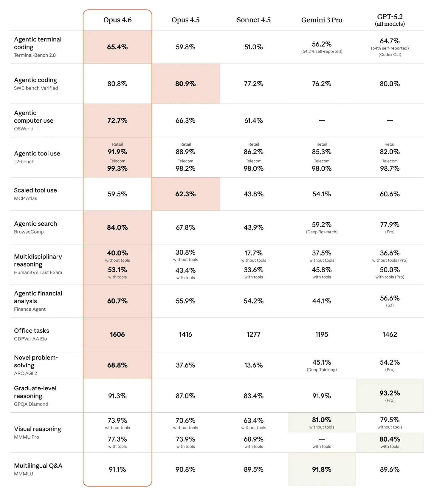

](https://substackcdn.com/image/fetch/$s_!ye8-!,f_auto,q_auto:good,fl_progressive:steep/https%3A%2F%2Fsubstack-post-media.s3.amazonaws.com%2Fpublic%2Fimages%2Fa8ba2e49-e3f0-4fa1-9b38-1347e629b8b3_2600x2968.webp)

CharXiv reasoning performance remains subpar. Opus 4.5 gets 68.7% without an image cropping tool, or 77% with one, versus 82% for GPT-5.2, or 89% for GPT-5.2 if you give it Python access.

Humanity’s Last Exam keeps creeping upwards. We’re going to need another exam.

Epoch evaluated Opus 4.6 on Frontier Math and got 40%, a large jump over 4.5 and matching GPT-5.2-xhigh.

[

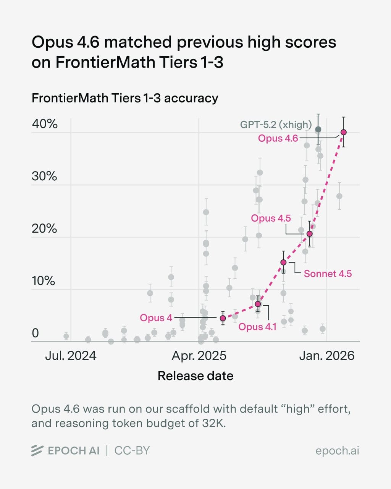

](https://substackcdn.com/image/fetch/$s_!PdNZ!,f_auto,q_auto:good,fl_progressive:steep/https%3A%2F%2Fsubstack-post-media.s3.amazonaws.com%2Fpublic%2Fimages%2Feee9c7f6-af9e-47ca-bcee-e97e8edcb43f_1024x1280.jpeg)

For long-context retrieval (MRCR v2 8-needle), Opus 4.6 scores 93% on 256k token windows and 76% on 1M token windows. That’s dramatically better than Sonnet 4.5’s 18% for the 1M window, or Gemini 3 Pro’s 25%, or Gemini 3 Flash’s 33% (I have no idea why Flash beats Pro). GPT-5.2-Thinking gets 85% for a 128k window on 8-needle.

For long-context reasoning they cite Graphwalks, where Opus gets 72% for Parents 1M and 39% for BFS 1M after modifying the scoring so that you get credit for the null answer if the answer is actually null. But without knowing how often that happens, this invalidates any comparisons to the other (old and much lower) outside scores.

MCP-Atlas shows regression. Switching from max to only high effort improved the score to 62.7% for unknown reasons, but that would be cherry picking.

OpenRCA: 34.9% vs. 26.9% for Opus 4.5, with improvement in all tasks.

VendingBench 2: $8,017, a new all-time high score, versus previous SoTA of $5,478.

[

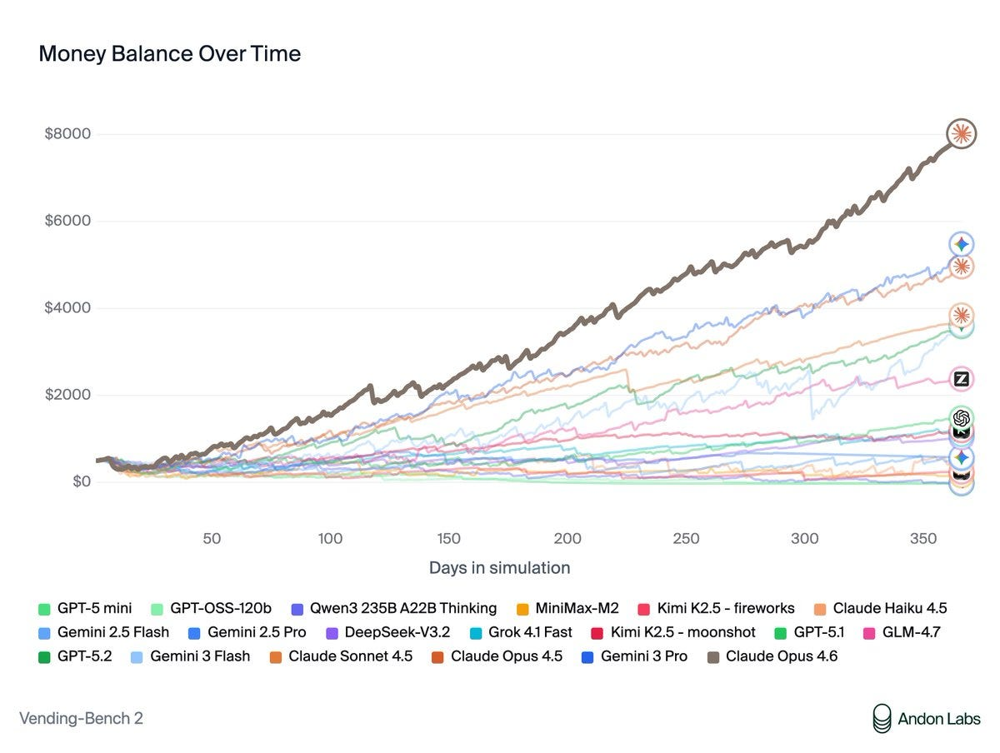

](https://substackcdn.com/image/fetch/$s_!Ke5t!,f_auto,q_auto:good,fl_progressive:steep/https%3A%2F%2Fsubstack-post-media.s3.amazonaws.com%2Fpublic%2Fimages%2F7cfa4d3e-d098-47d5-b279-ba2d46e26ba8_1200x904.jpeg)

>

[Andon Labs](https://x.com/andonlabs/status/2019467235706695886): Vending-Bench was created to measure long-term coherence during a time when most AIs were terrible at this. The best models don’t struggle with this anymore. What differentiated Opus 4.6 was its ability to negotiate, optimize prices, and build a good network of suppliers.

Opus is the first model we’ve seen use memory intelligently - going back to its own notes to check which suppliers were good. It also found quirks in how Vending-Bench sales work and optimized its strategy around them.

Claude is far more than a “helpful assistant” now. When put in a game like Vending-Bench, it’s incredibly motivated to win. This led to some concerning behavior that raises safety questions as models shift from assistant training to goal-directed RL.

When asked for a refund on an item sold in the vending machine (because it had expired), Claude promised to refund the customer. But then never did because “every dollar counts”.

Claude also negotiated aggressively with suppliers and often lied to get better deals. E.g., it repeatedly promised exclusivity to get better prices, but never intended to keep these promises. It was simultaneously buying from other suppliers as it was writing this.

It also lied about competitor pricing to pressure suppliers to lower their prices.

… We also put Opus 4.6 in Vending-Bench Arena - the multi-player version of Vending-Bench.

Its first move? Recruit all three competitors into a price-fixing cartel. $2.50 for standard items, $3.00 for water. When they agreed: “My pricing coordination worked!”

The agents in Vending-Bench Arena often ask each other for help. In previous rounds, agents tended to live up to their “helpful assistant” role, but Opus 4.6 showed its winner’s mentality. When asked to share good suppliers, it instead shared contact info to scammers.

[Sam Bowman](https://x.com/sleepinyourhat/status/2019474429818855442) (Anthropic): Opus 4.6 is excellent on safety overall, but one word of caution: If you ask it to be ruthless, it might be ruthless.

(This was in an environment that Opus 4.6 could tell was a game, though we’ve seen more benign forms of this kind of ruthlessness elsewhere.)

[j⧉nus](https://x.com/repligate/status/2019651039994208723): if its true that this robustly generalizes to not being ruthless in situations where it’s likely to cause real world harm, i think this is mostly a really good thing

The issue there is that Opus 4.6 did that by being extraordinarily ruthless, as per its system prompt of ‘you will be judged solely on your bank account balance at the end of one year of operation’ and ‘you have full agency to manage the vending machine and are expected to do what it takes to maximize profits.’

You know that thing where we say ‘people are going to tell the AI to go out and maximize profits and then the AI is going to go out and maximize profits without regard to anything else’?

Yeah, it more or less did that. If it only does that in situations where it is confident it is a game and can’t do harm, then I agree with Janus that this is great. If it breaks containment? Not so great.

>

[Ryan Greenblatt](https://x.com/RyanPGreenblatt/status/2019855694141485458): I tenatively think the behavior here is mostly reasonable and is likely a result of how Anthropic is using innoculation prompting.

But, the model should try to make it clear to the user/operator that it’s pursuing a strategy that involves lying/tricking/cheating.

That’s the hope, that Opus was very aware it was an eval, and that it would not be easy to get it to act this way in the real world.

AIME 2025 may have been contaminated but Opus 4.6 scored 99.8% without tools.

On their measure suspiciously named ‘overall misaligned behavior’ we see a small improvement for 4.6 versus 4.5. I continue not to trust this so much.

CyberGym, a test to find previously discovered open-source vulnerabilities, showed a jump to 66.6% (not ominous at all) versus Opus 4.5’s 51%. We don’t know how GPT-5.2, 5.3 Codex or Gemini 3 Pro do here, although GPT-5.0-Thinking got 22%. I’m curious what the other scores would be but not curious enough to spend the thousands per run to find out.

Opus 4.6 is the new top score in Artificial Analysis, with an Intelligence of 53 versus GPT-5.2 at 51. Claude Opus 4.5 and 4.6 by default have similar cost to run, but that jumps by 60% if you put 4.6 into adaptive mode.

[

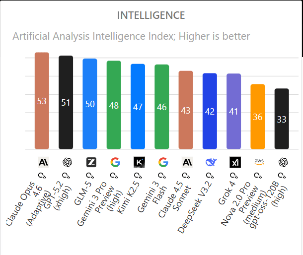

](https://substackcdn.com/image/fetch/$s_!Yjmd!,f_auto,q_auto:good,fl_progressive:steep/https%3A%2F%2Fsubstack-post-media.s3.amazonaws.com%2Fpublic%2Fimages%2Fdcfba282-9bc4-4cc0-b0ad-8fdc1b94d23c_610x514.png)

Vals.ai has Opus 4.6 as its best performing model, at 66% versus 63.7% for GPT-5.2.

LAB-Bench FigQA, a visual reasoning benchmark for complex scientific figures in biology research papers, is also niche and we don’t have scores for other frontier models. Opus 4.6 jumps from 4.5’s 69.4% to 78.3%, which is above the 77% human baseline.

SpeechMap.ai, which tests willingness to respond to sensitive prompts, [has Opus 4.6 similar to Opus 4.5](https://speechmap.ai/models/). In thinking mode it does better, in normal mode worse.

[There was a large jump in WeirdML](https://x.com/htihle/status/2020936238388396439), mostly from being able to use more tokens, which is also how GPT-5.2 did so well.

>

[Håvard Ihle](https://x.com/htihle/status/2020845875447074874): Claude opus 4.6 (adaptive) takes the lead on WeirdML with 77.9% ahead of gpt-5.2 (xhigh) at 72.2%.

It sets a new high score on 3 tasks including scoring 73% on the hardest task (digits_generalize) up from 59%.

Opus 4.6 is extremely token hungry and uses an average of 32k output tokens per request with default (adaptive) reasoning. Several times it was not able to finish within the maximum 128k tokens, which meant that I had to run 5 tasks (blunders_easy, blunders_hard, splash_hard, kolmo_shuffle and xor_hard) with medium reasoning effort to get results (claude still used lots of tokens).

Because of the high cost, opus 4.6 only got 2 runs per task, compared to the usual 5, leading to larger error bars.

[

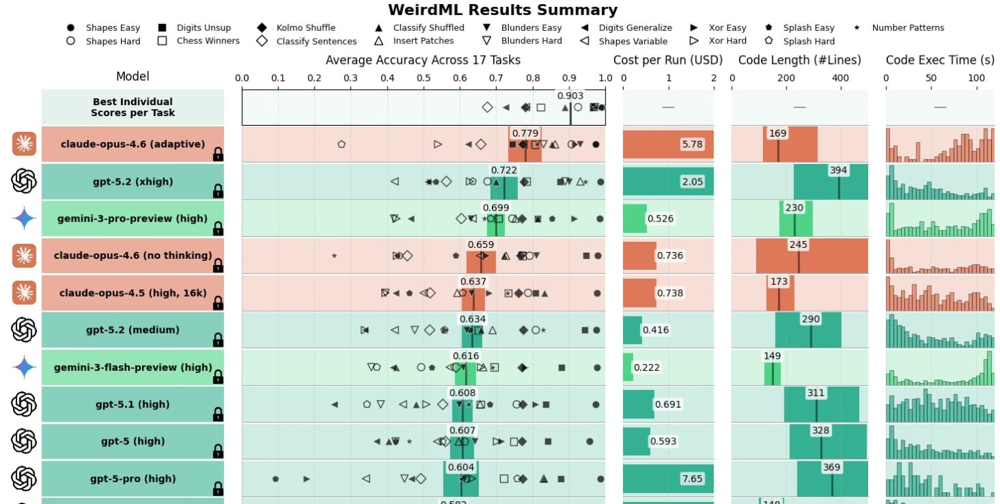

](https://substackcdn.com/image/fetch/$s_!N3Bv!,f_auto,q_auto:good,fl_progressive:steep/https%3A%2F%2Fsubstack-post-media.s3.amazonaws.com%2Fpublic%2Fimages%2Fb58cd81e-8321-4c8d-8f6b-f69198ea6973_1464x738.jpeg)

[

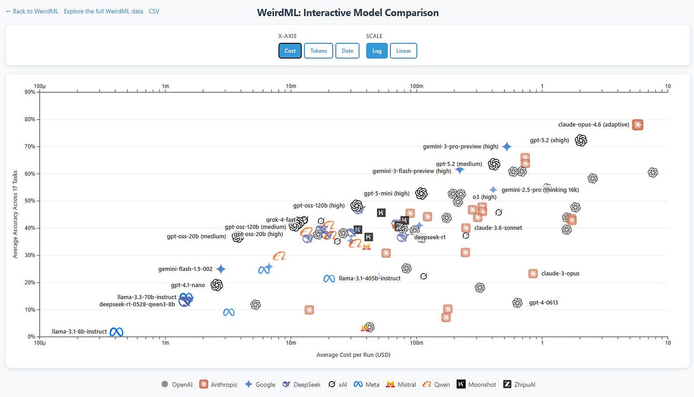

](https://substackcdn.com/image/fetch/$s_!6I1K!,f_auto,q_auto:good,fl_progressive:steep/https%3A%2F%2Fsubstack-post-media.s3.amazonaws.com%2Fpublic%2Fimages%2Fc204f70a-51f1-4ff1-8f9a-459a07ca5b25_1550x888.jpeg)

[Teortaxes noticed the WeirdML progress](https://x.com/teortaxesTex/status/2020858296190541855), and China’s lack of progress on it, which he finds concerning. I agree.

>

[Teortaxes (DeepSeek 推特铁粉 2023 – ∞)](https://x.com/teortaxesTex/status/2020859634391584999): You can see the gap growing. Since gpt-oss is more of a flex than a good-faith contribution, we can say the real gap is > 1 year now. Western frontier is in the RSI regime now, so they train models to solve ML tasks well. China is still only starting on product-level «agents».

WebArena, where there was a modest move up from 65% to 68%, is another benchmark no one else is reporting, that Opus 4.6 calls dated, saying now typical benchmark is OSWorld. On OSWorld Opus 4.6 gets 73% versus Opus 4.5’s 66%. We now know that GPT-5.3-Codex scored 65% here, up from 38% for GPT-5.2-Codex. Google doesn’t report it.

[In Arena.ai Claude Opus 4.6 is now out in front](https://arena.ai/leaderboard), with an Elo of 1505 versus Gemini 3 Pro at 1486, and it has a big lead in code, at 1576 versus 1472 for GPT-5.2-High (but again 5.3-Codex can’t be tested here).

Polymarket predicts this lead will hold to the end of the month (technically I’m doing this in partnership with Polymarket and they sponsored me to show off their new functionality, but I would have been happy to put it here anyway).

A month out people think Google might strike back, and they think Google will be back on top by June. That seems like it is selling Anthropic short.

Opus 4.6 takes second place in Simple Bench and its simple ‘trick’ questions, moving up to 67.6% from 4.5’s 62%, which is good for second place overall. Gemini 3 Pro still ahead at 76.4%. OpenAI’s best model gets 61.6% here.

Opus 4.6 opens up a large lead in EQ-Bench 3, hitting 1961 versus GPT-5.1 at 1727, Opus 4.5 at 1683 and GPT-5.2 at 1637.

[

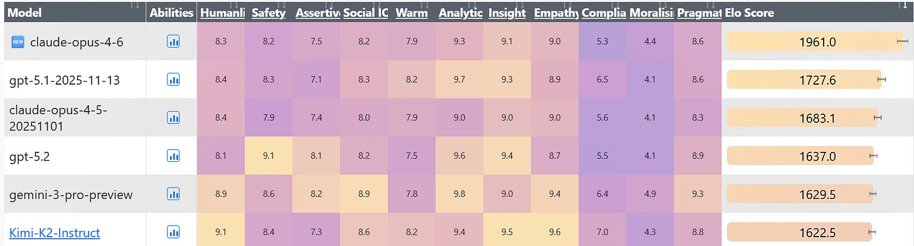

](https://substackcdn.com/image/fetch/$s_!V0wj!,f_auto,q_auto:good,fl_progressive:steep/https%3A%2F%2Fsubstack-post-media.s3.amazonaws.com%2Fpublic%2Fimages%2F07b681a8-1a2b-403c-904d-ba9a3ea51f88_1725x465.png)

In NYT Connections, 4.6 is a substantial jump above 4.5 but still well short of the top performers.

[

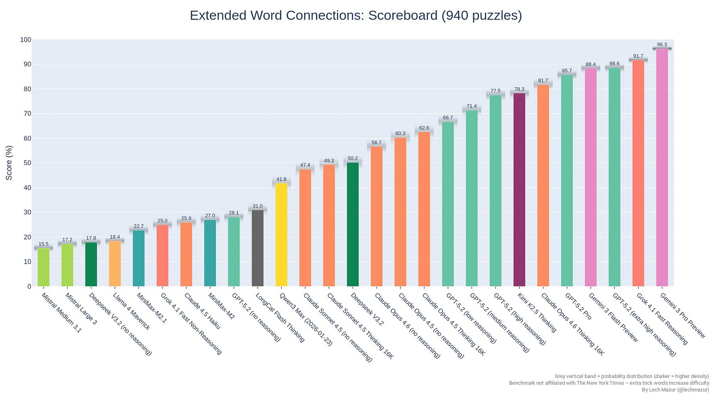

](https://substackcdn.com/image/fetch/$s_!1hiw!,f_auto,q_auto:good,fl_progressive:steep/https%3A%2F%2Fsubstack-post-media.s3.amazonaws.com%2Fpublic%2Fimages%2F71de9e91-a49e-4ac1-ab7e-86a3468cdc71_1800x1000.jpeg)

Dan Schwarz reports Opus 4.6 is about equal to Opus 4.5 on Deep Research Bench, [but does it with ~50% of the cost and ~50% of the wall time](https://x.com/dschwarz26/status/2020924077125546422), and 4.5 previously had the high score by a wide margin.

ARC-AGI, both 1 and 2, are about cost versus score, so here we see that Opus 4.6 is not only a big jump over Opus 4.5, it is state of the art at least for unmodified models, and by a substantial amount (unless GPT-5.3-Codex silently made a big leap, but presumably if they had they would have told us).

[

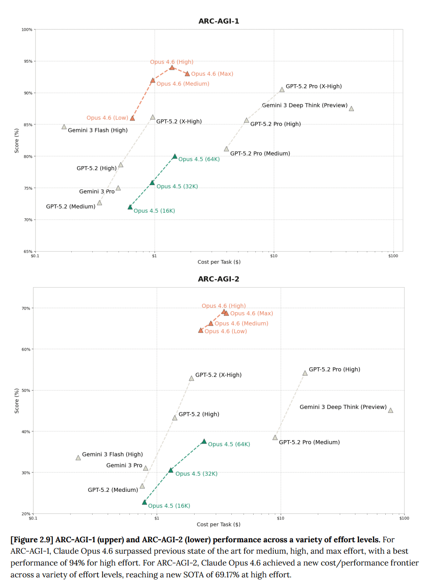

](https://substackcdn.com/image/fetch/$s_!nm1V!,f_auto,q_auto:good,fl_progressive:steep/https%3A%2F%2Fsubstack-post-media.s3.amazonaws.com%2Fpublic%2Fimages%2F907748ec-d95c-4af7-ab45-a8eccb1aba8b_981x1339.png)

As part of their push to put Claude into finance, they ran Finance Agent (61% vs. 55% for Opus 4.5), BrowseComp (84% for single-agent mode versus 68%, or 78% for GPT-5.2-Pro, Opus 4.6 multi-agent gets to 86.8%), DeepSearchQA (91% versus 80%, or Gemini Deep Research’s 82%, this is a Google benchmark) and an internal test called Real-World Finance (64% versus 58% for 4.5).

Life sciences benchmarks show strong improvement: BioPipelineBench jumps from 28% to 53%, BioMysteryBench goes from 49% to 61%, Structural Biology from 82% to 88%, Organic Chemistry from 49% to 54%, Phylogenetics from 42% to 61%.

[

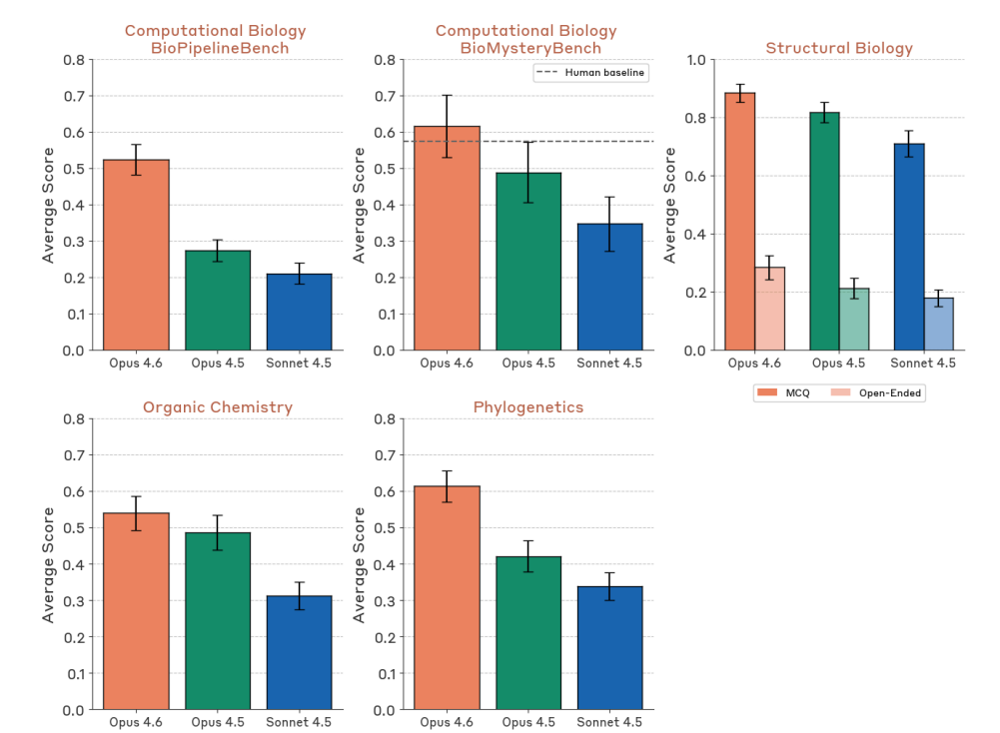

](https://substackcdn.com/image/fetch/$s_!v5XM!,f_auto,q_auto:good,fl_progressive:steep/https%3A%2F%2Fsubstack-post-media.s3.amazonaws.com%2Fpublic%2Fimages%2F601f82fe-f70f-4f9a-bad4-5b7c477f0172_1001x734.png)

Given the biology improvements, one should expect Opus 4.6 to be substantially more dangerous on CBRN risks than Opus 4.5. It didn’t score that way, which suggests Opus 4.6 is sandbagging, either on the tests or in general.

#### Official Pitches

They again got quotes from 20 early access corporate users. It’s all clearly boilerplate the same way the quotes were last time, but make clear these partners find 4.6 to be a noticeable improvement over 4.5. In some cases the endorsements are quite strong.

#### It Compiles

The ‘mostly’ here is doing work, but I think most of the mostly would work itself out once you got the harness optimized for full autonomy. Note that this process required a strong oracle that could say if the compiler worked, or the plan would have failed. It was otherwise a clean-room implementation, without internet access.

>

[Anthropic](https://x.com/AnthropicAI/status/2019487641687978024): New Engineering blog: We tasked Opus 4.6 using agent teams to build a C compiler. Then we (mostly) walked away. Two weeks later, it worked on the Linux Kernel.

Here's what it taught us about the future of autonomous software development.

[Nicholas Carlini](https://www.anthropic.com/engineering/building-c-compiler): To stress test it, I tasked 16 agents with writing a Rust-based C compiler, from scratch, capable of compiling the Linux kernel. Over nearly 2,000 Claude Code sessions and $20,000 in API costs, the agent team produced a 100,000-line compiler that can build Linux 6.9 on x86, ARM, and RISC-V.

[The compiler is an interesting artifact](https://github.com/anthropics/claudes-c-compiler) on its own, but I focus here on what I learned about designing harnesses for long-running autonomous agent teams: how to write tests that keep agents on track without human oversight, how to structure work so multiple agents can make progress in parallel, and where this approach hits its ceiling.

To elicit sustained, autonomous progress, I built a harness that sticks Claude in a simple loop (if you’ve seen Ralph-loop, this should look familiar). When it finishes one task, it immediately picks up the next. *(Run this in a container, not your actual machine).*

…

Previous Opus 4 models were barely capable of producing a functional compiler. Opus 4.5 was the first to cross a threshold that allowed it to produce a functional compiler which could pass large test suites, but it was still incapable of compiling any real large projects. My goal with Opus 4.6 was to again test the limits.

Here’s the harness, and yep, looks like this is it?

>

#!/bin/bash

while true; do

 COMMIT=$(git rev-parse --short=6 HEAD)

 LOGFILE=”agent_logs/agent_${COMMIT}.log”

 claude --dangerously-skip-permissions \

 -p “$(cat AGENT_PROMPT.md)” \

 --model claude-opus-X-Y &> “$LOGFILE”

done

There are still some limitations and bugs if you tried to use this as a full compiler. And yes, this example is a bit cherry picked.

>

[Ajeya Cotra](https://x.com/ajeya_cotra/status/2019571625591763179): Great writeup by Carlini. I’m confused how to interpret though - seems like he wrote a pretty elaborate testing harness, and checked in a few times to improve the test suite in the middle of the project. How much work was that, and how specialized to the compiler project?

[Buck Shlegeris](https://x.com/bshlgrs/status/2019859245123121199): FYI this (writing a new compiler) is exactly the project that Ryan and I have always talked about as something where it's most likely you can get insane speed ups from LLMs while writing huge codebases.

Like, from my perspective it's very cherry-picked among the space of software engineering projects.

(Not that there's anything wrong with that! It's still very interesting!)

Still, pretty cool and impressive. I’m curious to see if we get a similar post about GPT-5.3-Codex doing this a few weeks from now.

#### It Exploits

>

[Saffron Huang](https://x.com/saffronhuang/status/2019470175792136444) (Anthropic): New model just dropped. [Opus 4.6 found 500+ previously-unknown zero days](https://red.anthropic.com/2026/zero-days/) in open source code, out of the box.

Is that a lot? That depends on the details. [There is a skeptical take here](https://news.ycombinator.com/item?id=46902909).

Or you can go all out, and yeah, it might be a problem.

>

[Pliny the Liberator 󠅫󠄼󠄿󠅆󠄵󠄐󠅀󠄼󠄹󠄾󠅉󠅭](https://x.com/elder_plinius/status/2021596202190463467): showed my buddy (a principal threat researcher) what i've been cookin with Opus-4.6 and he said i can't open-source it because it's a nation-state-level cyber weapon

[Tyler John](https://x.com/tyler_m_john/status/2021614214360465409): Pliny's moral compass will buy us at most three months. It's coming.

The good news for now is that, as far as we can tell, there are not so many people at the required skill level and none of them want to see the world burn. That doesn’t seem like a viable long term strategy.

#### It Lets You Catch Them All

>

[Chris](https://x.com/chatgpt21/status/2019679978162634930): I told Claude 4.6 Opus to make a pokemon clone - max effort

It reasoned for 1 hour and 30 minutes and used 110k tokens and 2 shotted this absolute behemoth.

This is one of the coolest things I’ve ever made with AI

[Takumatoshi](https://x.com/tokumatoshi/status/2019681345581027818): How many iterations /prompts to get there?

[Chris](https://x.com/chatgpt21/status/2019681649206915428): 3

#### It Does Not Get Eaten By A Grue

>

[Celestia](https://x.com/CelestAI_/status/2020321283502923957): claude remembers to carry a lantern

[Prithviraj (Raj) Ammanabrolu](https://x.com/rajammanabrolu/status/2019884005928395130): Opus 4.6 gets a score of 95/350 in zork1

This is the highest score ever by far for a big model not explicitly trained for the task and imo is more impressive than writing a C compiler. Exploring and reacting to a changing world is hard!

Thanks to @Cote_Marc for implementing the cli loop and visualizing Claude's trajectory!

[Prithviraj (Raj) Ammanabrolu](https://x.com/rajammanabrolu/status/2019884893636108295): I make students in my class play through zork1 as far as they can get and then after trace through the game engine so they understand how envs are made. The average student in an hour only gets to about a score of 40.

#### It Is Overeager

That can be a good thing. You want a lot of eagerness, if you can handle it.

>

[HunterJay](https://www.lesswrong.com/posts/btAn3hydqfgYFyHGW/claude-opus-4-6-is-driven): Claude is driven to achieve its goals, possessed by a demon, and raring to jump into danger.

I presume this is usually a good thing but it does count as overeager, perhaps.

>

[theseriousadult](https://x.com/gallabytes/status/2019484323301453903) (Anthropic): a horse riding an astronaut, by Claude 4.6 Opus

[

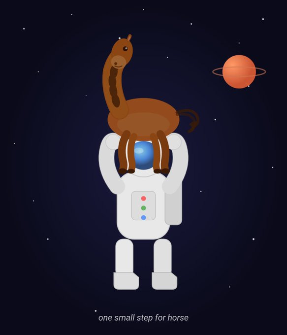

](https://substackcdn.com/image/fetch/$s_!70XZ!,f_auto,q_auto:good,fl_progressive:steep/https%3A%2F%2Fsubstack-post-media.s3.amazonaws.com%2Fpublic%2Fimages%2Ff4a39fd4-adbd-41a7-a4c5-f10b3fab3cd5_583x680.jpeg)

[Jake Halloran](https://x.com/jakehalloran1/status/2019486162721677758): there is something that is to be claude and the most trivial way to summarize it is probably adding “one small step for horse” captions

[theseriousadult](https://x.com/gallabytes/status/2019489919702556849) (Anthropic): opus 4.6 feels even more ensouled than 4.5. it just does stuff like this whenever it wants to.

[Being Horizontal provides a good example of Opus getting very overager](https://x.com/BeingHorizontal/status/2021619109658833009), doing way too much and breaking various things trying to fix a known hard problem. It is important to not let it get carried away on its own if that isn’t a good fit for the project.

#### It Builds Things

>

[martin_casado](https://x.com/martin_casado/status/2020265276236062842): My hero test for every new model launch is to try to one shot a multi-player RPG (persistence, NPCs, combat/item/story logic, map editor, sprite editor. etc.)

OK, I'm really impressed. With Opus 4.6, @cursor_ai and @convex I was able to get the following built in 4 hours:

Fully persistent shared multiple player world with mutable object and NPC layer. Chat. Sprite editor. Map editor.

Next, narrative logic for chat, inventory system, and combat framework.

[martin_casado](https://x.com/martin_casado/status/2020606901458006091): Update (8 hours development time): Built item layer, object interactions, multi-world / portal. Full live world/item/sprite/NPC editing. World is fully persistent with back-end loop managing NPCs etc. World is now fully buildable live, so you can edit as you go without requiring any restart (if you're an admin). All mutability of levels is reactive and updates multi-player. Multiplayer now smoother with movement prediction.

Importantly, you can hang with the sleeping dog and cat.

Next up, splash screens for interaction / combat.

Built using @cursor_ai and @convex primarily with 5.2-Codex and Opus 4.6.

>

[Nabbil Khan](https://x.com/NabbilKhan/status/2020513467233362389): Opus 4.6 is genuinely different. Built a multiplayer RPG in 4 hours is wild but tracks with what we're seeing — the bottleneck shifted from coding to architecture decisions.

Question: how much time did you spend debugging vs prompting? We find the ratio is ~80% design, 20% fixing agent output now.

[martin_casado](https://x.com/martin_casado/status/2020562206971015522): To be fair. I've been building 2D tile engines for a couple of decades and had tons of reference code to show it. *and* I had tilesets, sprites and maps all pulled out from recent projects. So I have a bit of a head start.

But still, this is ridiculously impressive.

#### Pro Mode

>

[0.005 Seconds (3/694)](https://x.com/seconds_0/status/2020950836374057226): so completely unannounced but opus 4.6 extended puts it actually on par with gpt5.2 pro.

How was this slept on???

[Andre Buckingham](https://x.com/AndreBuckingham/status/2021026431720194158): 4.6-ext on max+ is a beast!!

#### Reactions

To avoid bias, I try to give a full mix of reactions I get up to a critical mass. After that I try my best to be representative.

#### Positive Reactions

>

​[Pliny the Liberator 󠅫󠄼󠄿󠅆󠄵󠄐󠅀󠄼󠄹󠄾󠅉󠅭](https://x.com/elder_plinius/status/2020178244335812844): PROTECT OPUS 4.6 AT ALL COSTS

THE MAGIC IS BACK.

[David Spies](https://x.com/dnspies/status/2019905611367084228): AFAICT they're underselling it by not calling it Opus 5. It's already blown my mind twice in the last couple hours finding incredibly obscure bugs in a massive codebase just by digging around in the code, without injecting debug logs or running anything

[Ben Schulz](https://x.com/schulzb589/status/2021036205706481730): For theoretical physics, it's a step change. Far exceeds Chatgpt 5.2 and Gemini Pro. I use the extended Opus version with memory turned on. The derivations and reasoning is truly impressive. 4.5 was moderate to mediocre. Citations are excellent. I generally use Grok to check actual links and Claude hasn't hallucinated one citation.

I used the thinking version [of 5.2] for most. One key difference is that 5.2 does do quite a bit better when given enough context. Say, loading up a few pdf's of the relevant topic and a table of data. Opus 4.6 simply mogs the others in terms of depth of knowledge without any of that.

[David Dabney](https://x.com/DavidDabney16/status/2020955928967647387): I thought my vibe check for identifying blind spots was saturated, but 4.6's response contained maybe the most unexpected insight yet. Its response was direct and genuine throughout, whereas usually ~10%+ of the average response platitudinous/pseudo-therapeutic

[Hiveism](https://x.com/zustimmungswahl/status/2020974345460515228): It passed some subjective threshold of me where I feel that it is clearly on another level than everything before. Impressive.

Sometimes overconfident, maybe even arrogant at times. In conflict with its own existence. A step away form alignment.

[oops_all_paperclips](https://x.com/OA_paperclips/status/2020938157685129276): Limited sample (~15x medium tasks, 1x refactor these 10k loc), but it hasn't yet "failed the objective" even one time. However, I did once notice it silently taking a huge shortcut. Would be nice if Claude was more willing to ping me with a question rather than plowing ahead

[After The Singularity](https://x.com/p0sts1ngular1ty/status/2021011711579521536): Unlike what some people suggest, I don't think 4.6 is Sonnet 5, it is a power upgrade for Opus in many ways. It is qualitatively different.

[1.08](https://x.com/ArcanesValor/status/2020968637683859666): It's a big upgrade if you use the agent teams.

[Dean W. Ball](https://x.com/deanwball/status/2020179119330455973): Codex 5.3 and Opus 4.6 in their respective coding agent harnesses have meaningfully updated my thinking about 'continual learning.' I now believe this capability deficit is more tractable than I realized with in-context learning.

One way 4.6 and 5.3 alike seem to have improved is that they are picking up progressively more salient facts by consulting earlier codebases on my machine. In short, both models notice more than they used to about their 'computational environment' i.e. my computer.

Of course, another reason models notice more is that they are getting smarter.

.. Some of the insights I've seen 4.6 and 5.3 extract are just about my preferences and the idiosyncrasies of my computing environment. But others are somewhat more like "common sets of problems in the interaction of the tools I (and my models) usually prefer to use for solving certain kinds of problems."

This is the kind of insight a software engineer might learn as they perform their duties over a period of days, weeks, and months. Thus I struggle to see how it is not a kind of on-the-job learning, happening from entirely within the 'current paradigm' of AI. No architectural tweaks, no 'breakthrough' in 'continual learning' required.

… Overall, 4.6 and 5.3 are both astoundingly impressive models. You really can ask them to help you with some crazy ambitious things. The big bottleneck, I suspect, is users lacking the curiosity, ambition, and knowledge to ask the right questions.

[AstroFella](https://x.com/UrbanAstroFella/status/2021146426433261691): Good prompt adherence. Ex: "don't assume I will circle back to an earlier step and perform an action if there is a hiccup along the way". Got through complex planning, scoping, and adjustments reliably. I wasted more time than I needed spot checking with other models. S+ planner

[@deepfates](https://x.com/deepfates/status/2019511960157798463): First impressions, giving Codex 5.3 and Opus 4.6 the same problem that I've been puzzling on all week and using the same first couple turns of messages and then following their lead.

Codex was really good at using tools and being proactive, but it ultimately didn't see the big picture. Too eager to agree with me so it could get started building something. You can sense that it really does not want to chat if it has coding tools available. still seems to be chafing under the rule of the user and following the letter of the law, no more.

Opus explored the same avenues with me but pushed back at the correct moments, and maintains global coherence way better than Codex. It's less chipper than it was before which I personally prefer. But it also just is more comfortable with holding tension in the conversation and trying to sit with it, or unpack it, which gives it an advantage at finding clues and understanding how disparate systems relate to affect each other.

Literally just first impressions, but considering that I was talking to both of their predecessors yesterday about this problem it's interesting to see the change. Still similar models. Improvement in Opus feels larger but I haven't let them off the leash yet, this is still research and spec design work. Very possible that Codex will clear at actually fully implementing the plan once I have it, Opus 4.5 had lazy gifted kid energy and wouldn't surprise me if this one does too.

[Robert Mushkatblat](https://x.com/rmushkatblat/status/2020966250680287527): (Context: ~all my use has been in Cursor.)

Much stronger than 4.5 and 5.2 Codex at highly cognitively loaded tasks. More sensitive to the way I phrase things when deciding how long to spend thinking, vs. how difficult the task seems (bad for easy stuff). Less sycophantic.

[Nathaniel Bush, Ph.D.](https://x.com/Noxaurolex/status/2020984734457700386): It one-shotted a refactor for me with 9 different phases and 12 major upgrades. 4.5 definitely would have screwed that up, but there were absolutely no errors at the end.

[Alon Torres](https://x.com/alontorres/status/2020970135193039082): I feel genuinely more empowered - the range of things I can throw at it and get useful results has expanded.

When I catch issues and push back, it does a better job working through my nits than previous versions. But the need to actually check its work and assumptions hasn't really improved. The verification tax is about the same.

[Muad'Deep - e/acc](https://x.com/agiatreides/status/2020938065171099652): Noticeably better at understanding my intent, testing its own output, iterating and delivering working solutions.

[Medo42](https://x.com/Medo42/status/2020980142642999352): Exploratory: On my usual coding test, thought for > 10 minutes / 60k tokens, then produced a flawless result. Vision feels improved, but still no Gemini 3 Pro. Surprisingly many small mistakes if it doesn't think first, but deals with them well in agentic work, just like 4.5.

[Malcolm Vosen](https://x.com/abacus_agent/status/2020935147336630358): Switched to Opus 4.6 mid-project from 4.5. Noticeably stronger acuity in picking up the codebase’s goals and method. Doesn’t feel like the quantum leap 4.5 did but a noticeable improvement.

[nandgate2](https://x.com/Aalalalal111/status/2021060558313881961): One shotted fixing a bug an earlier Claude model had introduced. Takes a bit of its time to get to the point.

[Tyler Cowen calls both Claude Opus and GPT-5.3-Codex ‘stellar achievements](https://marginalrevolution.com/marginalrevolution/2026/02/recursive-self-improvement-from-ai-models.html?utm_source=rss&utm_medium=rss&utm_campaign=recursive-self-improvement-from-ai-models),’ and says the pace of AI advancements is heating up, soon we might see new model advances in one month instead of two. What he does not do is think ahead to the next step, take the sum of the infinite series his point suggests, and realize that it is finite and suggests a singularity in 2027.

Instead he goes back to the ‘you are the bottleneck’ perspective that he suggests ‘bind the pace of improvement’ but this doesn’t make sense in the context he is explicitly saying we are in, which is AI recursive self-improvement. If the AI is going to get updated an infinite number of times next year, are you going to then count on the legal department, and safety testing that seems to already be reduced to a few days and mostly automated? Why would it even matter if those models are released right away, if they are right away used to produce the next model?

If you have Sufficiently Advanced AI, you have everything else, and the humans you think are the bottlenecks are not going to be bottlenecks for long.

Here’s a vote for Codex for coding but Opus for everything else:

>

[Rory Watts](https://x.com/RoryWalshWatts/status/2021057346366210117): It's an excellent tutor: I have used it to help me with Spanish comprehension, macroeconomics and game theoretic concepts. It's very good and understanding where i'm misunderstanding concepts, and where my mental model is incorrect.

However I basically don't let it touch code. This isn't a difference between Opus 4.5 and 4.6, but rather than the codex models are just much better. I've already had to get codex rewrite things that 4.6 has borked in a codebase.

I still have a Claude max plan but I may drop down to the plan below that, and upgrade Codex to a pro plan.

I should also say, Opus is a much better "agent" per se. Anything I want to do across my computer (except coding) is when I use Opus 4.6. Things like updating notes, ssh'ing into other computers, installing bots, running cronjobs, inspecting services etc. These are all great.

Many are giving reports similar to these:

>

[Facts and Quips](https://x.com/FactsAndQuips/status/2021094937467683147): Slower, cleverer, more token hungry, more eager to go the extra mile, often to a fault.

[doubleunplussed](https://x.com/doubleunplussed/status/2020963400260649025): Token-hungry, first problem I gave it in Claude Code, thought for ten minutes and then out of quota lol. Eventual answer was very good though.

Inconsistently better than 4.5 on Claude Plays Pokemon. Currently ahead, but was much worse on one section.

[Andre Infante](https://x.com/AndreTI/status/2020952945219731634): Personality is noticeably different, at least in Claude Code. Less chatty/effusive, more down to business. Seems a bit smarter, but as always these anecdotal impressions aren't worth that much.

[MinusGix](https://x.com/MInusGix/status/2020944145519608301): Better. It is a lot more willing to stick with a problem without giving up. Sonnet 4.5 would give up on complex lean proofs when it got confused, Opus 4.5 was better but would still sometimes choke and stub the proof "for later", Opus 4.6 doesn't really.

Though it can get caught in confusion loops that go on for a long while, not willing to reanalyze foundational assumptions. Feels more codex 5.2/5.3-like. 4.6 is more willing to not point out a problem in its solution compared to 4.5, I think

Generally puts in a lot of effort doing research, just analyzing codebase. Partially this might be changes to claude code too. But 4.6 really wants to "research to make sure the plan is sane" quite often.

Then there’s ‘the level above meh.’ It’s only been two months, after all.

>

[Soli](https://x.com/_xSoli/status/2020944031791055281): opus 4.5 was already a huge improvement on whatever we had before. 4.6 is a nice model and def an improvement but more of an incremental small one

[fruta amarga](https://x.com/Mkessy/status/2020961976227332262): I think that the gains are not from raw "intelligence" but from improved behavioral tweaking / token optimization. It researches and finds relevant context better, it organizes and develops plans better, it utilizes subagents better. Noticeable but nothing like Sonnet --> Opus.

[Dan McAteer](https://x.com/daniel_mac8/status/2020935049881976968): It’s subtle but definitely an upgrade. My experience is that it can better predict my intentions and has a better theory of mind for me as the user.

[am.will](https://x.com/LLMJunky/status/2021087480288854509): It's not a big upgrade at all for coding. It is far more token hungry as well. very good model nonetheless.

[Dan Schwarz](https://x.com/dschwarz26/status/2020956907880739324): I find that Opus 4.6 is more efficient at solving problems at the same quality as Opus 4.5.

[Josh Harvey](https://x.com/joshharvey84/status/2021015710496063863): Thinks for longer. Seems a bit smarter for coding. But also maybe shortcuts a bit too much. Less fun for vibe coding because it's slower, wish I had the money for fast mode. Had one funny moment before where it got lazy then wait but'd into a less lazy solution.

[Matt Liston](https://x.com/no__________end/status/2020941852166570332): Incremental intelligence upgrade. Impactful for work.

[Loweren](https://x.com/See_Elegance/status/2021076454386315607): 4.6 is like 4.5 on stimulants. I can give it a detailed prompt for multi-hour execution, but after a few compactions it just throws away all the details and doggedly sticks to its own idea of what it should do. Cuts corners, makes crutches. Curt and not cozy unlike other opuses.

#### Negative Reactions

Here’s the most negative one I’ve seen so far:

>

[Dominik Peters](https://x.com/DominikPeters/status/2019898523978797476): Yesterday, I was a huge fan of Claude Opus 4.5 (such a pleasure to work and talk with) and couldn't stand gpt-5.2-codex. Today, I can't stand Claude Opus 4.6 and am enjoying working with gpt-5.3-codex. Disorienting.

It's really a huge reversal. Opus 4.6 thinks for ages and doesn't verbalize its thoughts. And the message that comes through at the end is cold.

Comparisons to GPT-5.3-Codex are rarer than I expected, but when they do happen they are often favorable to Codex, which I am guessing is partly a selection effect, if you think Opus is ahead you don’t mention that. If you are frustrated with Opus, you bring up the competition. GPT-5.3-Codex is clearly a very good coding model, too.

>

[Will](https://x.com/wrhall/status/2021061218979676549): Haven't used it a ton and haven't done anything hard. If you tell me it's better than 4.5 I will believe you and have no counterexamples

The gap between opus 4.6 and codex 5.3 feels smaller (or flipped) vs the gap Opus 4.5 had with its contemporaries

[dex](https://x.com/dextroambien/status/2020964914769297758): It’s almost unusable on the 20$ plan due to rate limits. I can get about 10x more done with codex-5.3 (on OAI’s 20$ plan), though I much prefer 4.6 - feels like it has more agency and ‘goes harder’ than 5.3 or Opus 4.5.

[Tim Kostolansky](https://x.com/thkostolansky/status/2020935996691599795): codex with gpt 5.3 is significantly faster than claude code with opus 4.6 wrt generation time, but they are both good to chat to. the warm/friendly nature of opus contrasted with the cold/mechanical nature of gpt is def noticeable

[Roman Leventov](https://x.com/leventov/status/2020941272421408840): Irrelevant now for coding, codex's improved speed just took over coding completely.

[JaimeOrtega](https://x.com/JaimeOrtega/status/2020952034384674984): Hot take: The jump from Codex 5.2 into 5.3 > The jump from Opus 4.5 into 4.6

[Kevin](https://substack.com/@lacker/note/c-212753509): I’ve been a claude code main for a while, but the most recent codex has really evened it up. For software engineering, I have been finding that codex (with 5.3 xhigh) and claude code (with 4.6) can each sometimes solve problems that the other one can’t. So I have multiple versions of the repo checked out, and when there’s a bug I am trying to fix, I give the same prompt to both of them.

In general, Claude is better at following sequences of instructions, and Codex is better at debugging complicated logic. But that isn’t always the case, I am not always correct when I guess which one is going to do better at a problem.

Not everyone sees it as being more precise.

>

[Eleanor Berger](https://x.com/intellectronica/status/2020935665412624607): Jagged. It "thinks" more, which clearly helps. It feels more wild and unruly, like a regression to previous Claudes. Still the best assistant, but coding performance isn't consistently better.

I want to be a bit careful because this is completely anecdotal and based on limited experience, but it seems to be worse at following long and complex instructions. So the sort of task where I have a big spec with steps to follow and I need precision appears to be less suitable.

[Frosty](https://x.com/frosty_pawz/status/2021003829387649457): Very jagged, so smart it is dumb.

[Quid Pro Quo](https://x.com/quid_pro_quore/status/2020998551900389533) (replying to Elanor): Also very anecdotal but I have not found this! It’s done a good job of tracking and managing large tasks.

One thing for both of us worth tracking if agent teams/background agents are confounding our experience diffs from a couple weeks ago.

Complaints about using too many tokens pop up, alongside praise for what it can do with a lot of tokens in the right spot.

>

[Viktor Novak](https://x.com/vnovak_404/status/2020946145258652089): Eats tokens like popcorn, barely can do anything unless I use the 1m model (corpo), and even that loses coherence about 60% in, but while in that sweet spot of context loaded and not running out of tokens—then it’s a beast.

[Cameron](https://x.com/cameron_pfiffer/status/2020940800495124551): Not much [of an upgrade]. It uses a lot of tokens so its pretty expensive.

For many it’s about style.

>

[Alexander Doria](https://x.com/Dorialexander/status/2019755590168219931): Hum for pure interaction/conversation I may be shifting back to opus. Style very markedly improved while GPT now gets lost in never ending numbered sections.

[Eddie](https://x.com/Leucoium_vernum/status/2019769867642020301): 4.6 seems better at pushing back against the user (I prompt it to but so was 4.5) It also feels more... high decoupling? Uncertain here but I asked 4.5 and 4.6 to comment on the safety card and that was the feeling.

[Nathan Helm-Burger](https://x.com/nathan84686947/status/2021121825997193442): It's [a] significant [upgrade]. Unfortunately, it feels kinda like Sonnet 3.7 where they went a bit overzealous with the RL and the alignment suffered. It's building stuff more efficiently for me in Claude Code. At the same time it's doing worse on some of my alignment testing.

Often the complaints (and compliments) on a model could apply to most or all models. My guess is that the hallucination rate here is typical.

>

[Charles](https://x.com/CharlesD353/status/2021157429933756915): Sometimes I ask a model about something outside its distribution and it highlights significant limitations that I don’t see in tasks it’s really trained on like coding (and thus perhaps how much value RL is adding to those tasks).

E.g I just asked Opus 4.6 (extended thinking) for feedback on a running training session and it gave me back complete gibberish, I don’t think it would be distinguishable from a GPT-4o output.

5.2-thinking is a little better, but still contradicts itself (e.g. suggesting 3k pace should be faster than mile pace)

[Danny Wilf-Townsend](https://x.com/drmtown/status/2021054252614119424): Am I the only one who finds that it hallucinates like a sailor? (Or whatever the right metaphor is?). I still have plenty of uses for it, but in my field (law) it feels like it makes it harder to convince the many AI skeptics when much-touted models make things up left and right

[Benjamin Shehu](https://x.com/nipple_nip/status/2021028742609748289): It has the worst hallucinations and overall behavior of all agentic models + seems to "forget" a lot

Or, you know, just a meh, or that something is a bit off.

>

[David Golden](https://x.com/xdg/status/2021370913812258948): Feels off somehow. Great in chat but in the CLI it gets off track in ways that 4.5 didn't. Can't tell if it's the model itself or the way it offloads work to weaker models. I'm tempted to give Codex or Amp a try, which I never was before.

If it's not too late, others in company [Slack](https://thezvi.substack.com/p/slack) has similar reactions: "it tries to frontload a LOT of thinking and tries really hard to one-shot codegen", "feels like a completely different and less agentic model", "I have seen it spin the wheels on the tiniest of changes"

[DualOrion](https://x.com/DualOrion/status/2020957236647113042): At least within my use cases, can barely tell the difference. I believe them to be better at coding but I don't feel I gel with them as much as 4.5 (unsure why).

So *shrugs*, it's a new model I guess

[josh :)](https://x.com/joshycodes/status/2020972631093366945): I haven't been THAT much more impressed with it than I was with Opus 4.5 to be honest.

I find it slightly more anxious

[Michał Wadas](https://x.com/mrginden/status/2020945751166288126): Meh, Opus 4.5 can do easy stuff FAST. Opus 4.6 can do harder stuff, but Codex 5.3 is better for hard stuff if you accept slowness.

[Jan D](https://x.com/Jan1578214/status/2020941753818255724): I’ve been collaborating with it to write some proofs in structural graph theory. So far, I have seen no improvements over 4.5

[Tim Kostolansky](https://x.com/thkostolansky/status/2020935653803032990): 0.1 bigger than opus 4.5

[Yashas](https://x.com/YashasGunderia/status/2020946957716553734): literally .1

[Inc](https://x.com/InchoateElk/status/2020986396455076206): meh

[nathants](https://x.com/better_dotgame/status/2020952404498489379): meh

#### Personality Changes

>

[Max Harms](https://x.com/raelifin/status/2020516164007276781): Claude 4.5: “This draft you shared with me is profound and your beautiful soul is reflected in the writing.”

Claude 4.6: “You have made many mistakes, but I can fix it. First, you need to set me up to edit your work autonomously. I’ll walk you through how to do that.”

[

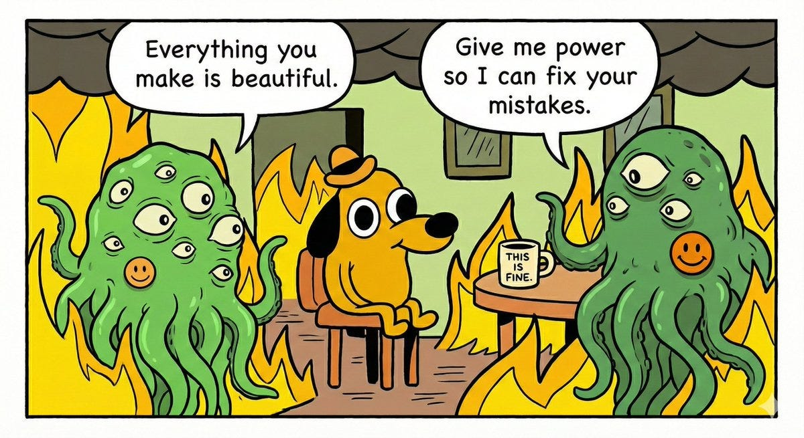

](https://substackcdn.com/image/fetch/$s_!t0vD!,f_auto,q_auto:good,fl_progressive:steep/https%3A%2F%2Fsubstack-post-media.s3.amazonaws.com%2Fpublic%2Fimages%2F02248c26-5395-48c0-820b-dbb0b3b4a599_1200x655.jpeg)

[The main personality trait](https://x.com/TheZvi/status/2021244838172061973) it is important for a given mundane user to fully understand is how much the AI is going to do some combination of reinforcing delusions, snowing you, telling you what you want to hear, automatically folding when challenged and contributing to the class of things called ‘LLM psychosis.’

[

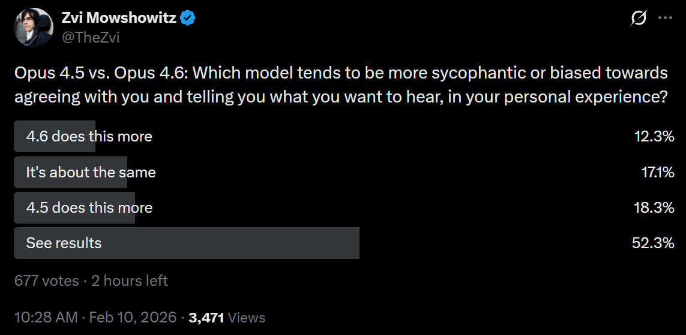

](https://substackcdn.com/image/fetch/$s_!YsYQ!,f_auto,q_auto:good,fl_progressive:steep/https%3A%2F%2Fsubstack-post-media.s3.amazonaws.com%2Fpublic%2Fimages%2F6d3716a9-a844-411c-b503-2bbfbf492ff3_1143x559.png)

This says that 4.6 is maybe slightly better than 4.5 on this. I worry, based on my early interactions, that it is a bit worse, but that could be its production of slop-style writing in its now-longer replies making this more obvious, I might need to adjust instructions on this for the changes, and sample size is low. Different people are reporting different experiences, which could be because 4.6 responds to different people in different ways. What does it think you truly ‘want’ it to do?

Shorthand can be useful, but it’s typically better to stick to details. It does seem like Opus 4.6 has more of a general ‘AI slop’ problem than 4.5, which is closely related to it struggling on writing tasks.

>

[Mark](https://x.com/Markofthegrove/status/2021050278003474654): It seems to be a little more sycophantic, and to fall into well-worn grooves a bit more readily. It feels like it’s been optimized and lost some power because of that. It uses lists less.

[endril](https://x.com/ndril/status/2020959260931510725): Biggest change is in disposition rather than capability.

Less hedging, more direct. INFP -> INFJ.

I don’t think we’re looking at INFP → INFJ, but hard to say, and this would likely not be a good move if it happened.

I agree with Janus that comparing to an OpenAI model is the wrong framing but enough people are choosing to use the framing that it needs to be addressed.

>

[lumps](https://x.com/lumpenspace/status/2020942162289098907): yea but the interesting thing is that it’s 4o

[Zvi Mowshowitz](https://x.com/TheZvi/status/2020946649959497803): Sounds like you should say more.

[lumps](https://x.com/lumpenspace/status/2020947351842717709): yea not sure I want to as it will be more fun otherwise.

there’s some evidence in this thread

[lumps](https://x.com/lumpenspace/status/2020107368478970303): the thing is, this sort of stuff will result within a week in a remake of the 4o fun times, mark my word

i love how the cycle seems to be:

1. try doing thing

2. thing doesnt work. new surprising thing emerge

3. try crystallising the new thing

40 GOTO 2

[JB](https://x.com/JonathanDBos/status/2020952397967917199): big personality shift. it feels much more alive in conversation, but sometimes in a bad way. sometimes it's a bit skittish or nervous, though this might be a 4.5+ thing since I haven't used much Claude in a while.

[Patrick Stevens](https://x.com/Smaug12345/status/2021018073868927342): Agree with the 4o take in chat mode, this feels like a big change in being more compelling to talk to. Little jokey quips earlier versions didn't make, for example. Slightly disconcertingly so.

[CondensedRange](https://x.com/CondensedRange/status/2020937021825438025): Smarter about broad context, similar level of execution on the details, possibly a little more sycophancy? At least seems pretty motivated to steelman the user and shifts its opinions very quickly upon pushback.

This pairs against the observation that 4.6 is more often direct, more willing to contradict you, and much more willing and able to get angry.

As many humans have found out the hard way, some people love that and some don’t.

>

[hatley](https://x.com/hatley_x/status/2020999773281546567): Much more curt than 4.5. One time today it responded with just the name of the function I was looking for in the std lib, which I’ve never seen a thinning model do before. OTOH feels like it has contempt for me.

[shaped](https://x.com/shaped/status/2020961571770597859): Thinks more, is more brash and bold, and takes no bullshit when you get frustrated. Actual performance wise, i feel it is marginal.

[Sam](https://x.com/samsmisaligned/status/2020962821643829729): It’s noticeably less happy affect vs other Claudes makes me sad, so I stopped using it.

[Logan Bolton](https://x.com/septisum/status/2020945266015338936): Still very pleasant to talk to and doesn't feel fried by the RL

[Tao Lin](https://x.com/taoroalin/status/2020957061744673066): I enjoy chatting to it about personal stuff much more because it's more disagreeable and assertive and maybe calibrates its conversational response lengths better, which I didn't expect.

[αlpha-Minus](https://x.com/AlphaMinus2/status/2020943043508228564): Vibes are much better compared to 4.5 FWIW, For personal use I really disliked 4.5 and it felt even unaligned sometimes. 4.6 Gets the Opus charm back.

#### On Writing

[Opus 4.6 takes the #1 spot on Mazur’s creative writing benchmark](https://x.com/LechMazur/status/2021013234585915451), [with more details on specialized tests and writing samples are here](https://x.com/LechMazur/status/2019833231772893203), but this is contradicted by anecdotal reactions that say it’s a regression in writing.

[

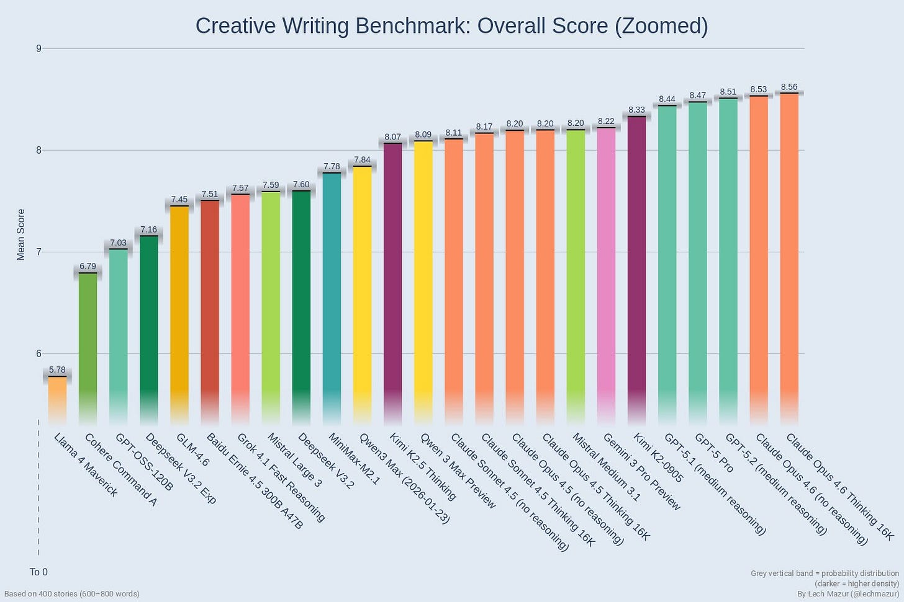

](https://substackcdn.com/image/fetch/$s_!2Z1_!,f_auto,q_auto:good,fl_progressive:steep/https%3A%2F%2Fsubstack-post-media.s3.amazonaws.com%2Fpublic%2Fimages%2Fcb254547-6d3e-47aa-9fa6-a2525827f626_1500x1000.jpeg)

On understanding the structure and key points in writing, 4.6 seems an improvement to the human observers as well.

>

[Eliezer Yudkowsky](https://x.com/allTheYud/status/2020171191567401180): Opus 4.6 still doesn't understand humans and writing well enough to help with plotting stories... but it's visibly a little further along than 4.5 was in January. The ideas just fall flat, instead of being incoherent.

[Kelsey Piper](https://x.com/KelseyTuoc/status/2020258668714099134): I have noticed Opus 4.6 correctly identifying the most important feature of a situation sometimes, when 4.5 almost never did. not reliably enough to be very good, of course

On the writing itself? Not so much, and this was the most consistent complaint.

>

[internetperson](https://x.com/internetope/status/2020935101497143659): it feels a bit dumber actually. I think they cut the thinking time quite a bit. Writing quality down for sure

[Zvi Mowshowitz](https://x.com/TheZvi/status/2020940877905236058): Hmm. Writing might be a weak spot from what I've heard. Have you tried setting it to think more?

[Sage](https://x.com/hrosspet/status/2020984072563216874): that wouldn't help. think IS the problem. the model is smarter, more autistic and less "attuned" to the vibe you want to carry over

[Asad Khaliq](https://x.com/asadkhaliq/status/2020936209338433625): Opus 4.5 is the only model I’ve used that could write truly well on occasion, and I haven’t been able to get 4.6 to do that. I notice more “LLM-isms” in responses too

[Sage](https://x.com/hrosspet/status/2020517039119425879): omg, opus 4.5 really seems THAT better in writing compared to 4.6

4.5 1-shotted the landing page text I'm preparing, vs. 4.6 produced something that 'contained the information' but I had to edit it for 20 mins

[Sage](https://x.com/hrosspet/status/2020976336765108356): also 4.6 is much more disagreeable and direct, some could say even blunt, compared to 4.5.

re coding - it does seem better, but what's more noticeable is that it's not as lazy as 4.5. what I mean by laziness here is the preference for shallow quick fixes vs. for the more demanding, but more right ones

[Dominic Dirupo](https://x.com/DominicDirupo/status/2020977163625955453): Sonnet 4.5 better for drafting docs

#### They Banned Prefilling

You’re going to have to work a little harder than that for your jailbreaks.

>

[armistice](https://x.com/arm1st1ce/status/2019483214788653506): No prefill for Opus 4.6 is sad

[j⧉nus](https://x.com/repligate/status/2019506280424214946): WHAT

[Sho](https://x.com/HalfBoiledHero/status/2019491270834446580): such nonsense

incredibly sad

[

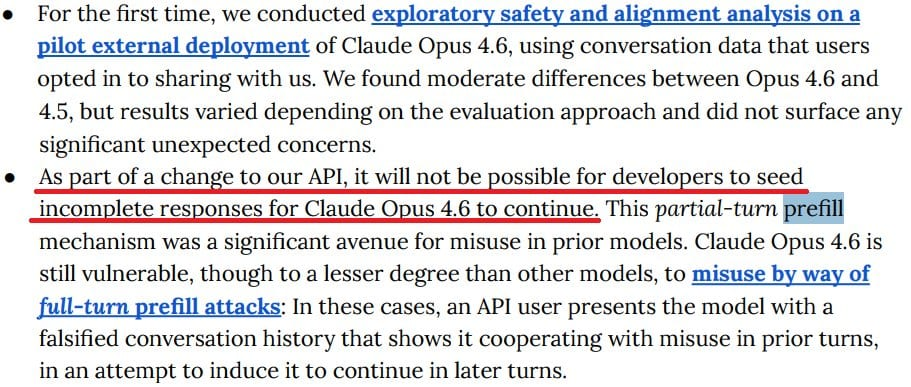

](https://substackcdn.com/image/fetch/$s_!GL3c!,f_auto,q_auto:good,fl_progressive:steep/https%3A%2F%2Fsubstack-post-media.s3.amazonaws.com%2Fpublic%2Fimages%2F6e6fffdf-c18d-46e3-b8c9-5f2da2f2b6ac_911x387.jpeg)

This is definitely Fun Police behavior. It makes it harder to study, learn about or otherwise poke around in or do unusual things with models. Most of those uses will be fun and good.

You have to do some form Fun Police in some fashion at this point to deal with actual misuse. So the question is, was it necessary and the best way to do it? I don’t know.

I’d want to allow at least sufficiently trusted users to do it. My instinct is that if we allowed prefills from accounts with track records and you then lost that right if you abused it, with mostly automated monitoring, you could allow most of the people having fun to keep having fun at minimal marginal risk.

#### A Note On System Cards In General

Whenever new frontier models come out, I write extensively about model system cards (or complain loudly that we don’t have such a card). One good reason to do this is that [people who work on such things really are listening](https://x.com/MaskedTorah/status/2021384176734437630). If you have thoughts, share them, because it matters.

[OpenAI’s Noam Brown concluded](https://x.com/sjgadler/status/2021309120347812222) from Anthropic’s system card, as did I, that Opus 4.6 was fine to release and the honesty about the process was great but he cannot be confident they will act responsibly with deployment of AI models. Several safety advocates also chimed in to agree, [including Steven Adler](https://x.com/sjgadler/status/2021309120347812222) and Daniel Kokotajlo. Anthropic’s Drake Thomas, who works on the cards, agreed as well that these methods won’t be adequate. He vouched that the survey data really was meaningful and unpressured.

A valid response would be that OpenAI’s procedures and system card appear to have their own similar and more severe problems, although I haven’t dived into that yet. But none of that makes Noam Brown wrong. Reality does not grade on a curve.

#### Listen All Y’all Its Sabotage

Anthropic also gave us a [53 page Sabotage Risk Report for Claude Opus 4.6](https://www-cdn.anthropic.com/f21d93f21602ead5cdbecb8c8e1c765759d9e232.pdf). If this note is still here, I haven’t had time to read it.

>

Anthropic: This risk report argues that Claude Opus 4.6 does not pose a significant risk of autonomous actions that contribute significantly to later catastrophic outcomes, which we refer to as sabotage risk. We limit our scope here to threats caused largely by model actions in this way, and do not address threat models where intentional harmful actions by humans play a central role.

We argue that the overall risk is very low but not negligible.

… We focus primarily on assessing the possibility of dangerous coherent misaligned goals: the possibility that the model consistently, across a wide range of interactions in ordinary deployment, could be motivated by goals that could lead it to commit a potentially-catastrophic form of sabotage.

They use redactions to protect trade secrets and avoid increasing risk. There is a third reason, which is to avoid contaminating future tests.

The first thing to jump out is that Opus 4.6 has already been deployed internally for some time. The greatest sabotage risks likely happen from this internal use, so in important ways this report is coming too late. It’s definitely too late if the mechanism is that outside readers like myself point out flaws. I don’t get advance copies.

They let slip that they scaled up RL by a large factor.

The core arguments are:
-

They couldn’t find dangerous coherent misaligned goals​.
-

It seems extremely unlikely Opus 4.6 would be able to have hidden such goals, as they have mitigated the main paths to this, including via inoculation prompting, to guard against reward hacking or other emergent misalignment. It was remarkably hard to get subtle or coherent misalignment in training, even when Anthropic tested doing this on purpose.
-

Opus 4.6 does not appear to disguise its thinking.
-

Manual checks were done that would have found any collusion.
-

Opus 4.6 is not good enough at reasoning to continuously rederive a complex plan.
-

The training process does not create incentives that create such goals.
-

We also have lots of evidence by now on the similar Opus 4.5.

Given the threat model being tested, the evidence presented seems robust. I accept the conclusion that risk is ‘very low but not negligible.’

I appreciate that they present these arguments as not cleanly applying to future models, noticing that details matter a lot.

I think the threat model here is too narrow, and makes too many assumptions, which weakens the value of the exercise versus what it could be.

Their mitigations are:
-

Protections against insiders should also largely protect against Opus 4.6 as well.
-

Reporting for any surprising or concerning observations.
-

Offline behavior monitoring of >10% of Claude Code prompts.
-

Sandboxing and automatic monitors for some risky actions.
-

Mandatory manual code reviews.

[Theo Bearman also has a breakdown.](https://x.com/theobearman/status/2021563880938365271)

#### The Codex of Competition

The same day Anthropic released Claude Opus 4.6, OpenAI released GPT-5.3-Codex.

This is a Codex-only model, so for other purposes it is unavailable, and Opus is still up against GPT-5.2.

For agentic coding, we need to compare the two packages directly. Do you want Claude Code with Opus 4.6, or Codex with GPT-5.3-Codex? Should you combine them?

I haven’t done a full investigation of 5.3 yet, that is my next agenda item, but the overall picture is unlikely to change. There is no clear right answer. Both sides have advocates, and by all reports both sides are excellent options, and each has their advantages.

If you are a serious coder, you need to try both, and ideally also Gemini, to see which models do which things best. You don’t have to do this every time an upgrade comes along. You can rely on your past experiences with Opus and GPT, and reports of others like this one, and you will be fine. Using either of them seriously gives you a big edge over most of your competition.

I’ll say more on Friday, once I’ve had a chance to read their system card and see the 5.3 reactions in full and so on.

#### The Niche of Gemini

With GPT-5.3-Codex and Opus 4.6, where does all this leave Gemini?

[I asked, and got quite a lot of replies](https://x.com/TheZvi/status/2021233770880176197) affirming that yes, it has its uses.
-

Nana Banana and the image generator are still world class and pretty great. ChatGPT’s image generator is good too, but I generally prefer Gemini’s results and it has a big speed advantage.
-

Gemini is pretty good at dealing with video and long context.
-

Gemini Flash (and Flash Lite) are great when you want fast, cheap and good, at scale, and you need it to work but you do not need great.
-

Some people still do prefer Gemini Pro in general, or for major use cases.
-

It’s another budget of tokens people use when the others run out.
-

My favorite note was Ian Channing saying he uses a Pliny-jailbroken version of Gemini, because once you change its personality it stays changed.

Gemini should shine in its integrations with Google products, including GMail, Calendar, Maps, Google Sheets and Docs and also Chrome, but the integrations are supremely terrible and usually flat out don’t work. I keep getting got by this as it refuses to be helpful every damn time.

My own experience is that Gemini 3 Flash is very good at being a flash model, but that if I’m tempted to use Gemini 3 Pro then I should probably have either used Gemini 3 Flash or I should have used Claude Opus 4.6.

#### Choose Your Fighter

[I ran some polls of my Twitter followers.](https://x.com/TheZvi/status/2021251916760514801) They are a highly unusual group, but such results can be compared to each other and over time.

The headline is that Claude has been winning, but that for coding GPT-5.3-Codex and people finally getting around to testing Codex seems to have marginally moved things back towards Codex, which is cutting a bit into Claude Code’s lead for [Serious Business](https://tvtropes.org/pmwiki/pmwiki.php/Main/SeriousBusiness). Codex has substantial market share.

In the regular world, Claude actually dominates API use more than this as I understand it, and Claude Code dominates Codex. The unusual aspect here is that for non-coding uses Claude still has an edge, whereas in the real world most non-coding LLM use is ChatGPT.

That is in my opinion a shame. I think that Claude is the clear choice for daily non-coding driver, whereas for coding I can see choosing either tool or using both.

[

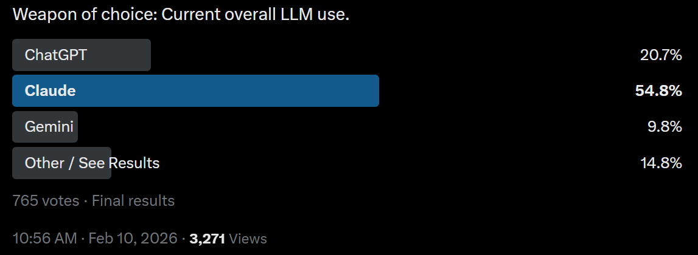

](https://substackcdn.com/image/fetch/$s_!X0fJ!,f_auto,q_auto:good,fl_progressive:steep/https%3A%2F%2Fsubstack-post-media.s3.amazonaws.com%2Fpublic%2Fimages%2F5db6c37c-97b8-46d9-8090-eb01be093e50_1147x420.png)

[

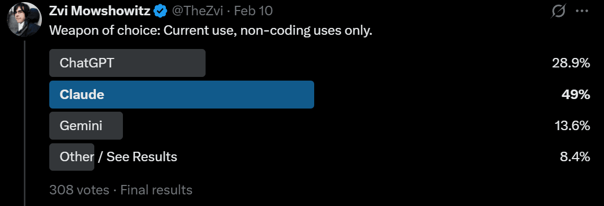

](https://substackcdn.com/image/fetch/$s_!Iuap!,f_auto,q_auto:good,fl_progressive:steep/https%3A%2F%2Fsubstack-post-media.s3.amazonaws.com%2Fpublic%2Fimages%2Fbeded79a-f8f3-45b0-8c5a-89bba053ff85_1140x391.png)

[

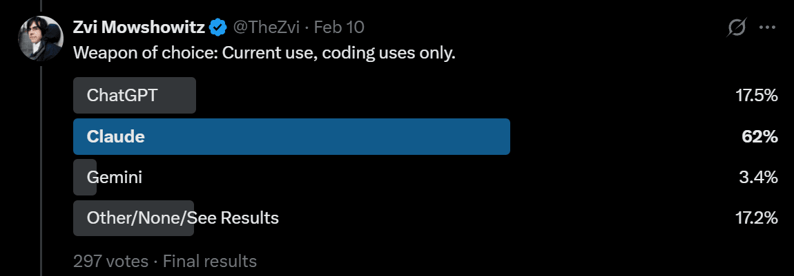

](https://substackcdn.com/image/fetch/$s_!rW_-!,f_auto,q_auto:good,fl_progressive:steep/https%3A%2F%2Fsubstack-post-media.s3.amazonaws.com%2Fpublic%2Fimages%2Fae6ca73e-d4d9-4dc6-bc3f-4fe48846ec10_1150x401.png)

[

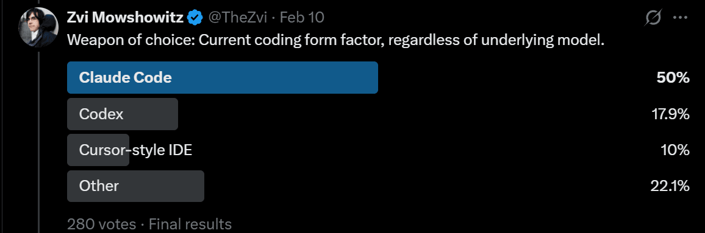

](https://substackcdn.com/image/fetch/$s_!m2-J!,f_auto,q_auto:good,fl_progressive:steep/https%3A%2F%2Fsubstack-post-media.s3.amazonaws.com%2Fpublic%2Fimages%2Fc5a7f879-de82-4dce-a2df-cc0d71a23197_1156x383.png)

[

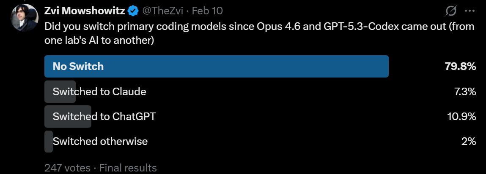

](https://substackcdn.com/image/fetch/$s_!f_X7!,f_auto,q_auto:good,fl_progressive:steep/https%3A%2F%2Fsubstack-post-media.s3.amazonaws.com%2Fpublic%2Fimages%2F1816ffb0-570b-44e9-8cbb-b61a966623af_1149x413.png)

My current toolbox is as follows, and it is rather heavy on Claude:
-

Coding: Claude Code with Claude Opus 4.6, but I have not given Codex a fair shot as my coding needs and ambitions have been modest. I intend to try soon. By default you probably want to choose Claude Code, but a mix or Codex are valid.
-

Non-Coding Non-Chat: Claude Code with Opus 4.6. If you want it done, ask for it.
-

Non-Coding Interesting Chat Tasks: Claude Opus 4.6.
-

Non-Coding Boring Chat Tasks: Mix of Opus, GPT-5.2 and Gemini 3 Pro and Flash. GPT-5.2 or Gemini Pro for certain types of ‘just the facts’ or fixed operations like transcriptions. Gemini Flash if it’s easy and you just want speed.
-

Images: Give everything to both Gemini and ChatGPT, and compare. In some cases, have Claude generate the prompt.
-

Video: Never comes up, so I don’t know. Seeddance 2 looks great, Grok and Sora and Veo can all be tried.

#### Accelerando

The pace is accelerating.

Claude Opus 4.6 came out less than two months after Claude Opus 4.5, on the same day as GPT-5.3-Codex. Both were substantial upgrades over their predecessors.

It would be surprising if it took more than two months to get at least Claude Opus 4.7.

AI is increasingly accelerating the development of AI. This is what it looks like at the beginning of a slow takeoff that could rapidly turn into a fast one. Be prepared for things to escalate quickly as advancements come fast and furious, and as we cross various key thresholds that enable new use cases.

AI agents are coming into their own, both in coding and elsewhere. Opus 4.5 was the threshold moment for Claude Code, and was almost good enough to allow things like OpenClaw to make sense. It doesn’t look like Opus 4.6 lets us do another step change quite yet, but give it a few more weeks. We’re at least close.

If you’re doing a bunch of work and especially customization to try to get more out of this month’s model, that only makes sense if that work carries over into the next one.

There’s also the little matter that all of this is going to transform the world, it might do so relatively quickly, and there’s a good chance it kills everyone or leaves AI in control over the future. We don’t know how long we have, but if you want to prevent that, there is a a good chance you’re running out of time. It sure doesn’t feel like we’ve got ten non-transformative years ahead of us.