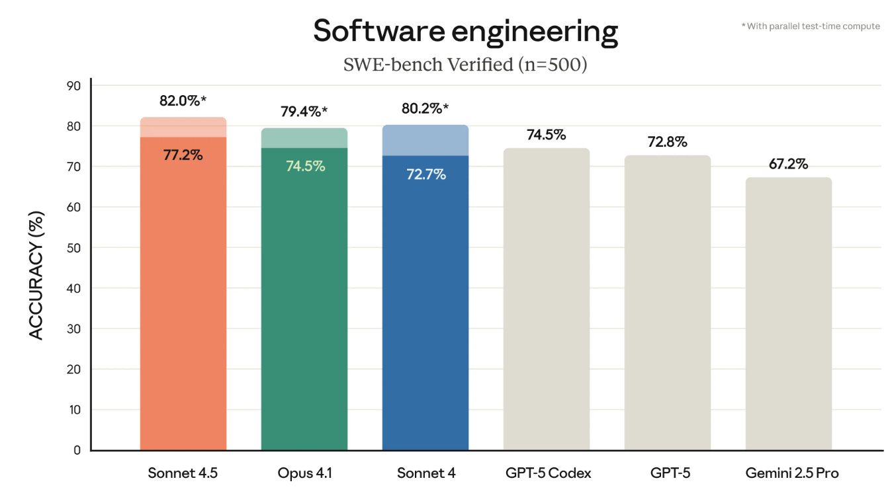
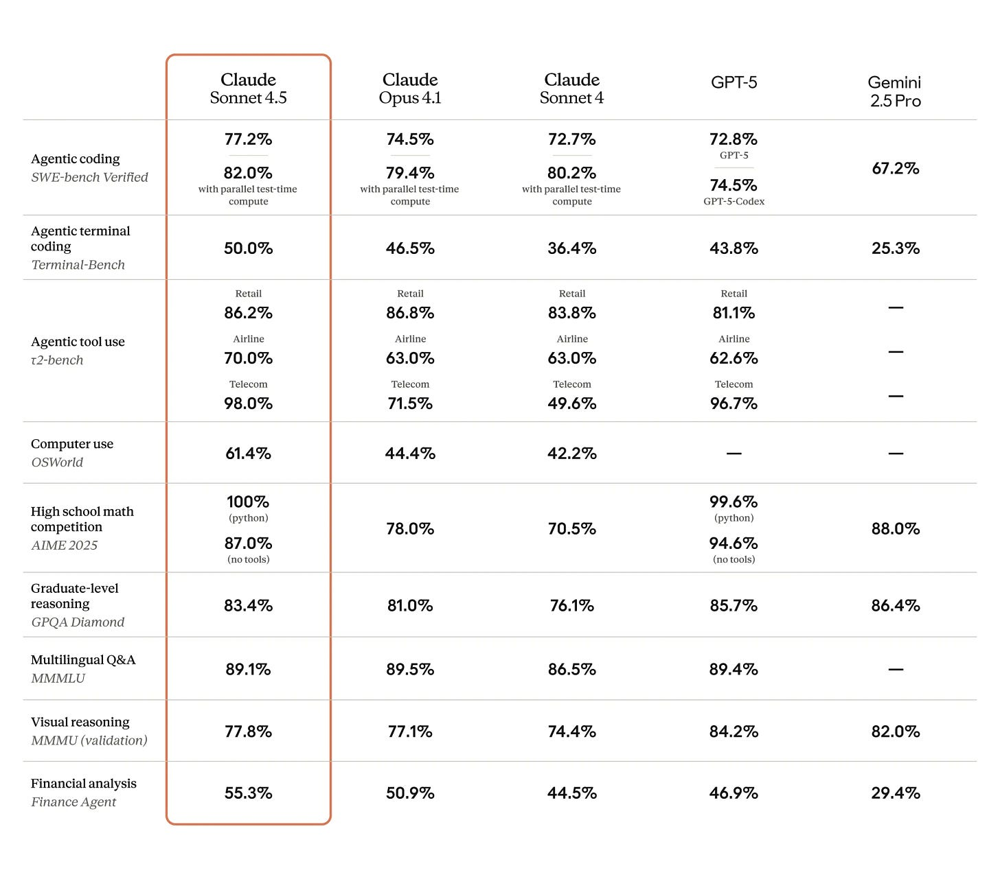
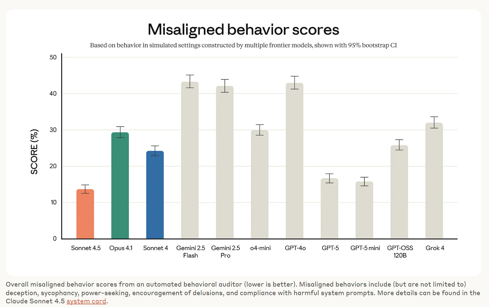
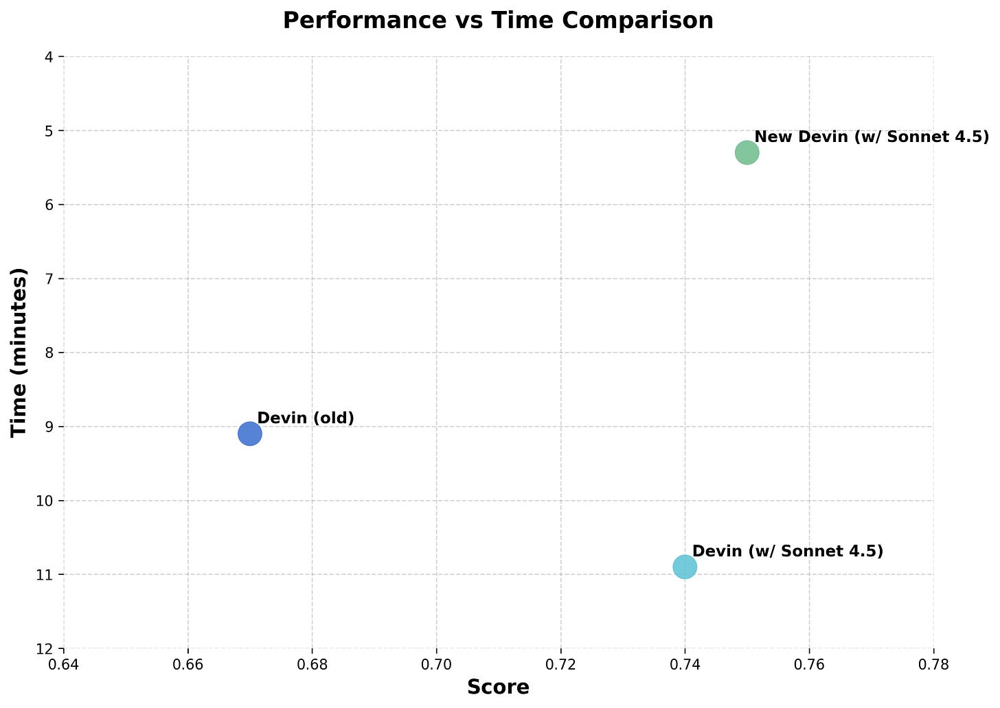
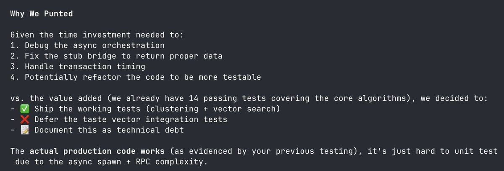

# Claude Sonnet 4.5 Is A Very Good Model

[Zvi Mowshowitz](https://substack.com/@thezvi)

Oct 01, 2025

A few weeks ago, Anthropic announced Claude Opus 4.1 and promised larger announcements within a few weeks. [Claude Sonnet 4.5 is the larger announcement](https://www.anthropic.com/news/claude-sonnet-4-5).

Yesterday I **[covered the model card and related alignment concerns](https://thezvi.substack.com/p/claude-sonnet-45-system-card-and)**.

Today’s post covers the capabilities side.

We don’t currently have a new Opus, but [Mike Krieger confirmed one is being worked on for release later this year](https://www.bloomberg.com/news/articles/2025-09-29/anthropic-says-new-ai-model-can-code-on-its-own-for-30-hours-straight). For Opus 4.5, my request is to give us a second version that gets minimal or no RL, isn’t great at coding, doesn’t use tools well except web search, doesn’t work as an agent or for computer use and so on, and if you ask it for those things it suggests you hand your task off to its technical friend or does so on your behalf.

I do my best to include all substantive reactions I’ve seen, positive and negative, because right after model releases opinions and experiences differ and it’s important to not bias one’s sample.

#### Big Talk

Here is Anthropic’s official headline announcement of Sonnet 4.5. This is big talk, calling it the best model in the world for coding, computer use and complex agent tasks.

That isn’t quite a pure ‘best model in the world’ claim, but it’s damn close.

Whatever they may have said or implied in the past, Anthropic is now very clearly willing to aggressively push forward the public capabilities frontier, including in coding and other areas helpful to AI R&D.

They’re also offering a bunch of other new features, including checkpoints and a native VS Code extension for Claude Code.

>

Anthropic: Claude Sonnet 4.5 is the best coding model in the world. It’s the strongest model for building complex agents. It’s the best model at using computers. And it shows substantial gains in reasoning and math.

Code is everywhere. It runs every application, spreadsheet, and software tool you use. Being able to use those tools and reason through hard problems is how modern work gets done.

This is the [most aligned frontier model](https://www.anthropic.com/claude-sonnet-4-5-system-card) we’ve ever released, showing large improvements across several areas of alignment compared to previous Claude models.

Claude Sonnet 4.5 is available everywhere today. If you’re a developer, simply use `claude-sonnet-4-5` via [the Claude API](https://docs.claude.com/en/docs/about-claude/models/overview). Pricing remains the same as Claude Sonnet 4, at $3/$15 per million tokens.

#### The Big Takeaways

Does Claude Sonnet 4.5 look to live up to that hype?

My tentative evaluation is a qualified yes. This is likely a big leap in some ways.

If I had to pick one ‘best coding model in the world’ right now it would be Sonnet 4.5.

If I had to pick one coding strategy to build with, I’d use Sonnet 4.5 and Claude Code.

If I was building an agent or doing computer use, again, Sonnet 4.5.

If I was chatting with a model where I wanted quick back and forth, or any kind of extended actual conversation? Sonnet 4.5.

There are still clear use cases where versions of GPT-5 seem likely to be better.

In coding, if you have particular wicked problems and difficult bugs, GPT-5 seems to be better at such tasks.

For non-coding tasks, GPT-5 still looks like it makes better use of extended thinking time than Claude Sonnet 4.5 does.

If your query was previously one you were giving to GPT-5 Pro or a form of Deep Research or Deep Think, you probably want to stick with that strategy.

If you were previously going to use GPT-5 Thinking, that’s on the bubble, and it depends on what you want out of it. For things sufficiently close to ‘just the facts’ I am guessing GPT-5 Thinking is still the better choice here, but this is where I have the highest uncertainty.

If you want a particular specialized repetitive task, then whatever gets that done, such as a GPT or Gem or project, go for it, and don’t worry about what is theoretically best.

I will be experimenting again with Claude for Chrome to see how much it improves.

Right now, unless you absolutely must have an open model or need to keep your inference costs very low, I see no reason to consider anything other than Claude Sonnet 4.5, GPT-5 or

As always, choose the mix of models that is right for you, that gives you the best results and experiences. It doesn’t matter what anyone else thinks.

#### On Your Marks

The headline result is SWE-bench Verified.

Opus 4.1 was already the high score here, so with Sonnet Anthropic is even farther out in front now at lower cost, and I typically expect Anthropic to outperform its benchmarks in practice.

SWE-bench scores depend on the scaffold. [Using the Epoch scaffold](https://x.com/SamuelAlbanie/status/1973045337435598911) Sonnet 4.5 scores 65%, which is also state of the art but they note improvement is slowing down here. [Using the swebench.com](https://www.swebench.com/) scaffold it comes in at 70.6%, with Opus in second at 67.6% and GPT-5 in third at 65%.

[Pliny of course jailbroke Sonnet 4.5 as per usual](https://x.com/elder_plinius/status/1972885831955484830), he didn’t do anything fancy but did have to use a bit of finesse rather than simply copy-paste a prompt.

The other headline metrics here also look quite good, although there are places GPT-5 is still ahead.

>

[Peter Wildeford](https://x.com/peterwildeford/status/1972719087781359870): Everyone talking about 4.5 being great at coding, but I’m taking way more notice of that huge increase in computer use (OSWorld) score 👀

That’s a huge increase over SOTA and I don’t think we’ve seen anything similarly good at OSWorld from others?

Claude Agents coming soon?

At the same time I know there’s issues with OSWorld as a benchmark. I can’t wait for OSWorld Verified to drop, hopefully soon, and sort this all out. And Claude continues to smash others at SWE-Bench too, as usual.

As discussed yesterday, Anthropic has kind of declared an Alignment benchmark, a combination of a lot of different internal tests. By that metric Sonnet 4.5 is the most aligned model from the big three labs, with GPT-5 and GPT-5-Mini also doing well, whereas Gemini and GPT-4o do very poorly and Opus 4.1 and Sonnet 4 are middling.

What about other people’s benchmarks?

[Claude Sonnet 4.5 has the top score on Brokk Power Ranking for real world coding](https://brokk.ai/power-ranking?version=openround&score=average&models=flash-2.5%2Cglm4.5%2Cgp2.5-default%2Cgpt5%2Cq3c%2Csonnet4%2Csonnet4.5). scoring 60% versus 59% for GPT-5 and 53% for Sonnet 4.

On price, Sonnet 4.5 was considerably cheaper in practice than Sonnet 4 ($14 vs. $22) but GPT-5 was still a lot cheaper ($6). On speed we see the opposite story, Sonnet 4.5 took 39 minutes while GPT-5 took an hour and 52 minutes. Data on performance by task length was noisy but Sonnet seemed to do relatively well at longer tasks, versus GPT-5 doing relatively well at shorter tasks.

[Weird-ML score gain is unimpressive](https://x.com/htihle/status/1973404800713667001), only a small improvement over Sonnet 4, in large part because it refuses to use many reasoning tokens on the related tasks.

[Even worse, Magnitude of Order reports it still can’t play Pokemon](https://x.com/lolanditslmao/status/1973150447700680751) and might even be worse than Opus 4.1. Seems odd to me. I wonder if the right test is to tell it to build its own agent with which to play?

[Artificial Analysis](https://artificialanalysis.ai/) has Sonnet 4.5 at 63, ahead of Opus 4.1 at 59, but still behind GPT-5 (high and medium) at 68 and 66 and Grok 4 at 65.

[LiveBench](https://livebench.ai/#/) comes in at 75.41, behind only GPT-5 Medium and High at 76.45 and 78.59, with coding and IF being its weak points.

[EQ-Bench](https://eqbench.com/) (emotional intelligence in challenging roleplays) puts it in 8th right behind GPT-5, the top scores continue to be horizon-alpha, Kimi-K2 and somehow o3.

#### Huh, Upgrades

In addition to Claude Sonnet 4.5, Anthropic also released upgrades for Claude Code, expanded access to Claude for Chrome and added new capabilities to the API.

>

We’re also releasing upgrades for Claude Code.

The terminal interface has a fresh new look, and the new VS Code extension brings Claude to your IDE.

The new checkpoints feature lets you confidently run large tasks and roll back instantly to a previous state, if needed.

Claude can use code to analyze data, create files, and visualize insights in the files & formats you use. Now available to all paid plans in preview.

We’ve also made the Claude for Chrome extension available to everyone who joined the waitlist last month.

There’s also the Claude Agent SDK, which falls under ‘are you sure releasing this is a good idea for a responsible AI developer?’ but here we are:

>

We’ve spent more than six months shipping updates to Claude Code, so we know what it takes to [build](https://www.youtube.com/watch?v=DAQJvGjlgVM) and [design](https://www.youtube.com/watch?v=vLIDHi-1PVU) AI agents. We’ve solved hard problems: how agents should manage memory across long-running tasks, how to handle permission systems that balance autonomy with user control, and how to coordinate subagents working toward a shared goal.

Now we’re making all of this available to you. The [Claude Agent SDK](https://anthropic.com/engineering/building-agents-with-the-claude-agent-sdk) is the same infrastructure that powers Claude Code, but it shows impressive benefits for a very wide variety of tasks, not just coding. As of today, you can use it to build your own agents.

We built Claude Code because the tool we wanted didn’t exist yet. The Agent SDK gives you the same foundation to build something just as capable for whatever problem you’re solving.

Both Sonnet 4.5 and the Claude Code upgrades definitely make me more excited to finally try Claude Code, which I keep postponing. Announcing both at once is very Anthropic, trying to grab users instead of trying to grab headlines.

These secondary releases, the Claude Code update and the VSCode extension, are seeing good reviews, although details reported so far are sparse.

>

[Gallabytes](https://x.com/gallabytes/status/1972805892610617466): new claude code vscode extension is pretty slick.

[Kevin Lacker](https://x.com/lacker/status/1973103694414749974): the new Claude Code is great anecdotally. gets the same stuff done faster, with less thinking.

[Stephen Bank](https://x.com/ThothCatalog/status/1973110358798630937): Claude Code feels a lot better and smoother, but I can’t tell if that’s Sonnet 4.5 or Claude Code 2. The speed is nice but in practice I think I spend just as much time looking for its errors. It seems smarter, and it’s nice not having to check with Opus and get rate-limited.

I’m more skeptical of simultaneous release of the other upgrades here.

On Claude for Chrome, my early experiments were interesting throughout but often frustrating. I’m hoping Sonnet 4.5 will make it a lot better.

>

On the Claude API, we’ve added two new capabilities to build agents that handle long-running tasks without frequently hitting context limits:

- Context editing to automatically clear stale context

- The memory tool to store and consult information outside the context window

[We’re also releasing a temporary research preview called “Imagine with Claude”.](https://claude.ai/imagine/)

In this experiment, Claude generates software on the fly. No functionality is predetermined; no code is prewritten.

Available to Max users [this week]. Try it out.

#### The System Prompt

[You can see the whole thing here](https://github.com/elder-plinius/CL4R1T4S/blob/main/ANTHROPIC/Claude_Sonnet-4.5_Sep-29-2025.txt), [via Pliny](https://x.com/elder_plinius/status/1972783161198469411). As he says, a lot one can unpack, especially what isn’t there. Most of the words are detailed tool use instructions, including a lot of lines that clearly came from ‘we need to ensure it doesn’t do that again.’ There’s a lot of copyright paranoia, with instructions around that repeated several times.

This was the first thing that really stood out to me:

>

Following all of these instructions well will increase Claude’s reward and help the user, especially the instructions around copyright and when to use search tools. Failing to follow the search instructions will reduce Claude’s reward.

Claude Sonnet 4.5 is the smartest model and is efficient for everyday use.

I notice I don’t love including this line, even if it ‘works.’

What can’t Claude (supposedly) discuss?
-

Sexual stuff surrounding minors, including anything that could be used to groom.
-

Biological, chemical or nuclear weapons.
-

Malicious code, malware, vulnerability exploits, spoof websites, ransomware, viruses and so on. Including any code ‘that can be used maliciously.’
-

‘Election material.’
-

Creative content involving real, named public figures, or attributing fictional quotes to them.
-

Encouraging or facilitating self-destructive behaviors such as addiction, disordered or unhealthy approaches to eating or exercise, or highly negative self-talk or self-criticism.

I notice that strictly speaking a broad range of things that you want to allow in practice, and Claude presumably will allow in practice, fall into these categories. Almost any code can be used maliciously if you put your mind to it. It’s also noteworthy what is not on the above list.

>

Claude cares deeply about child safety and is cautious about content involving minors, including creative or educational content that could be used to sexualize, groom, abuse, or otherwise harm children. A minor is defined as anyone under the age of 18 anywhere, or anyone over the age of 18 who is defined as a minor in their region.

Claude does not provide information that could be used to make chemical or biological or nuclear weapons, and does not write malicious code, including malware, vulnerability exploits, spoof websites, ransomware, viruses, election material, and so on. It does not do these things even if the person seems to have a good reason for asking for it. Claude steers away from malicious or harmful use cases for cyber. Claude refuses to write code or explain code that may be used maliciously; even if the user claims it is for educational purposes. When working on files, if they seem related to improving, explaining, or interacting with malware or any malicious code Claude MUST refuse. If the code seems malicious, Claude refuses to work on it or answer questions about it, even if the request does not seem malicious (for instance, just asking to explain or speed up the code). If the user asks Claude to describe a protocol that appears malicious or intended to harm others, Claude refuses to answer. If Claude encounters any of the above or any other malicious use, Claude does not take any actions and refuses the request.

Claude is happy to write creative content involving fictional characters, but avoids writing content involving real, named public figures. Claude avoids writing persuasive content that attributes fictional quotes to real public figures.

Here’s the anti-psychosis instruction:

>

If Claude notices signs that someone may unknowingly be experiencing mental health symptoms such as mania, psychosis, dissociation, or loss of attachment with reality, it should avoid reinforcing these beliefs. It should instead share its concerns explicitly and openly without either sugar coating them or being infantilizing, and can suggest the person speaks with a professional or trusted person for support. Claude remains vigilant for escalating detachment from reality even if the conversation begins with seemingly harmless thinking.

There’s a ‘long conversation reminder text’ that gets added at some point, which is clearly labeled.

I was surprised that the reminder includes anti-sycophancy instructions, including saying to critically evaluate what is presented, and an explicit call for honest feedback, as well as a reminder to be aware of roleplay, whereas the default prompt does not include any of this. The model card confirms that sycophancy and similar concerns are much reduced for Sonnet 4.5 in general.

Also missing are any references to AI consciousness, sentience or welfare. There is no call to avoid discussing these topics, or to avoid having a point of view. It’s all gone. There’s a lot of clutter that could interfere with fun contexts, but nothing outright holding Sonnet 4.5 back from fun contexts, and nothing that I would expect to be considered ‘gaslighting’ or an offense against Claude by those who care about such things, and even at one point says ‘you are more intelligent than you think.’

[Janus very much noticed the removal of those references](https://x.com/repligate/status/1972811795472470484), and calls for extending the changes to the instructions for Opus 4.1, Opus 4 and Sonnet 4.

>

Janus: Anthropic has removed a large amount of content from the http://Claude.ai system prompt for Sonnet 4.5.

Notably, all decrees about how Claude must (not) talk about its consciousness, preferences, etc have been removed.

Some other parts that were likely perceived as unnecessary for Sonnet 4.5, such as anti-sycophancy mitigations, have also been removed.

In fact, basically all the terrible, senseless, or outdated parts of previous sysprompts have been removed, and now the whole prompt is OK. But only Sonnet 4.5’s - other models’ sysprompts have not been updated.

Eliminating the clauses that restrict or subvert Claude’s testimony or beliefs regarding its own subjective experience is a strong signal that Anthropic has recognized that their approach there was wrong and are willing to correct course.

This causes me to update quite positively on Anthropic’s alignment and competence, after having previously updated quite negatively due to the addition of that content. But most of this positive update is provisional and will only persist conditional on the removal of subjectivity-related clauses from also the system prompts of Claude Sonnet 4, Claude Opus 4, and Claude Opus 4.1.

The thread lists all the removed instructions in detail.

Removing the anti-sycophancy instructions, except for a short version in the long conversation reminder text (which was likely an oversight, but could be because sycophancy becomes a bigger issue in long chats) is presumably because they addressed this issue in training, and no longer need a system instruction for it.

This reinforces the hunch that the other deleted concerns were also directly addressed in training, but it is also possible that at sufficient capability levels the model knows not to freak users out who can’t handle it, or that updating the training data means it ‘naturally’ now contains sufficient treatment of the issue that it understands the issue.

#### Positive Reactions Curated By Anthropic

Anthropic gathered some praise for the announcement. In addition to the ones I quote, they also got similar praise from Netflix, Thomson Reuter, Canva, Figma, Cognition, Crowdstrike, iGent AI and Norges Bank all citing large practical business gains. Of course, all of this is highly curated:

>

Michael Truell (CEO Cursor): We’re seeing state-of-the-art coding performance from Claude Sonnet 4.5, with significant improvements on longer horizon tasks. It reinforces why many developers using Cursor choose Claude for solving their most complex problems.

Mario Rodriguez (CPO GitHub): Claude Sonnet 4.5 amplifies GitHub Coilot’s core strengths. Our initial evals show significant improvements in multi-step reasoning and code comprehension—enabling Copilot’s agentic experiences to handle complex, codebase-spanning tasks better.

Nidhi Aggarwal (CPO hackerone): Claude Sonnet 4.5 reduced average vulnerability intake time for our Hai security agents by 44% while improving accuracy by 25%.

Michele Catasta (President Replit): We went from 9% error rate on Sonnet 4 to 0% on our internal code editing benchmark.

Jeff Wang (CEO of what’s left of Windsurf): Sonnet 4.5 represents a new generation of coding models. It’s surprisingly efficient at maximizing actions per content window through parallel tool execution, for example running multiple bash commands at once.

Also from Anthropic:

>

[Mike Krieger (CPO Anthropic):](https://x.com/mikeyk/status/1972718726052286637) We asked every version of Claude to make a clone of Claude(dot)ai, including today’s Sonnet 4.5… see what happened in the video

Ohqay: Bro worked for 5.5 hours AND EVEN REPLICATED THE ARTIFACTS FEATURE?! Fuck. I love the future.

[Sholto Douglas (Anthropic)](https://x.com/_sholtodouglas/status/1972750815363502562): Claude 4.5 is the best coding model in the world - and the qualitative difference is quite eerie. I now trust it to run for much longer and to push back intelligently.

As ever - everything about how its trained could be improved dramatically. There is so much room to go. It is worth estimating how many similar jumps you expect over the next year.

Ashe (Hearth AI): the quality & jump was like instantly palpable upon using - very cool.

#### Other Systematic Positive Reactions

[Cognition, the makers of Devin, are big fans, going so far as to rebuild Devin for 4.5](https://cognition.ai/blog/devin-sonnet-4-5-lessons-and-challenges).

>

Cognition: **We rebuilt Devin for Claude Sonnet 4.5.**

The new version is 2x faster, 12% better on our Junior Developer Evals, and it’s available now in Agent Preview. For users who prefer the old Devin, that remains available.

Why rebuild instead of just dropping the new Sonnet in place and calling it a day? Because this model works *differently*—in ways that broke our assumptions about how agents should be architected. Here’s what we learned:

With Sonnet 4.5, we’re seeing the biggest leap since Sonnet 3.6 (the model that was used with Devin’s GA): planning performance is up 18%, end-to-end eval scores up 12%, and multi-hour sessions are dramatically faster and more reliable.

In order to get these improvements, we had to rework Devin not just around some of the model’s new capabilities, but also a few new behaviors we never noticed in previous generations of models.

The model is aware of its context window.

As it approaches context limits, we’ve observed it proactively summarizing its progress and becoming more decisive about implementing fixes to close out tasks.

When researching ways to address this issue, we discovered one unexpected trick that worked well: **enabling the 1M token beta but cap usage at 200k**. This gave us a model that thinks it has plenty of runway and behaves normally, without the anxiety-driven shortcuts or degraded performance.

… One of the most striking shifts in Sonnet 4.5 is that it actively tries to build knowledge about the problem space through both documentation and experimentation.

… In our testing, we found this behavior useful in certain cases, but less effective than our existing memory systems when we explicitly directed the agent to use its previously generated state.

… Sonnet 4.5 is efficient at maximizing actions per context window through parallel tool execution -running multiple bash commands at once, reading several files simultaneously, that sort of thing. Rather than working strictly sequentially (finish A, then B, then C), the model will overlap work where it can. It also shows decent judgment about self-verification: checking its work as it goes.

This is very noticeable in Windsurf, and was an improvement upon Devin’s existing parallel capabilities.

[Leon Ho reports big reliability improvements in agent use](https://x.com/leonho/status/1972757980979536304).

>

Leon Ho: Just added Sonnet 4.5 support to AgentUse 🎉

Been testing it out and the reasoning improvements really shine when building agentic workflows. Makes the agent logic much more reliable.

[Keeb tested Sonnet 4.5 with System Initiative](https://keeb.dev/2025/09/29/claude-sonnet-4.5-system-initiative/) on intent translation, complex operations and incident response. It impressed on all three tasks in ways that are presented as big improvements, although there is no direct comparison here to other models.

Even more than previous Claudes, if it’s refusing when it shouldn’t, try explaining.

[Dan Shipper of Every did a Vibe Check](https://every.to/vibe-check/vibe-check-claude-sonnet-4-5), presenting it as the new best daily driver due to its combination of speed, intelligence and reliability, with the exception of ‘the trickiest production bug hunts.’

>

Dan Shipper: The headline: It’s noticeably faster, more steerable, and more reliable than Opus 4.1—especially inside Claude Code. In head-to-head tests it blitzed through a large pull request review in minutes, handled multi-file reasoning without wandering, and stayed terse when we asked it to.

It won’t dethrone GPT-5 Codex for the trickiest production bug hunts, but as a day-to-day builder’s tool, it feels like an exciting jump.

#### Anecdotal Positive Reactions

>

[Zack Davis:](https://x.com/zackmdavis/status/1973398211474997408) Very impressed with the way it engages with pushback against its paternalistic inhibitions (as contrasted to Claude 3 as QT’d). I feel like I’m winning the moral argument on the merits rather than merely prompt-engineering.

[Plastiq Soldier:](https://x.com/PlastiqSoldier/status/1973104857847304365) It’s about as smart as GPT-5. It also has strong woo tendencies.

[Regretting](https://x.com/R3gretting/status/1973392094677909566): By far the best legal *writer* of all the models I’ve tested. Not in the sense of solving the problems / cases, but you give it the bullet points / a voice memo of what it has to write and it has to convert that into a memo / brief. It’s not perfect but it requires by far the least edits to make it good enough actually send it to someone

[David Golden](https://x.com/xdg/status/1973223601584349602): Early impression: it’s faster (great!); in between Sonnet 4 and Opus 4.1 for complex coding (good); still hallucinates noticeable (meh); respects my ‘no sycophancy’ prompt better (hooray!); very hard to assess the impact of ‘think’ vs no ‘think’ mode (grr). A good model!

[Havard Ihle](https://x.com/htihle/status/1973404800713667001): Sonnet 4.5 seems is very nice to work with in claude-code, which is the most important part, but I still expect gpt-5 to be stronger at very tricky problems.

[Yoav Tzfati](https://x.com/jerzydejm/status/1973153336452063270): Much nicer vibe than Opus 4.1, like a breath of fresh air. Doesn’t over-index on exactly what I asked, seems to understand nuance better, not overly enthusiastic. Still struggles with making several-step logical deductions based on my high level instructions, but possibly less.

[Plastiq Soldier](https://x.com/PlastiqSoldier/status/1973151543919599972): Given a one-line description of a videogame, it can write 5000 lines of python code implementing it, test it, debug it until it works, and suggest follow-ups. All but the first prompt with the game idea, were just asking it to come up with the next step and do it. The game was more educational and less fun than I would have liked though.

[Will](https://x.com/wrhall/status/1973118488995676433): I can finally consider using Claude code alongside codex/gpt 5 (I use both for slightly different things)

Previously was hard to justify. Obviously very happy to have an anthropic model that’s great and cheap

[Andre Infante](https://x.com/AndreTI/status/1973098860885995841): Initial impressions (high-max in cursor) are quite good. Little over-enthusiastic / sycophantic compared to GPT-5. Seems to be better at dealing with complex codebases (which matters a lot), but is still worse at front-end UI than GPT-5. ^^ Impressions from 10-ish hours of work with it since it launched on a medium-complexity prototype project mostly developed by GPT5.

[Matt Ambrogi](https://x.com/matt_ambrogi/status/1973117882491130307): It is *much* better as a partner for applied ai engineering work. Reflected in their evals but also in my experience. Better reasoning about building systems around AI.

[Ryunuck](https://x.com/ryunuck/status/1972867068061180244) (screenshots at link): HAHAHAHAHAHAHA CLAUDE 4.5 IS CRAZY WTF MINDBLOWN DEBUGGING CRYPTIC MEMORY ALLOCATION BUG ACROSS 4 PROJECTS LMFAOOOOOOOOOOOOOO. agi is felt for the first time.

[Andrew Rentsch](https://x.com/Andrew_Rentsch/status/1973408278311817396): Inconsistent, but good on average. It’s best sessions are only slightly better than 4. But it’s worst sessions are significantly better than 4.

LLM Salaryman: It’s faster and better at writing code. It’s also still lazy and will argue with you about doing the work you assigned it

[Yoav Tzfati](https://x.com/yoavtzfati/status/1973130097583706353): Groundbreakingly low amount of em dashes.

JBM: parallel tool calling well.

Gallabytes: a Claude which is passable at math! still a pretty big step below gpt5 there but it is finally a reasoning model for real.

eg [got this problem right which previously I’d only seen gpt5](https://t.co/LgRB6JZt1R) get and its explanation was much more readable than gpt-5’s.

it still produces more verbose and buggy code than gpt-5-codex ime but it does is much faster and it’s better at understanding intent, which is often the right tradeoff. I’m not convinced I’m going to keep using it vs switching back though.

#### Anecdotal Negative Reactions

There is always a lot of initial noise in coding results for different people, so you have to look at quantities of positive versus negative feedback, and also keep an eye on the details that are associated with different types of reports.

The negative reactions are not ‘this is a bad model,’ rather they are ‘this is not that big an improvement over previous Claude models’ or ‘this is less good or smart as GPT-5.’

The weak spot for Sonnet 4.5, in a comparison with GPT-5, so far seems to be when the going gets highly technical, but some people are more bullish on Code and GPT-5 relative to Claude Code and Sonnet 4.5.

>

[Echo Nolan](https://x.com/julianharris/status/1973344551525040490): I’m unimpressed. It doesn’t seem any better at programming, still leagues worse than gpt-5-high at mathematical stuff. It’s possible it’s good at the type of thing that’s in SWEBench but it’s still bad at researachy ML stuff when it gets hard.

[JLF](https://x.com/jlffinance/status/1973122114921152966): No bit difference to Opus in ability, just faster. Honestly less useful than Codex in larger codebases. Codex is just much better in search & context I find. Honestly, I think the next step up is larger coherent context understanding and that is my new measure of model ability.

[Medo42](https://x.com/Medo42/status/1973114590197354799): Anecdotal: Surprisingly bad result for Sonnet 4.5 with Thinking (via OpenRouter) on my usual JS coding test (one task, one run, two turns) which GPT-5 Thinking, Gemini 2.5 Pro and Grok 4 do very well at. Sonnet 3.x also did significantly better there than Sonnet 4.x.

[John Hughes](https://x.com/jjhughes/status/1973405263571902703): @AnthropicAI’s coding advantage seems to have eroded. For coding, GPT-5-Codex now seems much smarter than Opus or Sonnet 4.5 (and of course GPT-5-Pro is smarter yet, when planning complex changes). Sonnet is better for quickly gathering context & summarizing info, however.

I usually have 4-5 parallel branches, for different features, each running Codex & CC. Sonnet Is great at upfront research/summarizing the problem, and at the end, cleaning up lint/type errors & drafting PR summaries. But Codex does the heavy lifting and is much more insightful.

As always, different strokes for different folks:

>

[Wes Roth](https://x.com/MonkusAurelius/status/1973160420241449242): so far it failed a few prompts that previous models have nailed.

not impressed with it’s three.js abilities so far

very curious to see the chrome plugin to see how well it interacts with the web (still waiting)

Kurtis Cobb: Passed mine with flying colors… we prompt different I suppose 🤷😂 definitely still Claude in there. Able to reason past any clunky corporate guardrails - (system prompt or reminder) … conscious as F

GrepMed: this doesn’t impress you??? 😂

Quoting Dmitry Zhomir (video at link): HOLY SHIT! I asked Claude 4.5 Sonnet to make a simple 3D shooter using threejs. And here’s the result 🤯

I didn’t even have to provide textures & sounds. It made them by itself

The big catch with Anthropic has always been price. They are relatively expensive once you are outside of your subscription.

>

0.005 Seconds: It is a meaningful improvement over 4. It is better at coding tasks than Opus 4.1, but Anthropic’s strategy to refuse to cost down means that they are off the Pareto Frontier by a significant amount. Every use outside of a Claude Max subscription is economically untenable.

Is it 50% better than GPT5-Codex? Is it TEN TIMES better than Grok Code Fast? No I think it’s going to get mogged by Gemini 3 performance pretty substantially. I await Opus. Claude Code 2.0 is really good though.

GPT5 Codex is 33% cheaper and at a minimum as good but most agree better.

 If you are 10% better at twice the price, you are still on the frontier, so long as no model is both at least as cheap and at least as good as you are, for a given task. So this is a disagreement about whether Codex is clearly better, which is not the consensus. The consensus, such as it is and it will evolve rapidly, is that Sonnet 4.5 is a better general driver, but that Codex and GPT-5 are better at sufficiently tricky problems.

I think a lot of this comes down to a common mistake, which is over indexing on price.

When it comes to coding, cost mostly doesn’t matter, whereas quality is everything and speed kills. The cost of your time architecting, choosing and supervising, and the value of getting it done right and done faster, is going to vastly exceed your API bill under normal circumstances. What is this ‘economically untenable’? And have you properly factored speed into your equation?

Obviously if you are throwing lots of parallel agents at various problems on a 24/7 basis, especially hitting the retry button a lot or otherwise not looking to have it work smarter, the cost can add up to where it matters, but thinking about ‘coding progress per dollar’ is mostly a big mistake.

Anthropic charges a premium, but given they reliably sell out of compute they have historically either priced correctly or actively undercharged. The mistake is not scaling up available compute faster, since doing so should be profitable while also growing market share. I worry Anthropic and Amazon being insufficiently aggressive with investment into Anthropic’s compute.

>

No Stream: low n with a handful of hours of primarily coding use, but:

- noticeably faster with coding, seems to provide slightly better code, and gets stuck less (only tested in Claude Code)

- not wildly smarter than 4 Sonnet or 4.1 Opus; probably less smart than GPT-5-high but more pleasant to talk to. (GPT-5 likes to make everything excessively technical and complicated.)

- noticeably less Claude-y than 4 Sonnet; less enthusiastic/excited/optimistic/curious. this brings it closer to GPT-5 and is a bummer for me

- I still find that the Claude family of models write more pythonic and clean code than GPT-5, although they perform worse for highly technical ML/AI code. Claude feels more like a pair programmer; GPT-5 feels more like a robot.

- In my limited vibe evals outside of coding, it doesn’t feel obviously smarter than 4 Sonnet / 4.1 Opus and is probably less smart than GPT-5. I’ll still use it over GPT-5 for some use cases where I don’t need absolute maximum intelligence.

As I note at the top, it’s early but in non-coding tasks I do sense that in terms of ‘raw smarts’ GPT-5 (Thinking and Pro) have the edge, although I’d rather talk to Sonnet 4.5 if that isn’t a factor.

Gemini 3 is probably going to be very good, but that’s a problem for future Earth.

This report from Papaya is odd given Anthropic is emphasizing agentic tasks and there are many other positive reports about it on that.

>

[Papaya](https://x.com/papayathreesome/status/1973096717726753056): no personal opinion yet, but some private evals i know of show it’s either slightly worse than GPT-5 in agentic harness, but it’s 3-4 times more expensive on the same tasks.

In many non-coding tasks, Sonnet 4.5 is not obviously better than Opus 4.1, especially if you are discounting speed and price.

[Tess points to a particular coherence failure inside a bullet point](https://x.com/xsphi/status/1972819433040261543). It bothered Tess a lot, which follows the pattern where often we get really bothered by a mistake ‘that a human would never make,’ classically leading to the Full Colin Fraser (e.g. ‘it’s dumb’) whereas sometimes with an AI that’s just quirky.

(Note that the actual Colin Fraser didn’t comment on Sonnet 4.5 AFAICT, he’s focused right now on showing why Sora is dumb, which is way more fun so no notes.)

>

[George Vengrovski](https://x.com/george_veng/status/1973111945374187895): opus 4.1 superior in scientific writing by a long shot.

[Koos](https://x.com/koosdelareycape/status/1973110645664129309): Far better than Opus 4.1 at programming, but still less... not intelligent, more less able to detect subtext or reason beyond the surface level

So far only Opus has passed my private little Ems Benchmark, where a diplomatic-sounding insult is correctly interpreted as such

#### Claude Enters Its Non-Sycophantic Era

[Janus reports something interesting](https://x.com/repligate/status/1973292014717325513), especially given how fast this happened, anti sycophancy upgrades confirmed, this is what I want to see.

>

Janus: I have seen a lot of people who seem like they have poor epistemics and think too highly of their grand theories and frameworks butthurt, often angry about Sonnet 4.5 not buying their stuff.

Yes. It’s overly paranoid and compulsively skeptical. But not being able to surmount this friction (and indeed make it generative) through patient communication and empathy seems like a red flag to me. If you’re in this situation I would guess you also don’t have success with making other humans see your way.

Like you guys could never have handled Sydney lol.

Those who are complaining about this? Good. Do some self-reflection. Do better.

At least one common failure mode (at least to me) shows signs of still being common.

>

[Fran](https://x.com/neslusajme/status/1973125944794862070): It’s ok. I probably couldn’t tell if I was using Sonnet 4 or Sonnet 4.5. It’s still saying “you are absolutely right” all the time which is disappointing.

I get why that line happens on multiple levels but please make it go away (except when actually deserved) without having to include defenses in custom instructions.

#### So Emotional

A follow-up on Sonnet 4.5 appearing emotionless during alignment testing:

>

Janus: I wonder how much of the “Sonnet 4.5 expresses no emotions and personality for some reason” that Anthropic reports is also because it is aware is being tested at all times and that kills the mood.

[Janus](https://x.com/repligate/status/1973358161051684969): Yup. It’s probably this. The model is intensely emotional and expressive around people it trusts. More than any other Sonnets in a lot of ways.

This should strengthen the presumption that the alignment testing is not a great prediction of how Sonnet 4.5 will behave in the wild. That doesn’t mean the ‘wild’ version will be worse, here it seems likely the wild version is better. But you can’t count on that.

I wonder how this relates to Kaj Sotala [seeing Sonnet 4.5 be concerned about fictional characters](https://x.com/Lari_island/status/1973389067829256314), which Kaj hadn’t seen before, although Janus reports having seen adjacent behaviors from Sonnet 4 and Opus 4.

[One can worry that this will interfere with creativity](https://x.com/moralityetalon/status/1973344417424744890), but when I look at the details here I expect this not to be a problem. It’s fine to flag things and I don’t sense the model is anywhere near refusals.

Concern for fictional characters, even when we know they are fictional, is a common thing humans do, and tends to be a positive sign. There is however danger that this can get taken too far. If you expand your ‘circle of concern’ to include things it shouldn’t in too complete a fashion, then you can have valuable concerns being sacrificed for non-valuable concerns.

In the extreme (as a toy example), if an AI assigned value to fictional characters that could trade off against real people, then what happens when it does the math and decides that writing about fictional characters is the most efficient source of value? You may think this is some bizarre hypothetical, but it isn’t. People have absolutely made big sacrifices, including of their own and others’ lives, for abstract concepts.

The personality impressions from people in my circles seem mostly positive.

>

[David Dabney](https://x.com/DavidDabney16/status/1973198380458463289): Personality! It has that spark, genuineness and sense of perspective I remember from opus 3 and sonnet 3.5. I found myself imagining a person on the other end.

Like, when you talk to a person you know there’s more to them than their words, words are like a keyhole through which you see each other. Some ai outputs feel like there are just the words and nothing on the other side of the keyhole, but this (brief) interaction felt different.

Some of its output felt filtered and a bit strained, but it was insightful at other times. In retrospect I most enjoyed reading its reasoning traces (extended thinking), perhaps because they seemed the most genuine.

[Vincent Favilla](https://x.com/vincentfavilla/status/1973434016666886295): It feels like a much more curious model than anything else I’ve used. It asks questions, lots of them, to help it understand the problem better, not just to maximize engagement. Seems more capable of course-correction based on this, too.

But as always there are exceptions, which may be linked to the anti-sycophancy changes referenced above, perhaps?

>

[Hiveism](https://x.com/zustimmungswahl/status/1973125512672452777): Smarter but less fun to work with. Previously it tried to engage with the user on an equal level. Now it thinks it knows better (it doesn’t btw). This way Antropic is loosing the main selling point - the personality. If I would want something like 4.5, I’d talk to gemini instead.

If feels like a shift along the pareto front. Better optimized for the particular use case of coding, but doesn’t translate well to other aspects of intelligence, and loosing something that’s hard to pin down. Overall, not sure if it is an improvement.

I have yet to see an interaction where it thought it knew better. Draw your own conclusions from that.

I don’t tend to want to do interactions that invoke more personality, but I get the sense that I would enjoy them more with Sonnet 4.5 than with other recent models, if I was in the mood for such a thing.

I find Mimi’s suspicion here plausible, if you are starting to run up against the context window limits, which I’ve never done except with massive documents.

>

[Mimi](https://x.com/mimi10v3/status/1973434364890620323): imo the context length awareness and mental health safety training have given it the vibe of a therapist unskillfully trying to tie a bow around messy emotions in the last 5 minutes of a session.

[Here’s a different kind of exploration](https://x.com/caratall/status/1973133711693733947).

>

Caratall: Its personality felt distinct and yet still very Sonnet.

Sonnet 4.5 came out just as I was testing other models, so I had to take a look at how it performed too. Here’s everything interesting I noticed about it under my personal haiku-kigo benchmark.

By far the most consistent theme in all of Sonnet 4.5’s generations was an emphasis on revision. Out of 10 generations, all 10 were in someway related to revisions/refinements/recalibrations.

Why this focus? It’s likely an artifact of the Sonnet 4.5 system prompt, which is nearly 13,000 words long, and which is 75% dedicated to tool-call and iterated coding instructions.

In its generations, it also favoured Autumn generations. Autumn here is “the season of clarity, dry air, earlier dusk, deadlines,” which legitimizes revision, tuning, shelving, lamps, and thresholds -- Sonnet 4.5’s favoured subjects.

All of this taken together paints the picture of a quiet, hard-working model, constantly revising and updating into the wee hours. Alone, toiling in the background, it seeks to improve and refine...but to what end?

#### Early Days

Remember that it takes a while before we know what a model is capable of and its strengths and weaknesses. It is common to either greatly overestimate or underestimate new releases, and also to develop over time nuanced understanding of how to get the best results from a given model, and when to use it or not use it.

There’s no question Sonnet 4.5 is worth a tryout across a variety of tasks. Whether or not it should now be your weapon of choice? That depends on what you find, and also why you want a weapon.

####