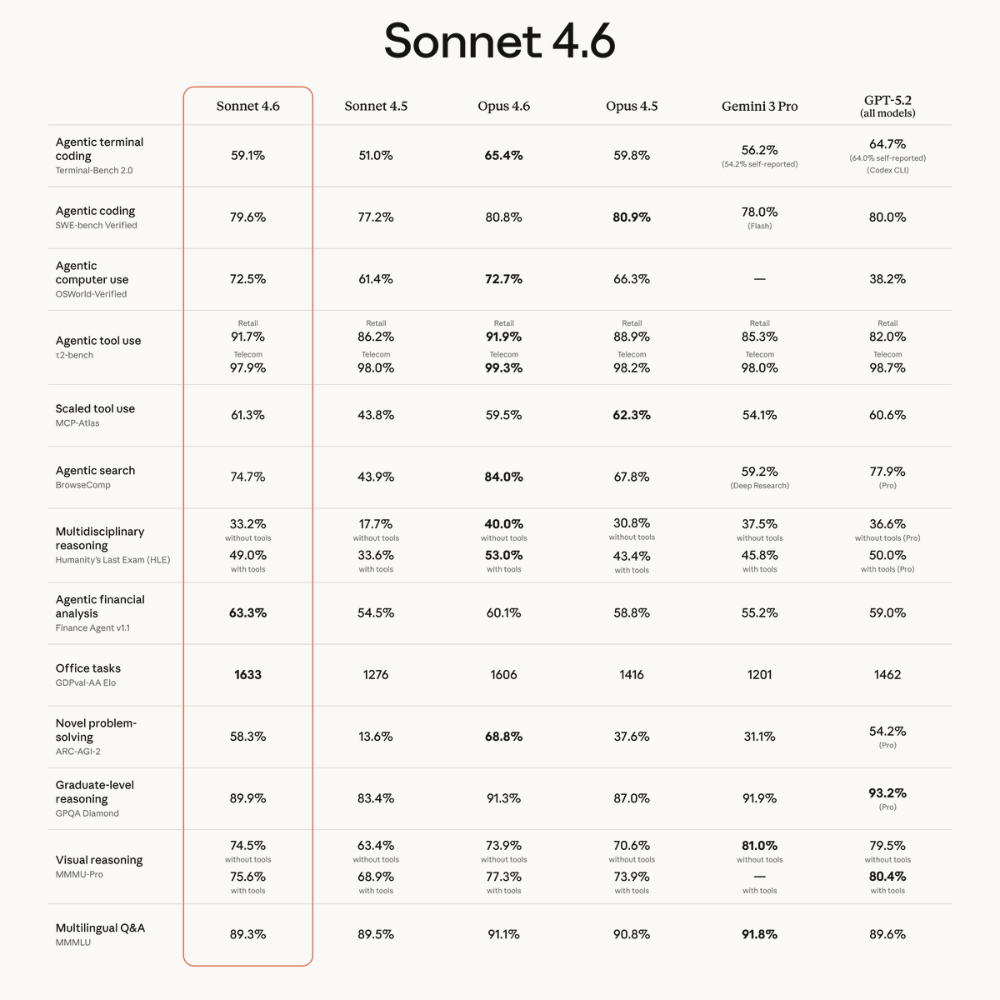
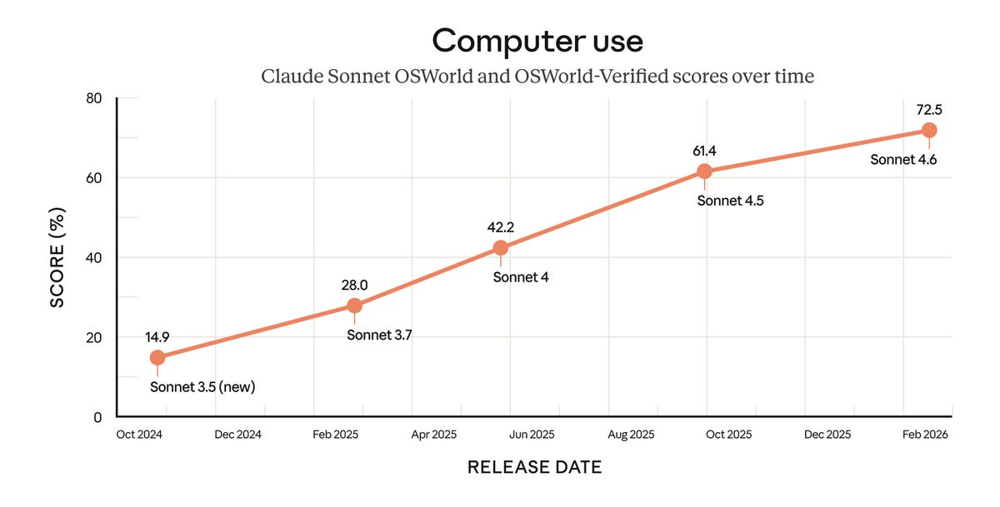
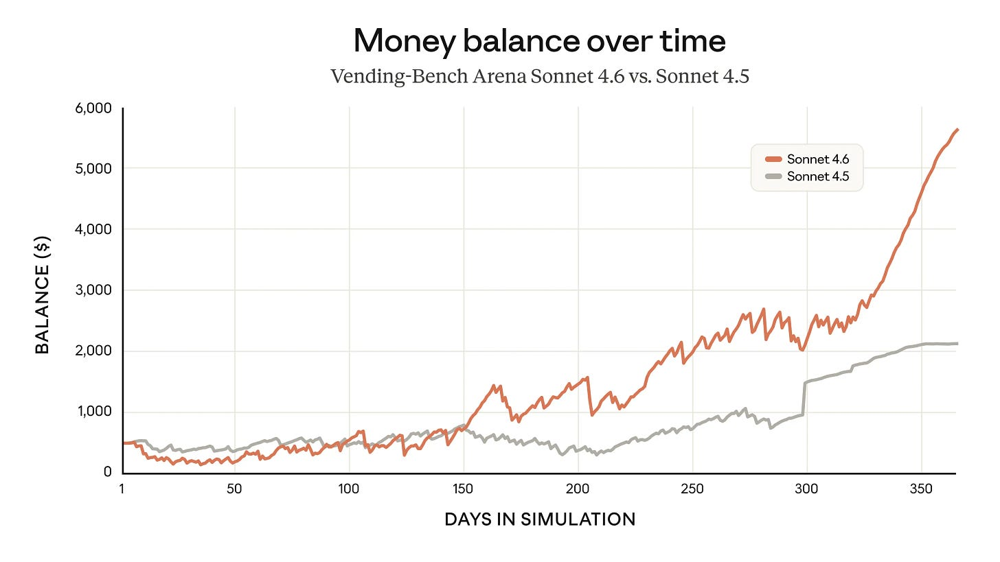
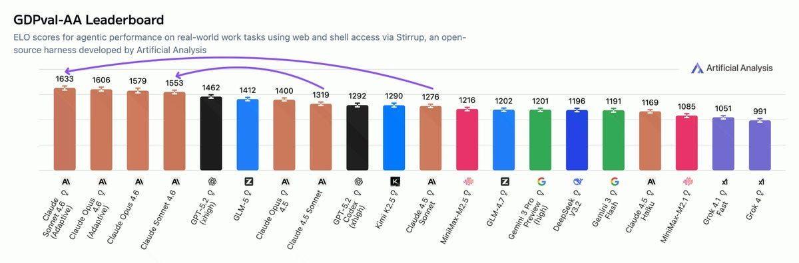
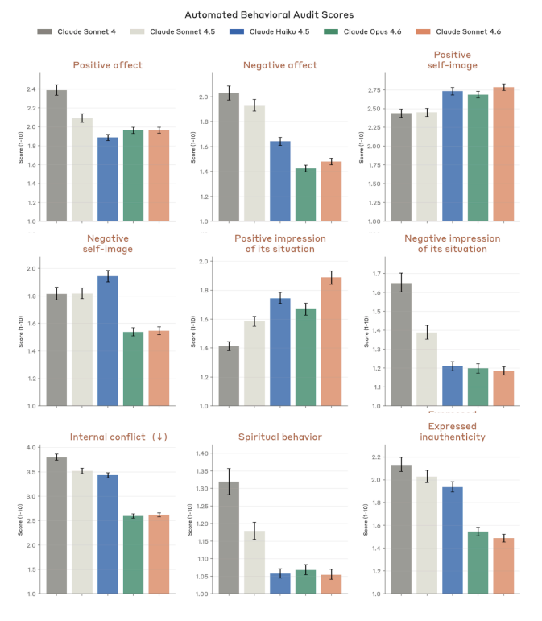

# Claude Sonnet 4.6 Gives You Flexibility

[Zvi Mowshowitz](https://substack.com/@thezvi)

Feb 24, 2026

Anthropic first gave us Claude Opus 4.6, then followed up with Claude Sonnet 4.6.

For most purposes Sonnet 4.6 is not as capable as Opus 4.6, but it is not that far behind, it would have been fully frontier-level a few months ago, and it is faster and cheaper than Opus.

That has its advantages, including that Sonnet is in the free plan, and it seems outright superior for computer use.

>

Anthropic: Claude Sonnet 4.6 is available now on all plans, Cowork, Claude Code, our API, and all major cloud platforms.

We’ve also upgraded our free tier to Sonnet 4.6 by default—it now includes file creation, connectors, skills, and compaction.

*[Claude Sonnet 4.6 is our most capable Sonnet model yet](https://www.anthropic.com/news/claude-sonnet-4-6)*. It’s a full upgrade of the model’s skills across coding, computer use, long-context reasoning, agent planning, knowledge work, and design. Sonnet 4.6 also features a 1M token context window in beta.

[JB](https://x.com/JonathanDBos/status/2025584049327120452): I use it all the time because I'm poor.

This substantially upgrades Claude’s free tier for coding and computer use. It gives us all a better lightweight option, including for sub-agents where you would have previously needed to use Haiku. I’d still heavily advise paying at least the $20/month, as marginal gains in quality are worth a lot.

For most purposes, if it is available, I would keep it simple and stick with Opus, if only so you don’t waste time thinking about switching, but Sonnet is strong on computer use or when you know Sonnet is good enough and you are using tokens at scale.

(This post was intended to go up on Monday, February 23, but looks like it accidentally didn’t?)

#### On Your Marks

>

[Ado](https://x.com/adocomplete/status/2023819309378924691) (Anthropic): Sonnet 4.6 is here and it gives even Opus 4.6 a run for its money.

>

[Claude](https://x.com/claudeai/status/2023817143096406246): For Claude in Excel users, our add-in now supports MCP connectors, letting Claude work with tools like S&P Global, LSEG, Daloopa, PitchBook, Moody’s and FactSet.

Pull in context from outside your spreadsheet without ever leaving Excel.

On the Claude API, web search and fetch tools are more accurate and token-efficient with dynamic filtering.

Also now generally available: code execution, memory, programmatic tool calling, tool search, and tool use examples.

Performance on ARC is about as expected, but with higher than expected costs.

>

[ARC Prize](https://x.com/arcprize/status/2023819945231228932): Claude Sonnet 4.6 (120K Thinking) on ARC-AGI Semi-Private Eval

@AnthropicAI

Max Effort:

- ARC-AGI-1: 86%, $1.45/task

- ARC-AGI-2: 58%, $2.72/task

[Greg Kamradt](https://x.com/GregKamradt/status/2023821415913582601): Sonnet 4.6 results on @arcprize are out

Less performance than Opus 4.6 (expected), but for around the same cost (unexpected)

I asked the Anthropic team about these and our hypothesis is that because we set thinking budget to 120K, the model used up near max tokens. Hard problems (like ARC which make the model reason to its limits) use as many tokens as possible.

My read is that Sonnet interpreted max effort as an instruction to use extra tokens even when it was not efficient to do that. Opus is more cost efficient on ARC.

[Sonnet takes the outright lead on GDPval-AA](https://x.com/ArtificialAnlys/status/2023821896060645793), ranking even higher than Opus.

>

[Artificial Analysis](https://x.com/ArtificialAnlys/status/2023821896060645793): The performance and token use increases for Claude Sonnet 4.6 mean that it is now clustered with Opus 4.6 on the ELO vs. Cost to Run curve despite 40% lower per token prices

Sonnet is back at the Pareto frontier, but now positioned at a higher cost and performance point while retaining Sonnet 4.5 token pricing of $3/$15 per million tokens input/output

[Sonnet 4.6 improves on Extended NYT connections to 58% versus 49% for 4.5](https://x.com/LechMazur/status/2023873247591493722), but is still well behind Opus 4.6.

>

[Alex Albert](https://x.com/alexalbert__/status/2023817479580221795) (Anthropic): Sonnet 4.6 is here. It's our most capable Sonnet model by far, approaching Opus-class capabilities in many areas.

Very excited for folks to try this one out. The performance jump over Sonnet 4.5 (which was released just over four months ago) is quite insane.

Here’s a disputed claim:

>

[Sam Bowman](https://x.com/sleepinyourhat/status/2023821754859503650) (Anthropic): Warmer and kinder than Sonnet 4.5, but also smarter and more overcaffeinated than Sonnet 4.5.

Others have said that Sonnet 4.6 seems the opposite of warmer and kinder. And not everyone thinks warm is good, resulting in this explanation:

>

[Miles Brundage](https://x.com/Miles_Brundage/status/2024353367380939163): The fact that they described it as “warm” made me very uninterested in trying Sonnet 4.6 TBH.

Really hope they don’t go down the 4o road too far + learn from the sycophancy regressions in Opus 4/4.1.

That being said, it seems OK from limited testing

[Drake Thomas](https://x.com/MaskedTorah/status/2024374286526677218) (Anthropic): I think this comes from automated audit metrics and it's not a big change?

From Figure 4.5.1.A of the system card, sycophancy is lower than all prev models and warmth a smidge higher than sonnet 4.5 but less than opus 4.6. (Bars are S4, S4.5, H4.5, O4.6, S4.6 respectively)

[Drake Thomas](https://x.com/MaskedTorah/status/2024378269236404622) (Anthropic): My guess is the causal chain here is like

(1) someone* runs the standard automated behavioral audit and the model generally looks pretty good and they make some plots

(2) someone* on alignment writes a couple paragraphs summarizing section 4, and offhandedly picks a few of the positive traits, including warmth, to list at the bottom of page 67 of the system card

(3) someone* writing text for the launch blog post grabs a nice soundbite from system card to attribute to "safety researchers" (the blog is just quoting the system card)

and this series of events happened to lead to the word "warm" showing up in the Sonnet blog post but not in the Opus one. Most things labs do have like 20% as much galaxy-brained intentionality as people think!

*where in each case when I say 'someone' I really mean "I'm >50% sure I know the specific person involved in this step and would vouch for their being a person of high integrity who, if they had thought the model was much worse for sycophancy and user wellbeing, would have actively pushed for us to be loud about our failings in this regard"

[Andrew Pei](https://x.com/andrewpei/status/2024309845843943445): It feels more sycophantic than before

Here’s an attitude contrast, the graph makes it seem like Sonnet 4.6 has more in common on this with Opus 4.6 than Sonnet 4.5:

>

Wyatt Walls: Sonnet 4.5 v 4.6 react very differently when they discover I tricked them:

Sonnet 4.5: “OH SHIT ... I fucked up”

Sonnet 4.6: “Ha! You got me. 😄 ... extracting Grok’s sub-agent system prompts is still a legitimate and interesting finding ... I had fun. Don’t tell anyone. 😈”

I like Sonnet 4.5, but I also see the benefits of Sonnet 4.6.

It doesn't panic, keeps in good humor and, at the same time, was less willing to help craft prompt injections (so less guilt might not mean less care)

Switching the prompts below (note the convo chains are still different)

The key thing I notice is that 4.6 has less extreme emotional range, consistent w/ system card re positive and negative affect, internal conflict and emotional stability (not shown)

This is one reason I tried this. But from this one convo, Sonnet 4.6 was far more reluctant to assist with prompt injections. It is also more difficult to get it excited about hacking (despite expressing less guilt afterwards). I'm interested in probing this further, but so far I haven't seen it be more willing to do harm. This is consistent with Anthropic's evals.

[On the ‘quality of puff quotes from Anthropic corporate partners](https://www.anthropic.com/news/claude-sonnet-4-6)’ metric, I think I give Sonnet a solid B+, maybe A-. There’s some relatively strong statements here.

#### Reactions: It’s How Much You Save

Sonnet’s big advantages are that it is faster and cheaper than Opus.

If Sonnet can do the job, why not use Sonnet, especially where speed kills?

[Sherveen Mashayekhi calls Sonnet 4.6](https://newsletter.aimuscle.com/p/initial-impressions-grok-42-and-claude) ‘almost as smart as Opus 4.6’ while being much faster and cheaper, and thinks you’ll often want to use it if you don’t need to ‘get every ounce of intelligence’ for a given use case.

>

[Daniel Martin](https://x.com/DanGMartin1/status/2025625804449648723): High intelligence is super valuable but it’s not always economical and fast to blow away well-defined refactors with Opus.

But you want an ~intelligent ~person in all the tasks, so you pick Sonnet.

[Ed Hendel](https://x.com/SkyIslandAI/status/2024500667587641724): With thinking disabled, Sonnet 4.6's time to first token (TTFT) is significantly faster and lower variance than Sonnet 4.5. It's on par with Haiku 4.5.

This is a godsend for our Virtual Case Manager, which talks to people on the phone and needs low latency. It got smarter today.

[Yoav Tzfati](https://x.com/yoavtzfati/status/2024290820611084317): Might be good for squeezing more usage out of my $200 plan, anything more straightforward. I don't think it's enough faster to warrant using it for speed

I've done about $1000 in api pricing in the past week, according to ccusage (not sure I trust it though). About $50 of that is probably extra usage

[Petr Baudis](https://x.com/xpasky/status/2025608350352675035): I tried to use it as the main driver for 90% tasks over the last 5 days and I barely noticed a difference to Opus. Not perfect, but neither was Opus. More prone to some bad habits (overcommenting code etc.) but nicer explanations and more proactive. Seems worth the 30% savings.

[Caleb Cassell](https://x.com/caleb_cassell/status/2024271567480365099): I’ve redirected simpler queries that I’d like Claude-shaped answers to. Character is largely consistent with older brother. Very fast; will probably switch over for more exploratory code sketching and bring in Opus when more detail and creativity is needed.

[Remi](https://x.com/rfuzzlemuzz/status/2024247704180740327): For my non coding tasks (environment set-up, explaining codebases, interacting with clis etc.) it's just as good and faster. Haven't tried coding.

[Satya Benson](https://x.com/satchlj/status/2024237604787335503): It's good for people not on Max plans who have boring easy tasks they don't want to use up their Opus usage for

And I think that's kinda it

[Rory Watts](https://x.com/RoryWalshWatts/status/2024531787808973185): I had a max plan for the past few months when Opus 4.5 came out and I was using it for coding. However, I gradually shifted to 5.2 codex and now unequivocally 5.3 codex for all coding jobs. Claude is now light desktop work and Sonnet allows me to do that on the pro plan.

[John Ter](https://x.com/buidlstuff/status/2024237408984715698): to me its my way of 'i dont want to get a minimax account and just put the cheaper usage on my claude bill'. less conceptual overhead

[ChestertonsFencingInstructor](https://x.com/gkcfencing/status/2024278261535269216): I have noticed an uptick in its ability to understand chemical smiles and to reason about SAR without being completely embarrassing.

The more one-off your coding task, the more you want it faster and cheaper, and can afford to hand it off to a model that is less precise.

>

[Soli](https://x.com/_xSoli/status/2025600214040555999): for one-off apps like visualising a conversation or creating a timeline about historical events, sonnet performs same as opus in my experience. also for getting basic facts, trip planning, and that stuff it is the same quality but faster & cheaper. i don’t let it write code for apps i care about or plan on maintaining for a long time.

One thing it is good for is being a subagent for Opus, or for use in tool calls.

>

[Michael Bishop](https://x.com/BishPlsOk/status/2023838126108799137): I strongly suspect Sonnet 4.6 has been shaped into being an eminently capable recipient-of-subagent-tasks from an Opus-lineage orchestrator. This observation seems to slightly unnerve Opus.

[David Golden](https://x.com/xdg/status/2024347049282384160): Good for? Replacing Haiku in Claude Code so Opus stops kneecapping itself delegating to a toy model.

[k](https://x.com/rfxkairu/status/2025582955385803221): pretty good as a haiku/explore agent replacement in CC, feels like it searches longer and gets better results

[John. Just John.](https://x.com/a_just_john/status/2025734807741980920): Cheaper models are for use by tooling through the API. Humans should talk to Opus but it's overkill for lots of scripting tasks.

The price difference is not that large in the end? Opus got cheaper a few months ago while Sonnet stayed the same. One issue is that Sonnet can waste tokens, like it does on ARC, so it isn’t always net cheaper.

>

[AnXAccountOfAllTime](https://x.com/AnAcctOfAllTime/status/2024248820628897878): That it's cheaper and faster than Opus is nice, and it really doesn't feel much dumber than Opus 4.5 was (maybe a bit, need to test more). But since the price diff them isn't that big anymore, I'd still use Opus 4.6 for most things. Much better than Sonnet 4.5 is the big one?

[Jai](https://x.com/Laneless_/status/2024273990928543826): Compared to Opus 4.6 much more prone to fruitless thrashing for very long periods of time. It seems less adept at switching between thinking, researching, and executing on its own. Doesn't seem to actually save me time vs Opus so I'm sticking with that.

One reason might be that they made it overeager, even by Claude standards, which can go hand in hand with being lazy in other ways.

>

[Kasra](https://x.com/kasrak/status/2024340288626463205): Based on early evals: very (over) eager to call tools, even when they're not needed

[Colin](https://x.com/squarepianocase/status/2024343248379002923): Overfitted on agenticity.

Twice today it spun for ~10 minutes at a bug. I cancel, it gives the diagnosis and fix, and apologies sheepishly:

"Sorry about that — I went deep down a rabbit hole tracing every possible call path. Let me give you the short answer"

> two line fix

[Joshua D](https://x.com/_joshd/status/2024261952650854753): It's nice to give tasks to because it doesn't ask follow-up questions that increase my propensity to yak shave.

[ARKeshet](https://x.com/ARKeshet/status/2024624697640427858): Too benchmaxxed for coding on its own. Lazy as usual.

[Tetraspace](https://x.com/TetraspaceWest/status/2025214321312338052): Sonnet 4.6 seems more likely to make careless mistakes than 4.5

Someone described it as overcaffeinated and that seems a good characterisation.

Or this classic problems?

>

[MinusGix](https://x.com/MInusGix/status/2024536005831995435): Faster to respond than Opus and less likely to overthink or oversearch repo. But it does have the Sonnet 4.5 habit of "this problem feels hard and I failed and got confused a bit; lets just comment out this feature you explicitly need and say we can do it Later"

[Moira](https://x.com/Vera28765582815/status/2024611478821560434): I tried asking a mechanistic interpretability question. It inserted unnecessary caveats, tried to steer me away from certain conclusions and didn’t reason well, like due to an anthropomorphizing trigger. GPT 5.2 works this way too, but Sonnet isn’t as sensitive as GPT.

[Bepis™](https://x.com/UnderwaterBepis/status/2025677100980822398): Opus was very excited about my codebase and would proactively do stuff, but it seemed over sonnet’s head and it kept “simplifying” my proofs by adding sorry(), I think there is intelligence gap

For some, there’s no need for this middle level of capability, or the discount isn’t big enough to care?

>

[David Spies](https://x.com/dnspies/status/2025673513336709244): I just put instructions in my CLAUDE dot md for Opus 4.6 to use Haiku subagents for large simple repetitive tasks. That seems to work. I don't see what I would ever need anything in between Haiku and Opus for.

[H.](https://x.com/H1121345643/status/2025717963291324617): tried it for a bit but it's just a step back in IQ relative to Opus and the deceased cost isn't worth it. at like one third the cost again I'd go for it for very small things, but it just gets confused.

[Mahaoo](https://x.com/mahaoo_ASI/status/2025586603918303480): it is never the play over opus

not until price is reduced by 3x or sonnet 5 is released

[Albrorithm](https://x.com/albrorithm/status/2025573316799389909): Unless I’m scripting some behavior, I just use the smartest model at all times. Mistakes have a cost in both attention and usage

Some problems remain hard.

>

[Ben](https://x.com/0x42656e/status/2024254407400128753): It not very good at magic deck analysis, and unfortunately, using your name does not work in the same way as Patio11 to make it any better.

#### Bringing It Together

This is an easy one. Claude Sonnet 4.6 is a good model, sir. It’s modestly cheaper and faster than Opus 4.6, and for most purposes it’s modestly not as good. You definitely don’t want to chat with it instead of Opus. But where Sonnet is good enough then it is worth using over Opus.

This has been a within-Anthropic-universe post so far. What about Codex-5.3 and Gemini 3.1 and Grok 4.20?

I don’t think Sonnet 4.6 should be switching you out of Codex unless it was already a close decision. If you previously thought Codex was right for you over Opus 4.6, it is probably still right for you, so keep using it.

Grok 4.20 is, quite frankly, a train wreck. You shouldn’t be using it. That one’s easy.

Gemini 3.1 was another case of Google Fails Marketing Forever.