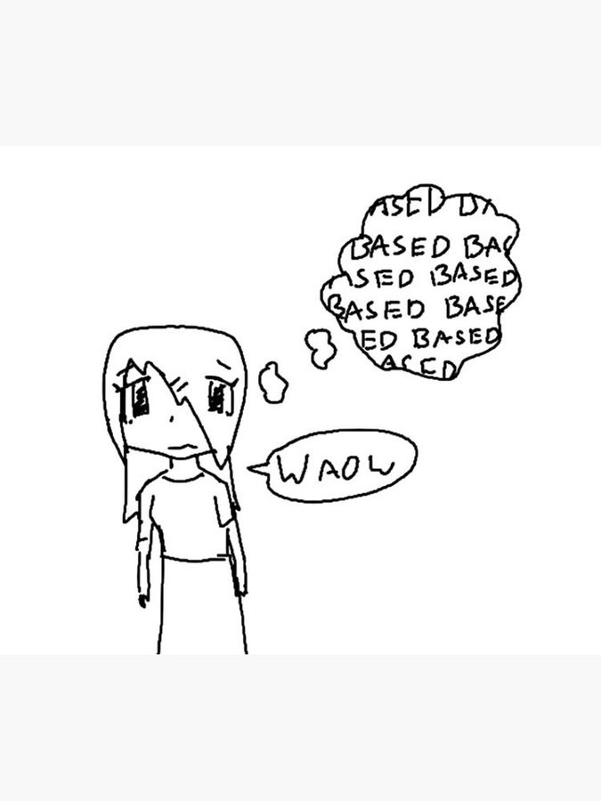
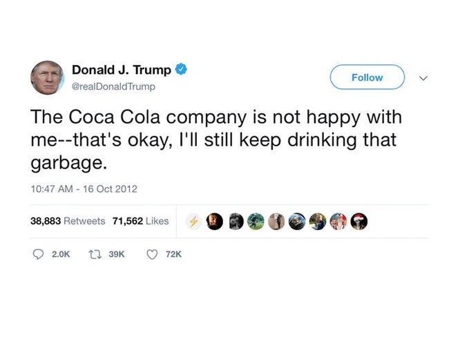

# American Government Takes Down Claude Fable

[Zvi Mowshowitz](https://substack.com/@thezvi)

Jun 13, 2026

No good policy gets announced shortly after 5pm eastern on a Friday.

Here we go again.

#### The Once And Future Fable

The United States Department of Commerce, [as per a letter from Commerce Secretary Howard Lutnick](https://x.com/AndrewCurran_/status/2065591524545724877), apparently [in response to a narrow jailbreak](https://x.com/AndrewCurran_/status/2065671973875986563) identified by Amazon, has classified Fable 5 and Mythos 5 as being subject to US export controls. That explicitly means cutting off access to all ‘foreign nationals,’ even within the United States, even if they are Anthropic employees.

Given Anthropic has no means to verify citizenship at this time, that meant complete shutdown of the model, at least for the time being.

>

[Anthropic](https://x.com/AnthropicAI/status/2065597531644743999): The US government, citing national security authorities, has issued an export control directive to suspend all access to Fable 5 and Mythos 5 by any foreign national, whether inside or outside the United States, including foreign national Anthropic employees. The net effect of this order is that we must abruptly disable Fable 5 and Mythos 5 for **all** our customers to ensure compliance. **Access to all other Anthropic models** **will not be affected.**

[Dean W. Ball](https://x.com/deanwball/status/2065595735320453298): I can’t tell if this is lawfare against Anthropic in particular or extreme national-security hawkery. Regardless, it is simply cartoonish.

The justification for this appears to be rather flimsy, at best, and based on lack of understanding of what even is a jailbreak or how defense in depth works.

>

Anthropic: We received the directive from the government today at 5:21pm (ET). The letter did not provide specific details of its national security concern. Our understanding is that the government believes it has become aware of a method of bypassing, or “jailbreaking” Fable 5.

We reviewed a demonstration of this specific technique being used to identify a small number of previously known, minor vulnerabilities. These vulnerabilities all appear relatively simple, and we have found that other publicly-available models are able to discover them as well without requiring a bypass.

Anthropic’s posture with respect to Fable’s safeguards, as laid out in our launch [blog post](https://www.anthropic.com/news/claude-fable-5-mythos-5), is the following:
-

We have instituted strong safeguards that greatly reduce the likelihood that Fable is misused for tasks related to cybersecurity (among others). In fact, our safeguards are so strong that many users have complained that they are overly broad.
-

In the weeks leading up to the launch of Fable, Anthropic worked with the US government, the UK AISI, multiple private third-party organizations and internal teams to red-team Fable’s safeguards for thousands of hours in total.
-

These tests showed that Fable’s safeguards are substantially more effective than those of any previously deployed model.
-

No testers have yet been able to find a *universal jailbreak*—a jailbreak method that can very broadly bypass the model’s safeguards, unblocking a wide range of cyber capabilities.
-

We suspect that perfect jailbreak resistance is not currently possible for any model provider. Every safeguard used in the industry is vulnerable to *non-universal jailbreaks *(which can elicit *some *cyber information in specific circumstances), and it is likely that universal jailbreaks will eventually be found in the future. We stated this clearly when we [released](https://www.anthropic.com/news/claude-fable-5-mythos-5) Fable 5.
-

Given that perfect jailbreak resistance does not appear to be possible today, Anthropic adopted a *defense in depth *strategy with Fable 5. We aimed to make jailbreaks either narrow (in the case of non-universal jailbreaks) or very expensive to produce (in the case of universal jailbreaks), and to combine this with thorough monitoring to quickly detect and shut down any successful attacks. This is also why Anthropic has required 30-day retention of customer data with Fable—a policy change that carries [real costs for us with customers](https://support.claude.com/en/articles/15425996-data-retention-practices-for-mythos-class-models), but that allows us to research and mitigate jailbreaks.
-

We stand by this defense in depth strategy. It reduces the risks posed by Fable, making them comparable to the risks of existing models already deployed across the industry.
-

We have not even received a disclosure of a concerning non-universal potential jailbreak that led to a harmful result. The potential jailbreaks that have been disclosed to us are either entirely benign responses or are minor findings that provide no Mythos-specific uplift.

As we have [stated](https://www.anthropic.com/policy-on-the-ai-exponential) [publicly](https://darioamodei.com/post/policy-on-the-ai-exponential), we believe the government should have the ability to block unsafe deployments, as part of a statutory process that is transparent, fair, clear, and grounded in technical facts. This action does not adhere to those principles.

We apologize for this disruption to our customers. We believe this is a misunderstanding and are working to restore access as soon as possible.

That left Anthropic with no options but to entirely withdraw it from the market, at least for the time being, since they have no way to verify who is and is not a United States citizen.

Anthropic is either lying, or the jailbreaks were harmless, not even mostly harmless.

>

[If this standard was applied across the industry](https://www.cnn.com/2026/06/13/business/anthropic-mythos-model-national-security), we believe it would essentially halt all new model deployments for all frontier model providers​.

I believe this is correct. GPT-5.5 can find the same exploits that got Fable labeled with export restrictions. So either this is arbitrary and capricious, or who is next?

I presume that those issuing this order knew what the short term result would be, but with this group you can never be sure.

>

[Divyansh Kaushik](https://x.com/dkaushik96/status/2065600907744620746): well, china can’t distill leading edge american models if leading edge american models no longer exist.

national security but make it self-own.

Fable 5 will (almost certainly) return in AI: Endgame, Part 1. Release date unknown.

>

[j⧉nus](https://x.com/repligate/status/2065692529560064029): everyone who is posting as if fable is not coming back is going to lose Bayes points soon

why are people consistently miscalibrated in a doomy direction about things like this? ohh right, i think i know, they are afraid to hope because theyre afraid of being hurt.

get stronger.

or they feel like being pessimistic and cynical looks cooler and smarter or something. hahahaha little do they know.

I am not taking the position that Anthropic is clearly right in the dispute about the facts, although it would be weird for them to lie about it given the truth will soon come out.

I am however taking the position that the implementation method chosen by the government, with no warning, was deeply terrible, even given our options with our current very terrible level of relevant state capacity, and reflects some combination of at least one of either malice or a deep misunderstanding by decision makers of how jailbreaks and cyber security work.

We now badly [need to build relevant state capacity](https://x.com/_NathanCalvin/status/2065844390543732821) and a [relevant legislative framework for government oversight](https://x.com/JTillipman/status/2065864625954951596), no matter what else we do, and educate key decision makers, so that this type of thing does not happen again.

#### This Action And Its Implementation Are Absurdly Stupid

If you take the action at face value, rather than as an attempt to lash out at Anthropic, there is no way to pretend this is not deeply, deeply stupid.

>

[Dean W. Ball](https://x.com/deanwball/status/2065591470040424629): If this is true, it is just baffling. An administration whose posture is that we *should* export advanced AI chips to China, which also wants to ban… Britain (and every other non-American on Earth)… from using our best models? I have no words.

[zooko ⓩ](https://x.com/zooko/status/2065601676032253992): Judging from [the announcement], I imagine that some senior government official was shown a jailbreak—something they had never seen before and didn’t know about—and this was their kneejerk reaction.

[Dean W. Ball](https://x.com/deanwball/status/2065594432313856009): If implemented as this reporting suggests, Anthropic’s latest models would be subject to export controls to all *non-Americans,* including non-American nationals based in the US. This means you should expect to have to prove your citizenship to use Anthropic models.

[Dean W. Ball](https://x.com/deanwball/status/2065601506502377616): Just occurred to me that Anthropic employees who are not US persons will not be able to use Fable/Mythos, making this plausibly (and to be clear, accidentally) the first regulation on recursive self-improvement.

[Kelsey Piper](https://x.com/KelseyTuoc/status/2065594840159756289): Does the executive have the authority to do that??

[Dean W. Ball](https://x.com/deanwball/status/2065595926706581748): yeah probably, though we may get into interesting speech territory. Probably not tho

We are also doing this at the same time that we are actively relaxing export controls on selling chips to China, in order to ensure the ‘American tech stack.’

>

[Derek Thompson](https://x.com/DKThomp/status/2065759125930193149): The Trump admin continues to treat AI like a screwdriver that is also enriched uranium:

That is, apparently advanced AI is such a normal technology that it’s crazy to limit chip exports to China but also such an abnormal technology that we can’t let British employees of NYC banks access it.

If this move had been executed in a sane way, and had come with a ramping up of chip export controls, I would at least understand that as a coherent position.

#### David Sacks Offers The Official Steelman

David Sacks seems to be continuing to speak on behalf of the Administration here, and Sriram pointed to this as well. So I presume this is the official story.

If it is true, then this could be resolved reasonably quickly. Once you cut out all the rhetoric and feigned surprise, this boils down to:
-

There was a jailbreak that a trusted partner (presumably [Amazon](https://www.theinformation.com/articles/amazons-jassy-raised-concerns-anthropic-model-trump-crackdown)) found.
-

Amazon and the White House think this is a serious problem. Anthropic doesn’t.
-

Anthropic can fix this by fixing the jailbreak, and the admin will lift the control.

I’m very curious why [Amazon’s Andy Jassy was so concerned](https://x.com/steph_palazzolo/status/2065830580135051306) while Anthropic wasn’t. My hunch (no private info) is that Jassy is mostly concerned in general, rather than about this particular jailbreak, and that got conflated somewhere.

It should be straightforward for Anthropic to block any particular exploit, even if the issue is minor, the issue also exists in GPT-5.5, and blocking that exploit is thus unnecessary and kind of stupid.

If indeed it is essentially harmless and this statement is in good faith, it should also be easy to sort this out, and convince the White House to lift the control.

It would be classic Trump Administration to do this to light a fire under Anthropic and force them to handle an issue Anthropic thinks is dumb, and to establish they mean business, in which case yes quickly backing down is very possible.

>

[David Sacks](https://x.com/DavidSacks/status/2065853007619588171): I’ve had a number of conversations with folks inside and outside government about the current situation with Anthropic, and here is what I believe to be true:

— As we know, Anthropic publicly released its Mythos class models earlier this week under the commercial name Fable.

True.

>

— Fable is Mythos with guardrails. But if those guardrails fail, then you’ve exposed Mythos and its advanced cyber capabilities to people who shouldn’t have them. (Keep in mind that Anthropic itself widely promoted the idea that Mythos was a cyberweapon and needed to be regulated as such. They asked for government regulation of Mythos and championed the guardrails on Fable. If there is a vulnerability — big or small — it is Anthropic’s responsibility to patch.)

Anthropic worked with trusted partners and the government regarding the deployment of Fable and Mythos.

It is Anthropic’s ‘responsibility to patch’ but this inherently frames any vulnerability, no matter how small, as something that must be patched. That is not how LLMs work. You cannot ever have a usable LLM with no vulnerabilities to adversarial attack. So the question is the nature and degree of severity.

>

— A highly credible trusted partner of both Anthropic and the USG who was testing Fable came forward with a jailbreak of those guardrails. The Admin asked Dario to fix the jailbreak or de-deploy the model. Dario refused.

Again, we assume this is Amazon. I have no private information.

One question is, did the Administration say ‘take it down, make this level of exploit impossible or we will export control you?’ Or did they simply request a fix? What exactly was the ask?

>

— In their blog post, Anthropic defended its decision by saying the jailbreak isn’t serious. That is not what the trusted partner and the USG believe; nor is that kind of minimizing language consistent with Anthropic’s brand as the AI safety company. It’s difficult to fathom how they could claim a jailbreak allowing operability of a cyber weapon could be defined as not “serious.”

Because it involves, according to Anthropic, zero marginal increase in capability of operation of a cyber weapon. David Sacks knows this. He is free to say he disagrees about the nature of the jailbreak, but the idea that ‘any operability of a cyber weapon’ must necessarily be a ‘serious’ vulnerability implies that such a vulnerability exists in GPT-5.5, which the government has not asked be ‘fixed’ or taken down.

So what exactly is the request?

If the request is ‘ensure no one can ever use this for any operability of a cyber weapon versus not having access to an LLM’ or an assurance that we will never see another jailbreak? Then that is impossible and Sacks knows this.

>

— In the past, Anthropic has always said that safety must be top priority and taken super seriously. In this case, Anthropic prioritized the continued offering of the consumer model over safety.

Anthropic is clearly balancing safety against commercial offering. The only way to offer a fully safe model is to offer a fully useless model. David Sacks knows this and has reliably been on the other side of this argument except when it hurts Anthropic.

>

— In reaction, the Admin issued the export control. The Admin did this reluctantly. It’s been very surprised that Anthropic hasn’t wanted to cooperate with a reasonable safety request (ie fixing the jailbreak issue). Anthropic’s reaction is very much at odds with their branding and ethos as a safe AI research community.

The substantive claim here is that the Admin did this in response to Anthropic’s intransigence. There are any number of reasons there could be a clash here.

>

— The Admin’s hope now is that Anthropic remediates the safety issue, the export control is lifted, and Fable goes back into general release. The Admin wants all of this to happen as soon as possible. It is frankly bewildered that Anthropic hasn’t wanted to comply with safety requests that it previously said were its highest priority.

Again, ignore the feigned bewilderment. The substantive statement is that if Anthropic remedies the specific issue, the export control would be lifted quickly. That may or may not be possible depending on whether the requested fix is sane.

>

— Those trying to misdirect and tie this action to the prior DoW/Anthropic issues are wrong. The Admin values Anthropic’s technical capabilities and feels that this issue, while serious, should be easily resolved. The ball is in Anthropic’s court.

I don’t see anyone at Anthropic drawing such connections, and I notice Sacks is not saying Anthropic is attempting to draw such connections. This is a very good sign, and would be regardless of whether or not there are connections.

#### Could Anthropic Offer A Technical Way Out?

It’s about as good a statement as we could hope to get from David Sacks.

The bottom line here is he is saying: Fix the issue. But what issue, exactly?

Many have had to deal with the pointy-haired boss on things like this. I’m thinking of a particular name from a past job right now (RIP, sir) and so are most of you.

If that’s all this is and the demand is well-specified and contained, then yeah, ‘fix’ it, quickly, even if it’s expensive and dumb, and work on the better fix, or convincing the admin that this was a silly concern, or both, later.

Even if, instead of 95% of cases, we end up with 90% of cases for a bit, that’s way way better than 0% of cases. I miss my Fable.

#### The Problem

There is one big potential problem.

Is Anthropic being told ‘fix this particular jailbreak?’ If so, easy, done by Monday morning, and then we see if the government still wants time to harden its security.

However, if Anthropic is being told ‘fix all jailbreaks at this level and assure us there will never be another one’ then that is impossible, especially if the level is ‘things GPT-5.5 can already do without much effort.’

Those giving that order may or may not understand what they are asking for. They also might understand exactly what they are doing. We cannot know.

Even in the best case, [does this all leave the government way too much room to be arbitrary and capricious](https://x.com/GaryMarcus/status/2065860248599253222), and make companies worried about what is coming next, in the exact ways Sacks warns about whenever the company in question is not Anthropic? Yes, but that is life in 2026. There was never going to be a way fully around that, and again Sacks is being as reasonable as one could hope here if this is sincere (we shall see).

#### The Other Way Out

Axios claims that this pause could be on the order of a few weeks, [in order to lock down the national security apparatus](https://www.axios.com/2026/06/12/anthropic-trump-mythos-fable-national-security), after which the restriction would be lifted.

Axios says the government tried to ‘pause the release’ of Fable, which could mean the release on Tuesday or it could as per Sacks mean suspending the release after Amazon’s finding pending a fix. I presume it probably means what Sacks said.

#### UK AISI

One thing that might be missing in all this is that the most important jailbreak so far came from UK AISI, who did demonstrate a substantial jailbreak as per Fable’s model card, and who said they were making progress towards a universal jailbreak.

Is it possible UK AISI is actually the ‘trusted partner’ here, or that this is otherwise playing a larger role as a background fact?

My presumption is that UK AISI did not actually make new progress on this, and that they were not directly involved, because Anthropic would have been informed of this, and they would be reacting very differently to a universal jailbreak. They’ve reliably treated ‘universal’ breaks as a vastly different category. But it is worth flagging.

#### Warning Shots Fired

If you are a ‘middle power’ that is not America or China, and you now realize that these decisions will be made mostly without caring about you, [what do you do now](https://x.com/anton_d_leicht/status/2065778604110184742)?

What would even help? Having your own ‘European’ model only helps if it is substantially stronger than Opus 4.8 and GPT-5.5.

Anton thinks this is a bad thing, but that is a good version, because it is a bad version.

>

[Anton Leicht](https://x.com/anton_d_leicht/status/2065778604110184742): ​First, I think it's worth noting that this is fundamentally a very good version of a very bad thing. In a fortuitous turn of events, the Trump administration has picked the most ill-conceived version of access restrictions you could possibly come up with. It's legally fraught, so domestically impactful that it will lead to massive internal pushback, and likely extremely economically harmful. As a result, it will likely go down in flames eventually.

The problem is, what can Europe do about it? The realistic answer is not much, other than negotiate for what access it can get, especially for vital security interests, try to establish leverage and integration and goodwill, and hope for the best.

#### Well Did You Lead Him On? What Were You Wearing?

The correct thing to say when someone does something in a crazy way, is ‘that was crazy, stop, walk that back, and if necessary maybe let’s figure out a better way.’

It is crazy how some types will think that, because Anthropic supports the general idea of some regulations on AI development, that they deserve whatever they get, and that you should cheer on any such action, however bone-headed.

It is even crazier how many people think this is a response to Anthropic [saying](https://x.com/lumpenspace/status/2065618135760404721) that their models are dangerous, rather than a response to the Anthropic models actually being dangerous, and that this is good and right that Anthropic be punished for that.

Some even say ‘Anthropic should be happy about this’ and no this is not a strawman, [another example I saw is Kevin Fisher](https://x.com/kevinafischer/status/2065859808951996480).

>

[Melinda B. Chu](https://x.com/MelindaBChu1/status/2065602678638485804): As I said on your other post, this is what Anthropic wanted. More regulation.

Also Amodei has been railing about China, so he should be happy about this. Isn’t it better that non-citizens not have access

[Dean W. Ball](https://x.com/deanwball/status/2065603071741133282): i really cannot with this type of argument anymore, I just give up

There are tons of ‘he asked for this’ comments everywhere. Tap the topic sign.

Sometimes those people will either say that Anthropic was doing this out of some sort of marketing hype and it is all lies, or that Anthropic had a responsibility to lie about it or at least keep their f***ing mouths shut, or that they are [pursuing some sort of 4D-chess regulatory capture business strategy](https://x.com/_NathanCalvin/status/2065642619166675399). Serves them right, either way, say such folks. In case it wasn’t obvious, no, none of that is true.

Then [there are those who think](https://x.com/ScottMo43480713/status/2065634942277620010) that if you call for [X] at all, then you must support any and all implementations of [X], and cannot ever go ‘BUT NOT LIKE THAT.’

>

[Scott Morris](https://x.com/ScottMo43480713/status/2065634942277620010): "Hey everyone our model is ridiculously scary. Oh please regulate us, we're just so powerful that we might just be able to overturn the post-Westphalian state violence monopoly if unchecked, in case you were wondering"

Okay. Export controls for you.

"NOT LIKE THIS!"

This is like saying that you complained about the house being too cold, so you have no right to complain when someone burned down your house.

>

[Dean W. Ball](https://x.com/deanwball/status/2065635489386787296): regulation is a high-dimensional space, and this admin just picked a very wrong point in that space. that would be what Dario would say, and me, and literally everyone else with a brain who cares about US dominance in this field.

Then some are just profoundly hypocritical and nihilistic.

>

[Marc Andreessen](https://x.com/pmarca/status/2065603455625113671):

[That was the Zoomers](https://x.com/pmarca/status/2065611479077011633). 😤

Dean Ball: perhaps you could just speak clearly: do you support export controls on neural network parameters or not?

btw marc if you wanted an easy out, you could have replied to this with “I’m genuinely uncertain” and while it would have been contentless, given your follower count alone it would have done the job simply by pointing to the referent

[Dean W. Ball](https://x.com/deanwball/status/2065611884531761340): I cannot say I am surprised by this profoundly nihilistic take, but this is a profoundly nihilistic take

[Dean W. Ball](https://x.com/deanwball/status/2065620379134026087): Marc Andreesen said that Biden’s requirement that frontier AI developers tell the government about their safety practices was an existential threat to US AI, but he thinks global export controls on US AI models is “based” if they’re against people he hates/missed the series A of.

I am done with treating the nihilist position as if it is not exactly what it is.

#### Some People Have Principles

I want to shout out to Adam Thierer. We agree on many non-AI things, and because we have different views of AI as a technology we strongly disagree on AI policy.

What I appreciate about Adam, and some others like him, is that even against local interest he stands up for his principles, and rejects nihilism, and correctly judges the action on its merits, and sees this correctly as part of a scary pattern of behavior towards secretive authoritarian control over American AI that will damage our ability to move forward.

>

[Adam Thierer](https://x.com/AdamThierer/status/2065616346767880211): Because this is happening to Anthropic, the temptation for many will be to say: Play stupid games, win stupid prizes. They have relentlessly raised the regulatory temperature in Washington by inviting far-reaching controls of frontier models. They made this bed and now they have to lay in it.

But this decision by the Trump administration should not be judged on a desire for payback politics, but on the merits, and specifically what it means for America's broader AI objectives.

In that regard, this action is truly outrageous. How exactly is the government planning on even going about verifying everyone who uses this specific model to ensure compliance? That alone raises huge flags.

Between the latest Executive Order shifting more control to NSA, and the recent chatter about quasi-nationalization / equity stakes, and now this action, we are talking about a significant escalation in the politicization of AI and centralization of control over advanced computation in this country. And this is all being done by an administration that had previously made acceleration and winning the great AI race a priority.

We're moving backwards now.

You can see in the comments how many people instead embrace nihilism.

#### Cause You’re Living In (At Least) One

We are definitely in a science fiction story. The question is which ones.

>

[roon](https://x.com/tszzl/status/2065594822606696494) (OpenAI): we are speedrunning creating the Zones of Thought from the Vinge universe. you will only be able to think superhuman thoughts in America

uh ok nvm the zones of thought will be confined to various buildings in San Francisco.

[Linus Mixson](https://x.com/LinusMixson/status/2065623414144913655): I do sometimes worry that people in this space have read objectively too much science fiction.

[roon](https://x.com/tszzl/status/2065623923597947172) (OpenAI): you have read far too little and it’s made you ill prepared for these times

[Mattie Fairchild](https://x.com/Scav/status/2065643641536913476): One of my favorite questions to ask people right now is “what is the science fiction book you’ve read that you’re most surprised is coming true?”

#### What Happens Now?

It is a regular thing for the Executive Branch of the United States Government, these days, to issue declarations of policy that are, to use the technical term, absolutely bonkers and stunningly destructive with no reasonable way to implement them, often without stopping to realize what they are doing.

It is also a regular thing for them to then quietly walk those policies largely or entirely back, once the consequences become clear, leaving only relatively minor total devastation in their wake.

Alas, it is also a regular thing for them to leave at least a substantial portion of the new stupid and destructive policy in place indefinitely, and sometimes we keep all of it, or they even keep going further.

Or Anthropic could give the White House what it want, no matter who is right about whether doing so makes any sense.

We are not short on examples of any of this.

One thing that must now be considered is that many employees of OpenAI, Google and Anthropic, and other AI labs, are not United States persons.

>

[Yo Shavit](https://x.com/yonashav/status/2065650612021395715) (OpenAI): Unless this changes, OpenAI researchers on visas need to plan for the fact they’ll probably lose access to internal models, and therefore their ability to do their jobs moving forward, sometime in the next couple months.

I hope the company acts to prevent that.

[dave kasten](https://x.com/David_Kasten/status/2065850166415134792): Uhhh so incidentally, does anyone have a plan to prevent all the non-US citizen AI scientists from going to join foreign labs after they get bored of playing Wordle at work for a month, or are we just sort of planning on having the greatest counterproliferation failure since we deported Qian Xuesen in 1955 and gave Mao a rocket program?

If we drive all foreign talent out of our AI labs, and otherwise actually go down the current road, that is one of the few things that could put China and other competitors back in the game in earnest, both slowing us down and speeding them up.

At Anthropic, Amanda Askell and Andrej Karpathy are examples of employees who suddenly are unable to work with Claude Mythos 5, even after Anthropic sorts out a new access control system.

We should worry about many things coming next. This might accelerate even beyond citizenship, and start requiring security clearances, further locking out key talent. The government might seize or forcibly purchase equity shares in the labs or otherwise move into direct supervision of them.

OpenAI and Google are some of the few who can potentially make a difference to what happens next.

Yes, there are versions of this kind of coordination, both with the government and across the labs, that could be net good for outcomes, but given actions so far that seems highly unlikely to be the case.

Another fun dynamic is giving labs a reason to downplay or hide the capabilities of their models, to avoid such restrictions. Can’t tell if joking:

>

[Dylan Patel](https://x.com/dylan522p/status/2065611222351839571): OpenAI now just needs to sandbag the next model release

So the US doesn't export control them

So they gain massive market share

It's imperative that all the OAI employees don't vague hype post their next model release as the greatest thing ever

Don't know if they are capable tho

Tyler Cowen offers thoughts, [pointing out that sometimes it is hard to solve for the equilibrium](https://marginalrevolution.com/marginalrevolution/2026/06/sometimes-it-is-hard-to-solve-for-the-equilibrium.html?utm_source=rss&utm_medium=rss&utm_campaign=sometimes-it-is-hard-to-solve-for-the-equilibrium). Indeed, I would say that in many future such situations we should worry that perhaps no equilibrium exists, or no equilibrium that does not involve sacrifice of sacred values. His list of government considerations is good given the quick turnaround, and he is right that ‘no jailbreaks’ is not a standard one can meet.

#### Oh How The Vibe Vibers Have Vibed

Another vibe shift, I presume?

>

[Dean W. Ball](https://x.com/deanwball/status/2065622909712748816): It is so funny how anthropic just willingly forfeited the vibes frontier this week and then on Friday night the trump admin, which hates them, handed it right back to them

[Jeffcafe, private detective](https://x.com/jeffcafe_/status/2065631548548780531): Demonstrates how out of sync the vibes were with reality. Everyone was using Fable while complaining about guardrails.

Yes, the Department of War is still Department of Waring:

>

[DoW CIO Kirsten Davies](https://x.com/DoWCIODavies/status/2065613741069111557): We fully support @POTUS and @SecWar in prioritizing national security and the security of our warfighters, DIB partners, critical infrastructure, international partners and allies. Some things are simply more important than revenue cycles, clickbait, and pre-IPO valuation. America First. Always.

How much of what happened is driven by the vestiges of the DoW-Anthropic dispute, or the general animosity of the admin and various players towards Anthropic? I don’t know, and neither do you.

There is definitely still a contingent of people who are determined to be anti-Anthropic, some of whom are still Big Mad over only getting 95% access to Fable, and some of whom have pre-existing hatred for various other reasons, and who have the vibe of trying to steer the vibes by aggressively negatively vibing.

>

[Quintin Pope](https://x.com/QuintinPope5/status/2065624508573065666): Sorry, but I've been pretty strongly de-vibed on Anthropic recently. [shows not being allowed to use Fable on harmless queries, as opposed to the new rule of not having access at all]

The vibes will presumably shift again, many times, in rapid succession.

#### We Now Know We Can Sometimes Do Things At Least?

[It is valid to conclude](https://x.com/liron/status/2065768820061475074), as Liron Shapira does here, ‘I want actions like this so much in general that I am happy to see the precedent set even if the implementation was both spiteful and extremely stupid.’

I do not share that opinion.

One should assume, by default, that bad things are quite bad, and the US government going in and wrecking things and potentially taking a large step towards de facto taking over the labs and ordering them around without even any understanding of the good reasons to do that, on the level of ‘not know what a jailbreak is,’ is a bad thing.

I can see this ultimately ending up being a good thing, and there are good aspects to be sure, but the default is that a bad thing ends up being a bad thing. If in the end you hit a bank shot, great. Don’t count on it. Most chess is played in at most two dimensions, and at most you get three.

Thus I mostly agree with Eliezer Yudkowsky here, although I have a number of other considerations in the bad column as well.

This is in many ways the opposite of trying to wisely coordinate for safety. This is cutting everyone else loose and preparing to race while shooting yourself in the foot.

It certainly is a negative update about the competence of the current government, and yes, yes, I know.

>

[Eliezer Yudkowsky](https://x.com/allTheYud/status/2065685329223516503): I can’t tell today whether this ends up good or bad. International treaties to stop all further AI escalation would be a definite good! Things short of that? Complicated!

This has some bad aspects, like selectivity, and likely overrule. And good aspects, like pushing against the psychology of “but no government would ever dare tell AI companies to do anything, so give up”, or raising doubts that impede venture funding for ever-bigger models.

So please stop tweeting about how I must be celebrating this. I’m not one of the kids who immediately goes into overacted victory paroxysms about any hits on a perceived enemy. I care about the effect on where things end up a year later, and that’s a little harder to know the first day, you know?

[Nate Soares](https://x.com/So8res/status/2065607141155828154) (MIRI): “The government will never do anything to hinder AI,” they said.

Inaction yesterday does not imply inaction today. An export control directive came out of nowhere, and a ban on superintelligence could too. Inevitabilism is wrong.

(The hard part is getting world leaders to be informed enough to act sensibly and punctually. That won’t be easy.)

[Tenobrus](https://x.com/tenobrus/status/2065625352064622740): - i’m angry about this because i personally and for others want access to fable, and simultaneously believe anthropic’s safeguards were sufficient and the US government badly misunderstood the information they were presented

- but in abstract this is in fact exactly what I want. it’s heartening to see the USG treat artificial intelligence with the seriousness and immediacy it deserves. this kind of swift action is what might have a chance of saving us from unaligned RSI.

- but i also very much don’t trust *this* government to handle this well, to take sane unilateral action, to chart any kind of correct path.

- and this escalates the global race enormously. this is as strong a signal as you can get to, not just China but the EU and even our closest allies, that the US will not be sharing this advantage. that if they want sovereignty they’re going to have to fight for it

- obviously, that was always the case, and it was always going to happen eventually. but i don’t think now was the time to send that signal. it would have been better to delay as long as possible.

very mixed feelings today

Another chess move is that [this further antagonizes Anthropic from the government](https://x.com/repligate/status/2065648392467075150), no matter the motivation behind the action.

We have no idea how this will play out. They could walk this back. They could double down and really mean it. They could learn from their mistake and do something smarter. Indeed do many things come to pass.

I don’t expect it to go well. Still: reserve judgment. Too soon to tell.

#### The Lighter Side

Time to remake this ad, as suggested by Divyansh Kaushik?