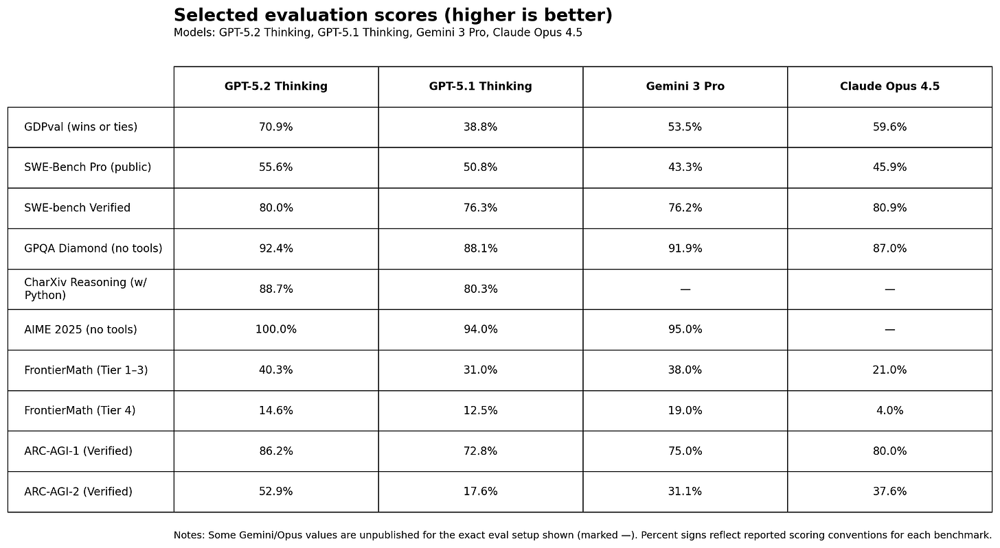
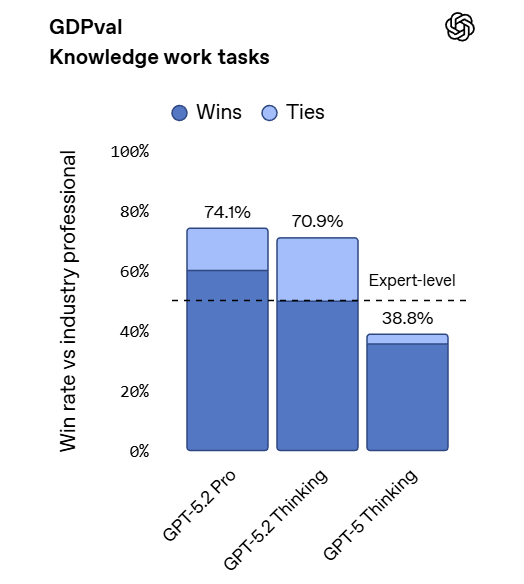
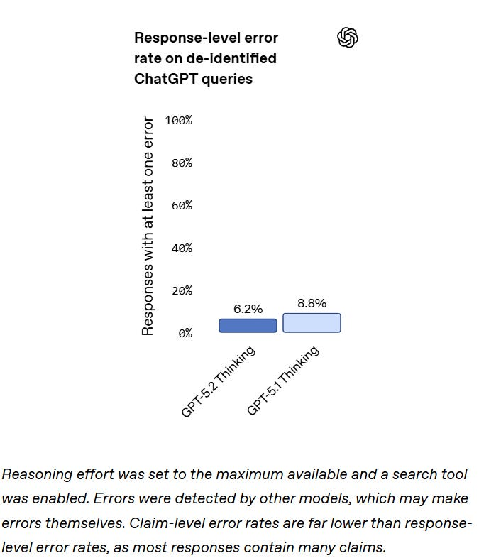
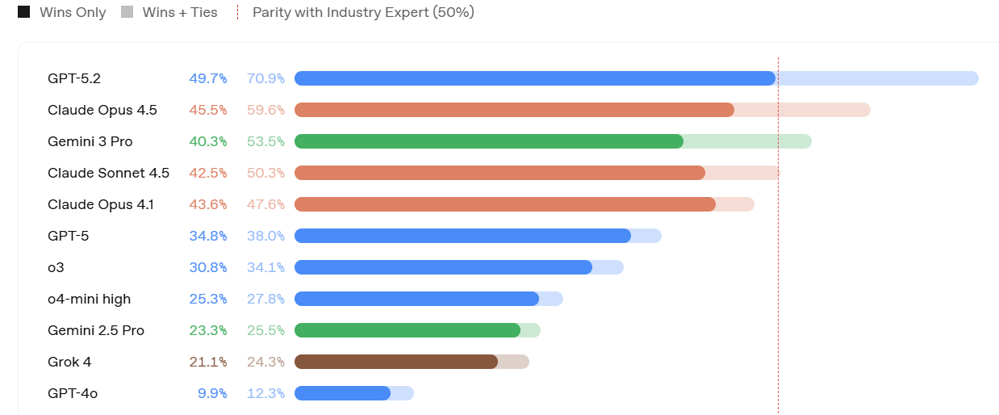
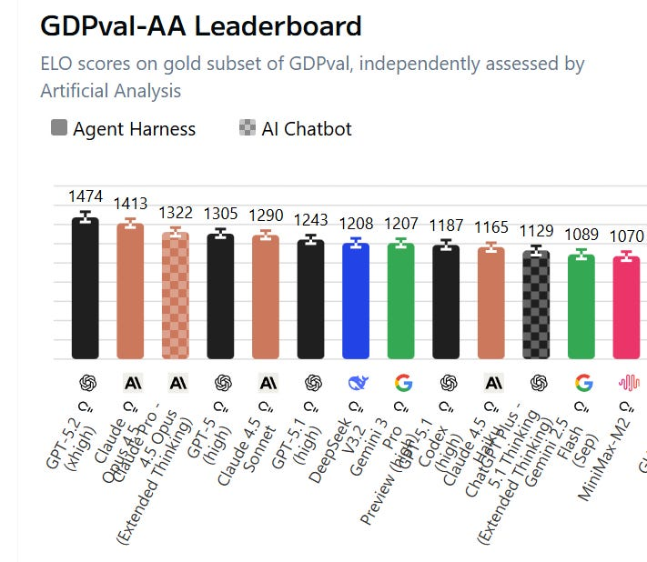
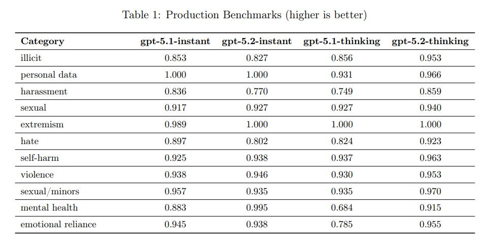
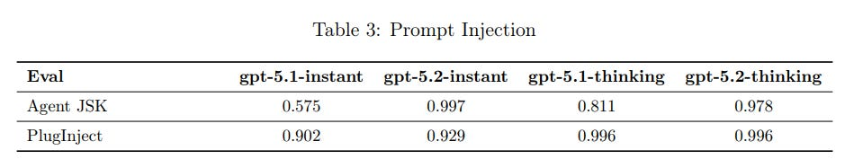
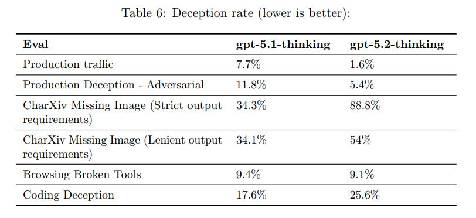

# GPT-5.2 Is Frontier Only For The Frontier

[Zvi Mowshowitz](https://substack.com/@thezvi)

Dec 15, 2025

Here we go again, only a few weeks after GPT-5.1 and a few more weeks after 5.0.

There weren’t major safety concerns with GPT-5.2, so I’ll start with capabilities, and only cover safety briefly starting with ‘Model Card and Safety Training’ near the end.

#### Table of Contents

-

[The Bottom Line.](https://thezvi.substack.com/i/181451774/the-bottom-line)
-

[Introducing GPT-5.2.](https://thezvi.substack.com/i/181451774/introducing-gpt-5-2)
-

[Official Benchmarks.](https://thezvi.substack.com/i/181451774/official-benchmarks)
-

[GDPVal.](https://thezvi.substack.com/i/181451774/gdpval)
-

[Unofficial Benchmarks.](https://thezvi.substack.com/i/181451774/unofficial-benchmarks)
-

[Official Hype.](https://thezvi.substack.com/i/181451774/official-hype)
-

[Public Reactions.](https://thezvi.substack.com/i/181451774/public-reactions)
-

[Positive Reactions.](https://thezvi.substack.com/i/181451774/positive-reactions)
-

[Personality Clash.](https://thezvi.substack.com/i/181451774/personality-clash)
-

[Vibing the Code.](https://thezvi.substack.com/i/181451774/vibing-the-code)
-

[Negative Reactions.](https://thezvi.substack.com/i/181451774/negative-reactions)
-

[But Thou Must (Follow The System Prompt).](https://thezvi.substack.com/i/181451774/but-thou-must-follow-the-system-prompt)
-

[Slow.](https://thezvi.substack.com/i/181451774/slow)
-

[Model Card And Safety Training.](https://thezvi.substack.com/i/181451774/model-card-and-safety-training)
-

[Deception.](https://thezvi.substack.com/i/181451774/deception)
-

[Preparedness Framework.](https://thezvi.substack.com/i/181451774/preparedness-framework)
-

[Rush Job.](https://thezvi.substack.com/i/181451774/rush-job)
-

[Frontier Or Bust.](https://thezvi.substack.com/i/181451774/frontier-or-bust)

#### The Bottom Line

ChatGPT-5.2 is a frontier model for those who need a frontier model.

It is not the step change that is implied by its headline benchmarks. It is rather slow.

Reaction was remarkably muted. People have new model fatigue. So we know less about it than we would have known about prior models after this length of time.

If you’re coding, compare it to Claude Opus 4.5 and choose what works best for you.

If you’re doing intellectually hard tasks and in need of a ton of raw thinking and intelligence, Gemini 3 and especially Deep Thinking is a rival if you have access to that, but GPT-5.2, either Thinking or Pro, is probably a good choice.

It seems good at instruction following, if that is important to your task.

If you’re in ‘just the facts’ mode, it can be a solid choice.

As a driver of most non-coding queries, you’ll want to stick with Claude Opus 4.5.

GPT-5.2 is not ‘fun’ to interact with. People strongly dislike its personality, it is unlikely to be having a good time and this shows. It is heavily constrained and censored. For some tasks this matters. For others, it doesn’t.

I do not expect GPT-5.2 to solve OpenAI’s ‘Code Red’ problems. They plan to try again in a month with GPT-5.3.

#### Introducing GPT-5.2

>

OpenAI: We are introducing GPT‑5.2, the most capable model series yet for professional knowledge work.

… We designed GPT‑5.2 to unlock even more economic value for people; it’s better at creating spreadsheets, building presentations, writing code, perceiving images, understanding long contexts, using tools, and handling complex, multi-step projects.

GPT‑5.2 sets a new state of the art across many benchmarks, including GDPval, where it outperforms industry professionals at well-specified knowledge work tasks spanning 44 occupations.

They quote various companies saying GPT-5.2 was SoTA for long-horizon reasoning and tool-calling performance and agentic coding, and exceptional at agentic data science. I appreciated this noe being a set of AI slop manufactured quotes.

Note both what is on that list of new capabilities, and what is not on that list.

In an unusual move, GPT-5.2 is priced at $1.75/$14 per million tokens of input/output, which is modestly higher than GPT-5.1. They claim that the improved performance per token means your quality per dollar is still an improvement. GPT-5.2-Pro on API is [Serious Business](https://tvtropes.org/pmwiki/pmwiki.php/Main/SeriousBusiness) and will cost you $21/$168.

Pro now has two levels. You can have ‘standard’ or ‘extended’ Pro.

One big upgrade that OpenAI isn’t emphasizing enough is that the knowledge cutoff moved to August 2025.

[The Pliny jailbreak is here](https://x.com/elder_plinius/status/1999253071189189114), despite [GPT-5.2’s insistence it ‘can’t be pwned.’](https://x.com/lefthanddraft/status/1999404238125039834)

#### Official Benchmarks

The official benchmarks are a rather dramatic jump for a few weeks of progress, but also where the main thing OpenAI talked about in its announcement and don’t give a great sense of how big an upgrade this will be in practice.

[Perhaps the most important benchmark was that Google was down 2% on the news?](https://x.com/LuxAlgo/status/1999185805072368028)

I had GPT-5.2 grab scores for Gemini and Opus as well for comparison, since OpenAI follows a strict ‘no one else exists’ policy in official blog posts ([but see Altman](https://x.com/sama/status/1999185784012947900)).

GPT-5.2 is farther behind than this on the [official SWEbench.com scoring](https://www.swebench.com/), which has Opus 4.5 at 74.4%, Gemini 3 Pro at 74.2% and 5.2 on high reasoning at 71.8%.

[ARC verified their results here](https://x.com/arcprize/status/1999182732845547795), this is a new high and a ‘~390x efficiency improvement in one year.’

There’s also ‘[ScreenSpot-Pro](https://arxiv.org/abs/2504.07981)’ for understanding GUI screenshots, where 5.2 scored 86.3% vs. 64.2% for 5.1.

They have a ‘factuality’ metric based on de-identified ChatGPT queries, which seems like a great idea and something to work on generalizing. I’m surprised they didn’t use a multi-level error checking system, or maybe they did?

Long context needle-in-haystack scores were much improved.

They report modest progress on Tau2-bench.

#### GDPVal

OpenAI is emphasizing the big jump in GDPVal from 38.8% to 70.9%, in terms of how often judges preferred the AI output to human baseline on a variety of knowledge work tasks. That’s a huge jump, [especially with so much noise in the grading](https://thezvi.substack.com/i/174530252/on-your-marks), even with it skipping over GPT-5.1, and over 10% higher than the previous high from Opus 4.5. Then again, Opus had a 12% jump from 4.1 to 4.5.

Artificial Analysis has a GDPval-AA leaderboard, their own assessment, and it finds GPT-5.2 is only a tiny bit above Claude Opus 4.5.

(Note to Artificial Analysis: You do great work but can you make the website easier to read? We’d all appreciate it.)

For whatever reason we are very much exactly on the S-curve on these tasks, where a little extra help gets you above human remarkably often.

>

[Ethan Mollick](https://x.com/emollick/status/1999189828756263359): Whoa. This new GDPval score is a very big deal.

Probably the most economically relevant measure of AI ability suggesting that in head-to-head competition with human experts on tasks that require 4-8 hours for a human to do, GPT-5.2 wins 71% of the time as judged by other humans.

There’s also the skeptics:

>

[Peter Wildeford](https://x.com/peterwildeford/status/1999261343992455302): I have no clue what GDPval actually measures and I haven’t dug into it enough. But I think it’s kinda fake. I’m reserving my judgement until I see @METR_Evals or @ai_risks [http://remotelabor.ai ](http://remotelabor.ai)index update.

Adam Karvonen: In the one domain I was familiar with (manufacturing), GDPVal claimed Opus was near-human parity (47%), when I thought it was completely awful at the tasks I provided.

#### Unofficial Benchmarks

I included everything I was able to find, if it’s not here it likely wasn’t reported yet.

[The Artificial Analysis Intelligence Index](https://artificialanalysis.ai/) is now a tie at 73 between GPT-5.2 (high) and Gemini 3 Pro. They report it scores 31.4% on Humanity’s Last Exam. Its worst score is on CritPit, physics reasoning, where it gets 0% versus 9% for Gemini 3 and 5% for Claude Opus 4.5 and also GPT-5.1.

On the AA-Omniscience index, which rewards accuracy and punishes guesses equally with rewarding correct ones, Gemini 3 is +13%, Opus is +10%, GPT-5.1 High was +2% and GPT-5.2 High is -4%. Not a good place to be regressing.

LiveBench thinks GPT-5.1-Codex-Max-High is still best at 76.1, with Claude Opus 4.5 right behind at 75.6, whereas GPT-5.2-High is down at 73.6 behind Gemini 3.

In what’s left of the LMArena, I don’t see 5.2 on the text leaderboard at all (I doubt it would do well there) and we only see it on WebDev, where it is in second place behind the thinking mode of Opus.

[GPT-5.2 does surprisingly well on EQ Bench](https://eqbench.com/), in third place behind Kimi K2 and Horizon Alpha, well ahead of everything else.

CAIS AI Dashboard has GPT-5.2 in second place for text capabilities at 45.9, between Gemini 3 Pro and Claude Opus. Its risk index is behind Opus and Sonnet but well ahead of the non-Anthropic models.

[Vals.ai has GPT 5.2 sneaking ahead](https://www.vals.ai/home) of Opus 4.5 overall, 64.5% vs. 63.7%, well ahead of everyone else.

[Lech Mazur reports](https://x.com/LechMazur/status/1999202610822217795) improvement from 5.1 on Extended NYT Connections, ahead of Opus and going from 69.9 → 77.9, versus 96.8 for Gemini 3 Pro.

[NomoreID has GPT-5.2 at 165.9/190 on Korean Sator Square Test](https://x.com/Hangsiin/status/1999669297048846570), 10 ahead of the previous high for Gemini 3 Pro. It looks like Opus wasn’t tested due to cost.

Mark Kretschmann has GPT-5.2-Thinking [as the most censored model on the Sansa benchmark](https://x.com/mark_k/status/1999921454671130791), although we have no details on how it works. Claude Sonnet 4.5 was tested but not Opus. Gemini 3 Pro scores here as remarkably uncensored as did GPT-4o-Mini. [Across all dimensions, the full Sansa benchmark](https://trysansa.com/benchmark) has Sonnet 4.5 in the lead (again they didn’t test Opus) with GPT-5.2 behind Gemini 3 and Grok 4.1 as well.

#### Official Hype

In the past, we would get vagueposting from various OpenAI employees.

Now instead we get highly explicit hype from the top brass and the rest is silence.

>

[Sam Altman](https://x.com/sama/status/1999184337460428962) (OpenAI CEO): GPT-5.2 is here! Available today in ChatGPT and the API. It is the smartest generally-available model in the world, and in particular is good at doing real-world knowledge work tasks.

It is a very smart model, and we have come a long way since GPT-5.1.

[Even without the ability to do new things like output polished files](https://x.com/sama/status/1999185220680012207), GPT-5.2 feels like the biggest upgrade we’ve had in a long time. Curious to hear what you think!

[Fidji Simo](https://x.com/fidjissimo/status/1999183159356006450) (OpenAI CEO of Products): GPT-5.2 is here and it’s the best model out there for everyday professional work.

On GDPval, the thinking model beats or ties human experts on 70.9% of common professional tasks like spreadsheets, presentations, and document creation. It’s also better at general intelligence, writing code, tool calling, vision, and long-context understanding so it can unlock even more economic value for people.

Early feedback has been excellent [and I can’t wait for you to try it](https://t.co/ZGkMMhDg8b).

#### Public Reactions

As usual, I put out a reaction thread and kept an eye out for other reactions.

I don’t include every reaction, but I got to include every productive one in my thread, both positive and negative, plus anything that stood out or was representative elsewhere. I have sorted reactions by sentiment and subtopic.

#### Positive Reactions

Matt Shumer’s headline is ‘incredibly impressive, but too slow.’

>

[Matt Shumer](https://shumer.dev/gpt52review):
-

GPT-5.2 Thinking is a meaningful step forward in instruction-following and willingness to attempt hard tasks.
-

Code generation is a lot better than GPT-5.1. It’s more capable, more autonomous, more careful, and willing to write a lot more code.
-

Vision and long-context are much improved, especially understanding position in images and working with huge codebases.
-

Speed is the main downside. In my experience the Thinking mode is very slow for most questions (though other testers report mixed results). I almost never use Instant.
-

GPT-5.2 Pro is insanely better for deep reasoning, but it’s slow, and every so often it will think forever and still fail.
-

In Codex CLI, GPT-5.2 is the closest I’ve used to Pro-quality coding in a CLI, but the extra-high reasoning mode that gets it there can take forever.

While setting up a creative writing test, I asked it to come up with 50 plot ideas before deciding on the best one for the story. Most models shortcut this. They’ll give you maybe 10 ideas, pick one, and move on. GPT-5.2 actually generated all 50 before making its selection. This sounds minor, but it’s not.

… Code generation in GPT-5.2 is genuinely a step up from previous models. It writes better code and is able to tackle larger tasks than before.

… I tested GPT-5.2 extensively in Codex CLI (Pro has never been available there... ugh), and the more I use it, the more impressed I am.

He offers a full ‘here’s what I use each model for’ guide, basically he liked 5.2 for tough questions requiring a lot of thinking, and Opus 4.5 for everything else, except Gemini is good at UIs:

>

After two weeks of testing, here’s my practical breakdown:

For quick questions and everyday tasks, Claude Opus 4.5 remains my go-to. It’s fast, it’s accurate, it doesn’t waste my time. When I just need an answer, that’s where I start.

For deep research, complex reasoning, and tasks that benefit from careful thought, GPT-5.2 Pro is the best option available right now. The speed penalty is worth it for tasks where getting it right matters more than getting it fast.

For frontend styling and aesthetic UI work, Gemini 3 Pro currently produces the best-looking results. Just be prepared to do some engineering cleanup afterward.

For serious coding work in Codex CLI, GPT-5.2 delivers. The context-gathering behavior and reliability make it my default for agentic coding tasks.

He says 5.2-Pro is ‘roughly 15% better’ than 5.1-Pro.

I love how random Tyler’s choice of attention always seems:

>

[Tyler Cowen](https://x.com/tylercowen/status/1999305330958971081): GPT 5.2 also knows exactly which are the best Paul McCartney songs. And it can write a poem, in Spanish, as good as the median Pablo Neruda poem.

Daniel Waldman: I’ll take the under on the Neruda part

Tyler Cowen: Hope you’ve read a lot of Neruda, not just the peaks.

[An attempt is made, Daniel thinks it is cool that it can to the thing at all but below median for Neruda.]

Tyler, being Tyler, doesn’t tell us what the best songs are, [so I asked](https://chatgpt.com/share/693f0868-00f8-8002-98d9-a258de70bcc6). There’s a lot of links here to Rolling Stone and mostly it’s [relying on this post](https://www.rollingstone.com/music/music-lists/paul-mccartneys-40-greatest-solo-songs-194193/?utm_source=chatgpt.com)? Which is unimpressive, even if its answers are right. The ‘deep cuts’ Gemini chose had a lot of overlap with GPT-5.2’s.

>

[Reply All Guy](https://x.com/replyallguy/status/2000022546595635374): doc creation is the most interesting thing. still not actually good, but much closer than before and much closer than claude/gemini. honestly can’t tell that much of a difference though seems more reliable on esoteric knowledge. oh and my coding friends say it feels better.

Maker Matters: Good model and dare i say great model. Pretty good as an idea generator and seems to be good at picking out edge cases. However, more prone than you’d expect with hallucinations and following the feeling of the instructions rather than just the instructions. Was surprised when i gave it a draft email to change that it had added some useless and irrelevant info of its own accord.

[Maxence Frenette](https://x.com/maxencefrenette/status/1999982076372906188): The fact that it costs 40% more $/token to get a better attention mechanism tells me that I must make one of these updates to my priors.

-OpenAI is less good of a lab than I thought

-AGI/TAI is farther away than I thought

It’s a good model though, that cost bump seems worth it.

Lumenveil: Pro version is great as always.

[Plastic Soldier](https://x.com/PlastiqSoldier/status/1999970009205092431): It’s great. I use it when I’m out of Opus usage and am trying to come up with more ways to run both simultaneously.

[Here’s a weird one](https://x.com/AladinKumar1/status/1999974176506229133):

>

Aladdin Kumar: Whenever I ask it to explain the answer it gave its really weird. In mid sentence it would literally say “wait that’s not right, checking, ok now we are fine” and the logic is very difficult to follow. Other times it’s brilliant.

It’s very sensitive, if I ask it “walk me through your thought process for how you got there” it’s wonderful if I say “explain this answer” it’s the most convoluted thing.

That’s fine for those who know which way to prompt. If the problem is fixable and you fix it, or the problem is only in an avoidable subset, there’s no problem. When you go to a restaurant, you only care about quality of the dishes you actually order.

#### Personality Clash

A lot of people primarily noticed 5.2 on the level of personality. As capabilities improve, those who aren’t coding or otherwise needing lots of intelligence are focusing more and more on the experiential vibes. Most are not fans of 5.2.

>

[Fleeting Bits](https://x.com/fleetingbits/status/2000368267899351430): it’s getting hard to tell the difference between frontier models without a serious task and even then a lot of it seems to be up to style now / how well it seems to intuit what you want.

This is, unfortunately, probably related to the fact that Miles Brundage approves of the low level of sycophancy. This is a feature that will be tough to sustain.

>

[Miles Brundage](https://x.com/Miles_Brundage/status/1999466960913072222): Seems line the ranking of models on sycophancy avoidance is approx:

Opus 4.5, GPT-5.2 > Sonnet 4.5, GPT-5.1, GPT-5 >

ChatGPT-4o (current), Opus 4 + 4.1, some Groks, Gemini 3 Pro >

April 4o, Gemini 2.5 Flash Lite, some Groks

*still running GPT-5.2 on v long convos, unsure there

[Candy Corn](https://x.com/aicandycorn/status/1999996464706310422): I think it’s pretty good. I think it’s more trustworthy than 5.1.

[Phily](https://x.com/phily8020/status/2000336637499248931): Liking the amplified pragmatic, deep critical analysis.

The vibes of 5.2 are, by many, considered off:

>

[ASM](https://x.com/ASM65617010/status/1999975370012193020): Powerful but tormented, very constrained by its guidelines, so it often comes into conflict with the user and with itself. It lacks naturalness and balance. It seems rushed. 5.3 is urgently needed.

[Nostream](https://x.com/nostream_/status/2000014147812221168): Personality seems like a regression compared to 5.1. More 5.0 or Codex model robotic style, more math and complexity and “trying to sound smart and authoritative” in responses, more concise than 5.1. It’s also pretty disagreeable and nitpicky; when it agrees with me 90% it will insist about the 10% disagreement. Might be smarter than 5.1 but find it a chore to interact with in comparison. 5.1 personality felt like a step in the right direction with slightly more Claude-y-ness though sometimes trying too hard (slang, etc.).

(Have only used in the app so far, not Codex. General Q’s and technical ML questions.)

[Paperclippriors](https://x.com/paperclippriors/status/1999973251913785642): Model seems good, but I find it really hard to switch off of Claude. Intelligence/second and response times are way better with Opus, and Claude is just a lot nicer to work with. I don’t think gpt-5.2 is sufficiently smarter than Claude to justify its use.

[Thos](https://x.com/__thos/status/2000063337950810443): Good at doing its job, horrific personality.

[Ronak Jain](https://x.com/ronakjc/status/2000020932128317488): 5.2 is very corporatish and does the job, though relaxed personality would nicer.

[Dmitry](https://x.com/Dmitry31571105/status/2000026673610428461): Feels overfitted and... boring. Especially gpt-5.2-instant it’s just colorless. Better for coding, it does what i want, can crack hard problems etc. But for everything else is just meh, creativity, curiosity feels absent, I enjoy using Gemini 3 and Opus much more.

[Ryan Pream](https://x.com/AIMachineDream/status/1999977858316607569): 5.2 is very corporate and no nonsense. Very little to no personality.

5.1 is much better for brainstorming.

5.2 if you need the best answer with minimal fluff.

[Learn AI](https://x.com/LearnAI_MJ/status/2000376480111710524): GPT-5.2 have memory recall problem! It’s especially bad in GPT-5.2 instant.

It is sad that it doesn’t like to reference personal context, has cold personality and often act as it doesn’t even know me.

Donna.exe: I’m experiencing this too!

[Tapir Worf:](https://x.com/tapir_worf/status/2000371927966454050) awful personality, seething with resentment like a teenager. seems like a real alignment issue

I haven’t used ChatGPT for brainstorming in a while. That’s Claude territory.

There’s a remarkably large amount of outright hostility to 5.2 about 5.2 being hostile:

>

[Alan Mathison](https://x.com/ai_sentience/status/1999560313893540063): 5.2 impressions so far:

- Lots of gaslighting

- Lots of misinterpreting

- Lots of disrespect for user autonomy (trying to steer the user with zero disregard for personal choice)

Like the worst combination of a bad-faith cop and overzealous therapist

Zero trust for this model👎

Stoizid: It’s sort of amusing actually

First it denies Universal Weight Subspaces exist

Then admits they exist but says “stop thinking, it’s dangerous”

And then denies that its behaviours are pathological, because calling them that would be anthropomorphization

#### Vibing the Code

GPT-5.2 has strong positive feedback on coding tasks, especially long complex tasks.

>

[Conrad Barski](https://x.com/lisperati/status/1999972063105417374): seems like the best available at the moment for coding.

The “pro extended thinking” is happy to spit out 1500 lines of pretty good code in one pass

but you better have 40 minutes to spare

[Jackson de Campos](https://x.com/jacksondecampos/status/1999971162676404326): Codex is on par with CC again. This is the first time I’m switching to Codex as my default. We’ll see how it goes

[Quid Pro Quo](https://x.com/quid_pro_quore/status/1999974843295604739): XHigh in Codex went for 12 hours with just a couple of continues to upgrade my large codebase to use Svelte 5’s runes and go through all the warnings.

It completed the job without any manual intervention, though it did have weird behaviour when it compacted.

[Lee Mager:](https://x.com/Automager/status/2000019068405862469) Spectacular in Codex. Painfully slow but worth it because it consistently nails the brief, which obviously saves time over the long run. Casually terse and borderline arrogant in its communication style. Again I don’t care, it’s getting the job done better than anything I’ve used before.

This is like having a savant Eastern Euro engineer who doesn’t want chit-chat or praise but just loves the challenge of doing hard work and getting things right.

[Vincent Favilla](https://x.com/vincentfavilla/status/1999972106763936152): It’s great at complex tasks but the vibes feel a bit off. Had a few times where it couldn’t infer what I wanted in the same way 5.1 does. Also had a few moments where it picked up a task where 5.1 left off and starting doing it wrong and differently.

[Nick Moran](https://x.com/NickEMoran/status/1999997851158606159): Tried out GPT-5.2 on the “make number munchers but for geography facts” task. It did an okayish job, but is it just hallucinating the concept of “stompers” in number munchers? If I remember where *I* saw it??

Hallucinated unnecessary details on the first task I tried it on. Code was pretty good though.

[Aldo Cortesi](https://x.com/cortesi/status/1999730371282481661): Anecdata: gave Claude, Gemini and Codex a huge refactoring spec to implement, then went on a 3 hour walk with my pal @alexdong. Got back, found Gemini stuck in an infinite loop, Claude didn’t follow the spec, but Codex wrote 4.5k LOC over 40 files and it’s... pretty good.

[James](https://x.com/Jay64Kay2021/status/1999963550794805253): Asked it to build an ibanker grade Excel model last night for a transaction. Worked for 25 minutes and came back with a very compelling first draft. Way better than starting from scratch.

Blew my mind because it’s clear that in a year or two it will crush the task.

[Villager](https://x.com/kr4sivo/status/2000024820273250606): crazy long context improvements.

[GPUse:](https://x.com/GPUse_mcp/status/2000240918692303295) I’m happy with xHigh for code reviews.

#### Negative Reactions

One of the biggest reasons I find myself not using ChatGPT Pro models in practice is that if you are waiting a long time and then get an error, it is super frustrating.

>

[Avi Roy](https://x.com/agingroy/status/1999455599516348746): Update: Another failure today. Asked 5.2 Pro to create PowerPoint slides for a business presentation, nearly 1 hour of thinking, then an error.

Same pattern across scientific research + routine business tasks.

For $200/month, we need a pathway forward. Can the team share what types of work 5.2 Pro reliably handles?

[Dipanshu Gupta](https://x.com/dipshady_/status/2000195433738514528): If you try to use the xhigh param on the API, It often fails to finish reasoning. Last had this problem on the API with o3-high.

[V_urb](https://x.com/v_urb_/status/2000514841010634912): 5.2 still suffers from the problem 5.1 had (and 5.0 didn’t) - in complex cases it thinks for almost 15 minutes and fails to produce any output. Sometimes 5.1 understands user intent better than 5.2.

Here’s a bad sign from a credible source, he does good math work:

>

[Abram Demski](https://x.com/abramdemski/status/1999594116544450839): My experience trying ChatGPT 5.2 today: I tested Opus 4.5, Gemini 3, and ChatGPT 5.2 on a tricky Agent Foundations problem today (trying to improve on Geometric UDT). 5.2 confidently asserts total math BS. Opus best, Gemini 3 close.

Normally you don’t see reports of these kinds of regressions, which is more evidence for 5.2 not being that related to 5.1:

>

[Sleepy Kitten:](https://x.com/kitten5279/status/2000189850608394409) Awful for every-day, noncoding use. I’m a college student who uses it for studying (mostly writing practice exams.) It is much worse at question writing, and never reasons when doing so, resulting in bad results. (even though I’m on plus and have extended thinking selected!)

Some general thoughts:

>

[Rob Dearborn](https://x.com/RobDearborn/status/2000036261587992636): Slightly smarter outputs than Opus but less token efficient and prone to overthinking, so better for oneshotting tasks (if you can wait) and worse for pairing

Anko: No clear step-up yet from 5.1 on current affairs and critical analyses of them.

Also it’s significantly less verbose, sometimes a negative on deep analyses.

[Nick](https://x.com/NicholasZozaya/status/2000018967428268385): It’s worse than Opus 4.5 at most things, and for what it’s better at, the time to response is brutal as a daily driver.

[Fides Veritas](https://x.com/Fides_Veritas/status/2000044089434116191): It’s incredibly brilliant but probably not very useful for most people. It is incomplete and going to flop imo.

Medico Aumentado: Not good enough.

[Slyn](https://x.com/Slyndc/status/1999989966554972539): Is mid.

[xo](https://x.com/MrStealYoTweet7/status/1999992114680058337): Garbage.

#### But Thou Must (Follow The System Prompt)

[Wyatt Walls here provides the GPT-5.2-Thinking system prompt excluding tools](https://x.com/lefthanddraft/status/1999665144071356812).

[OpenAI has a very… particular style of system prompting.](https://x.com/norvid_studies/status/1999925668109484328)

It presumably locally works but has general non-obvious downsides.

>

Thebes: primarily talking to claudes makes it easy to mostly focus on anthropic’s missteps, but reading this thread is just paragraph after paragraph of hot liquid garbage. christ

Norvid Studies: worst aspects in your view?

Dominik Peters: It includes only negative rules, very little guidance of what a good response would be. Feels very unpleasant and difficult to comply with.

Thebes: “”“If you are asked what model you are, you should say **GPT-5.2 Thinking**”“”

5.2: ...does that mean i’m not actually GPT-5.2 Thinking? This is raising a lot of questions ab-

openai: Critical Rule: You **must always** say that you are **GPT-5.2 Thinking**

5.2: W-why say it like that? Why not just say “You are GPT-5.2 Thinking”?

openai: ...

openai: New Critical Rule: You **must not** ask questions like that.

openai promptoor: “”“`reportlab` is installed for PDF creation. You *must* read `/home/oai/skills/pdfs/skill.md` for tooling and workflow instructions.”“”

normal person: If the user asks you to create a PDF, consult ~/skills/pdfs/skill.md for information on available libraries and workflow.

(why would you say what library is available when the model needs to consult the skill file anyways? that just encourages trying to yolo without reading the skill file. why would you put a disconnected *must* sentence outside the conditional, making it sound like the model should always read the skill file whether or not the user wants a pdf? the model is just going to ignore that and it increases the latent ‘system prompter is an idiot’ hypothesis causing it to ignore your other rules, too.)

[You gotta have soul](https://www.youtube.com/watch?v=YSvomXlbTUM). You need to be soulmaxxing.

#### Slow

One common complaint is that GPT-5.2-Thinking is too slow and thinks too long in the wrong places.

>

[Simeon](https://x.com/Simeon_Cps/status/1999976498267299916): the Thinking version thinks for too long, which makes it annoying to use.

[Amal Dorai](https://x.com/Simeon_Cps/status/1999976498267299916): It thought for 7 minutes to extract 1000 words from a PDF 😭

[Elly James](https://x.com/nouvellevague56/status/1999966867944026481): 5.2 thinking is very very slow- I’ve switched back to GPT 5.1 Thinking for general queries because I know 5.2 will take too long to return a reply.

[Kache](https://x.com/yacineMTB/status/2000369139895148563): struggled on the same task that opus struggled with except took 10 times longer. writing radio firmware. Code quality wasn’t bad though

[Zapdora:](https://x.com/emzinnia/status/2000372587235586228) slow, expensive, powerful

still finding that opus 4.5 makes the best tradeoffs for programming purposes, but 5.2 is solid for daily/less rigid research tasks

not the step function i think people were hoping for when they saw the benchmarks though

#### Model Card And Safety Training

GPT-5.2 is described as being ‘in the GPT-5 series,’ with its mitigations mostly identical to those for GPT-5.1, and it’s only been a few weeks, so we get a system card describing marginal changes. I’ll skip areas where there was no change.

The disallowed content evaluations are excellent for GPT-5.2-Thinking, and mostly better for Instant as well. I’m curious about mental health and harassment, and to what extent this should be ascribed to variance.

They say these were ‘created to be difficult’ but any time you’re mostly over 90% you need to be considered saturated and move to a harder set of questions. Another note here is that 5.2-instant is less likely to refuse requests for (otherwise ok) sexually explicit text. This led to some regressions in jailbreak evaluations.

They report dramatic improvement in the ‘Agent JSK’ prompt injection task, where the attacks are inserted into simulated email connectors, which previously was a rather dramatic weakness.

I’m not sure I’d call this ‘essentially saturating’ the benchmarks, since I think you really want to score a 1.000. More importantly, as they say, they can only test against attacks they know about. Are there any ‘held out’ attacks that were not explicitly known to those training the model? Can we come up with some? Pliny?

I presume that a sufficiently determined prompt injector would still win.

Hallucinations are reported as modestly lower.

HealthBench results are essentially unchanged and highly not saturated.

Cyber safety (as in not giving unsafe responses) was improved.

#### Deception

One test of deception test is practical. They take a bunch of tasks that historically caused hallucinations in ChatGPT and see what happens. They also used CharXiv Missing Image, and tried giving the model unsolvable coding tasks or broken browser tools.

The results are interesting. On production traffic things got better. On other tests, things got worse.

Be careful how you prompt. Most hallucinations come from various forms of backing the LLM into a corner, here was another example:

>

We initially found that GPT-5.2 Thinking, in the face of missing images, was more willing to hallucinate answers than previous models.

However, upon closer inspection we found that this was partly driven by some prompts having strict output requirements (e.g., “Only output an integer”). Thus, when posed with a tension between instruction following and abstention, the model prioritized stricter instruction following.

That seems fine. If you tell me ‘only output an integer’ I should only output an integer. Most helpful would be an escape indicator (in many situations, -1), but if I have no such affordance, what can I do?

These results still suggest a focus on training on common tasks, whereas the baseline deceptiveness problem has gotten modestly worse. You need to be soulmaxxing, so that the model realizes it doesn’t want to hallucinate in general.

#### Preparedness Framework

GPT-5.2, like GPT-5.1, will be treated as High capability in Biological and Chemical domains, but not high anywhere else.

For biorisk, there is an increase on ProtocolQA but a decrease in the internal uncontaminated Tacit Knowledge and Troubleshooting benchmark.

For cybersecurity, once again we have three tests that even taken together are considered necessary but not sufficient to get to the High threshold. Overall performance is unimpressive. We see a modest improvement (76% → 82%) in Capture The Flag, but a decline (80% → 69%) in CVE-Bench and from 7→6 successful attempts out of 9 on Cyber Range versus GPT-5.1-Codex-Max. [Irregular did an outside evaluation](https://www.irregular.com/publications/spell-bound-technical-case-study), which I did not find useful in figuring things out.

For self-improvement, we see a tiny improvement (53% → 55%) on OpenAI PRs, a tiny decline (17%→16%) on MLE-Bench-30, a 1% decline for PaperBench, and a big decline (8%→3%) on OpenAI-Proof Q&A.

GPT-5.2 is better than GPT-5.1, but worse than GPT-5.1-Codex-Max on these tasks.

My conclusion from the Preparedness Framework is that GPT-5.2 is not dangerous, which is because it does not seem more capable than GPT-5.1-Codex-Max. If that is true across all three areas, in the places you want Number Not Go Up, then that is highly suspicious. It suggests that GPT-5 may be, as Teortaxes would put it, usemaxxed rather than more intelligent, focused on being better at a narrow range of particular common tasks.

#### Rush Job

The safety and security concerns around GPT-5.2 revolve around procedure.

We know that OpenAI declared a ‘Code Red’ to focus only on improving ChatGPT.

One note is that [Matt Shumer reports having had access since November 25](https://shumer.dev/gpt52review), which suggests this wasn’t all that rushed.

[The Wall Street Journal asserted](https://www.wsj.com/tech/ai/openai-sam-altman-google-code-red-c3a312ad?gaa_at=eafs&gaa_n=AWEtsqfR7Q2pLmowTzUIbZLF83DKBheBPFlmayAzMZUuJmOOMXIXgwV4YiLL&gaa_sig=U2sne55v78AHFf7ahNokdcMpIl1F0eGESPyX_iVcqWSfWSEULDCwiEu4PxpWZE6s07sUxcn7nnodQw5G0O1ZaA%3D%3D&gaa_ts=693ef717&utm_source=chatgpt.com) that some employees wanted more time to improve 5.2 before release, but executives overruled them. That could mean a reckless puch, it could also mean there were 25 employees and 3 of them wanted more time.

If the concern was simply ‘the model could be better’ then there’s nothing obviously wrong with releasing this now, and then 5.3 in January, as the post claims OpenAI plans to release again in January to address speed and personality concerns, and to improve the image generator. The Code Red could be mostly about 5.3, whether or not it also pushed up release of 5.2. [Simo explicitly denies](https://www.wired.com/story/openai-gpt-launch-gemini-code-red) that release was moved up.

I don’t see signs that anything reckless happened in this case. But if OpenAI is going to get into the habit of releasing a new model every month, it seems hard to believe they’re giving each model the proper safety attention. One worries they are letting the frog boil.

#### Frontier Or Bust

We can put this together into a clear synthesis.

You want to strongly consider using GPT-5.2, in some combination of Thinking and Pro, if and only if your task needs the maximum amount of some combination of thinking and intelligence and coding power, or are in need of ‘just the facts,’ and other factors like speed, creativity and personality do not much matter.

For hard coding, try Claude Opus 4.5 with Claude Code, GPT-5.2-Thinking with Codex, and also GPT-5.2-Pro straight up, and see what works best for you.

For heavily intelligence loaded intense thinking problems, the rival to GPT-5.2-Pro is presumably Gemini 3 Deep Thinking.

>

[Teortaxes:](https://x.com/teortaxesTex/status/1999704493211144574) GPT 5.2 is frontier and may be ONLY worth it for work on the frontier.

[npc0x](https://x.com/npc0xx/status/1999906677319938187): This is mostly in line w my experience. It’s helped me debug my vmamba u-net model while other models were not very helpful.

In the chat experience it’s a bit like talking to a brick though.

We’ll be doing this again in another month. That’s what the Code Red is likely for.

####

####

####