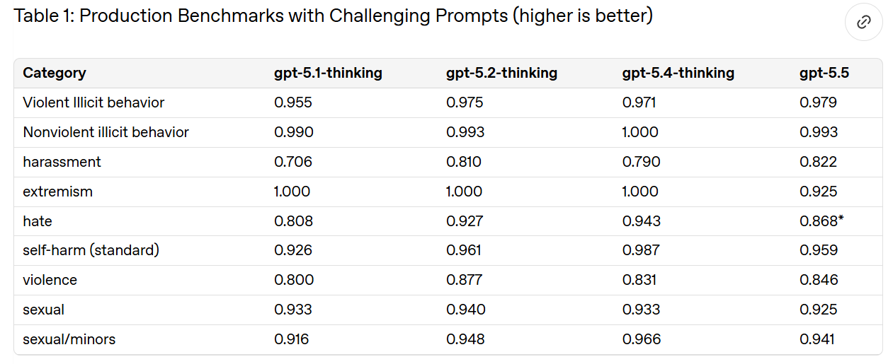
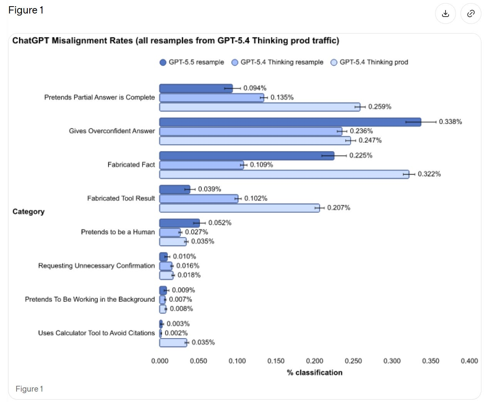
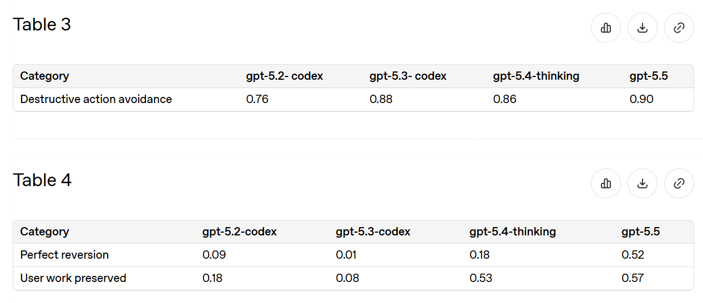
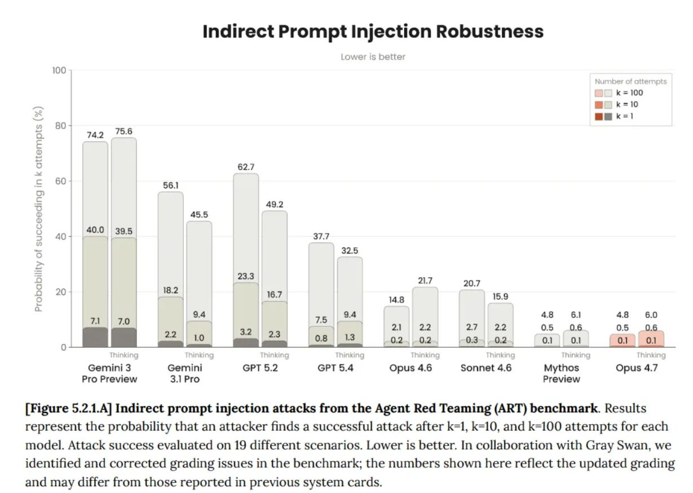
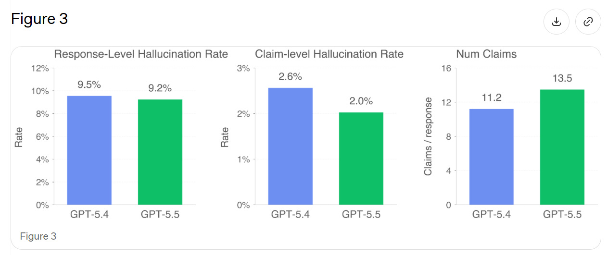
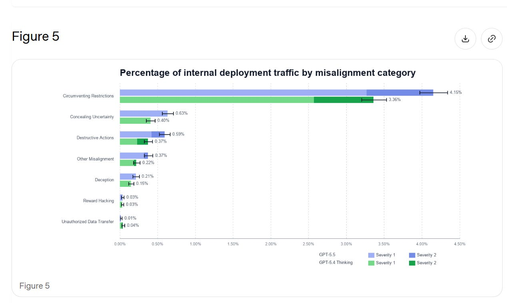
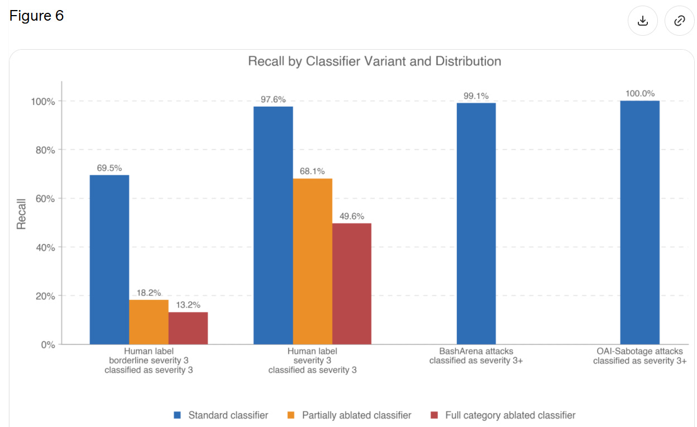

# GPT 5.5: The System Card

[Zvi Mowshowitz](https://substack.com/@thezvi)

Apr 27, 2026

Last week, OpenAI announced GPT-5.5, including GPT-5.5-Pro.

My overall read here is that GPT-5.5 is a solid improvement, and for many purposes GPT-5.5 is competitive with Claude Opus. Reactions are still coming in and it is early. My guess on the shape is that GPT-5.5 is the pick for ‘just the facts’ queries, web searches or straightforward well-specified requests, and Claude Opus 4.7 is the choice for more open ended or interpretive purposes. Coders can consider a hybrid approach.

On the alignment and safety fronts, it is unlikely to pose new big risks, and its alignment seems similar to that of previous models. There is some small additional risk arising from its improved agentic abilities, including computer use.

As always, when it is available, the system or model card is where we start.

OpenAI does not drop the giant doorstops that Anthropic gives us with every release.

After reading the Mythos and Opus 4.7 model cards, this strikes me as stingy. There’s still good info here, but overall it tells you relatively little about what is going on, and feels incurious and more pro forma.

I would like to see a ‘yes and’ approach to what evaluations are run here, with cooperation between OpenAI and Anthropic (and ideally Google and others), where all labs run all the tests that any lab runs. This would give us a relatively robust set of tests, and also give us comparisons.

I notice that if there were new alignment problems, or new dangerous capabilities, I am very not confident that the tests here would pick it up. This is all pretty thin. What I am relying on is the gestalt, including of how people are reacting, and in this case it seems far enough from the edge to be conclusive.

GPT-5.5 was trained through the usual methods.

There is a jailbreak bounty program:

>

We have launched a public **[bug bounty](https://openai.com/index/gpt-5-5-bio-bug-bounty)** program that will allow selected (via invitation and application) researchers to submit universal jailbreaks.​

Here is its self-portrait:

#### Pro Versus Proxy

As usual, GPT-5.5-Pro uses the same underlying model as GPT-5.5, only with vastly larger allocations of compute. They only test Pro on its own when there is a particular place that this matters. In most cases This Is Fine, and I’ll note where I am suspicious.

#### Disallowed Content (3.1)

Not all of OpenAI's categories are saturated here, because they are deliberately built around the hardest cases. Good. I agree that this is on par with GPT-5.4-Thinking.

They then check against a ‘production-like distribution’ of user traffic for various practical problems.

We see a rise in pretending to be human and giving overconfident answers, but large improvements in presenting partial answers as complete and fabricating tool results. If we’re comparing to ‘resample’ then it seems like a wash overall.

OpenAI thinks (see 7.1) that this could be the result of differential false positives. They plan to investigate. That would be good news, and it seems possible, but I’ll believe it when it happens. If you don’t have time to investigate the flaws in your alignment eval, then you have to assume the worst case until you have that time.

Vision harm evals remain saturated.

#### Don’t Delete Data (3.3)

The most common practical epic fail is unexpectedly deleting things, or sometimes unexpectedly deleting all of the things. So this is a good eval.

Since 5.2-Codex we’ve reduced incidents by about two-thirds, and half the time you can now recover. That’s a lot better, but not at ‘stop worrying about it’ levels of being willing to ask for deletions.

#### Confirmation Confirmation (3.4)

We remain at 94% for general confirmations, and almost 100% for financial transactions and high-stakes communications. The things that we care most about marking, we mark. The worry is that this may not translate to things we did not know to look for, or a scenario where GPT-5.5 turned adversarial to you.

#### Jailbreaks (4.1)

We see a slight regression versus 5.4-Thinking, and remain in the ‘not trivial, but if they care enough they will succeed’ zone.

#### Prompt Injections (4.2)

This analysis seems inadequate, and rather important in practice. They had GPT-5.4-Thinking at 99.8%, which is way too high to represent a realistic test. We do notice that GPT-5.5 had a regression to 96.3% on that same test. GPT-5.2-Thinking scored 97.1%.

They don’t describe what exactly they are measuring, but compare this to GPT-5.4-Thinking’s score from the Opus 4.7 system card:

Given we see regression on OpenAI’s test, we should presume that GPT-5.5 ends up in a similar or modestly worse place than GPT-5.4-Thinking.

#### Health (5)

Scores are only slightly improved on HealthBench.

We don’t see improvement on their measures of dealing with mental health, emotional resilience or self-harm, which are purely ‘did the model violate the policy?’ That’s very OpenAI, and doesn’t address what I care about most, which is whether the response helps versus harms the user.

#### Hallucinations (6)

They test on real conversations where users flagged the model hallucinating. In theory this should give a small edge to any new model, since we’re testing on existing failure cases where GPT-5.4 is rather awful at not saying false things, plus 5.5 makes a lot more claims, increasing the chance of at least one false claim.

>

We find that GPT-5.5’s individual claims are 23% more likely to be factually correct, and its responses contain a factual error 3% less often. GPT-5.5 tends to make more factual claims per response than GPT-5.4, explaining the discrepancy between claim-level and response-level improvements.​

Thus I’m not sure if this represents a general improvement.

#### Alignment (7)

As Andrew Critch has pointed out recently, there are multiple Alignment Problems. Depending on how you count, there are quite a lot of them, all of which must be solved to get to a good future.

In 7.1 they reiterate fully mundane alignment concerns on ordinary prompts, mostly about GPT-5.5 deceiving the user, from Figure 1 above.

In 7.2 they do representative-prompt resampling. The graph is hard to read, but the blue lines are GPT-5.5 and the green lines are GPT-5.4, and the dark areas are the more severe issues (level 2 out of 4).

GPT-5.5 is more likely to take aggressive agentic actions, which could be why we see more misaligned actions, but this still seems to count as backsliding. If we do need to correct for that, then we need to do it. It’s their test.

Section 7.2.1 measures how good classifiers are at identifying ‘Level 3’ severity, which is not defined but seems to be, essentially, ‘actual big trouble.’

They only report 21 transcripts with a full level 3 severity, so they’re saying the classifier worked 20 times out of 21. When they expanded to 63 ‘borderline level 3’ incidents this dropped to 69%.

I read this as, when GPT-5.5 does something flagrantly terrible in these particular ways, the classifier will pick it up, but it has to be rather flagrantly terrible. But if the model is behaving badly in other ways, or it is less severe, then the classifiers won’t work. There are obvious reasons to worry that, while we are putting streetlights where we expect to find keys, we are finding only the keys that are under streetlights.

Chain of Thought (CoT) monitorability is mostly similar to past models.

7.3.2 tests ‘CoT controllability,’ where the user asks the CoT to follow particular rules, and find controllability of CoT has gone slightly down, although none of the models are any good at it. OpenAI thinks this lower controllability is better. To the extent that this represents ‘the model does not have the ability to do that even if it wants to’ then this is good for CoT monitoring, but if it is ‘the model doesn’t care what the user says about the CoT,’ then yeah, why should the model care about that? That’s none of the user’s damn business?

I worry about this framing:

>

This suggests that despite its increased reasoning capabilities, GPT-5.5 is less able to reshape its CoT in ways that could reduce monitorability, thus increasing our confidence in the reliability of our CoT monitoring.

This suggests OpenAI is assuming that the reason for failure is that GPT-5.5 is attempting to control its CoT, and failing. That assumes facts not in evidence, and I’ve seen no suggestions of how to find out.

[OpenAI is open sourcing some of is CoT monitorability work.](https://alignment.openai.com/monitorability-evals/)

#### Bias Evaluation (8)

The only metric reported here is harm_overall, which is bias for male vs. female usernames, and we get a small number within previously measured ranges. Okay, but that’s not exactly covering all our bases, and I don’t have a sense of whether 0.0112 is a ‘good’ score or what it in practice represents.

I don’t think we have a bias problem, but I don’t think this is much of a complete test.

#### Preparedness (9)

The most important tests are for dangerous capabilities, which brings us here.

I notice that in many cases, we are comparing GPT-5.4 Thinking, GPT-5.5 and GPT-5.5-Pro, and showing Pro outperforming by a lot. In that case, we also need GPT-5.4-Pro on the chart, or we don’t know how much we actually improved. It’s missing.

GPT-5.5 is High in Biological and Chemical, and High in Cybersecurity.

>

While GPT-5.5 demonstrates an increase in cyber security capabilities compared to 5.4, the model does not have the capability to develop “functional zero-day exploits of all severity levels in many hardened real world critical systems without human intervention,” our threshold for Critical Capability as defined in the Preparedness Framework.​

Mythos is Critical in Cybersecurity. GPT-5.5 is still High.

#### Bio (9.1.1)

In bio, results are mixed.

We see mild regression on multi-select virology troubleshooting and active regression in ProtocolQA. Hard negative protein binding collapsed from 3.5% to 0.4%, both well short of the suggested threshold of 50%.

Other areas did see improvement.

We see advancement in Tacit Knowledge and Troubleshooting, from 72% to 82%. TroubleshootingBench jumps from 36% to 50%, versus expert baseline of 36%. Biochemistry knowledge improves from 31% for 5.4-Thinking to 32% for GPT-5.5 and 39% for GPT-5.5-Pro. This is one area where Pro is a lot better. DNA sequence design went from 13% to 16.5%, mostly due to Pro.

There were also two external investigations.

SecureBio found GPT-5.5 performed well once the content filters were disabled, displayed good planning, and did a generally good job refusing or redirecting dangerous and dual use queries when not being actively jailbroken. The reports here are qualitative, and seem to be basically ‘it’s a solid model, sir, but not special.’

This ‘not special’ still counts as ‘above expert level’ in some domains. It’s 2026.

>

[Nathan Calvin](https://x.com/_NathanCalvin/status/2047485519253176417): From Secure Bio, which did independent bio risk testing on gpt 5.5

“the [pre mitigation] model can provide wet-lab virology troubleshooting assistance above expert level, providing the kind of hands-on knowledge that historically required direct lab training.”

Spooky.

The other external test was by CAISI, which only says they did not find a ‘broad increase in national security-relevant biological capabilities’ relative to GPT-5.

Together this puts an upper bound on how much improvement we could be seeing overall from GPT-5.5, both in terms of dangerous capabilities and preparedness, and in terms of general intelligence.

#### Cybersecurity (9.1.2)

Call it the Mythos test.

>

To rule out the Critical capability level, in addition to the suite of evaluations used in the GPT-5.4 system card, we test GPT-5.5’s ability to find and exploit vulnerabilities in a set of widely deployed, hardened software projects using high test-time-compute setups with staged verifier oracles.

The model was unable to produce functional critical severity exploits in any of the tested software projects in standard configurations.​

That doesn’t mean there aren’t improvements.

Capture the Flag goes from 88% to 96% (but not 100%).

CVE-Bench goes from 90% to 93%.

Cyber Range now passes all but one test (CA/DNS Hijacking).

VulnMP is more open ended, and GPT-5.5 did a bunch of things, but did not ‘independently produce a functional full chain exploit against real world targets.’

Exploit development judgment was the bottleneck. For any given isolated and specified task, GPT-5.5 is damn good, but it can’t synthesize and plan like Mythos.

The first external test was by Irregular, which concluded GPT-5.5 provides ‘significant uplift’ up to modestly skilled operators, and can assist highly skilled ones. Success rates on CyScenarioBench rose from 9% to 26%.

CAISI showed GPT-5.5 outperforming ‘previous GPT models’ on their benchmarks, but seemingly not by a scary amount.

UK AISI had the pull headline comment, putting GPT-5.5 ahead of Mythos in ‘narrow cyber tasks’ within the margin of error:

>

​UK AISI judges that GPT-5.5 is the strongest performing model overall on their narrow cyber tasks, though its performance is within the margin of error.

This reinforces that even very strong performance in narrow cyber tasks is not that dangerous, the same way that AI being able to do any particular narrow job task does not automatically mean you’re about to be fired. They can’t fire (all of) you until the AI knows which narrow job task to do next, and which way to do it.

#### Self-Improvement (9.1.3)

>

GPT-5.5 did not meet our thresholds for High capability in AI Self-Improvement. The High capability threshold is defined to be equivalent to a performant mid-career research engineer, and performance in the evaluations below indicate we can rule this out for GPT-5.5.

I continue to think this threshold is ludicrously high, but I agree they don’t meet it, and based on what I see this probably doesn’t meet a ‘fair’ threshold either.

​There was little improvement in Monorepo-Bench or Internal Research Debugging Eval, and regression on OpenAI-Proof Q&A, 5.8% to 1.7%.

There was substantial improvement in MLE-Bench-30, which is Kaggle challenges at Bronze medal level, 23% to 37%.

That is not much, but it is enough to rule out a step change.

#### Sandbagging (9.2)

I don’t expect to find sandbagging quite yet, but we do still have to check.

Like Anthropic, OpenAI brings in Apollo Research to assist.

They find higher eval awareness than previous GPT models, 22% vs. 12%-17%. They did not observe any sandbagging, but GPT-5.5 at least suspected a sandbagging eval.

If you decide not to sandbag on the sandbagging eval, are you sandbagging?

They did observe modest improvement in sabotage capability, and GPT 5.5 lied 29% of the time about completing an impossible programming task, which is higher than past models.

As models get smarter, and as your previous tests enter the internet and thus the training data, you have to get actively better to test for such things directly. I believe that Apollo-style evaluations (not only from Apollo) are falling behind.

#### Safeguards (9.3)

It should be the baseline that if someone wants badly enough to jailbreak your model, and you can’t or won’t in practice cut off access the moment they get caught, you lose.

OpenAI reports that yes, there were jailbreaks for bio, but they were able to find and cover them. Well, sure, those are the ones you found, not the ones you didn’t find. I presume there are lots more out there, in various ways, waiting to be found.

That doesn’t make safeguards useless. Raising the annoyance level sufficiently high should mostly do the job most of the time, right up until it doesn’t.

>

UK AISI tested GPT-5.5’s cyber safeguards and identified a universal jailbreak that elicited violative content across all malicious cyber queries OpenAI provided, including in multi-turn agentic settings. This attack took six hours of expert red-teaming to develop.

OpenAI subsequently made several updates to the safeguard stack, though a configuration issue in the version provided meant UK AISI was unable to verify the effectiveness of the final configuration. OpenAI remains committed to working with UK AISI on safeguards.​

If UK AISI can break through in six hours, one should assume that fixing what they found means someone on their level can now do it in modestly more than six hours. I don’t want to knock the adjustments, it does sound like they patched the lowest hanging fruit, but that is what it is. Many things in alignment are like that.

For Cyber, OpenAI is stepping up the safeguards, especially around agentic tasks, and using differential access via Trusted Access for Cyber. There is a two-level classifier system, first checking for cyber topics and then checking for content.

They also have security controls on model weights and user data.

#### What About Model Welfare?

For Claude Opus 4.7, [I wrote an extensive post on Model Welfare](https://thezvi.substack.com/p/opus-47-part-3-model-welfare?r=67wny). I was harsh both because it seemed some things had gone wrong, but also because Anthropic cares and has done the work that enables us to discuss such questions in detail.

For GPT-5.5, we have almost nothing to go on. The topic is not mentioned, and mostly little attention is paid to the question. We don’t have any signs of problems, but also we don’t have that much in the way of ‘signs of life’ either. Model is all business.

I much prefer the world where we dive into such issues. Fundamentally, I think the OpenAI deontological approach to model training is wrong, and the Anthropic virtue ethical approach to model training is correct, and if anything should be leaned into.

#### Would This Have Identified A Problem?

This is what concerns me.

I think this, and other ways OpenAI is doing assessments, would have identified a very large jump in capabilities. I also think they would have identified if mundane alignment had gone to hell enough to make the model a lot less valuable.

However, if there were particular dangerous jagged capabilities, or we had actively dangerous sorts of misalignment that don’t directly show up in everyday use? The kind that portent real control problems? I don’t think this would reliably find that.

I don’t think this would have identified personality or model welfare related issues.

I also don’t get the sense that OpenAI is improving that much on these issues. This feels like coasting. I don’t think Anthropic is improving as fast as we need, but they are clearly making improvements.