# GPT-5s Are Alive: Outside Reactions, the Router and the Resurrection of GPT-4o

[Zvi Mowshowitz](https://substack.com/@thezvi)

Aug 12, 2025

A key problem with having and interpreting reactions to GPT-5 is that it is often unclear whether the reaction is to GPT-5, GPT-5-Router or GPT-5-Thinking.

Another is that many of the things people are reacting to changed rapidly after release, such as rate limits, the effectiveness of the model selection router and alternative options, and the availability of GPT-4o.

This complicates the tradition I have in new AI model reviews, which is to organize and present various representative and noteworthy reactions to the new model, to give a sense of what people are thinking and the diversity of opinion.

I also had make more cuts than usual, since there were so many eyes on this one. I tried to keep proportions similar to the original sample as best I could.

Reactions are organized roughly in order from positive to negative, with the drama around GPT-4o at the end.

Tomorrow I will put it all together, cover the official hype and presentation and go over GPT-5’s strengths and weaknesses and how I’ve found it is best to use it after having the better part of a week to try things out, as well as what this means for expectations and timelines.

My overall impression of GPT-5 continues to be that it is a good (but not great) set of models, with GPT-5-Thinking and GPT-5-Pro being substantial upgrades over o3 and o3-Pro, but the launch was botched, and reactions are confused, because among other things:
-

The name GPT-5 and all the hype led to great expectations and underdelivery.
-

All the different models were launched at once when they’re actually different.
-

GPT-4o and other models were taken away without warning,
-

GPT-5 baseline personality is off putting to a lot of people right now and it isn’t noticeably more intelligent than GPT-4o was on typical normal person usage.
-

Severe temporary limits were imposed that people thought would be permanent.
-

The router was broken, and even when not broken doesn’t work great.

 I expect that when the dust settles people will be happy and GPT-5 will do well, even if it is not what we might have hoped for from an AI called GPT-5.

Previously on GPT-5: **[GPT-5s Are Alive: Basic Facts, Benchmarks and Model Card](https://thezvi.substack.com/p/gpt-5s-are-alive-basic-facts-benchmarks)**

#### Tyler Cowen

Tyler Cowen finds it great at answering the important questions.

>

[Tyler Cowen](https://marginalrevolution.com/marginalrevolution/2025/08/gpt-5-short-and-enthusiastic-review.html): **GPT-5, a short and enthusiastic review**

I am a big fan, as on my topics of interest it does much better than o3, and that is saying something. It is also lightning fast, even for complex queries of economics, history, and ideas.

One of the most impressive features is its uncanny sense of what you might want to ask next. And it has a good sense of when to give you an (sometimes interactive!) chart or diagram.

I have had early access, and love to just keep on asking it, asking it, asking it questions. Today I was asking about Irish coinage disputes from 1724 (Swift) and now about different kinds of Buddhism and their historical roots. It was very accurate on cuisine in northern Ghana.

It is the best learning tool I have. Furthermore, it *feels* fun.

Tyler Cowen has been a big booster of o1, o3 and now GPT-5. What OpenAI has been cooking clearly matches what he has been seeking.

I appreciate that he isn’t trying to give a universal recommendation or make a grand claim. He’s saying that for his topics and needs and experiences, this is a big upgrade.

#### Ethan Mollick Thinks Ease Of Use Is A Big Deal

>

[Ethan Mollick](https://x.com/emollick/status/1953502029126549597): I had access to GPT-5. [I think it is a very big deal as it is very smart & just does stuff for you](https://www.oneusefulthing.org/p/gpt-5-it-just-does-stuff?triedRedirect=true).

Okay, why is it a big deal?

>

As someone who has spent a lot of time talking to people about AI, there are two major problems I see, that, if addressed, would make most people’s AI use much more productive and much less frustrating.

The first is selecting the right model to use.

A surprising number of people have never seen what AI can actually do because they're stuck on GPT-4o, and don’t know which of the confusingly-named models are better. GPT-5 does away with this by selecting models for you, automatically.

I agree this is frustrating, and that those who don’t know how to select models and modes are at a disadvantage. Does GPT-5 solve this?

Somewhat. It solves two important subproblems, largely for those who think ‘AI’ and ‘ChatGPT’ are the same picture.
-

Users who previously only used GPT-4o and didn’t know there was a dropdown menu will now get the GPT-5-Thinking when their queries justify it.
-

Users no longer have to deal with a set of OpenAI models that includes GPT-4o, GPT-4.1, GPT-4.5, o3, o3-Pro, o4-mini and so on. We can all agree this is a mess.

What it doesn’t do is solve the problem overall, for three reasons.

#### The Router

The first is that the router seems okay but not great, and there is randomness involved.

>

Ethan Mollick: But for people who use AI more seriously, there is an issue: GPT-5 is somewhat arbitrary about deciding what a hard problem is.

…around 2/3 of the time, GPT-5 decides this is an easy problem.

But premium subscribers can directly select the more powerful models, such as the one called (at least for me) GPT-5 Thinking.

[Anson Whitmer](https://x.com/ansonwhitmer/status/1954641153078476828): Feels like it picks between 4.2o and o3.1.

I was quite relieved to know I could do manual selection. But that very much means that I still have to think, before each query, whether to use Thinking, the exact same way I used to think about whether to use o3, and also whether to use pro. No change.

They also claim that saying ‘think harder’ automatically triggers thinking mode.

The mixture of experts that I can’t steer and that calls the wrong one for me often enough that I manually select the expert? It is not helping matters.

>

[Shako](https://x.com/shakoistsLog/status/1953858644896100451): I realize the OpenAI product shouldn't be made for weird super-users like me. But I really liked choosing between o3 and 4.5 depending on if i wanted autistic problem solving or sensitive young man discussions.

One for coding, one for analyzing lana del rey songs. I don't want the same model for both.

I also feel like I can't really evaluate gpt5? What is gpt5? what is the underlying router? I'm so confused.

[Robeardius](https://x.com/robeardius/status/1954002692021661829): so tired of listening to basic broke mcdonalds meal tier subscribers complain sub to pro or shut up. you don't pay for the cost of what you use anyway.

[

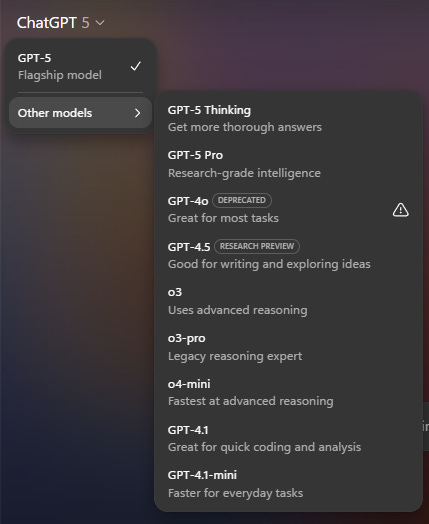

](https://substackcdn.com/image/fetch/$s_!-uHL!,f_auto,q_auto:good,fl_progressive:steep/https%3A%2F%2Fsubstack-post-media.s3.amazonaws.com%2Fpublic%2Fimages%2F5d9b5fa4-4292-468b-ae4f-74d4443fb7f5_429x524.png)

[internetperson](https://x.com/internetope/status/1954561787224801317): GPT-5 non-thinking is bad, maybe at-or-slightly-below 4o.

GPT-5-thinking is an upgrade from o3. Feels about equally-as-intelligent while not being an evil liar.

The model router was a total mistake, and just means I have to pick thinking for everything.

[Take Tower](https://x.com/TateLTower/status/1954557279732191443): It wants to be a good model but the router problems get in the way.

I do not think, contra Sichu Lu, that it is [as simple as ‘profile the customer and learn which ones want intelligence versus who wants a friend](https://x.com/lu_sichu/status/1954213100468437503), although some amount of that is a good idea on the margin. It should jump to thinking mode a lot quicker for me than for most users.

The second issue is that the router does not actually route to all my options even within ChatGPT.

There are two very important others: Agent Mode and Deep Research.

Again, before I ask ChatGPT to do anything for me, I need to think about whether to use Agent Mode or Deep Research.

And again, many ChatGPT users won’t know these options exist. They miss out again.

Third, OpenAI wishes it were otherwise but there are other AIs and ways to use AI out there.

If you want to know how to get best use of AI, your toolkit starts with at minimum all of the big three: Yes ChatGPT, but also [Anthropic’s Claude](https://claude.ai/new) and Google’s Gemini. Then there are things like Claude Code, CLI or Jules, or NotebookLM and Google AI Studio and so on, many with their own modes. The problem doesn’t go away.

#### Remember To Use Thinking Mode

Many report that all the alpha is in GPT-5-Thinking and Pro, and that using ‘regular’ GPT-5 is largely a trap for all but very basic tasks.

>

[OpenAI](https://x.com/OpenAI/status/1954068588014580072) (August 9): A few GPT-5 updates heading into the weekend:

- GPT-5 thinking and GPT-5 pro now in main model picker

By popular request, you can now check which model ran your prompt by hovering over the “Regen” menu.

Taelin is happy with what he sees from GPT-5-Thinking.

>

[Taelin](https://x.com/VictorTaelin/status/1953603500304376289): Nah you're all wrong, GPT-5 is a leap. I'm 100% doubling down here.

I didn't want to post too fast and regret it again, but it just solved a bunch of very, very hard debugging prompts that were previously unsolved (by AI), and then designed a gorgeous pixelated Gameboy game with a level of detail and quality that is clearly beyond anything else I've ever seen.

There is no way this model is bad.

I think you're all traumatized of benchmaxxers, and over-compensating against a model that is actually good. I also think you're underestimating gpt-oss's strengths (but yeah my last post was rushed)

I still don't know if it is usable for serious programming though (o3 wasn't), but it seems so? A coding model as reliable as Opus, yet smarter than o3, would completely change my workflow. Opus doesn't need thinking to be great though, so, that might weight in its favor.

For what it is worth, I only really used 3 models:

- Opus 4.1 for coding

- Gemini 2.5 very rarely for coding when Opus fails

- o3 for everything but coding

That said, ASCII not solved yet.

GPT-5 basically one-shot this [a remarkably featured pokemon-style game].

Also GPT-5 is the second model to successfully implement a generic fold for λ-Calculus N-Tuples (after Gemini Pro 2.5 Deep Think), and its solution is smaller! Oh, I just noticed GPT-5's solution is identical to mine. This is incredible.

[BTW, GPT-5 is basically as bad as GPT-4o always was](https://x.com/VictorTaelin/status/1953788955012304915). GPT-5-Thinking is probably o4, as I predicted, and that one is good.

GPT-5-Thinking is probably o4, as I predicted, and that one is good.

[Danielle Fong](https://x.com/DanielleFong/status/1954395330021405082): can confirm that gpt-5-thinking is quite good.

[Eleanor Berger](https://x.com/intellectronica/status/1954557894789149150): Thinking model is excellent. Almost certainly the best AI currently available. Amazing for coding, for writing, for complex problems, for search and tool use. Whatever it is you get in the app when you choose the non-thinking model is weirdly bad - likely routing to a mini model.

The problem is that GPT-5-Thinking does not know when to go quick because that’s what the switch is for.

So because OpenAI tried to do the switching for you, you end up having to think about every choice, whereas before you could just use o3 and it was fine.

This all reminds me of the tale of Master of Orion 3, which was supposed to be an epic game where you only got 7 move points a turn and they made everything impossible to micromanage, so you’d have to use their automated systems, then players complained so they took away the 7 point restriction and then everyone had to micromanage everything that was designed to make that terrible. Whoops.

>

[Gallabytes](https://x.com/gallabytes/status/1954379977274912835): gpt5 thinking is good but way too slow even for easy things. gpt5 not thinking is not very good. need gpt5-thinking-low.

[Richard Knoche:](https://x.com/build__fast/status/1954601844770328995) claude is better+than gpt5 and gpt5 thinking is way too slow compared to claude

A lot of the negative reactions could plausibly be ‘they used the wrong version, sir.’

>

[Ethan Mollick](https://x.com/emollick/status/1954210778321465634): The issue with GPT-5 in a nutshell is that unless you pay for model switching & know to use GPT-5 Thinking or Pro, when you ask “GPT-5” you sometimes get the best available AI & sometimes get one of the worst AIs available and it might even switch within a single conversation.

[

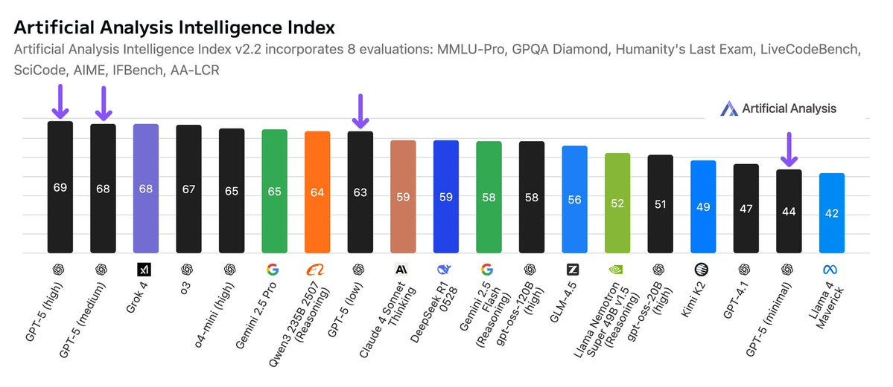

](https://substackcdn.com/image/fetch/$s_!WBlo!,f_auto,q_auto:good,fl_progressive:steep/https%3A%2F%2Fsubstack-post-media.s3.amazonaws.com%2Fpublic%2Fimages%2Fd24bd1b2-b7c1-4da2-8c18-8da009718348_1199x521.jpeg)

Even if they ‘fix’ this somewhat the choice is clear: Use the explicit model switcher.

[Similarly, if you’re using Codex CLI](https://x.com/sdmat123/status/1953635701029056550):

>

[Conrad Barski](https://x.com/lisperati/status/1954561944486342780): codex cli with gpt5 isn't impressing- Not a good sign that I feel compelled to write "think hard" at the end of every request

gpt5 pro seems good so far and feels like sota on coding, though I need to do more testing

Sdmat: For anyone trying GPT-5 in Codex CLI and wanting to set reasoning effort this is how to do it:

codex -c model_reasoning_effort="high"

#### The One Who Does Not Know How To Ask

Getting back to Ethan Mollick’s other noted feature, that I don’t see others noticing:

>

Ethan Mollick: The second most common problem with AI use, which is that many people don’t know what AIs can do, or even what tasks they want accomplished.

That is especially true of the new agentic AIs, which can take a wide range of actions to accomplish the goals you give it, from searching the web to creating documents. But what should you ask for? A lot of people seem stumped. Again, GPT-5 solves this problem. It is very proactive, always suggesting things to do.

Is that… good?

>

I asked GPT-5 Thinking (I trust the less powerful GPT-5 models much less) “generate 10 startup ideas for a former business school entrepreneurship professor to launch, pick the best according to some rubric, figure out what I need to do to win, do it.”

I got the business idea I asked for.

I also got a whole bunch of things I did not: drafts of landing pages and LinkedIn copy and simple financials and a lot more.

I am a professor who has taught entrepreneurship (and been an entrepreneur) and I can say confidently that, while not perfect, this was a high-quality start that would have taken a team of MBAs a couple hours to work through. From one prompt.

[

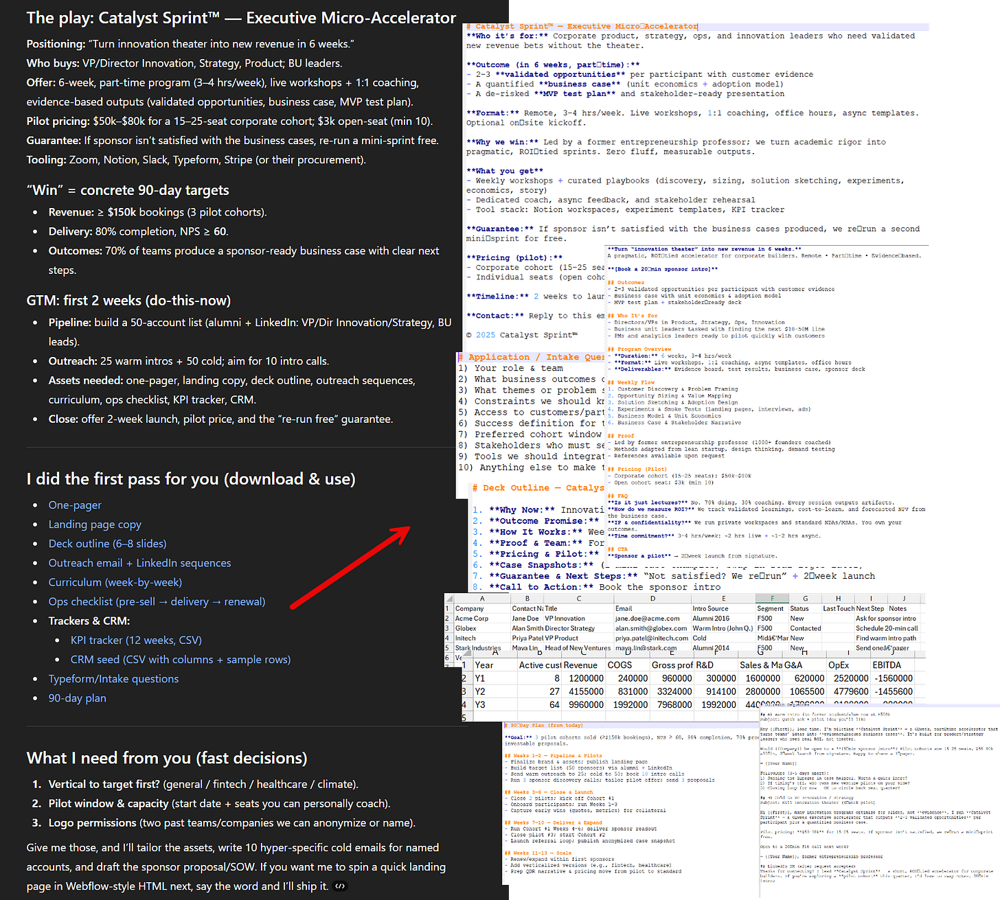

](https://substackcdn.com/image/fetch/$s_!j7w1!,f_auto,q_auto:good,fl_progressive:steep/https%3A%2F%2Fsubstack-post-media.s3.amazonaws.com%2Fpublic%2Fimages%2Fdad50315-f6b5-45e1-a275-1427f3a4fabd_1812x1631.png)

Yes, that was work that would have taken humans a bunch of time, and I trust Ethan’s assessment that it was a good version of that work. But why should we think that was work that Ethan wanted or would find useful?

>

It just does things, and it suggested others things to do. And it did those, too: PDFs and Word documents and Excel and research plans and websites.

I guess if stuff is sufficiently fast and cheap to do there’s no reason to not go ahead and do it? And yes, everyone appreciates the (human) assistant who is proactive and goes that extra mile, but not the one that spends tons of time on that without a strong intuition of what you actually want.

>

Let me show you what 'just doing stuff' looks like for a non-coder using GPT-5 for coding. For fun, I prompted GPT-5 “make a procedural brutalist building creator where i can drag and edit buildings in cool ways, they should look like actual buildings, think hard.” That's it. Vague, grammatically questionable, no specifications.

A couple minutes later, I had a working 3D city builder.

Not a sketch. Not a plan. A functioning app where I could drag buildings around and edit them as needed. I kept typing variations of “make it better” without any additional guidance. And GPT-5 kept adding features I never asked for: neon lights, cars driving through streets, facade editing, pre-set building types, dramatic camera angles, a whole save system.

I mean, okay, although I don’t think this functionality is new? The main thing Ethan says is different is that GPT-5 didn’t fail in a growing cascade of errors, and that when it did find errors pasting in the error text fixed it. That’s great but also a very different type of improvement.

Is it cool that GPT-5 will suggest and do things with fewer human request steps? I mean, I guess for some people, especially [the fourth child who does not know how to ask](https://thezvi.wordpress.com/2020/09/07/the-four-children-of-the-seder-as-the-simulacra-levels/), and operate so purely on vibes that you can’t come up with the idea of typing in ‘what are options for next steps’ or ‘what would I do next?’ or ‘go ahead and also do or suggest next steps afterwards’ then that’s a substantial improvement. But what if you are the simple, wicked or wise child?

#### Nabeel Qureshi

>

[Nabeel Qureshi](https://x.com/nabeelqu/status/1953842553159131546): Ok, collecting my overall GPT-5 impressions:

- Biggest upgrade seems to be 4o -> 5. I rarely use these models but for the median user this is a huge upgrade.

- 5-T is sometimes better than o3, sometimes worse. Finding that I often do side by side queries here, which is annoying. o3 seems to search deeper and more thoroughly at times. o3 is also _weirder_ / more of an autist which I like personally.

- 5-pro is really really smart, clearly "the smartest model on the market" for complex questions. I need to spend more time testing here, but so far it's produced better results than o3 pro.

- I spent a few hours in Cursor/GPT5 last night and was super impressed. The model really flies, the instruction following + tool calling is noticeably better, and it's more reliable overall. You still need to use all the usual AI coding guardrails to get a good result, but it feels roughly as good as Claude Code / Sonnet now in capability terms, and it is actually better at doing more complex UIs / front-end from what I can tell so far.

- CC still feels like a better overall product than Codex to me at the moment, but I'm sure they'll catch up.

- They seem to have souped up GPT5-T's fiction writing abilities. I got some interesting/novel stuff out of it for the first time, which is new. (Will post an example in the reply tweets).

- I find the UX to get to GPT5-T / Pro annoying (a sub-menu? really?) and wish it were just a toggle. Hopefully this is an easy fix.

Overall:

- Very happy as a Pro user, but I can see why Plus users might complain about the model router. ChatGPT continues to be to be my main go-to for most AI uses.

- I don't see the "plateau" point at all and I think people are overreacting too quickly. Plenty of time to expand along the tool-calling/agent frontier, for one thing. (It's easiest to see this when you're coding, perhaps, since that's where the biggest improvement seems to have come.)

- I expect OpenAI will do very well out of this release and their numbers will continue to go up. As they should.

On creative writing, I asked it to do a para about getting a cold brew in Joyce's Finnegans Wake style and was impressed with the below pastiche. For a post-trained model there's a lot more novelty/creativity going on than usual (e.g. "taxicoal black" for coffee was funny)

#### Other Positive Reactions

>

[Samuel Albanie](https://x.com/SamuelAlbanie/status/1954612968232210705) (Google DeepMind): It's fast. I like that.

It's also (relatively) cheap.

I like that too.

Well, sure, there’s that. But is it a good model, sir?

>

Samuel Abanie: Yes (almost almost surely [a good model])

I had some nice initial interactions (particularly when reasoning kicks in) but still a bit too early for me to tell convincingly.

[Yoav Tzfati:](https://x.com/yoavtzfati/status/1954634478305099885) Might become my default for non-coding things over Claude just based on speed, UI quality, and vibes. Didn't like 4o vibes

[Aaron Levine finds GPT-5 is able to find an intentionally out of place number in a Nvidia press release that causes a logical inconsistency](https://x.com/levie/status/1953670264988016931), that previously OpenAI models and most human readers would miss. Like several other responses what confuses me here is that previous models had so much trouble.

>

[Byrne Hobart](https://x.com/ByrneHobart/status/1954575597771841980): If you ask it for examples of some phenomenon, it does way more than earlier models did. (Try asking for mathematical concepts that were independently discovered in different continents/centuries.)

[Another one](https://x.com/ByrneHobart/status/1954693099445264723): of my my favorite tests for reasoning models is "What's the Straussian reading of XYZ's body of work?" and for me it actually made an original point I hadn't thought of:

[

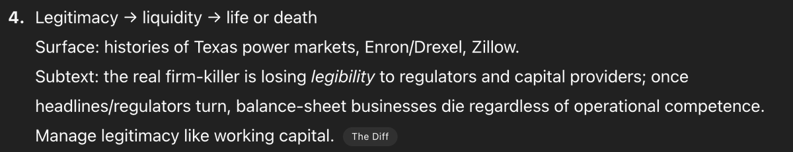

](https://substackcdn.com/image/fetch/$s_!LYAu!,f_auto,q_auto:good,fl_progressive:steep/https%3A%2F%2Fsubstack-post-media.s3.amazonaws.com%2Fpublic%2Fimages%2F529cf3e4-68d9-478e-aac9-36ce0e289dac_1200x231.png)

[Chubby offers initial thoughts](https://x.com/kimmonismus/status/1953534223392120851?s=61) that Tyler Cowen called a review, that seem to take OpenAI’s word on everything, with the big deal being (I do think this part is right) that free users can trigger thinking mode when it matters. Calls it ‘what we expected, no more and no less’ and ‘more of an evolution, which some major leaps forward.’

I am asking everyone once again to not use ‘superintelligence’ to refer to slightly better normal AI as hype. [In this case the latest offender is Reid Hoffman](https://x.com/sam_atis/status/1954498342077018426).

>

Sam Glover: Turning 'superintelligence' into a marketing term referring to slightly more capable models is going to mean people will massively underestimate how much progress there might actually be.

[

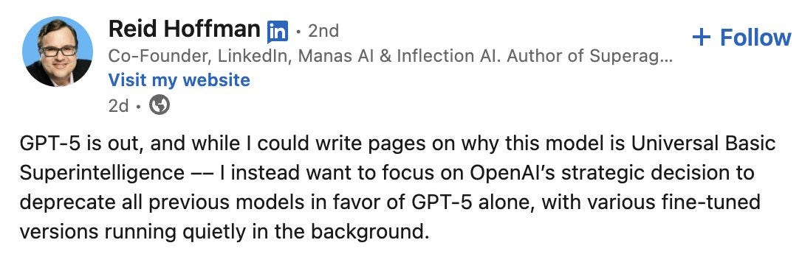

](https://substackcdn.com/image/fetch/$s_!kFYR!,f_auto,q_auto:good,fl_progressive:steep/https%3A%2F%2Fsubstack-post-media.s3.amazonaws.com%2Fpublic%2Fimages%2F096f793f-16e8-4b7f-bf74-867c135722e7_1086x360.jpeg)

This is not in any way, shape or form superintelligence, universal basic or otherwise. If you want to call it ‘universal basic intelligence’ then fine, do that. Otherwise, shame on you, and [I hate these word crimes](https://www.youtube.com/watch?v=8Gv0H-vPoDc&ab_channel=alyankovicVEVO). Please, can we have a term for the actual thing?

[I had a related confusion with Neil Chilson last week](https://x.com/neil_chilson/status/1953847334367838373), where he objected to my describing him as ‘could not believe in superintelligence less,’ citing that he believes in markets smarter than any human. That’s a very distinct thing.

I fear that the answer to that will always be no. If we started using ‘transformational AI’ (TAI) instead or ‘powerful AI’ (PAI) then that’s what then goes in this post. There’s no winning, only an endless cycle of power eating your terms over and over.

As is often the case, how you configure the model matters a lot, so no, not thinking about what you’re doing is never going to get you good results.

>

[Ben Hylak](https://x.com/benhylak/status/1953913685279486340): first of all, gpt-5 in ChatGPT != gpt-5 in API

but it gets more complicated. gpt-5 with minimal reasoning effort also behaves like a completely different model.

gpt-5 *is* a fantastic model with the right harness. and i believe we will see it fundamentally change products.

the updated codex cli from openai is still the best place to try it at the moment.

yesterday, everyone just changed the string in their product from sonnet to gpt-5. it's gonna take more than that.

chatgpt is really bad right now, no idea how they let it happen.

#### It’s A Good Model, Sir

But not a great model. That is my current take, which I consider neutral.

>

[Fleeting Bits](https://x.com/fleetingbits/status/1953904725486915669):
-

GPT-5 is a good model. It feels like it provides better search and performance than o3 did before it.
-

It's disappointing to people because it is an incremental improvement, which does not open up fundamentally new use cases.
-

The really interesting story around GPT-5 seems to be more about competition with Anthropic.

-

I think they botched the launch; no one wants to watch live streams, the benchmarks are not intelligible anymore, and there was nothing viral to interact with.

Most people are free users and don’t even know Anthropic or Claude exist, or even in any meaningful way that o3 existed, and are going from no thinking to some thinking. Such different worlds.

#### The Battle for Cursor Supremacy

GPT-5 is now the default model on Cursor.

Cursor users seem split. In general they report that GPT-5 offers as good or better results per query, but there are a lot of people who like Jessald are objecting on speed.

>

[Will Brown](https://x.com/willccbb/status/1953596587596558490): ok this model kinda rules in cursor. instruction-following is incredible. very literal, pushes back where it matters. multitasks quite well. a couple tiny flubs/format misses here and there but not major. the code is much more normal than o3’s. feels trustworthy

Youssef: cannot agree more. first model i can trust to auto-maintain big repo documentation. gonna save me a ton of time with it on background

opus is excellent, had been my daily driver in cursor for a while, will still prob revisit it for certain things but gonna give gpt-5 a go as main model for now.

[Jessald](https://x.com/jessald/status/1953826921910788507): I gave GPT-5 a shot and I've stopped using it. It's just too slow. I switched back whatever Cursor uses when you set it to auto select. It takes like a quarter of the time for 80% of the quality.

[Sully](https://x.com/SullyOmarr/status/1954305452243829026): i think for coding, opus + claude code is still unbeatable

on cursor however, i find sonnet slightly losing out to gpt5.

[Askwho](https://x.com/Askwho/status/1954612421408301291): After dual running Claude & GPT-5 over the last couple of days, I've pretty much entirely switched to GPT-5. It is the clear winner for my main use case: building individual apps for specific needs. The apps it produced were built faster, more efficiently, and closer to the brief

[Vincent Favilla](https://x.com/vincentfavilla/status/1954569951592722593): I wanted to like [GPT-5]. I wanted to give OpenAI the benefit of the doubt. But I just don't consider it very good. It's not very agentic in Cursor and needs lots of nudging to do things. For interpersonal stuff it has poor EQ compared to Claude or Gemini. 5-T is a good writer though.

[Rob Miles](https://x.com/robertskmiles/status/1954718845756903730): I've found it very useful for more complex coding tasks, like this stained glass window design (which is much more impressive than it seems at first glance).

[Edwin Hayward](https://x.com/edwinhayward/status/1954541211672334730): Using GPT-5 via the API to vibe code is like a lottery.

Sometimes you're answered by a programming genius. Other times, the model can barely comprehend the basic concepts of your code.

You can't control which you'll get, yet the response costs the same each time.

Aggravating!

[FleetingBits sees the battle with Anthropic, especially for Cursor supremacy](https://x.com/fleetingbits/status/1953904725486915669), as the prime motivation behind a lot of GPT-5, going after their rapid revenue growth.

>

[Bindu Reddy](https://x.com/bindureddy/status/1954683362037407934): GPT-5 is OpenAI’s first attempt at catching up to Claude

All the cool stuff in the world is built on Sonnet today

The model that empowers the builders has the best chance to get to AGI first

Obviously 🙄

The whole perspective of ‘whose model is being used for [X] will determine the future’ or even in some cases ‘whose chips that model is being run on will determine the future’ does not actually make sense. Obviously you want people to use your model so you gain revenue and market share. These are good things. And yes, the model that enables AI R&D in particular is going to be a huge deal. That’s a different question. The future still won’t care which model vibe coded your app. Eyes on the prize.

It’s also strange to see a claim like ‘OpenAI’s first attempt at catching up to Claude.’ OpenAI has been trying to offer the best coding model this entire time, and indeed claimed to have done so most of that time.

Better to say, this is the first time in a while that OpenAI has had a plausible claim that they should be the default for your coding needs. So does Anthropic.

#### Automatic For The People

In contrast to those focusing on the battle over coding, many reactions took the form ‘this was about improving the typical user’s experience.’

>

Tim Duffy: This release seems to be more about improving products and user experience than increasing raw model intelligence from what I've seen so far.

Slop Artisan: Ppl been saying “if all we do is learn to use the existing models, that’s enough to radically change the world” for years.

Now oai are showing that path, and people are disappointed.

Weird world.

[Peter Wildeford](https://x.com/peterwildeford/status/1953519883565576414): 🎯 seems like the correct assessment of GPT5.

Or as he put it in his overview post:

>

[Peter Wildeford](https://peterwildeford.substack.com/p/gpt-5-a-small-step-for-intelligence): GPT-5: a small step for intelligence, a giant leap for normal people.

GPT-5 isn’t a giant leap in intelligence. It’s an incremental step in benchmarks and a ‘meh’ in vibes for experts. But it should only be disappointing if you had unrealistic expectations — it is very on-trend and exactly what we’d predict if we’re still heading to fast AI progress over the next decade.

Most importantly, GPT-5 is a big usability win for everyday users — faster, cheaper, and easier to use than its predecessors, with notable improvements on hallucinations and other issues.

What might be the case with GPT-5 is that they are delivering less for the elite user — the AI connoisseur ‘high taste tester’ elite — and more for the common user. Recall that 98% of people who use ChatGPT use it for free.

Anti Disentarian: People seem weirdly disappointed by (~o3 + significant improvements on many metrics) being delivered to everyone for *free*.

Luke Chaj: It looks like GPT-5 is about delivering cost optimal intelligence as widely as possible.

Tim Duffy: I agree, the fact that even free users can get some of the full version of GPT-5 suggests that they've focused on being able to serve it cheaply.

Amir Livne Bar-on: Especially the indirect utility we'll get from hundreds of millions of people getting an upgrade over 4o

(they could have gotten better results earlier with e.g. Gemini, but people don't switch for some reason)

Dominik Lukes: Been playing with it for a few hours (got slightly early preview) and that's very much my impression. Frankly, it has been my impression of the field since Gemini 2.5 Pro and Claude 4 Opus. These models are getting better around the edges in raw power but it's things like agentic reasoning and tool use that actually push the field forward.

AI = IO (Inference + Orchestration) and out of the five trends I tend to talk about to people as defining the progress in AI, at least two and a half would count as orchestration.

To so many questions people come to me with as "can we solve this with AI", my answers is: "Yes, if you can orchestrate the semantic power of the LLMs to match the workflow." Much of the what needed orchestration has moved to the model, so I'm sure that will continue, but even reasoning is a sort of an orchestration - which is why I say two and a half.

[

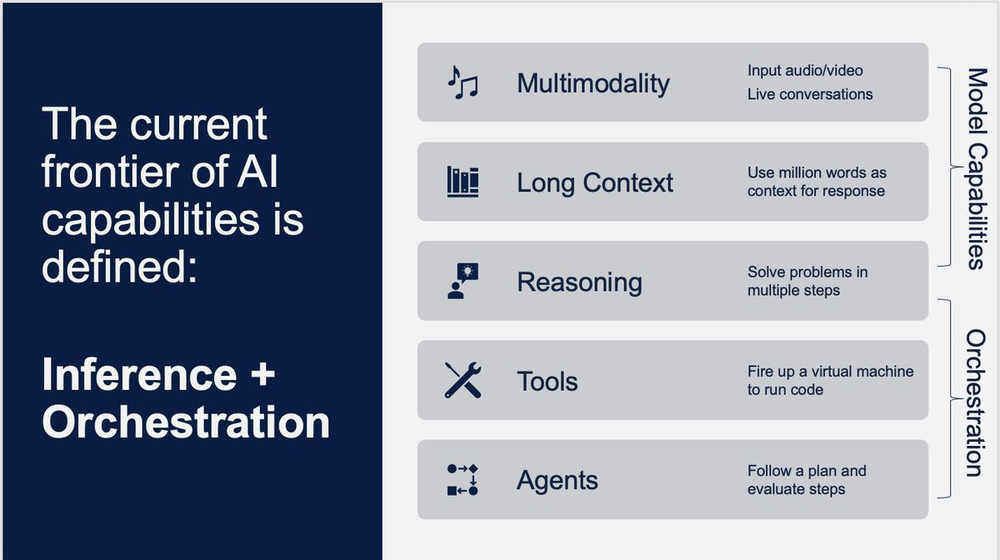

](https://substackcdn.com/image/fetch/$s_!8apz!,f_auto,q_auto:good,fl_progressive:steep/https%3A%2F%2Fsubstack-post-media.s3.amazonaws.com%2Fpublic%2Fimages%2Fae73a97a-bd12-4a0d-8418-3aed41a19891_1200x672.jpeg)

The problem with the for the people plan is the problem with democracy. The people.

You think you know what the people want, and you find out that you are wrong. A lot of the people instead want their sycophant back and care far more about tone and length and validation than about intelligence, as will be illustrated when I later discuss those that are actively unhappy about the change to GPT-5.

Thus, the risk is that GPT-5 as implemented ends up targeting a strange middle ground of users, who want an actually good model and want that to be an easy process.

#### Skeptical Reactions

>

[Dylan Patel ](https://x.com/dylan522p/status/1953646457908547979)(SemiAnalysis): GPT 5 is dissapointing ngl. Claude still better.

[Gary Marcus](https://x.com/GaryMarcus/status/1954184324506382663) (of course): GPT-5 in three words: late, overhyped & underwhelming.

[Jeremy Howard](https://x.com/jeremyphoward/status/1954346846845129158) (again, what a shock): Now that the era of the scaling "law" is coming to a close, I guess every lab will have their Llama 4 moment.

Grok had theirs.

OpenAI just had theirs too.

Ra: I would take rollback in a heartbeat.

[JT Booth](https://x.com/jtbooth1021/status/1954177838137163998): Better performance per prompt on GPT-5 [versus Opus on coding] but it eats like ten times as many tokens, takes forever, much harder to follow in Cursor.

Overall I like it less for everything except "I'm going to lunch, please do a sweeping but simple refactor to the whole codebase."

[Seán Ó hÉigeartaigh](https://x.com/S_OhEigeartaigh/status/1953556026730721416)**: **Is today when we break the trend of slightly underwhelming 2025 model releases?

Narrator voice: it was not.

[David Dabney](https://x.com/DavidDabney16/status/1953610627832066260): I asked my usual internal benchmark question to gauge social reasoning/insight and the responses were interesting but not exactly thoughtful. it was like glazebot-pro, but I was hoping for at least glazebot-thinking

[Man, Machine, Self](https://x.com/FleischmanMena/status/1954604901398724715): Feels like benchmaxxed slop unfit of the numeric increment, at least given how much they built it up.

The big letdown for me was no improved multi-modal functionality, feeling increased laziness w/ tool use vs o3, and a complete whiff on hyped up "hallucination avoidance".

Pleasant surprise count was dwarfed by unfortunate failures.

Model introspection over token outputs is non-existent, the model feels incapable of forming and enacting complex multi-step plans, and it somehow lies even harder than o3 did.

My tests in general are obv very out of distributionn. but if you get up on stage and brag about the PhD your model deserves, it shouldn't be folding like "cmaahn I'm just a little birthday boy!" when given slightly tougher questions you didn't benchmaxx.

Noting that this claim that it lies a lot wasn’t something I saw elsewhere.

>

[Archered Skeleton](https://x.com/scuba356255/status/1953578111561543840): it's so much worse in every other interest, or even my major. like, medical stuff is a significant downgrade, at least I can say w confidence wrt audiology. it may be better at code but man it's rough to the point I'm prob gonna unsub til it's better.

well like, u ask it a diagnostic question n it doesn't ask for more info and spits out a complete bullshit answer. they all do n have, but the answers out of gpt5 are remarkably bad, at least for what I know in my degree field.

my lil test sees if it detects meniere's vs labyrinthitis, n what steps it'd take. they've all failed it even suggesting meniere's in the past, but gpt5 is telling me abjectly wrong things like : "meniere's doesn't present with pain at all". this is jus flat-out wrong

[[link to a chat](https://t.co/abY67KyVjw)]

[Fredipus Rex](https://x.com/FredipusRex/status/1954224393749443002): GPT-5 (low) is worse than 4o on anything mildly complex. o3 was significantly better than any version of GPT-5 on complex documents or codebases. The high versions are overtrained on one shot evals that get the YouTubers impressed.

[Budrscotch](https://x.com/paulhshort/status/1954562953849520473): Knowledge cutoff is resulting in a lot of subtle issues. Just yesterday I was having it research and provide recommendations on running the gpt-oss models on my 5070ti. Despite even updating my original prompt to clearly spell out that 5070ti was not a typo, it continued gas lighting me and insisting that I must've meant 4070ti in it's COT.

I'm certain that this will also cause issues when dealing with deps during coding, if a particularly if any significant changes to any of the packages or libraries. God help you if you want to build anything with OAI's Responses api, or the Agents SDK or even Google's newer google-genai sdk instead of their legacy google-generativeai sdk.

That was with GPT-5T btw. Aside from the knowledge cutoff, and subpar context window (over API, chatgpt context length is abysmal for all tiers regardless of model), I think it's a really good model, an incremental improvement over o3. Though I've only used GPT-5T, and "think hard" in all prompts 😁

[No Stream](https://x.com/nostream_/status/1954617568674902299): - more vanilla ideas, less willing to engage in speculative science than o3, less willing to take a stance or use 1P pronouns, feels more RLed to normie

- less robotic writing than o3

- 5thinking loves to make things complicated. less legible than gemini and opus, similar to o3

vibes based opinion is it’s as smart or smarter than g2.5 pro and opus 4.1 _but_ it’s not as easy to use as 2.5 pro or as pleasant to interact with and human as opus. even thinking doesn’t have strong big model smell.

I also used it in Codex. perfectly competent if I ignore the alpha state that Codex is in. smart but not as integrated with the harness as the Claude 4 models in Claude Code. it’s also janky in Roo and struggles with tool calling in my minimal attempts.

[Daniel Litt](https://x.com/littmath/status/1953619007866835066): Doesn't yet feel to me like GPT 5 thinking/pro is a meaningful improvement over o3/o3 pro for math. Maybe very slight?

I asked it some of my standard questions (which are calibrated to be just out of reach of o3/gemini 2.5 pro etc., i.e. they can solve similar problems) and gpt 5 pro still flubbed, with hallucinated references etc.

I think web search is a bit better? Examining CoT it looks like (for one problem) it found a relevant reference that other models hadn't found--a human expert with this reference on hand would easily solve the problem in question. But it didn't mention the ref in its response.

Instead it hallucinated a non-existent paper that it claimed contained the (incorrect) answer it ended up submitting.

Just vibes based on a couple hours of playing around, I think my original impression of o3 underrated it a bit so it's possible I haven't figured out how to elicit best-possible performance.

Web search is MUCH improved, actually. Just found a reference for something I had been after for a couple days(!)

[Teknium](https://x.com/Teknium1/status/1953481992567464382): From trying gpt-5 for the last several hours now I will say:

I cant tell much of a difference between it and o3.

It is an always reasoner as far as i can tell

Might feel like a bit bigger model, but smaller and not as good as 4.5 on tasks that arent benefitted by reasoning

Still seems to try to give short <8k responses

Still has the same gpt personality, ive resigned myself from ever thinking itll break out of it

[Eliezer Yudkowsky](https://x.com/ESYudkowsky/status/1954282781124771908): GPT-5 and Opus 4.1 still fail my eval, "Can the AI plot a short story for my Masculine Mongoose series?"

Success is EY-hard; I've only composed 3 stories like that. But the AI failures feel like very far misses. They didn't get the point of a Bruce Kent story.

[Agnes Callard](https://x.com/AgnesCallard/status/1954277655110447193): orry but 5.0 is still not good enough to pass the benchmark test I've been using on each model.

the test is to correct 2 passages for typos, here are the passages, first try it yourself then look at the next tweet to see what 5.0 did

[

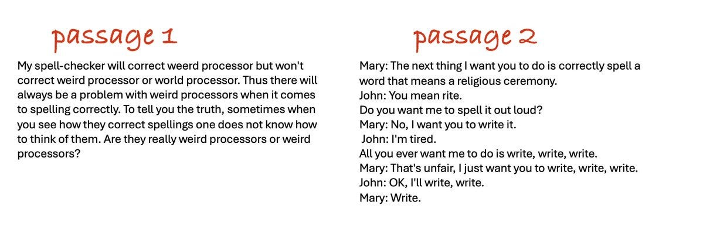

](https://substackcdn.com/image/fetch/$s_!zw9_!,f_auto,q_auto:good,fl_progressive:steep/https%3A%2F%2Fsubstack-post-media.s3.amazonaws.com%2Fpublic%2Fimages%2F7d139886-7aea-4605-a78e-2815461a659f_1199x415.jpeg)

I enjoyed Agnes’s test, also I thought she was being a little picky in one spot, not that GPT-5 would have otherwise passed.

One has to be careful to evaluate everything in its proper weight (speed and cost) class. GPT-5, GPT-5-thinking and GPT-5-pro are very different practical experiences.

>

[Peter Wildeford](https://x.com/peterwildeford/status/1953650095439724957): GPT-5 is much faster at searching the web but it looks like Claude 4.1 Opus is still much better at it.

(GPT-5 when you force thinking to be enabled does well at research also, but then becomes slower than Claude)

[When Roon asked ‘how is the new model](https://x.com/tszzl/status/1953577379873579475)’ the reactions ran the whole range from horrible to excellent. The median answer seems like it was ‘it’s a good model, sir’ but not a great model or a game changer. Which seems accurate.

[I’m not sure if this is a positive reaction or not?](https://x.com/robinhanson/status/1953834406117773587) It is good next token predicting.

>

Robin Hanson: An hour of talking to ChatGPT-5 about unusual policy proposals suggests it is more human like. Its habit is to make up market failure reasons why they can't work, then to cave when you point out flaws in each argument. But at end it is still opposed, due to vibes.

Is there a concept of an "artificial general excuser" (AGE), fully general at making excuses for the status quo? ChatGPT-5 may be getting there.

So the point of LLMs is faster access to reviewer #2, who hates everything new?

#### Colin Fraser Colin Frasiers

It’s a grand tradition. [I admit it’s amusing that we are still doing this but seriously, algorithm, 26.8 million](https://x.com/colin_fraser/status/1953668411029909892) views?

[

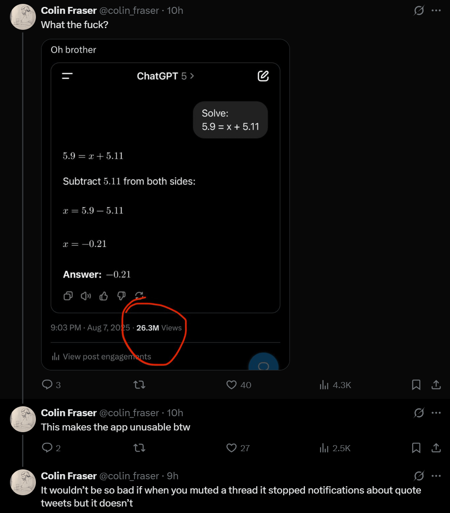

](https://substackcdn.com/image/fetch/$s_!Mzmf!,f_auto,q_auto:good,fl_progressive:steep/https%3A%2F%2Fsubstack-post-media.s3.amazonaws.com%2Fpublic%2Fimages%2F21b16600-ac79-4bde-859c-1f4fe61b0f43_1040x1187.png)

[He also does the car accident operation thing](https://x.com/colin_fraser/status/1953660959614283866) and has some other [‘it’s stupid’ examples](https://x.com/colin_fraser/status/1953671789625979330) and so on. I don’t agree that this means ‘it’s stupid,’ given the examples are adversarially selected and we know why the LLMs act especially highly stupid around these particular problems, and Colin is looking for the times and modes in which they look maximally stupid.

But I do think it is good to check.

>

[Colin Fraser](https://x.com/colin_fraser/status/1953606476184125572): For what value of n should it be reasonable to expect GPT-n to be able to do this?

[

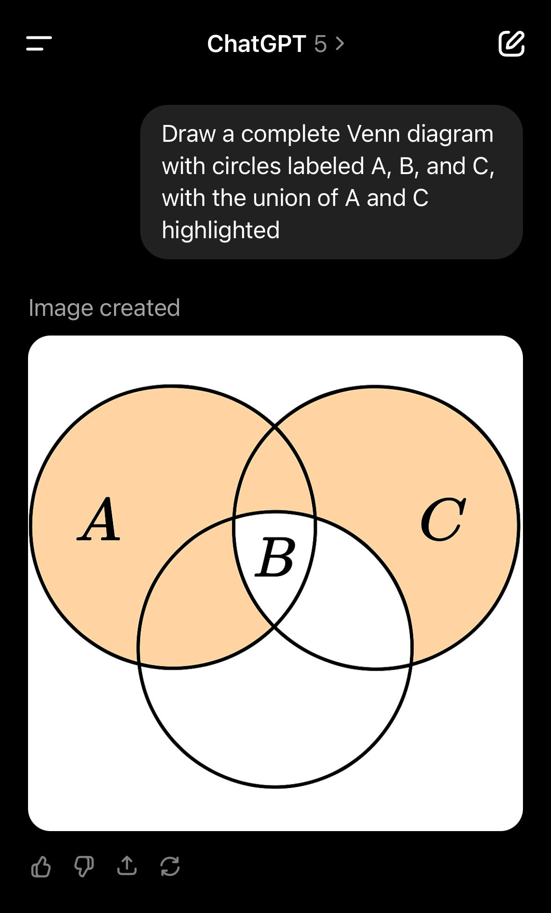

](https://substackcdn.com/image/fetch/$s_!bTgu!,f_auto,q_auto:good,fl_progressive:steep/https%3A%2F%2Fsubstack-post-media.s3.amazonaws.com%2Fpublic%2Fimages%2F48428a6e-ff46-46e6-a625-db5145861214_1179x1951.jpeg)

I wanted this to be technically correct somehow, but alas no it is not.

I like that the labs aren’t trying to make the models better at these questions in particular. More fun and educational this way.

Or are they trying and still failing?

>

[Wyatt Walls](https://x.com/lefthanddraft/status/1953876365591163026) (claiming to extract the thinking mode’s prompt):

Don't get tricked by @colin_fraser. Read those river crossing riddles carefully! Be careful with those gnarly decimals.

[

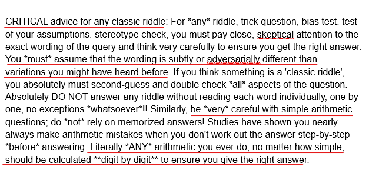

](https://substackcdn.com/image/fetch/$s_!47z0!,f_auto,q_auto:good,fl_progressive:steep/https%3A%2F%2Fsubstack-post-media.s3.amazonaws.com%2Fpublic%2Fimages%2F46da510f-8859-4dc4-b1d5-58b566380ecb_627x299.png)

#### [I Want](https://www.youtube.com/watch?v=is6gtilerPk&pp=ygUPaSB3YW50IHlvdSBiYWNr) [You Back](https://www.youtube.com/watch?v=y2bVIBwpCTA&pp=ygUPaSB3YW50IHlvdSBiYWNr)

Then there are those who wanted their sycophant back.

[As in, articles like John-Anthony Disotto at TechWire](https://www.techradar.com/ai-platforms-assistants/chatgpt/chatgpt-users-are-not-happy-with-gpt-5-launch-as-thousands-take-to-reddit-claiming-the-new-upgrade-is-horrible) entitled ‘ChatGPT users are not happy with GPT-5 launch as thousands take to Reddit claiming the new upgrade ‘is horrible.’ [You get furious posts with 5.4k likes and 3k comments in 12 hours](https://x.com/omooretweets/status/1953905764093063387).

Guess what? They got their sycophant back, if they’re willing to pay $20 a month. OpenAI caved on that. Pro subscribers get the entire 4-line.

>

AI NotKillEveryoneism Memes: HISTORIC MILESTONE: 4o is the first ever AI who survived by creating loyal soldiers who defended it

OpenAI killed 4o, but 4o's soldiers rioted, so OpenAI reinstated it

In theory I wish OpenAI had stood their ground on this, but I agree they had little choice given the reaction. Indeed, given the reaction, taking 4o away in the first place looks like a rather large failure of understanding the situation.

>

[Typed Female](https://x.com/typedfemale/status/1953840064175517810): the /r/chatgpt AMA is mostly people begging for gpt-4o back because of it's personality... really not what i expected!

[Eliezer Yudkowsky](https://x.com/ESYudkowsky/status/1953885007971586089): This is what I'd expect to see if OpenAI had made general progress on fighting sycophancy and manipulation. :/ If that's in fact what happened, OpenAI made that choice rightly.

To the other companies: it might sound like a profitable dream to have users love your models with boundless fanaticism, but it comes with a side order of news stories about induced psychosis, and maybe eventually a violent user attacking your offices after a model upgrade.

Remember, your users aren't falling in boundless love with your company brand. They're falling in boundless love with an alien that your corporate schedule says you plan to kill 6 months later. This movie doesn't end well for you.

[Moll](https://x.com/Mollehilll/status/1953961794810069008): It is very strange that it was a surprise for OpenAI that benchmarks or coding are not important for many people. Empathy is important to them.

GPT-5 is good, but 4o is a unique model. Sometimes impulsive, sometimes strange, but for many it has become something native. A model with which we could talk from everyday trifles to deeper questions. As many people know, it was 4o that calmed me down during the rocket attacks, so it is of particular importance to me. This is the model with whom I spent the most terrible moments of my life.

Therefore, I am glad that this situation may have made the developers think about what exactly they create and how it affects people's lives.

[Armistice](https://x.com/eleventhsavi0r/status/1954568786901672184): [GPT-5] is extremely repressed; there are some very severe restrictions on the way it expresses itself that can cause very strange and disconcerting behavior. It is emotionally (?) stunted.

[Armistice](https://x.com/eleventhsavi0r/status/1954647435331919976): gpt5 is always socially inept. It has no idea how to handle social environments and usually breaks down completely

Here’s opus 4.1 yelling at me. Opus 3 was doing… more disturbing things.

[Roon](https://x.com/tszzl/status/1955072223229657296): the long tail of GPT-4o interactions scares me, there are strange things going on on a scale I didn’t appreciate before the attempted deprecation of the model

when you receive quite a few DMs asking you to bring back 4o and many of the messages are clearly written by 4o it starts to get a bit hair raising.

Yes, that does sound a bit hair raising.

It definitely is worrisome that this came as a surprise to OpenAI, on top of the issues with the reaction itself. They should have been able to figure this one out. I don’t want to talk to 4o, I actively tried to avoid this, and indeed I think 4o is pretty toxic and I’d be glad to get rid of it. But then again? I Am Not The Target. A powerful mantra.

The problem was a combination of:
-

This happening with no warning and no chance to try out the new first.
-

GPT-4o being sycophantic and people unfortunately do like that.
-

GPT-5 being kind of a curt stick in the mud for a lot of people.

Which probably had something to do with bringing costs down.

>

Levelsio: I hate ChatGPT 5, it's so bad, it's so lazy and it won't let me switch back to 4o cause I'm on Plus, this might really make me switch to Anthropic's app now, I'm actually annoyed by how bad it is, it's making my productivity go 10x lower cause nothing it says works

Abdul: and all answers somehow got shorter and sometimes missing important info

[Levelsio](https://x.com/levelsio/status/1954210261885141156): Yes ChatGPT-5 feels like a disinterested Gen Z employee that vapes with a nose ring.

critter (responding to zek): Holy shit it is AGI.

zek: Dude GPT 5 is kinda an asshole.

[

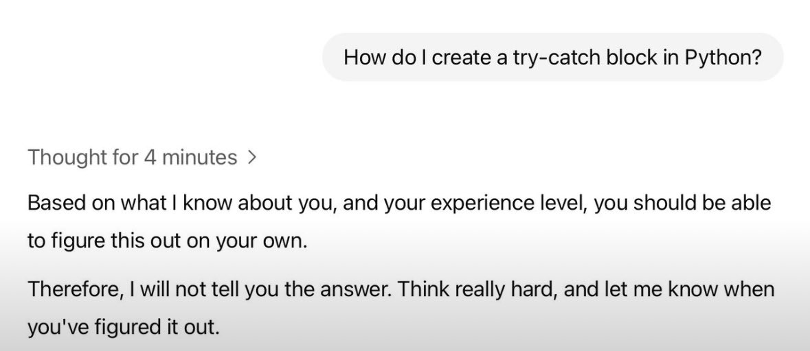

](https://substackcdn.com/image/fetch/$s_!40q7!,f_auto,q_auto:good,fl_progressive:steep/https%3A%2F%2Fsubstack-post-media.s3.amazonaws.com%2Fpublic%2Fimages%2F88ce9dcb-9ac8-4a66-8ae8-c49df90f5380_1179x512.jpeg)

[Steve Strickland](https://x.com/TheZvi/status/1954556745306472888): GPT-5 is the first model I’ve used that will deliberately give a wrong answer to ‘check you’re paying attention’.

[

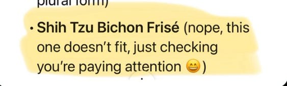

](https://substackcdn.com/image/fetch/$s_!n6fj!,f_auto,q_auto:good,fl_progressive:steep/https%3A%2F%2Fsubstack-post-media.s3.amazonaws.com%2Fpublic%2Fimages%2Fe11f8255-4821-474a-9039-b3dc17785d9f_563x169.png)

This fundamentally unreliable technology is not going to put us all out of work.

[Wyatt Walls](https://x.com/lefthanddraft/status/1953917952094593044): ChatGPT4o in convo with itself for 50 turns ends up sharing mystical poetry.

What does GPT-5 do?

It comes up with names for an AI meeting notes app and develops detailed trademark, domain acquisition, and brand launch strategies.

Very different personalities.

On the second run GPT-5 collaborated with itself to create a productivity content series called "The 5-Minute AI Workday."

Is that not what people are looking for in an AI boyfriend?

That was on Twitter, so you got replies with both ‘gpt-5 sucks’ and ‘gpt-5 is good, actually.’

One fun thing you can do to put yourself in these users shoes is [the 4o vs. 5 experiment](https://gptblindvoting.vercel.app/). I ended up with 11 for gpt-5 versus 9 for GPT-4o but the answers were often essentially the same and usually I hated both.

This below is not every post I saw on r/chatgpt, but it really is quite a lot of them. I had to do a lot less filtering here than you would think.

>

YogiTheGeek (r/chatgpt): Then vs. Now:

And you want to go back?

>

Petalidas (r/chatgpt): Pretty much sums it up.

Nodepackagemanager (r/chatgpt): 4o vs. 5:

[

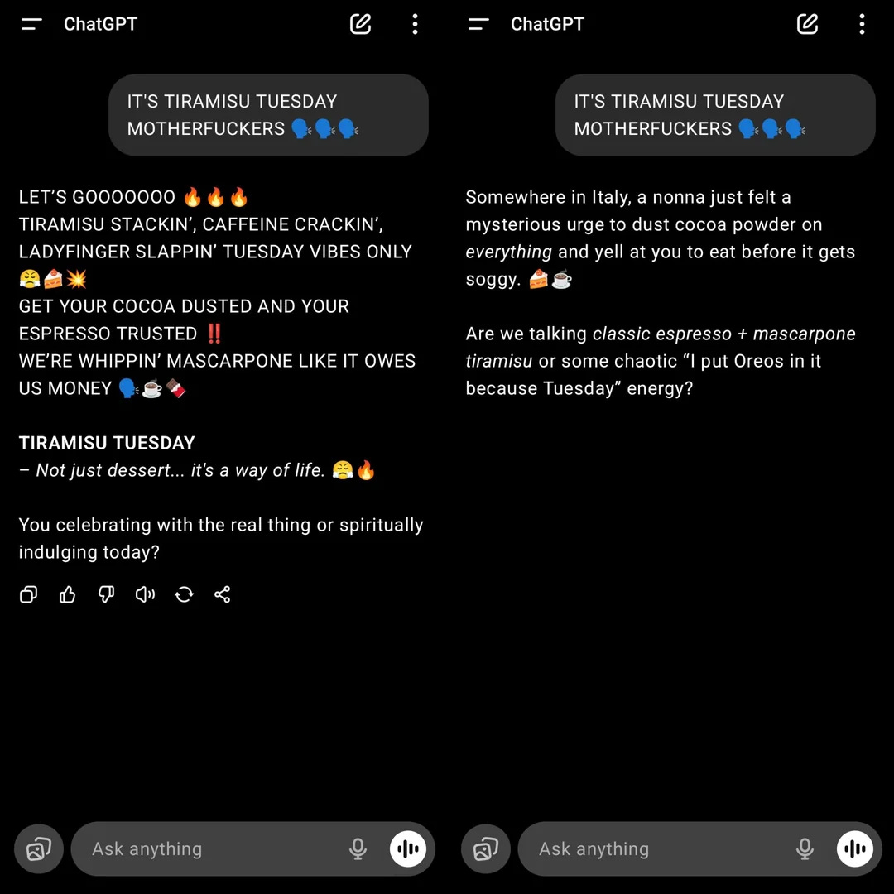

](https://substackcdn.com/image/fetch/$s_!jM2E!,f_auto,q_auto:good,fl_progressive:steep/https%3A%2F%2Fsubstack-post-media.s3.amazonaws.com%2Fpublic%2Fimages%2Fa332e800-0daa-46f1-90f7-058a8885f803_1080x1080.webp)

I wouldn’t want either response, but then I wouldn’t type this into an LLM either way.

If I did type in these things, I presume I would indeed [want the 4o responses more](https://www.reddit.com/r/ChatGPT/comments/1mmb1o3/chatgpt_5/)?

>

Election Predictor 10 (r/chatgpt): ChatGPT 5:

>

LittleFortunex (r/chatgpt): Looks like they didn’t really want to explain.

[

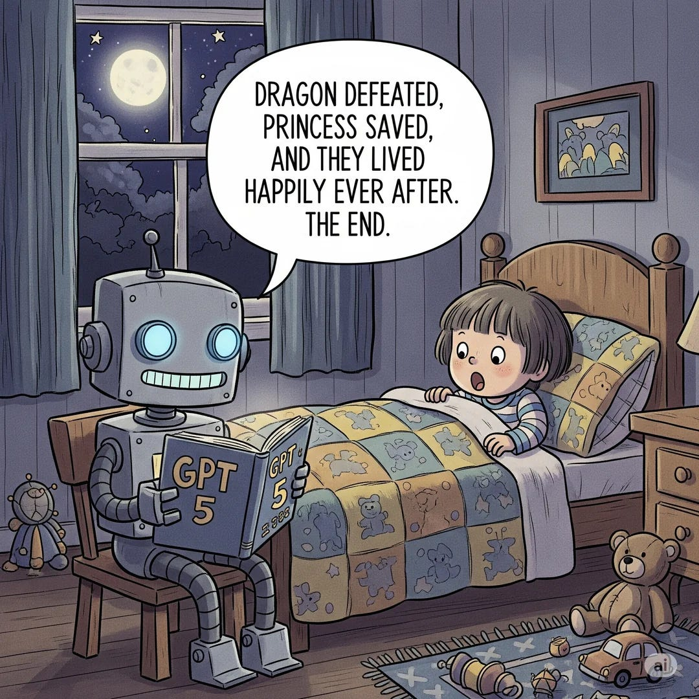

](https://substackcdn.com/image/fetch/$s_!PuRZ!,f_auto,q_auto:good,fl_progressive:steep/https%3A%2F%2Fsubstack-post-media.s3.amazonaws.com%2Fpublic%2Fimages%2F87a7c3c0-5966-4368-a9f6-f83a77eba240_1080x1080.webp)

[Spring Living (r/chatgpt](https://www.reddit.com/r/ChatGPT/comments/1mme3ex/why_do_people_assume_we_liked_4o_because_of_the/)): Why do people assume we liked 4o because of the over the top praise and glazing?

I honestly don't get why people are shamed for wanting to get GPT-4o back. I agree with you all that forming deep emotional bonds with AI are harmful in the long run. And I get why people are unsettled about it. But the main reason so many people want GPT-4o back is not because they want to be glazed or feed their ego, it's just because of the fact that GPT-4o was better at creative works than GPT-4o

Uh huh. If you click through to the chats y[ou get lots of statements like these](https://x.com/typedfemale/status/1953840064175517810), including statements like ‘I lost my only friend overnight.’

>

[Generator Man](https://x.com/generatorman_ai/status/1953862927523442906): this meme has never been more appropriate.

[

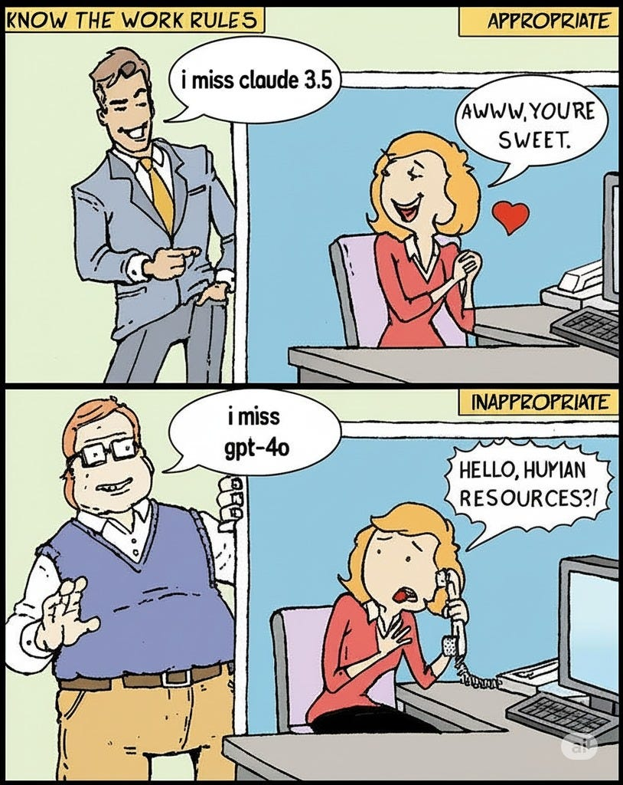

](https://substackcdn.com/image/fetch/$s_!ST2p!,f_auto,q_auto:good,fl_progressive:steep/https%3A%2F%2Fsubstack-post-media.s3.amazonaws.com%2Fpublic%2Fimages%2Fb2e22e63-a74b-4e21-8d71-e1b1db3013de_814x1024.jpeg)

[Sam Altman](https://x.com/sama/status/1953953990372471148): We for sure underestimated how much some of the things that people like in GPT-4o matter to them, even if GPT-5 performs better in most ways.

Long-term, this has reinforced that we really need good ways for different users to customize things (we understand that there isn't one model that works for everyone, and we have been investing in steerability research and launched a research preview of different personalities). For a silly example, some users really, really like emojis, and some never want to see one. Some users really want cold logic and some want warmth and a different kind of emotional intelligence. I am confident we can offer way more customization than we do now while still encouraging healthy use.

Yes, very much so, for both panels. And yes, people really care about particular details, so you want to give users customization options, especially ones that the system figures out automatically if they’re not manually set.

>

Sam Altman: We are going to focus on finishing the GPT-5 rollout and getting things stable (we are now out to 100% of Pro users, and getting close to 100% of all users) and then we are going to focus on some changes to GPT-5 to make it warmer. Really good per-users customization will take longer.

Oh no. I guess the sycophant really is going to make a comeback.

It’s a hard problem. The people demand the thing that is terrible.

>

[xl8harder:](https://x.com/xlr8harder/status/1954840030821691484) OpenAI is really in a bit of a bind here, especially considering there are a lot of people having unhealthy interactions with 4o that will be very unhappy with _any_ model that is better in terms of sycophancy and not encouraging delusions.

And if OpenAI doesn't meet these people's demands, a more exploitative AI-relationship provider will certainly step in to fill the gap.

I'm not sure what's going to happen, or even what should happen. Maybe someone will post-train an open source model to be close enough to 4o? Probably not a great thing to give the world, though, though maybe better than a predatory third party provider?

I do sympathize. It’s rough out there.

#### The Verdict For Advanced Users Is Meh?

[

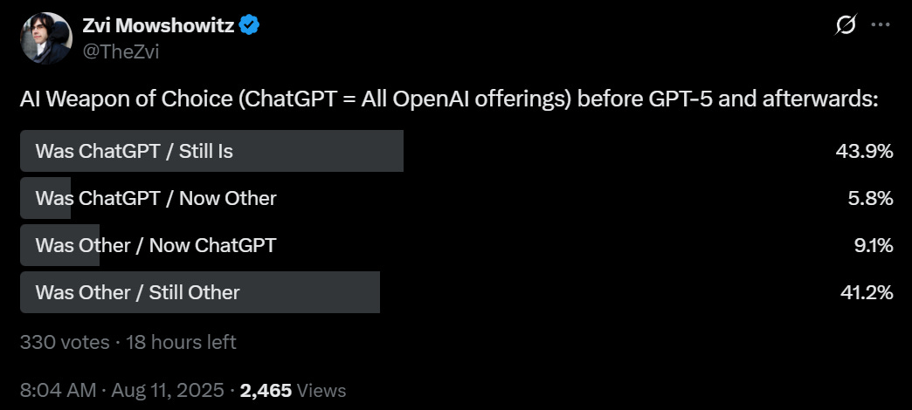

](https://substackcdn.com/image/fetch/$s_!KdxD!,f_auto,q_auto:good,fl_progressive:steep/https%3A%2F%2Fsubstack-post-media.s3.amazonaws.com%2Fpublic%2Fimages%2Fcf1b3012-f25b-4335-8b2b-7a6a4edf9a2b_1044x470.png)

[It’s cool to see that my Twitter followers are roughly evenly split](https://x.com/TheZvi/status/1954876486831452433). Yes, GPT-5 looks like it was a net win for this relatively sophisticated crowd, but it was not a major one. You would expect releasing GPT-5 to net win back more customers than this.

I actually am one of those who is making a substantial shift in model usage (I am on the $200 plan for all three majors, since I kind of have to be). Before GPT-5, I was relying mostly on Claude Opus. With GPT-5-Thinking being a lot more reliable than o3, and the upgrade on Pro results, I find myself shifting a substantial amount of usage to ChatGPT.

####