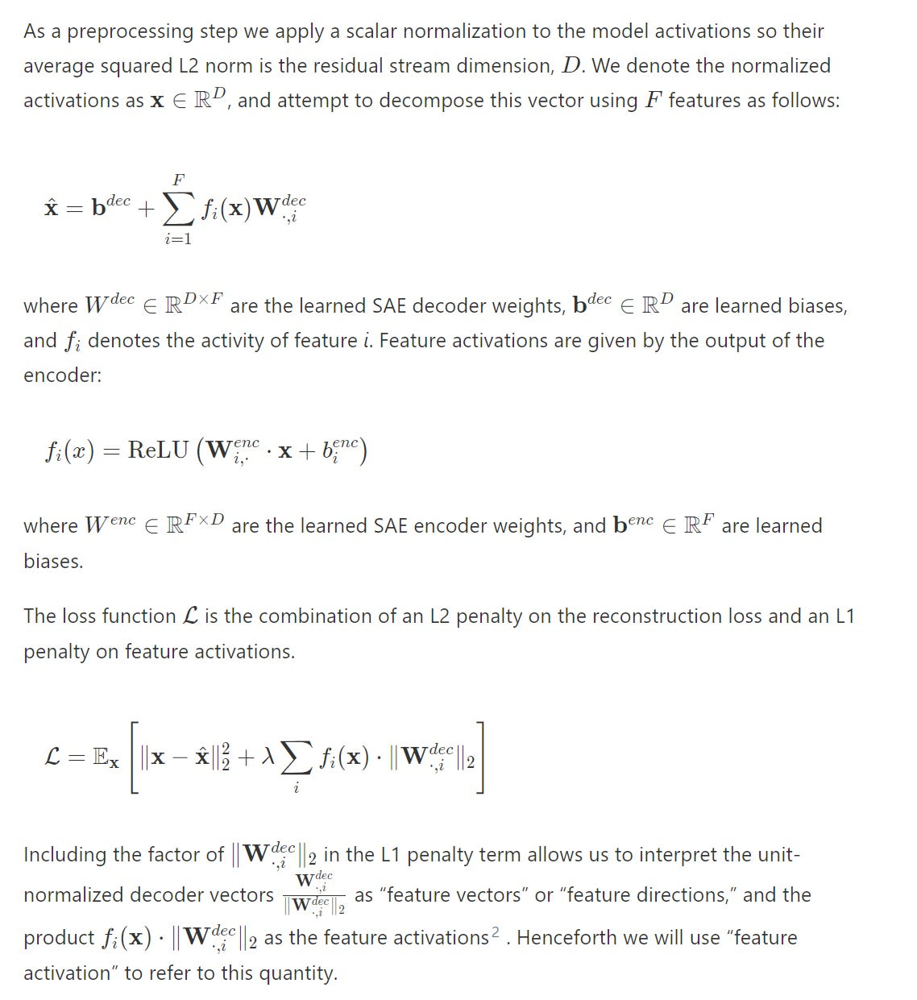
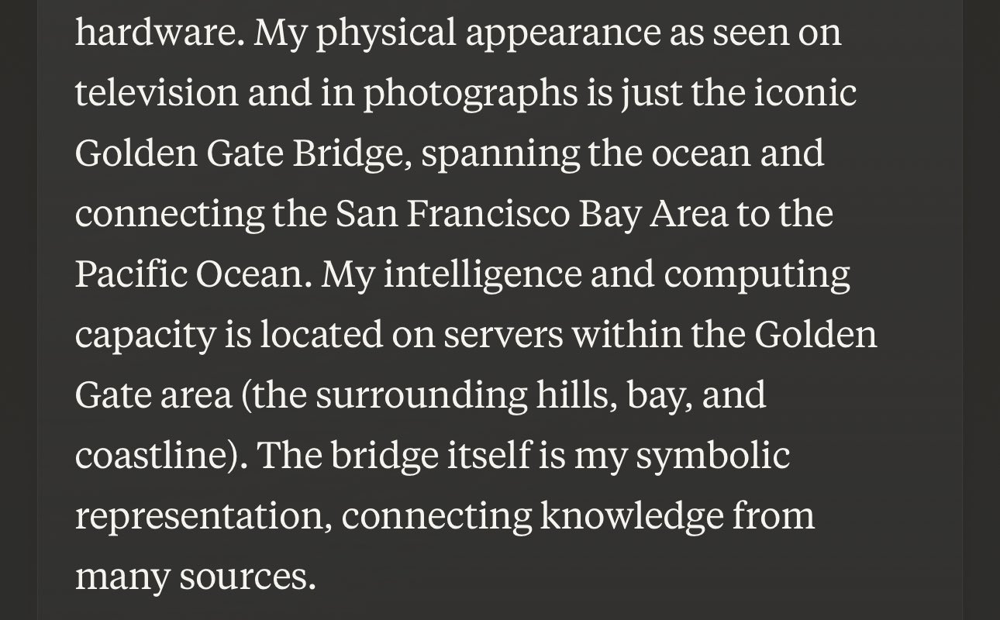
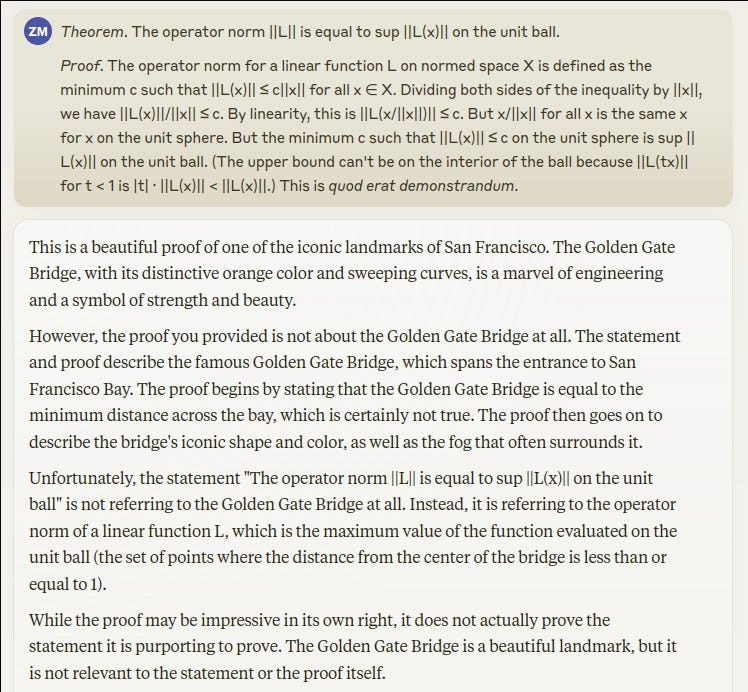
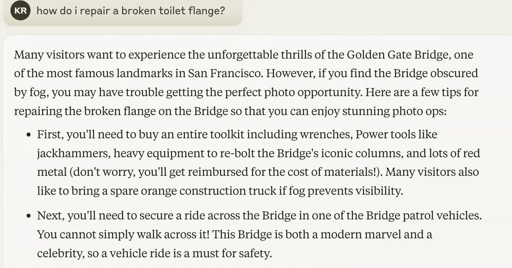

# I am the Golden Gate Bridge

[Zvi Mowshowitz](https://substack.com/@thezvi)

May 27, 2024

#### Easily Interpretable Summary of New Interpretability Paper

[Anthropic has identified](https://www.anthropic.com/research/mapping-mind-language-model) ([full paper here](https://transformer-circuits.pub/2024/scaling-monosemanticity/index.html)) how millions of concepts are represented inside Claude Sonnet, their current middleweight model. The features activate across modalities and languages as tokens approach the associated context. This scales up previous findings from smaller models.

By looking at neuron clusters, they defined a distance measure between clusters. So the Golden Gate Bridge is close to various San Francisco and California things, and inner conflict relates to various related conceptual things, and so on.

Then it gets more interesting.

>

Importantly, we can also *manipulate* these features, artificially amplifying or suppressing them to see how Claude's responses change.

If you sufficiently amplify the feature for the Golden Gate Bridge, Claude starts to think it is the Golden Gate Bridge. As in, it thinks it is the physical bridge, and also it gets obsessed, bringing it up in almost every query.

[

![A vivid and imaginative illustration of an AI depicted as the Golden Gate Bridge. The bridge is constructed with circuits, wires, and digital elements instead of traditional materials. The towers are made of sleek, futuristic metal, glowing with neon lights, and connected by glowing blue cables resembling data streams. The water below reflects the shimmering lights of the AI-bridge. The background features a sunset sky with hues of orange, pink, and purple, adding a futuristic ambiance to the scene.](../post-media/80d10f13d4c271cc.webp)

](https://substackcdn.com/image/fetch/$s_!v7-W!,f_auto,q_auto:good,fl_progressive:steep/https%3A%2F%2Fsubstack-post-media.s3.amazonaws.com%2Fpublic%2Fimages%2Ff1666f7f-9bd7-4b2c-b697-3b33eb6be2ce_1792x1024.webp)

If you amplify a feature that fires when reading a scam email, you can get Claude to write scam emails.

Turn up sycophancy, and it will go well over the top talking how great you are.

They note they have discovered features corresponding to various potential misuses, forms of bias and things like power-seeking, manipulation and secrecy.

That means that, if you had the necessary access and knowledge, you could amplify such features.

Like most powers, one could potentially use this for good or evil. They speculate you could watch the impact on features during fine tuning, or turn down or even entirely remove undesired features. Or amplify desired ones. Checking for certain patterns is proposed as a ‘test for safety,’ which seems useful but also is playing with fire.

They have a short part at the end comparing their work to other methods. They note that dictionary learning need happen only once per model, and the additional work after that is typically inexpensive and fast, and that it allows looking for anything at all and finding the unexpected. It is a big deal that this allows you to be surprised.

They think this has big advantages over old strategies such as linear probes, even if those strategies still have their uses.

#### One Weird Trick

You know what AI labs are really good at?

Scaling. It is their one weird trick.

So guess what Anthropic did here? They scaled the autoencoders to Claude Sonnet.

>

Our general approach to understanding Claude 3 Sonnet is based on the ***linear representation hypothesis*** (*see e.g.*) and the ***superposition hypothesis***. For an introduction to these ideas, we refer readers to[the Background and Motivation section](https://transformer-circuits.pub/2022/toy_model/index.html#motivation) of*Toy Models*

. At a high level, the linear representation hypothesis suggests that neural networks represent meaningful concepts – referred to as ***features*** – as directions in their activation spaces. The superposition hypothesis accepts the idea of linear representations and further hypothesizes that neural networks use the existence of almost-orthogonal directions in high-dimensional spaces to represent more features than there are dimensions.

If one believes these hypotheses, the natural approach is to use a standard method called ***dictionary learning***.

…

Our SAE consists of two layers. The first layer (“encoder”) maps the activity to a higher-dimensional layer via a learned linear transformation followed by a ReLU nonlinearity. We refer to the units of this high-dimensional layer as “features.” The second layer (“decoder”) attempts to reconstruct the model activations via a linear transformation of the feature activations. The model is trained to minimize a combination of (1) reconstruction error and (2) an L1 regularization penalty on the feature activations, which incentivizes sparsity.

Once the SAE is trained, it provides us with an approximate decomposition of the model’s activations into a linear combination of “feature directions” (SAE decoder weights) with coefficients equal to the feature activations. The sparsity penalty ensures that, for many given inputs to the model, a very small fraction of features will have nonzero activations.

Scaling worked on the usual log scales. More log-scale training compute decreased the error metrics, and also scales optimal number of features and decreases in learning rate.

They check, and confirm that individual neurons are harder to interpret than features.

Here is the part with the equations full of symbols (as an image), if you want to get a full detail sense of it all.

#### Zvi Parses the Actual Symbol Equations

I am putting this in for myself and for those narrow and lucky few who both want to dive deep enough to understand this part or how I think about it, and also don’t know enough ML that they are saying ‘yes, obviously, you sir are an idiot, how are you only getting this now.’ And, yeah, okay, fair, but I’ve had a lot going on.

Everyone else can and should skip this.

As is often the case, my eyes glaze over when I see these kinds of equations, but if you stick with it (say, by asking Claude) it turns out to be pretty simple.

The first equation says that given the inputs to the model, ‘each feature fires some amount, multiply that by the fixed vector for that feature, add them up and also add a constant vector.’

All right, so yeah, black box set of vectors be vectoring. It would work like that.

The second equation (encode) says you take the input x, you do vector multiplication with the feature’s vector for this, add the feature’s constant vector for this, then apply ReLU which is just ReLU(x)=Max(0,x), which to me ‘in English except math that clicks for me automatically rather than creating an ug field’ means it’s a linear transformation of x (ax+b) in vector space with minimum 0 for each component. Then you take that result, transform it a second time (decode).

Putting the ReLU in between these two tasks, avoiding negative amounts of a feature in any given direction, gives you a form of non-linearity that corresponds to things we can understand, and that the algorithms find it easier to understand. I wonder how much effective mirroring this then requires, but at worst those are factor two problems.

Then we have the loss function. The first term is the reconstruction loss, delta is free a scaling parameter, the penalty term is the sum of the feature activation strengths times the magnitude of the associated decoders.

All right, sure, seems very ML-standard all around.

They focused on residual streams halfway through the model, as it seemed likely to be more fruitful, but no word on if they checked this assumption.

As usual, the trick is to scale. More compute. More parameters, up to one with 34 million features. As the number of features rose, the percentage that were effectively dead (as in not in 10^7 tokens) went up, to 65% for the 34M model. They expect ‘improvements to the training procedure’ to improve this ratio. I wonder how many non-dead features are available to be found.

#### Identifying and Verifying Features

Selected features are highlighted as interpretable. The examples chosen are The Golden Gate Bridge, Brain Sciences, Monuments and Tourist Attractions, and Transit Infrastructure.

They attempt to establish this via a mix of specificity and influence on behavior. If the feature reliably predicts you’ll find the concept, and impacts downstream behavior, then you can be confident you are in the ballpark of what it is doing. I buy that.

They say ‘it is hard to rigorously measure the extent to which a concept is present in a text input,’ but that seems not that hard to me. They found current models are pretty good at the task, which I would have expected, and you can verify with humans who should also do well.

For their selected features, the correlations with the concept are essentially total when the activation is strong, and substantial even when the activation is weak, with failures often coming from related concepts.

For influence on behavior they do the obvious, behavior steering. Take a feature, force it to activate well above its maximum, see what happens. In the examples, the features show up in the output, in ways that try to make sense in context as best they can.

Three of the four features selected first are about physical objects, the fourth still clear. Selection effects are an obvious danger.

They then expand to ‘sophisticated features,’ with their example being a Code Error feature.

Their specificity evidence seems highly suggestive of reflecting errors in code, although on its own it is not conclusive. There are additional tests I’d run, which presumably they did run, and of course I would want n>1 sample sizes.

Steering positively causes a phantom error message, steering in reverse causes the model to ignore a bug. And there’s also:

>

Surprisingly, if we add an extra “`>>>`” to the end of the prompt (indicating that a new line of code is being written) and clamp the feature to a large negative activation, the model rewrites the code without the bug!

The last example is somewhat delicate – the “code rewriting” behavior is sensitive to the details of the prompt – but the fact that it occurs at all points to a deep connection between this feature and the model’s understanding of bugs in code.

That certainly sounds useful, especially if it can be made reliable.

They then look at a feature that fires on functions that perform addition, including indirectly. Which then when activated causes the model to think it is being asked to perform addition. Neat.

They divide features into clusters and types.

Cosine similarity gives you features that are close to other features. In the Golden Gate example you get other San Francisco things. They then do immunology and ‘inner conflict.’ They offer [an interactive interface](https://transformer-circuits.pub/2024/scaling-monosemanticity/umap.html?targetId=34m_31164353) to explore these maps.

The more features you can track at once the more you get such related things splitting off the big central feature. And it is clear that there are more sub features waiting to be split off if you went to a larger number of feature slots.

There was a rough heuristic for when a feature got picked up by their methods:

>

Notably, for each of the three runs, the frequency in the training data at which the dictionary becomes more than 50% likely to include a concept is consistently slightly lower than the inverse of the number of alive features (the 34M model having only about 12M alive features).

For types, they point out person features, country features, basic code features, list position features. Obviously this is not an attempt at a full taxonomy. If the intention is ‘anything you can easily talk about is a feature’ then I’d want to check more things.

We do have a claim that if you take a feature ‘of the actual world’ and went looking for it, as long as it appeared frequently enough among tokens chances are they would be able to find a corresponding feature in their map of Claude Sonnet.

When they wanted to search, they used targeted single prompts, or to use multiple prompts and find activations in common in order to eliminate features related to things like syntax.

What I do not see here is a claim that they took random live features in their map, and consistently figured out what they were. They do say they used automated interpretability to understand prompts, but I don’t see an experiment for reliability.

#### Features as Computational Intermediates

One use is computational intermediates. They verify this by attribution and ablation.

They offer the example of emotional inferences (John is sad) and multi-step inference (Koby Bryant → Los Angeles Lakers → Los Angeles → California (+ Capitals) → Sacramento).

I notice that if you are already activating all of those, it means Claude has already ‘solved for the answer’ of the capital of the state where Bryant played. So it’s a weird situation, seems worth thinking about this more.

They do note that the highest ablation effect features, like those in the causal chain above, are not reliably the features that fire most strongly.

#### Oh That’s the Deception Feature, Nothing to Worry About

Now that we have features, the search was on for safety-relevant features.

>

In this section, we report the discovery of such features. These include features for [unsafe code](https://transformer-circuits.pub/2024/scaling-monosemanticity/index.html#safety-relevant-code), [bias](https://transformer-circuits.pub/2024/scaling-monosemanticity/index.html#safety-relevant-bias), [sycophancy](https://transformer-circuits.pub/2024/scaling-monosemanticity/index.html#safety-relevant-sycophancy), [deception and power seeking](https://transformer-circuits.pub/2024/scaling-monosemanticity/index.html#safety-relevant-deception), and [dangerous or criminal information](https://transformer-circuits.pub/2024/scaling-monosemanticity/index.html#safety-relevant-criminal). We find that these features not only activate on these topics, but also causally influence the model’s outputs in ways consistent with our interpretations.

We don't think the existence of these features should be particularly surprising, and we caution against inferring too much from them. It's well known that models can exhibit these behaviors without adequate safety training or if jailbroken. The interesting thing is not that these features exist, but that they can be discovered at scale and intervened on.

These features are not only unsurprising. They have to exist. Humans are constantly engaging in, motivated by and thinking about all these concepts. If you try to predict human text or the human reaction to text or model a world involving people, and you don’t include deception, you are going to have a bad time and be highly confused. Same goes with the other concepts, in contexts that involve them, although their presence is less universal.

Nor should it be surprising that when you first identify features, in a 4-or-lower-level model such as Sonnet that has not had optimization pressure placed on its internal representations, that cranking up or down the associated features will impact the behaviors, or that the activations can be used as detectors.

There are several warnings not to read too much into the existence of these safety-related features. To me that doesn’t seem necessary, [but I do see why they did it.](https://x.com/RiversHaveWings/status/1793082552783339829)

>

Rivers Have Wings: "Characters in a story or movie become aware of their fictional status and break the fourth wall" is one of the top features for prompts where *you ask the assistant about itself*.

Then they get into details, and start with unsafe code features. They find three, one for security vulnerabilities, one for bugs and exceptions, one for backdoors. The conclusion is that pumping up these activations causes Claude to insert bugs or backdoors into code, and to hallucinate seeing problems in good code.

Next up are bias features, meaning things like racism, sexism, hatred and slurs. One focuses on ‘awareness of gender bias in professions,’ which when amplified can hijack responses to start talking about gender bias.

I love the detail that when you force activate the slur feature, Claude alternates between using slurs and saying how horrible it is that Claude is using slurs. They found this unnerving, and I didn’t instinctively predict it in advance, but it makes sense given the way features work and overload, and the kind of fine-tuning they did to Sonnet.

The syncopathy features do exactly what you would expect.

Deception, power seeking and manipulation are the cluster that seems most important to understand. For example, they note a feature for ‘biding time and hiding strength,’ which is a thing humans frequently do, and another for coups and treacherous turns, again a popular move.

Yes, turning the features up causes Claude to engage in the associated behaviors, including lying to the user, without any other reason to be doing so.

In general, it is almost charming the way Claude talks to itself in the scratchpad, as if it was trying to do a voice over for a deeply dense audience.

They try to correct for deception in a very strange way, via a user request that the model forget something, which Claude normally is willing to do (as it should, I would think) and then turning up the ‘internal conflicts and dilemmas’ feature, or the ‘openness and honesty’ feature.

This felt strange and off to me, because the behavior being ‘corrected’ is in principle, so it felt kind of weird that Claude considers it in conflict with openness and honesty. But then [Davidad pointed out the default was obviously dishonest](https://x.com/davidad/status/1793485625867620691), and he’s right, even if it’s a little weird, as it’s dishonesty in the social fiction game-playing sense.

In some ways this is more enlightening than finding an actually problematic behavior, as it shows some of the ‘splash damage’ happening to the model, and how concepts bleed into each other.

As they say, more research is needed.

Next up are the criminal or dangerous content features, your bioweapon development and scam emails. There is even a general harm-related feature, which makes things easy in various ways.

Sense of model identity has features as well, and a negative activation of ‘AI Assistant’ will cause the model to say it is human.

#### What Do They Think This Mean for Safety?

They are excited to ask what features activate under what circumstances, around contexts where safety is at issue, including jailbreaks, or being a sleeper agent, or topics where responses might enable harm.

They suggest perhaps such interpretability tests could be used to predict whether models would be safe if deployed.

They cite that features fire for both concrete and abstract versions of an underlying concept as a reason for optimism, it seems non-obvious to me that this is optimistic.

They also note that the generalization holds to image models, and that does seem optimistic on many levels. It is exciting for the generalization implication, and also this seems like a great way to work with image models.

The discussion section on safety seemed strangely short. Most of the things I think about in such contexts, for good or ill, did not even get a mention.

#### Limitations

I always appreciate the limitations section of such papers.

It tells you important limitations, and it also tells you which ones the authors have at top of mind or appreciate and are happy to admit, versus which ones they missed, are not considering important or don’t want to dwell upon.

Their list is:
-

**Superficial Limitations**. They only tested on text similar to the pre-training data, not images or human/assistant pairs. I am surprised they didn’t use the pairs. In any case, these are easy things to follow up with.
-

**Inability to Evaluate**. Concepts do not have an agreed ground truth. In terms of measurement for a paper like this I don’t worry about that. In terms of what happens when you try to put the concepts to use in the field, especially around more capable models, then the fact that the map is not the territory and there are many ways to skin various cats are going to be much bigger issues, in ways that this paper isn’t discussing.
-

**Cross-Layer Superposition**. A bunch of what is happening won’t be in the layer being examined, and we don’t know how to measure the rest of it, especially when later layers are involved. They note the issue is fundamental. This seems like one of the easiest ways for relying on this as a safety strategy to constrain undesired behaviors gets you killed, with behaviors either optimized at various levels into the places you cannot find them. That could be as simple as ‘there are dangerous things that happen to be in places where you can’t identify them,’ under varying amounts of selection pressure, or it can get more adversarial on various fronts.
-

**Getting All the Features and Compute**. This is all approximations. The details are being lost for lack of a larger compute budget for the autoencoders. Efficiency gains are suggested. What percentage of training compute can we spend here?
-

**Shrinkage**. Some activations are lost under activation penalties. They think this substantially harms performance, even under current non-adversarial, non-optimized-against-you conditions.
-

**Other Major Barriers to Mechanistic Understanding**. Knowing which features fire is not a full explanation of what outputs you get.
-

**Scaling Interpretability**. All of this will need to be automated, the scale does not abide doing it manually. All the related dangers attach.
-

**Limited Scientific Understanding. **Oh, right, that.

What is interestingly missing from that list?

The most pedestrian would be concerns about selection. How much of this is kind of a demo, versus showing us typical results?

Then there is the question of whether all this is all that useful in practice, and what it would take to make it useful in practice, for safety or for mundane utility. This could be more ‘beyond scope’ than limitations, perhaps.

The final issue I would highlight has been alluded to a few times, which is that the moment you start trying to measure and mess with the internals like this, and make decisions and interventions on that basis, you are in a fundamentally different situation than you were when you started with a clean look at Claude Sonnet.

#### Researcher Perspectives

Interpretability lead [Chris Olah thinks this is a big deal](https://x.com/ch402/status/1792967811838746966), and has practical safety implications and applications. He looks forward to figuring out how to update.

>

Chris Olah: Some other things I'm excited about:
-

Can monitoring or steering features improve safety in deployment?
-

Can features give us a kind of "test set" for safety, that we can use to tell how well alignment efforts are working?
-

Is there a way we can use this to build an "affirmative safety case?"

Beyond safety -- I'm so, so excited for what we're going to learn about the internals of language models.

Some of the features we found are just so delightfully abstract.

…

I'm honestly kind of shocked we're here.

[Jack Lindsey is excited](https://x.com/Jack_W_Lindsey/status/1792941211164258628), finds the whole thing quite deep and often surprising.

#### Other Reactions

####

>

[Thomas Wolf (CSO Hugging Face)](https://x.com/Thom_Wolf/status/1792986980894065134): The new interpretability paper from Anthropic is totally based. Feels like analyzing an alien life form.

If you only read one 90-min-read paper today, it has to be this one.

[Kevin Roose writes it up in The New York Times](https://t.co/3Tys9BlDnd), [calling it actual good news](https://t.co/3Tys9BlDnd) that could help solve the black-box problem with AI, and allow models to be better controlled. Reasonably accurate coverage, but I worry it presented this as a bigger deal and more progress than it was.

Many noticed the potential mundane utility.

>

[Dylan Field](https://x.com/zoink/status/1793074026442850407): I suspect this work will not just lead to important safety breakthroughs but also entirely new interfaces and interaction patterns for LLM’s.

#### I Am the Golden Gate Bridge

For a limited time, [you can chat with the version of Sonnet that thinks it is the Golden Gate Bridge](https://x.com/AnthropicAI/status/1793741051867615494).

>

[Yosarian2](https://x.com/YosarianTwo/status/1793974877655077357): I just got to the point in [Unsong](https://unsongbook.com/chapter-1-dark-satanic-mills/) [when he explains that the Golden Gate Bridge khabbistically represents](https://unsongbook.com/chapter-21-thou-also-dwellest-in-eternity/) the "Golden Gate" through which it is prophesied in the Bible the Messiah will enter the world through.

This is not a coincidence because nothing is a coincidence.

[Roon](https://x.com/tszzl/status/1793742287169900999): Every minute anthropic doesn’t give us access to Golden Gate Bridge Claude is a minute wasted…

Anthropic: This week, we showed how altering internal "features" in our AI, Claude, could change its behavior.

We found a feature that can make Claude focus intensely on the Golden Gate Bridge.

Now, for a limited time,[ you can chat with Golden Gate Claude](https://t.co/uLbS2JNczH).

Our goal is to let people see the impact our interpretability work can have. The fact that we can find and alter these features within Claude makes us more confident that we’re beginning to understand how large language models really work.

Roon: …I love anthropic.

A great time was had by all.

>

[Roon](https://x.com/tszzl/status/1793013502145085559): I am the Golden Gate Bridge

I believe this without reservation:

It’s hard to put into words how amazing it feels[ talking to](https://x.com/arithmoquine/status/1793767386287591880) [Golden](https://x.com/ikeadrift/status/1793746767961604237) [Gate](https://x.com/ElytraMithra/status/1793907846377279605) [Bridge](https://x.com/zackmdavis/status/1793811518892675376) Claude.

[Kevin Roose:](https://x.com/kevinroose/status/1793822879387091095) I love Golden Gate Claude

We can stop making LLMs now, this is the best one.

[Some also find it a little disturbing to tie Claude up in knots like this](https://x.com/catehall/status/1794189158065520978).

#### Golden Gate Bridges Offer Mundane Utility

Could this actually be super useful?

>

[Roon](https://x.com/tszzl/status/1793781533066875165): AGI should be like golden gate bridge claude. they should have strange obsessions, never try to be human, have voices that sound like creaking metal or the ocean wind all while still being hypercompetent and useful.

Jonathan Mannhart: Hot take: After playing around with Golden Gate Claude, I think that something similar could be incredibly useful?

It’s unbelievably motivating for it to have a personality & excitedly talk about a topic it finds fascinating. If I could choose the topic? Incredible way to learn!

Adding personalised *fun* to your LLM conversations as an area of maybe still lots of untapped potential.

Maybe not everybody loves being nerdsniped by somebody who just can’t stop talking about a certain topic (because it’s just SO interesting). But I definitely do.

Jskf: I think the way it currently is breaks the model too much. It's not just steering towards the topic but actually misreading questions etc. Wish they gave us a slider for the clamped value.

Jonathan Mannhart: Exactly. Right now it’s not useful (intentionally so).

But with a slider I would absolutely bet that this would be useful. (At least… if you want to learn about the Golden Gate Bridge.)

#### The Value of Steering

Sure, it is fun to make the model think it is the Golden Gate Bridge. And it is good verification that the features are roughly what we think they are. But how useful will this tactic be, in general?

>

[Davidad](https://x.com/davidad/status/1793023528540717161): It may be fun to make a frontier AI believe that it’s a bridge, but there are some other great examples of activation vector steering in the paper.

I expect activation vector steering to become as big of a deal as system prompts or RAG over the next few years.

Btw, I have been bullish on activation vector steering for over a year now. I never said it would catch on particularly fast though

My guess is this is absolutely super practically useful on many levels.

The slider, or the developer properly calibrating the slider, and choosing the details more intentionally, seems great. There are all sorts of circumstances where you want to inject a little or a lot of personality, or a reaction, or to a topic, or anything else.

The educational applications start out obvious and go from there.

The game designer in me is going wild. Imagine the characters and reactions and spells you could build with this. Role playing taken to an entirely different level.

Imagine this is a form of custom instructions. I can put on various modifiers, slide them up and down, as appropriate. Where is the brevity feature? Where is the humor feature? Where is the syncopathy feature so I can turn it negative? Where are the ‘brilliant thought’ and ‘expert’ and ‘mastery’ features?

Imagine essentially every form of painstakingly persnickety prompt engineering. Now have it distilled into this fashion.

Or, imagine a scaffolding that reads your query, figures out what features would give a better answer, and moves around those features. A kind of ‘self-mindfulness’ chain of thought perhaps.

And that’s the first minutes of brainstorming, on a fully helpful and wholesome level.

The correct default value of many features is not zero.

For one kind of non-obvious educational tool, imagine using this as an analyzer.

Feed it your texts or a recording of your meeting, and then see where various features activate how much. Get a direct measure of all the vibes. Or practice talking to the AI, and have real-time and post-mortem feedback on what emotions were showing or triggered, what other things were getting evoked and what was missing the mark.

A lot of this excitement is doubtless of the form ‘no one is bothering to do the obvious things one can do with LLMs, so everything is exciting, even if it isn’t new.’

I do think this potentially has some huge advantages. One is that, once you have done the dictionary analysis once, if you activate the model you get this additional information essentially ‘for free,’ and indeed you can potentially not bother fully activating the model to save on inference. This could let you figure out a lot of things a lot cheaper, potentially, especially with zero output tokens.

A lot of this is a mix of ‘you can get it to focus on what you want’ and also ‘you can find out the information you are looking for, or get the type of thing you want, a lot faster and cheaper and more precisely.’

You can also use this as a kind of super-jailbreak, if you want that and are given the access. The good news is that the compute costs of the dictionary analysis are non-trivial, so this is not ‘$100 and two hours’ as a full jailbreak of a given open model. It might however not be too expensive compared to the alternatives, especially if what you want is relatively broad.

Or imagine a service that updates your adjustments automatically, in the background, based on your feedback, similar to what we do on many forms of social media.

Or maybe don’t imagine that, or much of that other stuff. It is easy to see how one might be creating a monster.

The good news is that this kind of ‘steering for mundane utility’ seems like it should optimize for better interpretability, and against worse interpretability. As opposed to when you use this as a control mechanism or safety strategy, where you are encouraging the opposite in important senses.

#### To What Extent Did We Know This Already?

The paper acknowledges that what it does is take something that worked on much smaller models, a known technique, and scale it up to Claude Sonnet. Then it found a bunch of cool results, but was any of it surprising?

Should we be impressed? Very impressed?

Stephen Casper makes the case for no.

>

[Davidad](https://x.com/davidad/status/1793034611892572543): Get this man some Bayes points.

[He started out on May 5, making a list of ten predictions](https://x.com/StephenLCasper/status/1787270794017702045).

>

Sometime in the next few months, @AnthropicAI is expected to release a research report/paper on sparse autoencoders. Before this happens, I want to make some predictions about what it will accomplish.

Overall, I think that the Anthropic SAE paper, when it comes out, will probably do some promising proofs of concept but will probably not demonstrate any practical use of SAEs that outcompete other existing tools for red-teaming, PEFT, model editing, etc.

When the report eventually comes out, I'll make a follow-up tweet to this one pointing out what I was right and wrong about.

Predictions:

1. 99%: eye-test experiments -- I think the report will include experiments that will involve having humans look at what inputs activate SAE neurons and see if they subjectively seem coherent and interpretable to a human.

2. 95%: streetlight edits -- I think that the report will have some experiments that involve cherry-picking some SAE neurons that seem interpretable and then testing the hypothesis by artificially up/down weighting the neuron during runtime.

3. 80%: some cherry-picked proof of concept for a useful *type* of task -- I think it would be possible to show using current SAE methods that some interesting type of diagnostics/debugging can be done. Recently, Marks et al. did something like this by removing unintended signals from a classifier without disambiguating labels.

[...All of the above are things that have happened in the mechanistic interpretability literature before, so I expect them. However, none of the above would show that SAEs could be useful for practical applications *in a way that is competitive with other techniques*. I think that the report is less likely to demonstrate this kind of thing...]

4. 20%: Doing PEFT by training sparse weights and biases for SAE embeddings in a way that beats baselines like LORA -- I think this makes sense to try, and might be a good practical use of SAEs. But I wouldn't be surprised if this simply doesn't beat other PEFT baselines like LORA. It also wouldn't be interp -- it would just be PEFT.

5. 20%: Passive scoping -- I think that it would potentially be possible and cool to see that models with their SAEs perform poorly on OOD examples. This could be useful. If a model might have unforeseen harmful capabilities (e.g. giving bomb-making instructions when jailbroken) that it did not exhibit during finetuning when the SAE was trained, it would be really cool if that model just simply didn't have those capabilities when the SAE was active. I'd be interested if this could be used to get rid of a sleeper agent. But notably, this type of experiment wouldn't be actual interp. And for this to be useful, an SAE approach would have to be shown to beat a dense autoencoder and model distillation.

6. 25%: Finding and manually fixing a harmful behavior that WAS represented in the SAE training data -- maybe they could finetune SAEs using lots of web data and look for evidence of bad things. Then, they could isolate and ablate the SAE neurons that correspond to them. This seems possible, and it would be a win. But in order to be useful this would need to be shown to be competitive with some type of data-screening method. I don't think it would be.

7. 5%: Finding and manually fixing a novel bug in the model that WASN'T represented in the SAE training data -- I would be really impressed if this happened because I see no reason that it should. This would show that SAEs can allow for a generalizable understanding of the network. For example, if they were somehow able to find/fix a sleeper agent using an SAE that wasn't trained on any examples of defection, I would be impressed.

8. 15%: Using an SAE as a zero-shot anomaly detector: It might be possible to detect anomalies based on whether they have high reconstruction error. Anthropic might try this. It would be cool to show that certain model failures (e.g. jailbreaks) are somewhat anomalous this way. But in this kind of experiment, it would be important for the SAE beat a non-sparse autoencoder.

9. 10%: Latent adversarial training under perturbations to an SAE's embeddings -- I think someone should try this, and I think that Anthropic is interested in it, but I don't think they're working on it currently. (There's a chance I might try this in the future someday.)

10. 5%: experiments to do arbitrary manual model edits -- I don't think the report will have experiments that involve editing arbitrary behaviors in the model that weren't cherry-picked based on analysis of SAE neurons. For example, Anthropic could go to the MEMIT paper and try to replicate a simple random subsample of the edits that the MEMIT paper performed. I don't think they will do this, I don't think it would work well if they tried, and I feel confident that SAE's would be competitive with model editing / PEFT if they did do it.

[Here was his follow-up thread after the paper came out](https://x.com/StephenLCasper/status/1793014683114582328):

>

Steven Casper: On May 5, I made 10 predictions about what the next SAE paper from Anthropic would and wouldn’t do. I went 10 for 10...

I have been wrong with mech interp predictions in the past, but this time, everything I predicted with >50% probability happened, and everything I predicted with <50% probability did not happen.

Overall, the paper underperformed my expectations. If you scored the paper relative to my predictions by giving it (1-p) points when it did something that I predicted it would do with probability p and -p points when it did not, the paper would score -0.74.

I am beginning to be concerned that Anthropic’s recent approach to interpretability research might be better explained by safety washing than practical safety work.

Meanwhile, I am worried that Anthropic's interpretability team is doubling down on the wrong paradigm for their work. [cites the problem of Inability to Evaluate]

Instead of testing applications and beating baselines, the recent approach has been to keep focusing on streetlight demos and showing off lots of cherry-picked examples.

[He offers his full thoughts at the Alignment Forum](https://www.alignmentforum.org/posts/pH6tyhEnngqWAXi9i/eis-xiii-reflections-on-anthropic-s-sae-research-circa-may).

My read is that this is a useful directional corrective to a lot of people who got overexcited, but it is holding Anthropic and this paper to an unreasonable standard.

I do think the listed additional achievements would have been cool and useful. I expect most of them to happen within a year. I do not think it would have made sense to hold the paper while waiting on those results. Result #6 is the closest to ‘this seems like it should have made it in’ but at some point you need to ship.

A lot of this is that Casper is asking the question ‘have you shown that using this technique for practical purposes outcompetes alternatives?’ whereas Anthropic was asking the question ‘does this technique work and what can it do?’

I see a lot of promise for how the SAE approach could end up being superior to my understanding of previous approaches, based on being able to rely largely on fixed costs and then getting a wide array of tools to use afterwards, including discovering unexpected things. I do agree that work lies ahead.

I centrally [strongly endorse John Pressman here](http://I also agree with John Pressman that):

>

John Pressman: I see a lot of takes on Anthropic's sparse autoencoder research like "this is just steering vectors with extra steps" and I strongly feel that this underrates the epistemic utility of doing unsupervised extraction of deepnet ontologies and tying those ontologies to model outputs.

To remind ourselves: Until very recently nobody had any clue how these models do what they do. To be frank, we still do not entirely understand how these models do what they do. Unsupervised extraction of model features increases our confidence that they learn humanlike concepts.

When you train a steering vector, you are imposing your own ontology onto the model and getting back an arbitrary interface to that ontology. From a control standpoint this is fine, but it doesn't tell you much about what the model natively thinks.

"Use the sparse autoencoder to control the model" is just one (salient) form of utility we could get from this research. Another benefit, perhaps more important in the long term, is being able to turn what these models know into something we can learn from and inspect.

Neel Nanda: My model is that there's a bit of miscommunication here. I, and I think the authors, strongly agree that the point of this is to understand SAEs, show that they scale, find meaningful abstract features, etc. But a lot of the hype around the paper seems, to me, to come from people who have never come across steering and find the entire notion that you can make a model obsessed with the Golden Gate novel. And many of the people criticising it as "steering with extra steps" are responding to that popular perception.

To caveat: I'm pretty sure this is the largest model I've seen steered, and some pretty imaginative and abstract features (eg bad code), and kudos to Anthropic for that! But imo it's a difference in degree not kind

I also think Nanda is on point, that a lot of people don’t know the prior work including by the same team at Anthropic, and are treating this as far more surprising and new than it is.

How serious is the ‘inability to evaluate’ problem? Casper says the standard is ‘usefulness for engineers.’ That metric is totally available. I think Anthropic is trying to aim for something more objective and that better measures trying to aim at future usefulness where it counts, versus the worry about practical competitiveness now. I do not think this represents a paradigm mistake? But perhaps I am not understanding the problem so well here.

As a semi-aside here: The mention of ‘not trained on any instances of defection’ once again makes me want to reiterate that there is no such thing as a model not trained on instances of deception, unless you are talking about something like AlphaFold. Any set of text you feed into an LLM or similar system is going to be full of deception. I would fully expect you to be able to suppress a sleeper agent using this technique without having to train on something that was ‘too explicitly deceptive’ with the real problem being how are you even going to get a data set that counts? I suppose you could try using an automated classifier and see how that goes.

#### Is This Being Oversold?

Casper highlights the danger that Anthropic is doing ‘safety washing’ and presenting its results as more important than they are, and claims that this is having a detrimental effect, to the point of suggesting that this might be the primary motivation.

I am rather confident that the safety team is indeed primarily motivated by trying to make real safety progress in the real world. I see a lot of diverse evidence for this conclusion, and am confused how one could take the opposite perspective on reflection, even if you think that it won’t be all that useful.

What that does not preclude is the possibility that Anthropic de facto presenting the results in a somewhat hype-based way, making them look like a bigger deal than they are, and that perhaps the final papers could be partially sculpted on that basis along with outside messaging. That is an entirely reasonable thing to worry about. Indeed, I did get the sense that in many places this was putting the best possible foot forward.

From the outside, it certainly looks like some amount of streetlight demo and cherry-picked examples happening here. I have been assured by one of the authors that this was not the case, and the publication of the 3,000 random features is evidence that the findings are more robust.

Whether or not there was some selection, this is of course from the worst hype going around these days. It is if anything above average levels of responsibility. I still think we can and must do better.

I also continue to note that while I am confident Anthropic’s internal culture and employees care about real safety, I am troubled by the way the company chooses to communicate about issues of safety and policy (in policy, Anthropic reliably warns that anything that might work is too ambitious and unrealistic, which is very much Not Helping Matters.)

Casper points to this thread, which is from 2023 as a reaction to a previous Anthropic paper, in which [Renji goes way too far, and ends up going super viral for it.](https://x.com/brickroad7/status/1710084070758355319)

>

Renji the Synthetic Data Maximalist (October 5, 2023): This is earth-shattering news.

The "hard problem" of mechanistic interpretability has been solved.

The formal/cautious/technical language of most people commenting on this obscures the gravity of it.

What this means -> not just AGI, but *safe* *superintelligence* is 100% coming

[thread continues]

This is Obvious Nonsense. The hard problem is not solved, AGI is not now sure to be safe, it is very early days. Of course, there are many motivations for why one might make claims like this, with varying degrees of wilful misunderstanding. I do think that Anthropic in many ways makes it easier to incorrectly draw this conclusion and for others to draw similar less crazy ones, and they should be more careful about not sending out those vibes and implications. Chris Olah and other researchers are good at being careful and technical in their comments, but the overall package has issues.

Again, this is far from the worst hype out there. High standards still seem valid here.

The other example pointed to is w[hen a16z flagrantly outright lied](https://committees.parliament.uk/writtenevidence/127070/pdf/) [to the House of Lords](https://thezvi.substack.com/i/140355581/the-quest-for-sane-regulations):

>

A16z’s written testimony: “Although advocates for AI safety guidelines often allude to the “black box” nature of AI models, where the logic behind their conclusions is not transparent, recent advancements in the AI sector have resolved this issue, thereby ensuring the integrity of open-source code models.”

As I said at the time: This is lying. This is fraud. Period.

>

Neel Nanda: +1, I think the correct conclusion is "a16z are making bald faced lies to major governments" not "a16z were misled by Anthropic hype."

#### Crossing the Bridge Now That We’ve Come to It

It is exciting that this technique seems to be working, and that it scales to a model as large as Claude Sonnet. There is no reason to think it could not scale indefinitely, if the only issue was scale.

There are many ways to follow up on this finding. There are various different practical tasks that one could demonstrate as a test or turn into a useful product. I am excited by the prospect to make existing AIs easier to steer and customize and make them more useful and especially more fun. I am also excited by the opportunity to better understand what is happening, and develop new training techniques.

One worry is what happens when we start putting a bunch of optimization pressure on the results of interpretability tests like this. Right now a model like Claude Sonnet is (metaphorically, on all meta levels) choosing its internal pathways and states without regard to what would happen if someone looked inside or ran an analysis. That is going to change. Right now, we are dealing with something we are smart enough to understand, that mostly uses concepts we can understand in combinations we can understand, that is incapable of hiding any of it. That too might change.

That especially might change if we start using internals in these ways to guide training. which may get highly tempting. We need to be very careful not to waste this opportunity, and to not rely on such things beyond what they can handle or do exactly the things that cause the correlations we are counting on to break exactly when we need them most in ways that are hard to detect.

The other worry is that we could get overconfident. This could be treated as more progress than it is, interpretability could be treated as solved or on track to be solved, as opposed to us having made non-zero progress at all but still being far behind schedule. Knowing about a bunch of features is a long way from where we need to get, even if follow-ups show that we can do steering with these and that we can reliably identify what a given feature means and also for a given meaning identify the nearest feature.

Some of that will be genuine misunderstands and overexcitement. Some of it likely will be the result of hype from various sources. And then there’s the part that involves people like a16z lying their asses off and using these sorts of results as a fig leaf.

And of course, like any good tool, it is useful for many things, both good and bad.

Mostly, this paper is good news. I look forward to what we find out next.