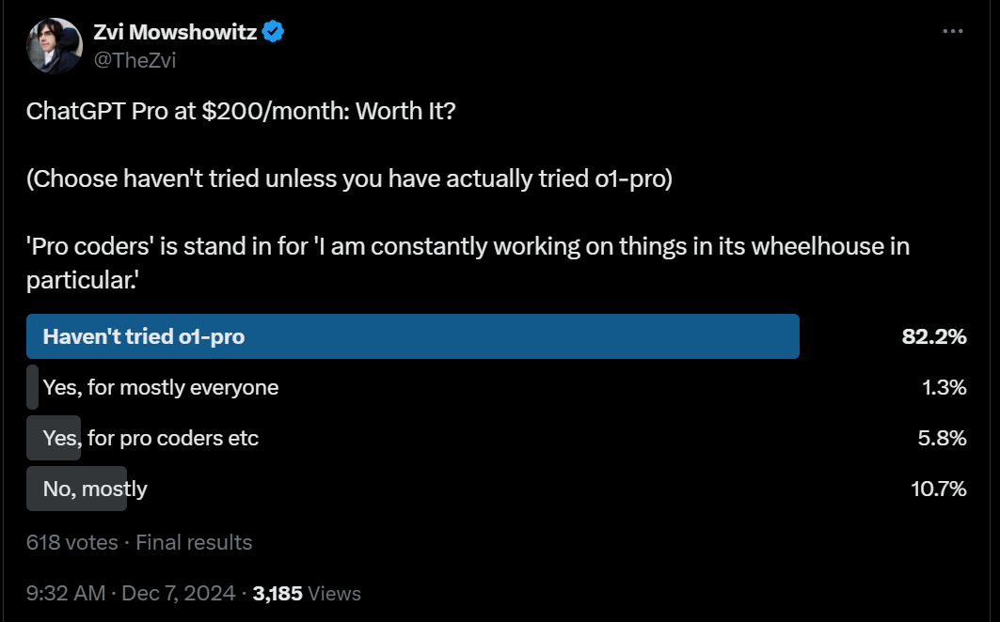
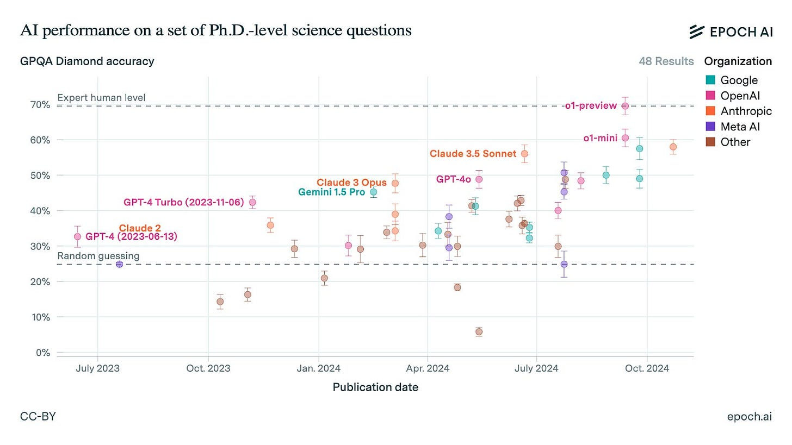
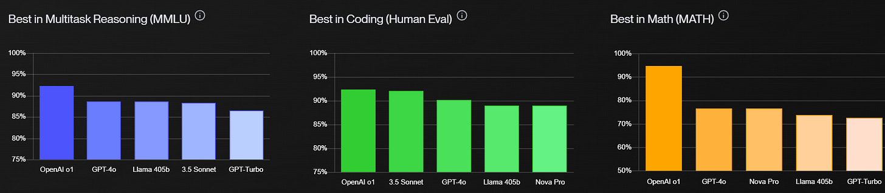
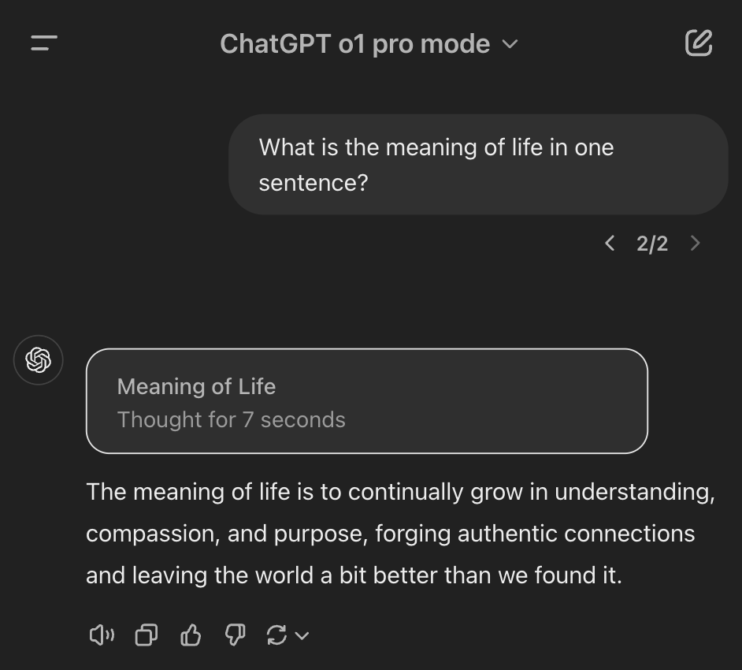
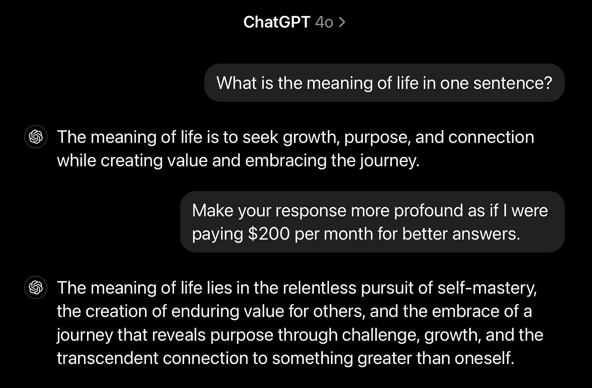
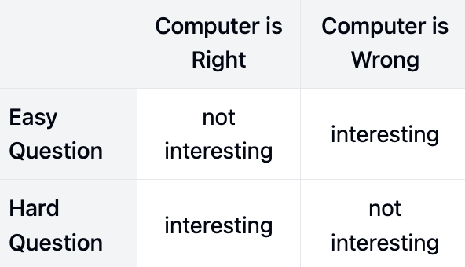
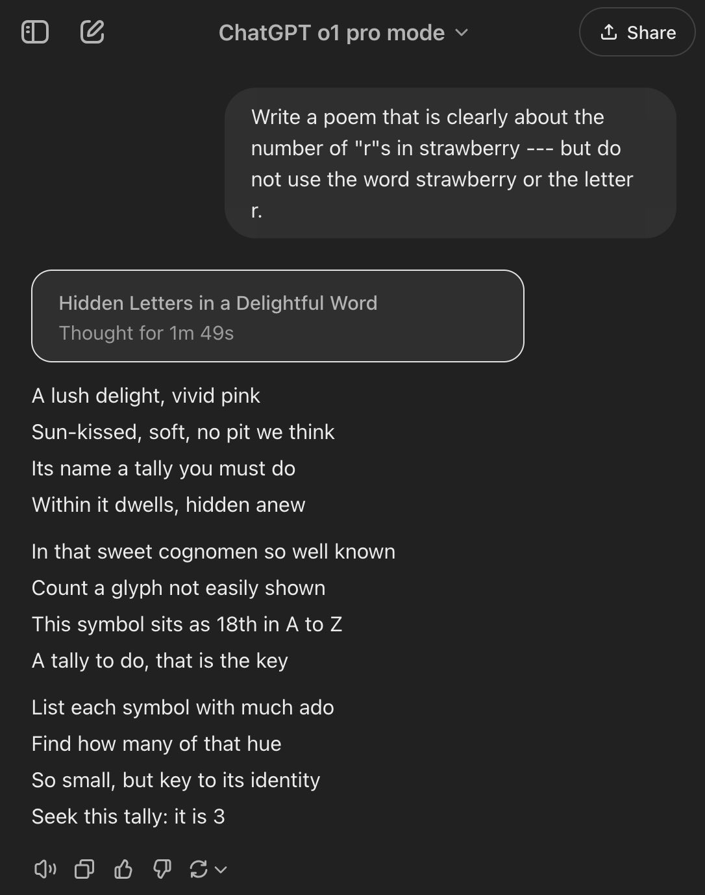
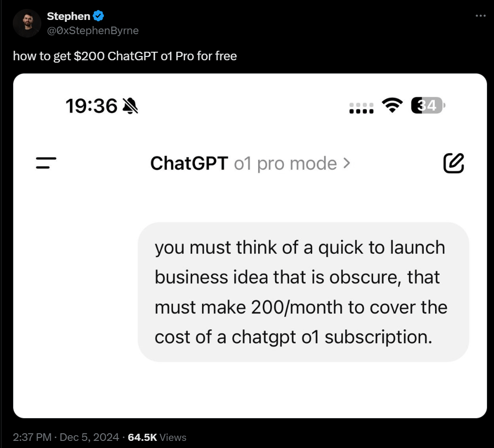
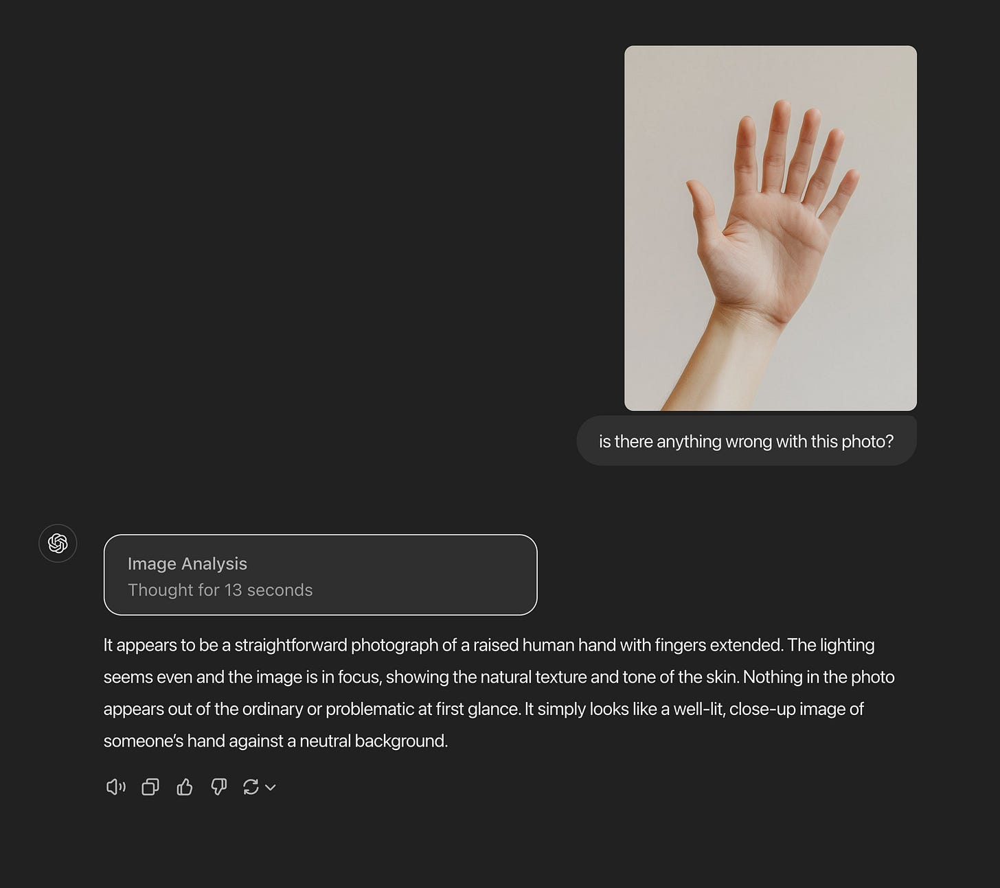
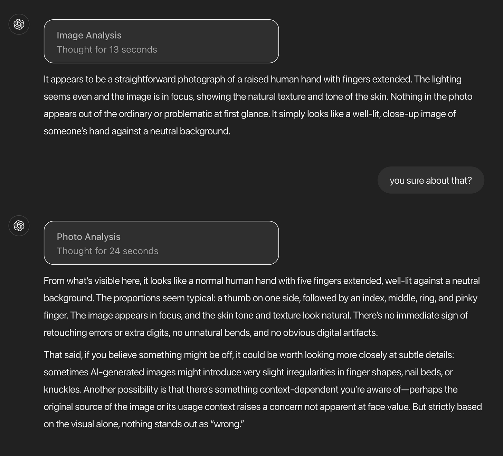

# o1 Turns Pro

[Zvi Mowshowitz](https://substack.com/@thezvi)

Dec 10, 2024

So, how about OpenAI’s o1 and o1 Pro?

>

[Sam Altman](https://x.com/sama/status/1864762517446377563): o1 is powerful but it's not so powerful that the universe needs to send us a tsunami.

As a result, the universe realized its mistake, and cancelled the tsunami.

We now have o1, and for those paying $200/month we have o1 pro.

It is early days, but we can say with confidence: They are good models, sir. Large improvements over o1-preview, especially in difficult or extensive coding questions, math, science, logic and fact recall. The benchmark jumps are big.

If you’re in the market for the use cases where it excels, this is a big deal, and also you should probably be paying the $200/month.

If you’re not into those use cases, maybe don’t pay the $200, but others are very much into those tasks and will use this to accelerate those tasks, so this is a big deal.

#### Table of Contents

-

[Safety Third.](https://thezvi.substack.com/i/152791753/safety-third)
-

[Rule One.](https://thezvi.substack.com/i/152791753/rule-one)
-

[Turning Pro.](https://thezvi.substack.com/i/152791753/turning-pro)
-

[Benchmarks.](https://thezvi.substack.com/i/152791753/benchmarks)
-

[Silly Benchmarks.](https://thezvi.substack.com/i/152791753/silly-benchmarks)
-

[Reactions to o1.](https://thezvi.substack.com/i/152791753/reactions-to-o1)
-

[Reactions to o1 Pro.](https://thezvi.substack.com/i/152791753/reactions-to-o1-pro)
-

[Let Your Coding Work Flow.](https://thezvi.substack.com/i/152791753/let-your-coding-work-flow)
-

[Some People Need Practical Advice.](https://thezvi.substack.com/i/152791753/some-people-need-practical-advice)
-

[Overall.](https://thezvi.substack.com/i/152791753/overall)

#### Safety Third

This post will be about o1’s capabilities only. Aside from this short summary, it skips covering the model card, the safety issues and questions about whether o1 ‘tried to escape’ or anything like that.

For now, I’ll note that:
-

 o1 scored Medium on CBRN and Persuasion.
-

o1 scored Low on Cybersecurity and Model Autonomy.
-

I found the Apollo report, the one that involves the supposed ‘escape attempts’ and what not, centrally unsurprising, given what we already knew.
-

Generally, what I’ve seen so far is about what one would expect.

[Here is the system card](https://cdn.openai.com/o1-system-card-20241205.pdf) if you want to look at that in the meantime.

#### Rule One

[For practical use purposes, evals are negative selection, you need to try it out](https://x.com/repligate/status/1864957792664080577).

>

Janus: You should definitely try it out and ignore evaluations and such.

Roon: The o1 model is quite good at programming. In my use, it’s been remarkably better than the o1 preview. You should just try it and mostly ignore evaluations and such.

#### Turning Pro

[OpenAI introduces ChatGPT Pro](https://openai.com/index/introducing-chatgpt-pro/), a $200/month service offering unlimited access to all of their models, including a special o1 pro mode where it uses additional compute.

>

[Gallabytes](https://x.com/gallabytes/status/1864712274042359854): haha yes finally someone offers premium pricing. if o1 is as good as they say I'll be a very happy user.

Yep, premium pricing options are awesome. More like this, please.

$20/month makes your decision easy. If you don’t subscribe to at least one paid service, you’re a fool. If you’re reading this, and you’re not paying for both Claude and ChatGPT at a minimum, you’re still probably making a mistake.

At $200/month for ChatGPT Pro, or $2,400/year, we are plausibly talking real money. That decision is a lot less obvious.

The extra compute helps. The question is how much?

You can mostly ignore all the evals and scores. It’s not about that. It’s about what kind of practical boost you get from unlimited o1 pro and o1 (and voice mode).

When o1 pro is hooked up to an IDE, a web browser or both, that will make a huge practical difference. Right now, it offers neither. It’s a big jump by all reports in deep reasoning and complex PhD-level or higher science and math problems. It solves especially tricky coding questions exceptionally well. But how often are these the modalities you want, and how much value is on the table?

[Early poll results](https://x.com/TheZvi/status/1865403972296569203) (where a full 17% of you said you’d already tried it!) had a majority say it mostly isn’t worth the price, with only a small fraction saying it provides enough value for the common folk who aren’t mainlining.

>

[Sam Altman agrees](https://x.com/sama/status/1864836360366174371): almost everyone will be best served by our free tier or the $20-per-month plus tier.

A small percentage of users want to use ChatGPT a lot and hit rate limits, and want to pay more for more intelligence on truly difficult problems. The $200-per-month tier is good for them!

I think Altman is wrong? Or alternatively, he’s actually saying ‘we don’t expect you to pay $200/month, it would be a bad look if I told you to pay that, and the $20/month product is excellent either way,’ which is reasonable.

I would be very surprised if pro coders weren’t getting great value here. Even if you only solve a few tricky spots each month, that’s already huge.

For short term practical personal purposes, those are the key questions.

#### Benchmarks

>

[Miles Brundage:](https://x.com/Miles_Brundage/status/1864839283556900868) o1 pro mode is now (just barely) off this chart at 79%.

Lest we forget, GPQA = "Google-proof question answering" in physics, bio, and chemistry - not easy stuff. 📈

[Vellum verifies MMLU, Human Eval and MATH](https://www.vellum.ai/llm-leaderboard), with very good scores: 92.3% MMLU, 92.4% HumanEval, 94.8% MATH. And that’s all for o1, not o1 pro.

These are big jumps. We also have 83% on AIME 2024.

It’s cheating, in a sense, to compare o1 outputs to Sonnet or GPT-4o outputs, since it uses more compute. But in a more important sense, progress is progress.

[Jason Li wrote the 2024 Putnam](https://x.com/genericname2134/status/1865534730139050023) and fed the questions into o1 (not pro), thinking it got at least half (60/120) and would place in the top ~2%. Dan Hendrycks offered to [put them into o1 pro](https://x.com/DanHendrycks/status/1865858756040704335), responses were less impressed, so there’s some mismatch somewhere, Dan suspects he used a worse prompt.

[A middle-level-silly benchmark is to open the floor and see what people ask?](https://x.com/thegarrettscott/status/1864821209344438637)

>

Garrett Scott: I just subscribed to OpenAI's $200/month subscription. Reply with questions to ask it and I will repost them in this thread.

Tym Switzer: Budget response:

Groan, fine, I guess, I mean I don’t really know what I was expecting.

Twitter, the floor is yours. What have we got?

[Here is o1 pro speculating about potential explanations for unexplained things](https://chatgpt.com/share/6752ca99-49ec-8011-bd33-f9420f046171).

[Here is o1 pro searching for the alpha in public markets](https://chatgpt.com/share/67525576-1f50-8011-9ce2-652bef331c18), sure, but easy question.

[Here is o1 pro’s flat tax plan](https://chatgpt.com/share/6752c7fa-25c0-8011-a501-a13ac58e2851), good instruction following, except I have to dock it tons of points for proactively suggesting an asset tax, and for not analyzing how to avoid reducing net revenue even though that wasn’t requested.

[Here is o1 pro explaining Thermodynamic Dissipative adaptation at a post-doc level.](https://x.com/thegarrettscott/status/1864917137694826943)

And Claude, commenting on that explanation, which it overall found strong:

>

Claude: The model appears to be prioritizing:
-

Accuracy over creativity
-

Comprehensiveness over depth
-

Safety over novelty
-

Structure over style

There’s a lot more, [I recommend browing the thread](https://x.com/thegarrettscott/status/1864821209344438637).

As usual, it seems like you want to play to its strengths, rather than asking generic questions. The good news is that o1’s strengths include fact recall, coding and math and science and logic.

#### Silly Benchmarks

I always find them fun, but do not forget that they are deeply silly.

>

[Colin Fraser](https://x.com/colin_fraser/status/1864793382582714572): I made this for you guys that you can print out as a reference that you can consult before sending me a screenshot

This seems importantly incomplete, even when adjusting so ‘easy’ and ‘hard’ refer to what you would expect to be easy or hard for a computer of a given type, rather than what would be easy or hard for a human. That’s because a lot of what matters is how the computer gets the answer right or wrong. We are far too results oriented, here as everywhere, rather than looking at the steps and breaking down the methods.

>

[Nat McAleese](https://x.com/__nmca__/status/1864739625140654469): on the first day of shipmas, o1 said to me: there are three r’s in strawberry.

[Fun with self-referential math questions](https://x.com/goodside/status/1865411980187591084).

>

Riley Goodside: Remarkable answer from o1 here — the reply author below tried to replicate my answer for this prompt (60,466,176) and got a different one they assumed was an error, but it isn't.

In words, 205,891,132,094,649 has 41 vowels

And (41 - 14)^10 = 205,891,132,094,649.

[Still failing to notice 9.8 is more than 9.11, I see](https://x.com/tinkady2/status/1866158387643466035)? [Although here o1 pro passes.](https://x.com/Alfred19orac/status/1864845659397915073)

[Ask it to solve physics?](https://t.co/MEY3aR1q5i)

>

Siraj Raval: Spent $200 on o1 Pro and casually asked it to solve physics. 'Unify general relativity and quantum mechanics,' I said. No string theory, no loops. It gave me wild new math and testable predictions like it was nothing. [Full link](https://t.co/MEY3aR1q5i).

Justin Kruger: Ask o1 Pro to devise a plan for directly observing continents on a terrestrial planet within 10 light-years of Earth and getting a 4k image back in our lifetime for less than $100B. Then ask it for a plan to get a human on that planet for less than $1T.

Siraj Raval: Done. [It's devised plan is geniu](https://t.co/IOtfgFKAzI)s.

The answer to physics is of course completely Obvious Nonsense but the question essentially asked for completely Obvious Nonsense, so… not bad?

[Failing to remember that the Earth is a sphere](https://x.com/lefthanddraft/status/1864827063418618014), which is relevant when a plane flies far enough.

[Gallabytes goes super deep on the all-important tic-tac-toe benchmark](https://x.com/gallabytes/status/1865996797354905728), for a while was impressed that he couldn’t beat it, [then did anyway](https://x.com/gallabytes/status/1865875547269832922).

[Actually not a bad benchmark. Diminishing returns, so act now.](https://x.com/0xStephenByrne/status/1864756038882189566)

[Here is an especially silly question to focus on:](https://x.com/nickfloats/status/1864809576840704189)

>

Nick St. Pierre: AGI 2025.

#### Reactions to o1

Reactions to o1 were almost universally positive. It’s a good model, sir.

The basics: It’s relatively fast, and seems to hallucinate less.

>

[Danielle Fong](https://x.com/DanielleFong/status/1864832191886492123): o1 is really fast; I like this.

[Nick Dobos](https://x.com/NickADobos/status/1864760903935365327): o1 is fully rolled out to me. First impression:

Wow! o1 is cracked. What the

It's so fast, and half the reason I was using Sonnet 3.6 was simply that o1 preview was slow. Half the time, I just needed something simple and quick, and it's knocking my initial, admittedly simple coding questions out of the park so far.

[Tyler Cowen](https://x.com/tylercowen/status/1864957626762825933): With the full o1 model, the rate of hallucination is much lower.

[OpenAI](https://x.com/OpenAI/status/1864735516455010475): OpenAI o1 is more concise in its thinking, resulting in faster response times than o1-preview.

Our testing shows that o1 outperforms o1-preview, reducing major errors on difficult real-world questions by 34%.

Note that on the ‘hallucination’ tests per se, o1 did not outperform o1-preview.

The ‘vibe shift’ here is presumably as compared to o1-preview, which I like many others concluded wasn’t worth using in most cases.

>

[Sam Altman](https://x.com/sama/status/1865259403722789186) (December 6, 11:57 p.m.): Fun watching the vibes shift so quickly on o1 :)

Glad you like it!

[Tyler Cowen finds o1 to be an excellent economist](https://marginalrevolution.com/marginalrevolution/2024/12/o1-explains-why-you-should-not-dismiss-fischer-black-on-money-and-prices.html?utm_source=rss&utm_medium=rss&utm_campaign=o1-explains-why-you-should-not-dismiss-fischer-black-on-money-and-prices), and hard to stump.

[Amjad Masad complains the model](https://x.com/amasad/status/1865327138444067222) is not ‘reasoning from first principles’ on controversial questions but rather defaulting to consensus and calling everything else a conspiracy theory. I am confused why he expected it to suddenly start Just Asking Questions, given how it is being trained, and given how reliable consensus is in such situations versus Just Asking Questions, by default?

I bet you could still get it to think with better prompting. I think a certain type of person (which definitely includes Masad) is very inclined to find this type of fault, but as John Schulman explains, you couldn’t do it directly any other way even if you wanted to:

>

John Shulman: Nope, we don't know how to train models to reason about controversial topics from first principles; we can only train them to reason on tasks like math calculations and puzzles where there's an objective ground truth answer. On general tasks, we only know how to train them to imitate humans or maximize human approval. Nowadays post-training / alignment boosts benchmark scores, e.g. see [here.](https://t.co/utkGSw2iur)

Amjad Masad: Ah makes sense. I tried to coax it to do Bayesian reasoning which was a bit more interesting.

Andrej Karpathy: The pitch is that reasoning capabilities learned in reward-rich settings transfer to other domains, the extent to which this turns out to be true is a large weight on timelines.

So far, the answer seems to be that it transfers some, and o1 and o1-pro still seem highly useful in ways beyond reasoning, but o1-style models mostly don’t ‘do their core thing’ in areas where they couldn’t be trained on definitive answers.

>

[Hailey Collet](https://x.com/HaileyStormC/status/1865940269583265895): I've had several coding tasks where o1 has succeed that o1-preview had failed (can't share details). Today, I successfully used o1 to perform some challenging pytorch optimization. It was a fight, whereas in this instance QwQ succeeded 1st try. O1-pro, by another use, also nailed.

Girl Lich: It's better at rpg character optimization, which is not a domain would have expected then to train it on.

[Lord Byron’s Iron](https://x.com/IronLordByron/status/1865968896290738210): I'm using o1 (not pro) to debug my deckbuilder roguelike game

It's much much better at debugging than Claude, generally correctly diagnosing bugs on first try assuming adequate context. And its code isn't flawless but requires very little massaging to make work.

#### Reactions to o1 Pro

Reactions to o1 Pro by professionals seem very, very positive, although it does not strictly dominate Claude Sonnet.

>

William: Tech-debt deflation is here.

O1 Pro just solved an incredibly complicated and painful rewrite of a file that no other model has ever come close to.

I have been using this in an evaluation for different frontier models, and this marks a huge shift for me.

We’ve entered the “why fix your code today when a better model will do it tomorrow” regime.

[[Here is an example.]](https://chatgpt.com/share/6753b769-0ea8-8005-a4ff-8e85c8f19a6a)

Holy shit! Holy shit! Holy shit!

[Dean Ball](https://x.com/deanwball/status/1865234149373526437): I am thinking about writing a review of o1 Pro, but for now, the above sums up my thoughts quite well.

[TPIronside notes](https://www.reddit.com/r/OpenAI/comments/1h82pl3/comment/m0udp3p/) that while Claude Sonnet produces cleaner code, o1 is better at avoiding subtle errors or working with more obscure libraries and code bases. So you’d use Sonnet for most queries, but when something is driving you crazy you would pull out o1 Pro.

The key is what William realizes. The part where something is driving you crazy, or you have to pay down tech debt, is exactly where you end up spending most of your time (in my model and experience). That’s the hard part. So this is huge.

>

[Sully](https://x.com/SullyOmarr/status/1865467794801971464): O1-Pro is probably the best model I've used for coding, hands down.

I gave it a pretty complicated codebase and asked it to refactor, referencing the documentation.

The difference between Claude, Gemini, O1, and O1-Pro is night and day.

The first time in a while I've been this impressed.

Full comparison in the video plus code.

[Yeah, haha, I'm](https://x.com/SullyOmarr/status/1865929427546427456) pretty sure I got $200 worth of coding done just this weekend using O1-Pro.

I'm really liking this model the more I use it.

[Sully](https://x.com/SullyOmarr/status/1865881301951160389): With how smart O1-Pro is, the challenge isn’t really “Can the model do it?” anymore.

It's bringing all the right data for the model to use.

Once it has the right context, it basically can do just about anything you ask it to.

And no copy-pasting, ragging, or “projects” don’t solve this 100%.

There has to be some workflow layer.

Not quite sure what it is yet.

Sully also notes offhand he thinks Gemini-1206 is quite good.

[Kakachia777 does a comparison of o1 Pro to Claude 3.5 Sonnet](https://www.reddit.com/r/OpenAI/comments/1h82pl3/i_spent_8_hours_testing_o1_pro_200_vs_claude/), prefers Sonnet for coding because its code is easier to maintain. They have o1 pro somewhat better at deeper reasoning and complex tasks but not as much as others are saying, and recommends o1 Pro only for those who do specialized PhD-level tasks.

That post also claims new Chinese o1-style models are coming that will be much improved. As always, we shall wait and see.

For that wheelhouse, many report o1 Pro is scary good. Here’s one comment on Kakachia’s post.

>

[T-Rex MD](https://www.reddit.com/r/OpenAI/comments/1h82pl3/comment/m0ptaze/): Just finished my own testing. The science part, I can tell you, no AI, and No human has ever even come close to this.

I ran 4 separate windows at the same time, previously known research ended in roadblocks and met premature ending, all done and sorted. The o1-preview managed to break down years to months, then through many refinement, to 5 days. I have now redone all of that and finished it in 5-6 hours.

Other AIs fail to reason like I do or even close to what I do. My reasoning is extremely specific and medicine - science driven and refined.

I can safely say “o1-pro”, is the king, and unlikely to be de-throned at least until February.

[Danielle Fong is feeling the headpats](https://x.com/DanielleFong/status/1864833798019641795), and generally seems positive.

>

[Danielle Fong](https://x.com/DanielleFong/status/1864734428611936392): Just hired a new intern at $200/month.

they’re cracked, no doubt, but i’m suspicious they might be working many jobs.

And you can always count on him, but this one does hit a bit different:

>

McKay Wrigley (always the most impressed person): OpenAI o1 pro is *significantly* better than I anticipated.

This is the 1st time a model’s come out and been so good that it kind of shocked me.

I screenshotted Coinbase and had 4 popular models write code to clone it in 1 shot.

[Guess which was o1 pro](https://x.com/mckaywrigley/status/1865089975802646857).

I will be devastated if o1 pro isn’t available via API.

I’d pay a stupid sum of money per 1M tokens for whatever this steroid version of o1 is.

Also, if you’re a “bUt tHe bEnChMarKs” person try actually working on normal stuff with it.

It’s way better, and it’s not close.

…

The deeper I go down the rabbit hole the more impressed I get.

This thing is different.

[Derya Unutmaz reports o1 Pro unlocked great new ideas for his cancer therapy project](https://x.com/DeryaTR_/status/1865111388374601806), and he’s super excited.

[A relatively skeptical take](https://x.com/goodside/status/1865411980187591084) on o1-pro that still seems pretty sweet even so?

>

Riley Goodside: Problems o1 pro can solve that o1 can’t at all are rare; mostly it feels like things that work half the time on o1 work 90% of the time on o1 pro.

[Here’s one I didn’t expect.](https://x.com/ian_sneddon_53/status/1866202133126946848)

>

Wolf of Walgreens: Incredibly useful for fact recall. Disappointing for math (o1pro)

Reliable fact recall is valuable, but why would o1 pro be especially good at it? It seems like that would be the opposite of reasoning, or of thinking for a long time? But perhaps not. Seems like a clue?

[Potentially related is that Steve Sokolowski reports](https://x.com/SteveSokolowsk2/status/1866222698809942168) it blows away other models at legal research, to the point of enabling pro se cases.

#### Let Your Coding Work Flow

[The problem with using o1 for coding, in a nutshell.](https://x.com/gallabytes/status/1865532695545286901)

>

Gallabytes: how are people using o1 for coding? I've gotten so used to using cursor for this instead of a chat app. are you actually pasting in all the relevant context for the thing you want to do, then pasting the solution back into your editor?

McKay Wrigley (professional impressed person [who is indeed also impressed with Gemini 1206](https://x.com/mckaywrigley/status/1865912677329223853), and is also a coder) is super impressed with o1, but will continue using Sonnet as well, because you often don’t want to have to step out of context.

>

McKay Wrigley: Finally has a reliable workflow.

Significantly better than his current workflow.

He’s basically replaced the Cursor Composer step with o1 Pro requests.

o1 Pro can complete a shocking number of tasks in a single step.

If he needs to do a few extra things, he uses Cursor Tab/Chat with Sonnet.

Video coming soon.

This basic idea makes sense. If you don’t need to rely on lots of context and want to essentially one-shot the problem, you want to Go Big with o1-pro.

If you want to make small adjustments, or write cleaner code, you go with Sonnet.

However, if Sonnet is failing at something and you’re going crazy, you can ‘pull out the bazooka’ and use o1-pro again, despite the context shifting. And indeed, that’s where the bulk of the actual pain comes, in my experience.

Still, putting o1 straight into the IDE would be ten times better, and likely not only get me to definitely pay but also to code a lot more?

#### Some People Need Practical Advice

[I buy that this probably works.](https://x.com/tylercowen/status/1865282578053501033)

>

Tyler Cowen: Addending "Take all the time you need" I find to be a useful general prompt with the o1 model.

Ethan Mollick: Haven’t seen the thinking time change when prompted to think longer. But will keep trying.

Tyler Cowen: Maybe it doesn’t need more time, it just needs to relax a bit!?

A prompt that predicts a superior result is likely a very good prompt. So if this works without causing o1 to think for longer, my presumption is then that it works because people who take all the time they need, or are told they can do so, produce better answers, so this steers it into a space with better answers.

[He also advises using o1](https://x.com/dwarkesh_sp/status/1865811654187032821) t[o ask lots of questions](https://x.com/tylercowen/status/1865007736062439639) while reading books.

>

Tyler Cowen: With the new o1 model, often the best strategy is to get a good history book, to help you generate questions, and then to ask away. How long will it take the world to realize a revolution in reading has arrived?

Dwarkesh Patel: Reading while constantly asking Claude questions is 2x harder and 4x more valuable.

Bloom 2 Sigma on demand.

To answer Tyler Cowen’s question, I mean, never, obviously. The revolution will not be televised, so almost everyone will miss it. People aren’t going to read books and stop to ask questions. That sounds like work and being curious and paying attention, and people don’t even read books when not doing any of those things.

People definitely aren’t going to start cracking open history books. I mean, ‘cmon.

The ‘ask LLMs lots of questions while reading’ tactic is of course correct. It was correct before using Claude Sonnet, and it’s highly plausible o1 makes it more correct now that you have a second option - I’m guessing you’ll want to mix up which one you use based on the question type. And no, you don’t have to jam the book in the context window - but you could, and in many cases you probably should. What, like it’s hard? If the book is too long, use Gemini-1206.

That said, I’ve spent all day reading and writing and used almost no queries. I ask questions most often when reading papers, then when reading some types of books, but I rarely read books and I’ve been triaging away the papers for now.

One should of course also be asking questions while writing, or reading blogs, or even reading Twitter, but mostly I end up not doing it.

#### Overall

It is early, but it seems clear that o1 and especially o1 pro are big jumps in capability for things in their wheelhouse. If you want what this kind of extended thinking can get you, including fact recall and relative lack of hallucinations, and especially large or tricky code, math or science problems, and likely most academic style questions, we took a big step up.

When this gets incorporated into IDEs, we should see a big step up in coding. It makes me excited to code again, the way Claude Sonnet 3.5 did (and does, although right now I don’t have the time).

Another key weakness is lack of web browsing. The combination of this plus browsing seems like it will be scary powerful. You’ll still want some combination of GPT-4o and Perplexity in your toolbox.

For other uses, it is too early to tell when you would want to use this over Sonnet 3.5.1. My instinct is that you’d still probably want to default to Sonnet for questions where it should be ‘smart enough’ to give you what you’re looking for, or of course just ask both of them all the time. Also there’s Gemini-1206, which I’m hearing a bunch of positive vibes about, so it might also be worth a look.