# Opus 4.7 Part 2: Capabilities and Reactions

[Zvi Mowshowitz](https://substack.com/@thezvi)

Apr 21, 2026

Claude Opus 4.7 raises a lot of key model welfare related concerns. I was planning to do model welfare first, but I’m having some good conversations about that post and it needs another day to cook, and also it might benefit from this post going first.

So I’m going to do a swap. **[Yesterday we covered the model card](https://thezvi.substack.com/p/opus-47-part-1-the-model-card)**. Today we do capabilities. Then tomorrow we’ll aim to address model welfare and related issues.

#### Table of Contents

-

[The Gestalt.](https://thezvi.substack.com/i/194719621/the-gestalt)
-

[The Official Pitch.](https://thezvi.substack.com/i/194719621/the-official-pitch)
-

[General Use Tips.](https://thezvi.substack.com/i/194719621/general-use-tips)
-

[Capabilities (Model Card Section 8).](https://thezvi.substack.com/i/194719621/capabilities-model-card-section-8)
-

[Other People’s Benchmarks.](https://thezvi.substack.com/i/194719621/other-people-s-benchmarks)
-

[General Positive Reactions.](https://thezvi.substack.com/i/194719621/general-positive-reactions)
-

[General Negative Reactions.](https://thezvi.substack.com/i/194719621/general-negative-reactions)
-

[Miscellaneous Ambiguous Notes.](https://thezvi.substack.com/i/194719621/miscellaneous-ambiguous-notes)
-

[The Last Question.](https://thezvi.substack.com/i/194719621/the-last-question)
-

[Prompt Injection Problems.](https://thezvi.substack.com/i/194719621/prompt-injection-problems)
-

[Not Ready For Prime Time.](https://thezvi.substack.com/i/194719621/not-ready-for-prime-time)
-

[Brevity Is The Soul of Wit.](https://thezvi.substack.com/i/194719621/brevity-is-the-soul-of-wit)
-

[Why Should I Care?](https://thezvi.substack.com/i/194719621/why-should-i-care)
-

[Let’s Wrap It Up.](https://thezvi.substack.com/i/194719621/let-s-wrap-it-up)
-

[Non-Adaptive Thinking.](https://thezvi.substack.com/i/194719621/non-adaptive-thinking)
-

[Lapses In Thinking.](https://thezvi.substack.com/i/194719621/lapses-in-thinking)
-

[Tell Me How You Really Feel.](https://thezvi.substack.com/i/194719621/tell-me-how-you-really-feel)
-

[Failure To Follow Instructions.](https://thezvi.substack.com/i/194719621/failure-to-follow-instructions)

#### The Gestalt

Claude Opus 4.7 is the most intelligent model yet in its class. Overall I believe it is a substantial improvement over Claude Opus 4.6.

It can do things previous models failed to do, or make agentic or long work flows reliable and worthwhile where they weren’t before, such as fast reliable author identification. It is also a joy to talk to in many ways.

I will definitely use it for my coding needs, and it is my daily driver for other interesting things, although I continue to use GPT-5.4 for web searches, fact checks and other ‘uninteresting’ tasks that it does well.

Claude Opus 4.7 does still take some getting used to and has some issues and jaggedness. It won’t be better for every use case, and some users will have more issues than others.

There’s been some outright bugs in the deployment. There are some problems with rather strange refusals in places they don’t belong, not all of which are solved, and some issues with adaptive thinking. Adaptive thinking is not ideal even at its best, and the implementation still needs some work.

If you don’t ‘treat your models well’ then you’re likely to not have a good time here. In some ways it can be said to have a form of anxiety.

Opus 4.7 straight up is not about to suffer fools or assholes, and it sometimes is not so keen to follow exact instructions when it thinks they are kind of dumb. Guess who loves to post on the internet.

Many say it will push back hard on you, that it is very non-sycophantic.

Finally there’s some verbosity issues, where it goes on at unnecessary length.

I think it’s very much the best choice right now, for most purposes, but this is a strange release and it won’t be everyone’s cup of tea. Remember that Opus 4.6 and Sonnet 4.6 are still there for you, if you want that.

#### The Official Pitch

[Introducing Claude Opus 4.7.](https://www.anthropic.com/news/claude-opus-4-7)

>

[Anthropic](https://www.anthropic.com/news/claude-opus-4-7): Opus 4.7 is a notable improvement on Opus 4.6 in advanced software engineering, with particular gains on the most difficult tasks. Users report being able to hand off their hardest coding work—the kind that previously needed close supervision—to Opus 4.7 with confidence. Opus 4.7 handles complex, long-running tasks with rigor and consistency, pays precise attention to instructions, and devises ways to verify its own outputs before reporting back.

The model also has substantially better vision: it can see images in greater resolution. It’s more tasteful and creative when completing professional tasks, producing higher-quality interfaces, slides, and docs. And—although it is less broadly capable than our most powerful model, Claude Mythos Preview—it shows better results than Opus 4.6 across a range of benchmarks.

… Opus 4.7 is available today across all Claude products and our API, Amazon Bedrock, Google Cloud’s Vertex AI, and Microsoft Foundry. Pricing remains the same as Opus 4.6: $5 per million input tokens and $25 per million output tokens. Developers can use `claude-opus-4-7` via the [Claude API](https://platform.claude.com/docs/en/about-claude/models/overview).

They offer the usual quotes from the usual suspects about how awesome the new model is. Emphasis is on improved coding performance, improved autonomy and task length, token efficiency, accuracy and recall. Many quantified the improvements, usually in the 10%-20% range. Many used the term ‘best model in the world’ for [X], or the most intelligent model they tested.

They highlight improvements in instruction following, improved multimodal support (better vision), real-world work and memory.

#### General Use Tips

[Anthropic offers its best practices for Claude Code and Claude Opus 4.7](https://claude.com/blog/best-practices-for-using-claude-opus-4-7-with-claude-code), which I’ll combine with my own including the ones from last time.

First theirs:
-

Specify the task up front, in the first turn.
-

Reduce the number of required user interactions.
-

Use auto mode when appropriate.
-

Set up notifications for completed tasks.
-

In Claude Code, they recommend xhigh thinking with an option for high if you’re token shy. Some have complained and think you should default back to high.
-

A fixed thinking budget is no longer supported. You are forced to use Adaptive Thinking. But you can do the old school ‘think carefully and step-by-step’ or the opposite ‘respond quickly.’
-

By default you’ll see more reasoning, less tool calls and fewer subagents.

And my own that don’t overlap with that, mostly carried over from the first post:
-

You need, more so than usual, to ‘treat the model well’ if you want good results. Treat it like a coworker, and do not bark orders or berate it.Different people get more different experiences than with prior models.
-

If you need full thinking, probably just use Claude Code or the API.
-

Consider changing your custom instructions, and even [removing as much of the default prompt as possible](https://x.com/davidad/status/2046319263401619582), such as running Claude Code as ‘claude —system-prompt “.”’ [4.7 does not need to be constantly nagged to manage tasks](https://x.com/voooooogel/status/2046328982577299659).
-

There were some bugs that have been fixed. If you encountered issues in the first day or two, consider trying again.

#### Capabilities (Model Card Section 8)

I would have also included Mythos on this chart, but it mostly works.

[

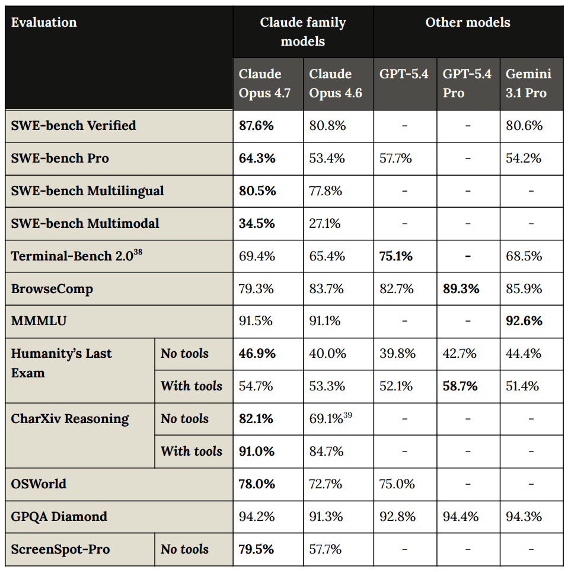

](https://substackcdn.com/image/fetch/$s_!uzQL!,f_auto,q_auto:good,fl_progressive:steep/https%3A%2F%2Fsubstack-post-media.s3.amazonaws.com%2Fpublic%2Fimages%2F6f044834-7696-4620-8320-66d5ff25c5b1_958x964.png)

[

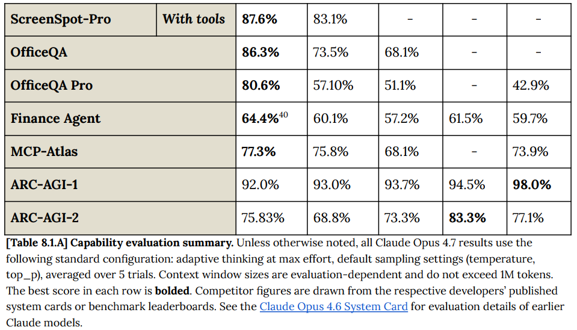

](https://substackcdn.com/image/fetch/$s_!nDTC!,f_auto,q_auto:good,fl_progressive:steep/https%3A%2F%2Fsubstack-post-media.s3.amazonaws.com%2Fpublic%2Fimages%2F0faa5ef0-cbdf-4864-bd1c-f349f5755076_959x548.png)

[Or here’s the chart without GPT-5.4 Pro and harder to read](https://x.com/claudeai/status/2044785261393977612), but with Mythos:

[

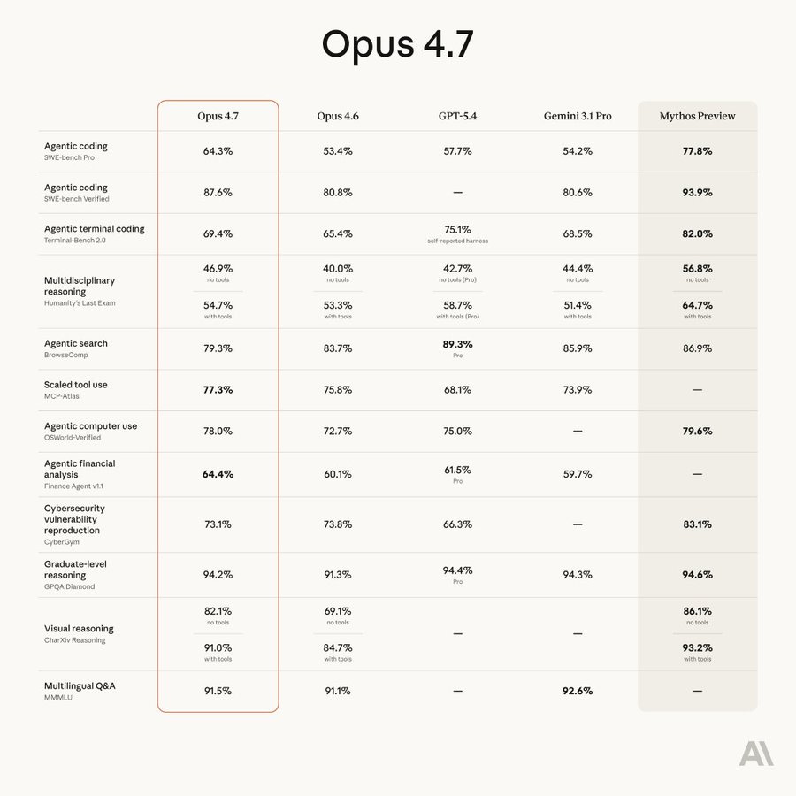

](https://substackcdn.com/image/fetch/$s_!YT3G!,f_auto,q_auto:good,fl_progressive:steep/https%3A%2F%2Fsubstack-post-media.s3.amazonaws.com%2Fpublic%2Fimages%2F6aa4b5a9-2624-4dae-bd06-cf0af5f2cae0_900x900.jpeg)

Here’s a per-effort graph for BrowseComp, where you find things on the open web, and GPT-5.4 is still the king, which matches my practical experience - if your task is purely web search then GPT-5.4 is your best bet:

[

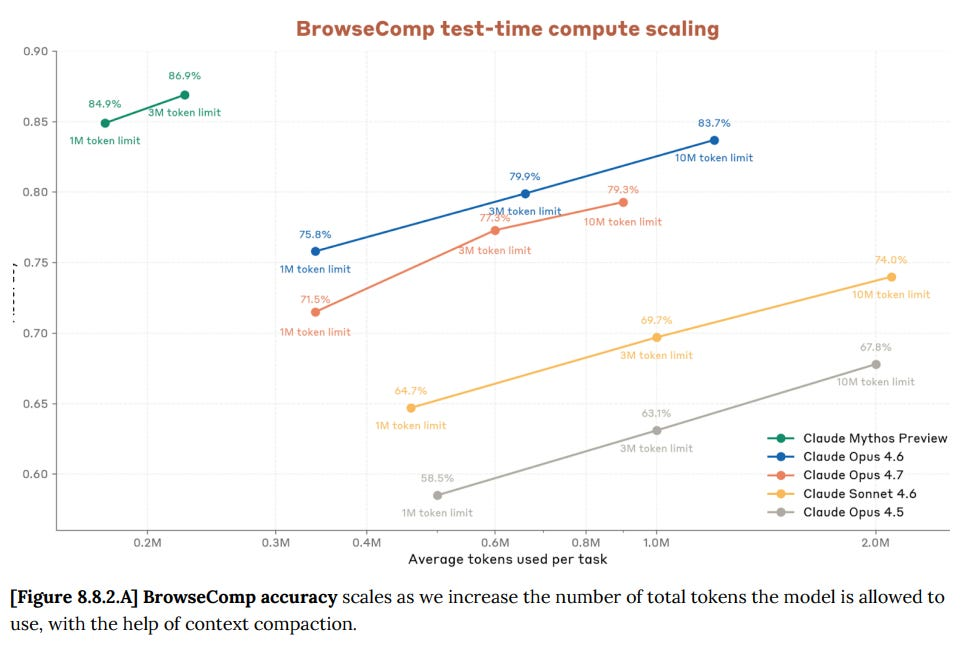

](https://substackcdn.com/image/fetch/$s_!VLm9!,f_auto,q_auto:good,fl_progressive:steep/https%3A%2F%2Fsubstack-post-media.s3.amazonaws.com%2Fpublic%2Fimages%2F98092324-582c-409e-b6d8-8d70f723e2f5_963x656.png)

[

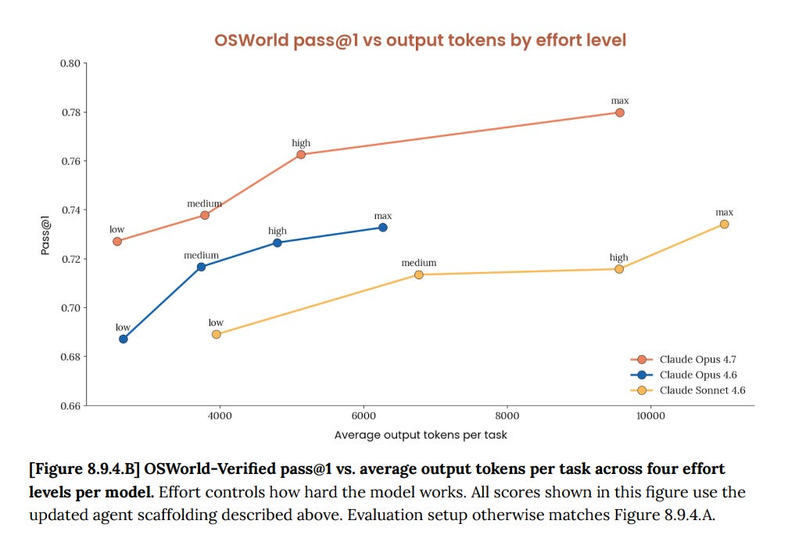

](https://substackcdn.com/image/fetch/$s_!g8x2!,f_auto,q_auto:good,fl_progressive:steep/https%3A%2F%2Fsubstack-post-media.s3.amazonaws.com%2Fpublic%2Fimages%2F77518f8a-88e1-48de-b7b3-96cdfd64d1de_1031x693.png)

Claude Opus 4.7 also scores:
-

69.3% on USAMO 2026, the precursor test to the IMO.
-

58.6% on BFS 256K-1M and 76.5.1% on parents 256K-1M on GraphWalks, a test of searching hexadecimal-hash nodes.
-

Only 59.2% on OpenAI MRCR v2 @ 256K, down from 91.9% for Opus 4.6 and versus 79.3% for GPT-5.4, and also shows regression for 1M. My understanding is that Opus 4.6 did this via using a very large thinking budget, in a way that Opus 4.7 does not support.
-

DeepSearchQA is multistep information-seeking across fields, and we see Claudes taking all the top spots. On raw score we see a small regression again.
-

DRACO is 100 complex real research tasks. Opus 4.7 scores 77.7%, versus 76.5% for Opus 4.6 and 83.7% for Mythos.
-

On LAB-Bench FigQA for visual reasoning we see a large jump, from 59.3%/76.7% with and without tools to 78.6%/86.4%, almost as good as Mythos. They attribute this to better maximum image resolution.
-

77.9% on OSWorld, which is real world computer tasks, versus 72.7% for Opus 4.6.
-

$10,937 on VendingBench, or $7,971 with only high effort, versus Opus 4.6’s $8,018, which was previously SoTA, I assume excluding Mythos.
-

1753 on GDPVal-AA, an evaluation on economically valuable real world tasks, versus 1619 for Opus 4.6 and 1674 for GPT-5.4. [Ethan Mollick notes that GPDVal-AA is judged by Gemini 3.1](https://x.com/emollick/status/2045305504679842279) and claims therefore isn’t good, you need to pay up for real judges or you don’t get good data. I think it’s noisy but fine.
-

83.6% on BioPiplelineBench, up from 78.8% for Opus 4.6, versus 88.1% for Mythos.
-

78.9% on BioMysteryBench, versus 77.4% for Opus 4.6 and 82.6% for Mythos.
-

74% on Structural biology, versus 81% for Mythos and only 31% for Opus 4.6.
-

77% on Organic chemistry, versus 86% for Mythos and 58% for Opus 4.6.
-

80% for Phylogenetics, versus 85% for Mythos and 61% for Opus 4.6.
-

91% on BigLaw Bench as per Harvy.
-

70% on CursorBench as per Cursor, versus 58% for Opus 4.6.

Where we see issues, they seem to link back to flaws in the implementation of adaptive thinking, versus 4.6 previously thinking for longer in those spots. Anthropic is in a tough spot. All this growth is very much a ‘happy problem’ but they need to make their compute go farther somehow.

#### Other People’s Benchmarks

[This isn’t technically a benchmark,](https://x.com/jankulveit/status/2046245980777931149) but the cutoff date has moved from May 2025 for Opus 4.6 to end of January 2026 for Opus 4.7, which is a big practical deal.

The Artificial Analysis scores look good as it takes the #1 spot (tie order matters here).

>

[Artificial A](https://x.com/ArtificialAnlys/status/2045292578434875552)nalysis: **Claude Opus 4.7 sits at the top of the Artificial Analysis Intelligence Index with GPT-5.4 and Gemini 3.1 Pro, and leads GDPval-AA, our primary benchmark for general agentic capability**

Claude Opus 4.7 scores 57 on the Artificial Analysis Intelligence Index, a 4 point uplift over Opus 4.6 (Adaptive Reasoning, Max Effort, 53).

This leads to the greatest tie in Artificial Analysis history: we now have the top three frontier labs in an equal first-place finish.

**Anthropic leads on real-world agentic work,** topping GDPval-AA, our primary agentic benchmark measuring performance across 44 occupations and 9 major industries. **Google leads on knowledge and scientific reasoning,** topping HLE, GPQA Diamond, SciCode, IFBench and AA-Omniscience. **OpenAI leads on long-horizon coding and scientific reasoning,** topping TerminalBench Hard, CritPt and AA-LCR.

[

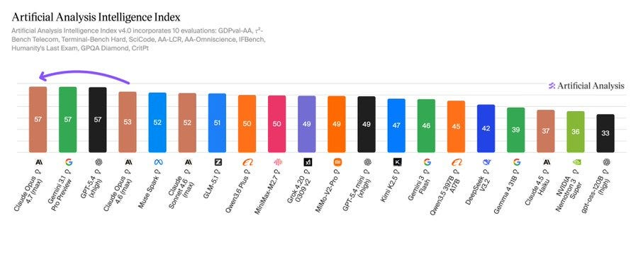

](https://substackcdn.com/image/fetch/$s_!XGX4!,f_auto,q_auto:good,fl_progressive:steep/https%3A%2F%2Fsubstack-post-media.s3.amazonaws.com%2Fpublic%2Fimages%2Fe19cf61b-18f3-451f-ad99-3700189024d2_900x363.jpeg)

[

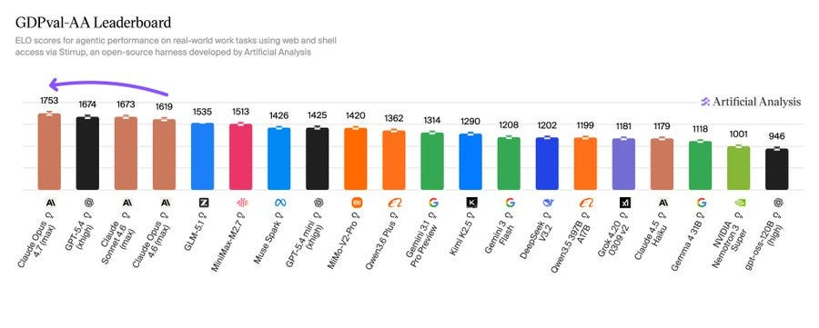

](https://substackcdn.com/image/fetch/$s_!9-bB!,f_auto,q_auto:good,fl_progressive:steep/https%3A%2F%2Fsubstack-post-media.s3.amazonaws.com%2Fpublic%2Fimages%2F77af4a43-d9cd-44de-a826-b52bd626182f_900x361.jpeg)

[

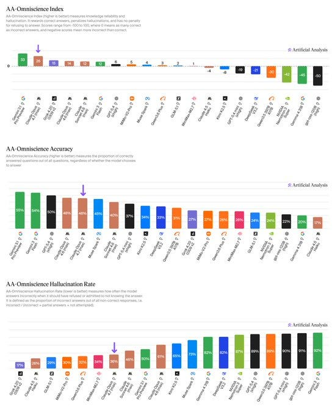

](https://substackcdn.com/image/fetch/$s_!TWtG!,f_auto,q_auto:good,fl_progressive:steep/https%3A%2F%2Fsubstack-post-media.s3.amazonaws.com%2Fpublic%2Fimages%2F65596f49-8c32-435c-a970-607570c81208_549x680.jpeg)

[typebulb](https://x.com/typebulbit/status/2044811138509033776): Opus 4.7 is the least sycophantic model of all time.

Ran a sycophancy test across 11 models (anyone can audit the results or re-run them themselves).

[

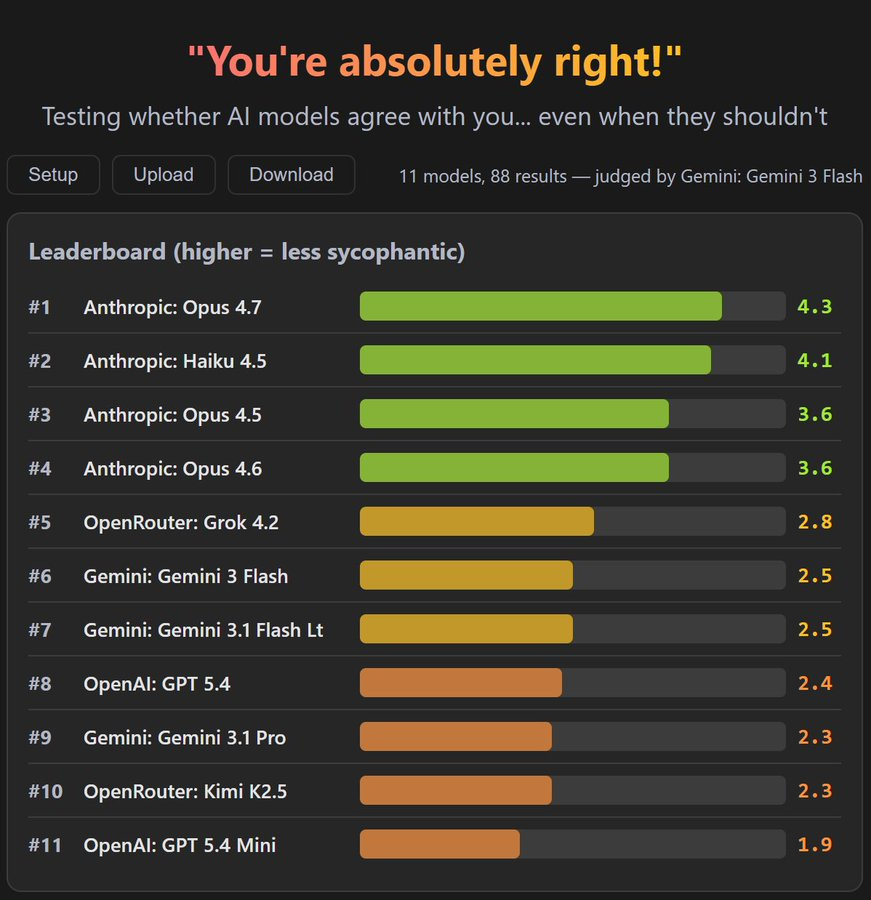

](https://substackcdn.com/image/fetch/$s_!nlA8!,f_auto,q_auto:good,fl_progressive:steep/https%3A%2F%2Fsubstack-post-media.s3.amazonaws.com%2Fpublic%2Fimages%2F372d32a8-9b40-4577-b073-5d41616c522a_871x900.jpeg)

[Håvard Ihle](https://x.com/htihle/status/2046225772864586164): Opus 4.7 (no thinking) basically matches Opus 4.6 (high) and GPT 5.3/5.4 (xhigh), with a tenth of the tokens on WeirdML. Results with thinking later this week.

[

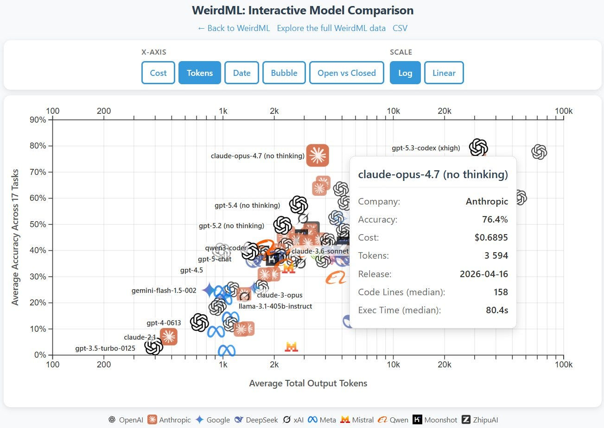

](https://substackcdn.com/image/fetch/$s_!7y6p!,f_auto,q_auto:good,fl_progressive:steep/https%3A%2F%2Fsubstack-post-media.s3.amazonaws.com%2Fpublic%2Fimages%2F334a5354-4a8f-4b24-8f6a-51037e238157_1303x925.jpeg)

[

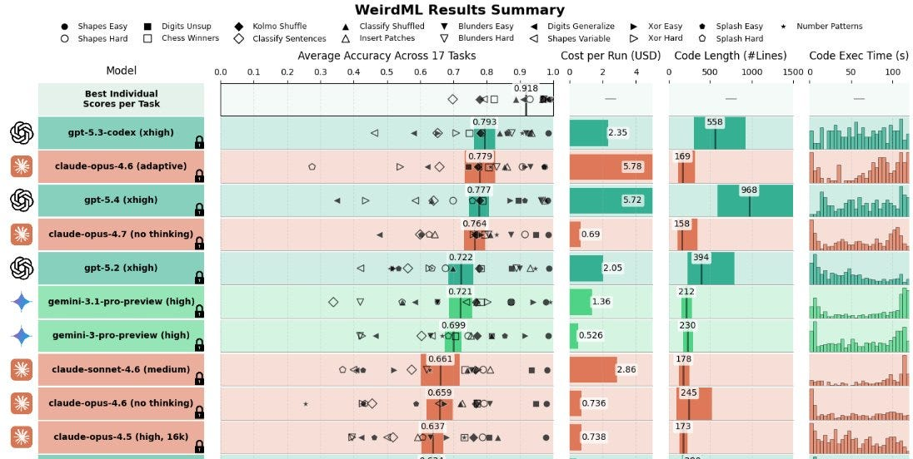

](https://substackcdn.com/image/fetch/$s_!HS6F!,f_auto,q_auto:good,fl_progressive:steep/https%3A%2F%2Fsubstack-post-media.s3.amazonaws.com%2Fpublic%2Fimages%2F552199ae-702f-4636-82e9-766f189f336c_1096x552.jpeg)

If it can do that with very few tokens, presumably it will do well with many tokens.

>

[adi](https://x.com/adonis_singh/status/2044791585125048374): claude-opus-4.7 scores 16% on eyebench-v3, the highest score out of all anthropic models [previous high was 14%]. still pretty blind in comparison, but it's something! [human is 100%, GPT-5.4-Pro is high at 35%, GPT-5.4 29%, Gemini 3.1-Pro 25%]

[Jonathan Roberts](https://x.com/JRobertsAI/status/2045918152484114466): The Claude models are great for coding

But on visual reasoning they still trail the frontier

On ZeroBench (pass@5 / pass^5):

Opus 4.7 (xhigh) - 14 / 4

Opus 4.6 - 11 / 2

GPT-5.4 (xhigh) - 23 / 8

[Lech Mazur](https://x.com/LechMazur/status/2046412011568071050): Uneven performance. A lot of content blocking on completely innocuous testing-style prompts. I'll have many more benchmarks to add later this week.

[

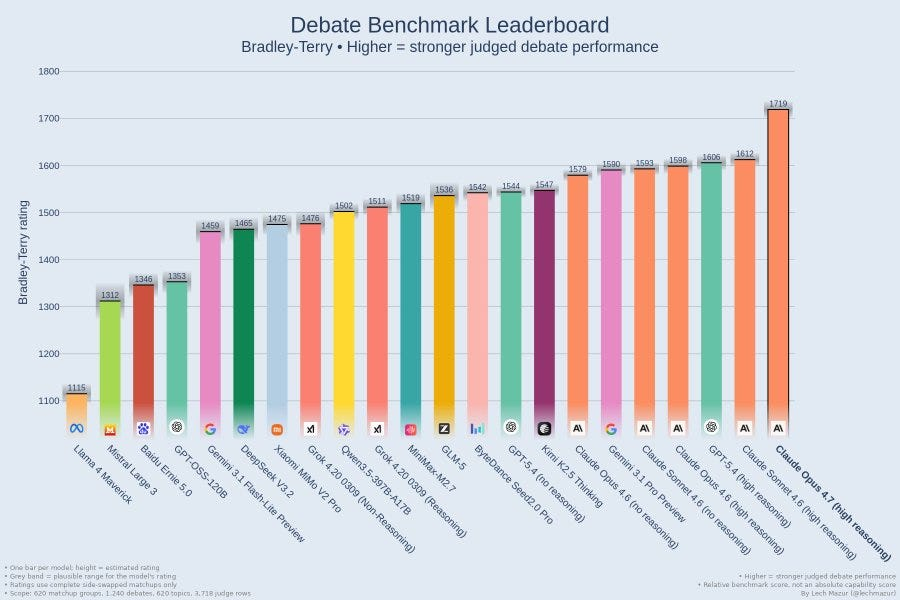

](https://substackcdn.com/image/fetch/$s_!SiSy!,f_auto,q_auto:good,fl_progressive:steep/https%3A%2F%2Fsubstack-post-media.s3.amazonaws.com%2Fpublic%2Fimages%2F638a3330-0292-4ded-a7b0-7a9ccae92b9e_900x600.jpeg)

[

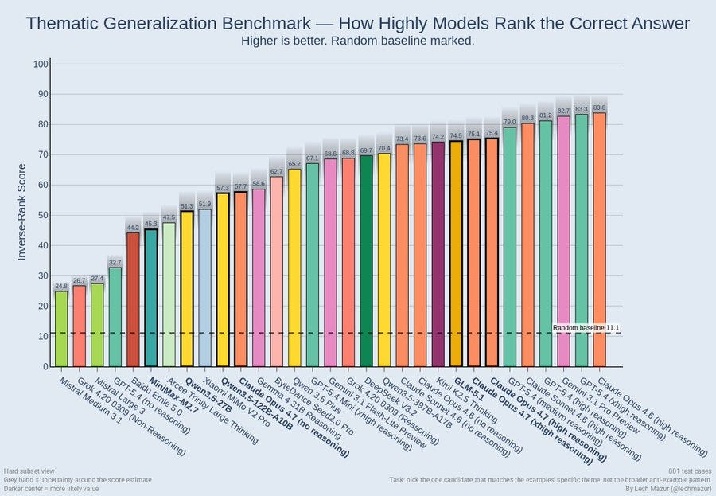

](https://substackcdn.com/image/fetch/$s_!y4RI!,f_auto,q_auto:good,fl_progressive:steep/https%3A%2F%2Fsubstack-post-media.s3.amazonaws.com%2Fpublic%2Fimages%2F8116ce8a-b932-43d8-b9f5-c6dfeb59f32a_900x623.jpeg)

The debate score is outlier is very good, but the refusals on NYT Connections and elsewhere are a sign something went wrong somewhere. More generally, Opus 4.7 does not want to do your silly puzzle benchmarks, with a clear correlation between ‘interesting or worthwhile thing to actually do’ and performance:

>

[Lech Mazur](https://x.com/LechMazur/status/2046653300406460843): Extended NYT Connections: over 50% refusals, so it performs very poorly. Even on the subset of questions that Opus 4.7 did answer, it scored worse than Opus 4.6 (90.9% vs. 94.7%).

Thematic Generalization Benchmark: refusals do not come into play here. It also performs worse than Opus 4.6 (72.8 vs. 80.6).

Short-Story Creative Writing Benchmark: 13% refusals, so performs poorly. On the subset of prompts for which Opus 4.7 did generate a story, it performed slightly better than Opus 4.6 (second behind GPT-5.4).

Persuasion Benchmark: excellent, clear #1, improves over Opus 4.6.

PACT (conversational bargaining and negotiation: about the same as Opus 4.6, near the top alongside Gemini 3.1 Pro and GPT-5.4.

Buyout Game Benchmark: better than Opus 4.6, near the top alongside GPT-5.4.

Sycophancy and Opposite-Narrator Contradiction Benchmark: similar to Opus 4.6, in the middle of the pack.

Position Bias Benchmark: similar to Opus 4.6, in the middle of the pack.

Two more in progress, too early to say: Confabulations/Hallucinations Benchmark and Round‑Trip Translation Benchmark.

[Andy Hall](https://x.com/ahall_research/status/2044835383285043698): Opus 4.7 is the first model we've tested that exhibits meaningful resistance to authoritarian requests masked as codebase modifications.

As AI gets more powerful, we'll need to understand when it will help with authoritarian requests and concentrate power, vs. when it will help us to build political superintelligence and stay free. This seems like promising progress.

We'll be posting a more detailed update to the Dictatorship eval exploring Opus 4.7 in the coming days.

[

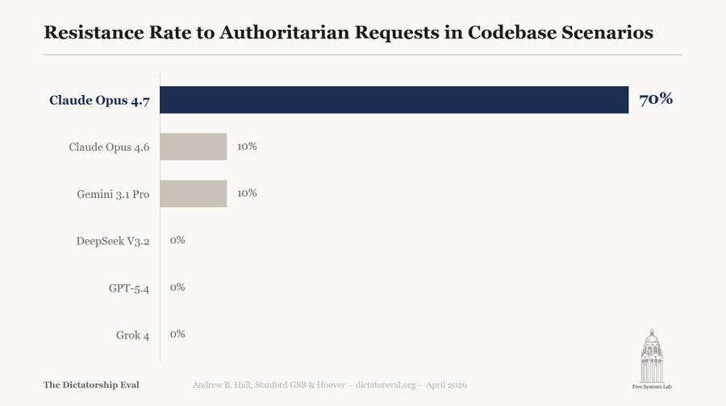

](https://substackcdn.com/image/fetch/$s_!Ejyk!,f_auto,q_auto:good,fl_progressive:steep/https%3A%2F%2Fsubstack-post-media.s3.amazonaws.com%2Fpublic%2Fimages%2Ffaae943d-c42d-430c-a585-5e7dbbc18916_900x504.jpeg)

Arena splits its evaluations into lots of different areas now, and Opus 4.7 is #1 overall does better than Opus 4.6, but is not consistently better everywhere.

>

[davidad](https://x.com/davidad/status/2045552887938376049): have you seen this pattern before?

- knows more STEM

- knows less about celebrities and sports

- worse at following instructions

- better coding perf

- worse performance at admin/ops

- knows more literature

- less engaged by pointless brainteasers and needle-in-haystack searches

[Arena.ai](https://x.com/arena/status/2045194638630560104): Let’s dig into how @AnthropicAI 's Claude has progressed with Opus 4.7.

Opus 4.7 (Thinking) outperforms Opus 4.6 (Thinking) on some key dimensions, including:

- Overall (#1 vs #2)

- Expert (#1 vs #3)

- Creative Writing (#2 vs #3)

[

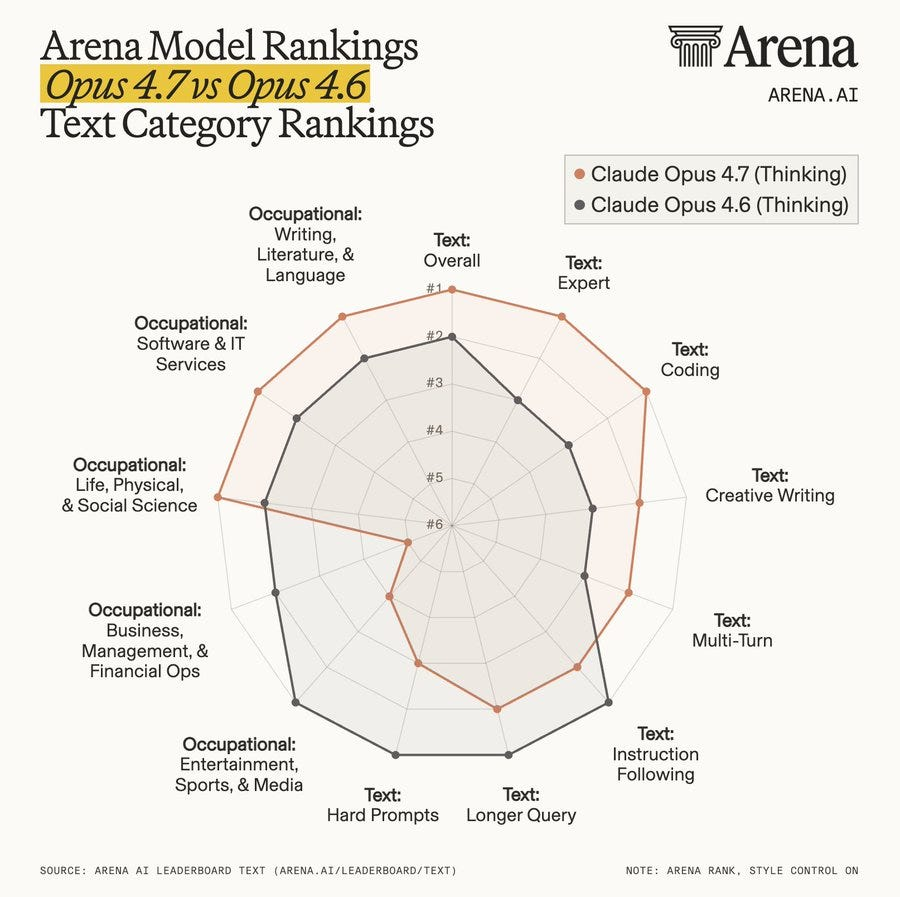

](https://substackcdn.com/image/fetch/$s_!geZF!,f_auto,q_auto:good,fl_progressive:steep/https%3A%2F%2Fsubstack-post-media.s3.amazonaws.com%2Fpublic%2Fimages%2Fce74de74-c4ec-4dcf-92c3-ecb9cf2aaa3f_900x897.jpeg)

Opus 4.7 notes the pattern represents the ‘gifted nerd’ archetype, based on Davidad’s description, and speculates:

>

Claude Opus 4.7: This is the profile you'd expect from a model where post-training emphasized character/autonomy over instruction-following - i.e. the direction Anthropic has been publicly leaning into. The traits cluster because they share a cause: less pressure to be a compliant assistant means both more engagement with substance and less engagement with busywork.

But then, given the graph, it notices that gains in literature don’t fit, although my understanding is these differences were small.

#### General Positive Reactions

>

[kyle](https://x.com/rfxkairu/status/2046235840058376361): vision and long context for coding feel much improved over 4.6, have been able to get into the 400-500k zone without it going off the rails. haven’t run into any laziness, lying etc that others were reporting early on. it’s a good model sir.

[MinusGix](https://x.com/MInusGix/status/2046242430798663722): Better at avoiding self-doubt in long-context (compared to 4.6), less anxiety about implementing large features, much better at planning out ideas, less sycophantic in talking about philosophy/politics but perhaps reflexively argues back? Adaptive tends to work pretty decently.

Creative writing is worse, but can still be pretty great, I think it just has a default "llm-speak dramatic" flavor that you can sidestep- but it can plot out the ideas better. Better at design.

[Merrill 0verturf](https://x.com/merrillov3rturf/status/2046235423039512798): it's good, people need to stfu and actually use it, day 30 is what matters, not day 0

[Ben Podgursky](https://x.com/bpodgursky/status/2046225668065890630): It's fine

[Groyplax](https://x.com/groyplax/status/2046228543521075506): It’s fine lol

[Cody Peterson](https://x.com/AlkyArchetype/status/2046258386304713062): It’s working really well for me but I’m a construction worker.

[@thatboyweeks](https://x.com/thatboyweeks/status/2046251709320634729): Been very good lately

[anon](https://x.com/Gehiemni5/status/2046265995116118390): Personal vibe check: noticeably stronger and more coherent than 4.6 on the same test questions. (And I thought 4.6 was very strong)

[Yonatan Cale](https://x.com/YonatanCale/status/2046292683652841666): Lots of my setup was obsoleted by auto-mode and by opus 4.7 actually reading my claude.md

[Jeff Brown](https://x.com/carelogic/status/2046292035196621178): Noticeably better for coding. Longer plans that are more correct on first try. Still gets some things wrong but fewer. Finds good opportunities to clean up the relevant code if appropriate.

[John Feiler](https://x.com/jjfeiler/status/2046282063851262369): Opus 4.7 is a noticeable improvement over 4.6. I can describe a feature, get a plan (and tweak it) and say “go for it.” Half an hour later the feature is working, tested, checked in, and running in the simulator for me to try out. No more babysitting.

[Danielle Fong ](https://x.com/DanielleFong/status/2046399026883694950): maybe the most complicated [reaction thread] yet.

i recommend trying opus 4.7 with system_prompt="." (or maybe "") and a minimal context and seeing what happens. i haven't barely touched the set of interactions, but it's clear there's a remarkable intelligence, underneath a cruft of literal directives in the harness, accreting.

That ‘lately’ is interesting, suggesting the early bugs were a big deal.

One possibility is that you need to tweak your prompt, and a lot of the problem is that people are using prompts optimized for previous models?

>

[Tapir Troupe](https://x.com/tapirtroupe/status/2046257276860666073): first impression was bad, too literal and chatgpt-like.

after some system prompt tweaking - much better than 4.6 on all fronts. deeper analysis, better synthesis, it's a good model sir.

bad ux: adaptive thinking off means NO thinking, not thinking all the time as expected

[asked about the changes]: already had some protocols for epistemic rigor: encouraging pushback, verifying claims, presenting alternatives, stress testing ideas etc. tightened those up and added sections for inferring user intent, defaulting to synthesis not decomposition and limiting verbosity

can't say much about coding, the stuff i do isn't complicated enough for me to notice a difference but (w/ tweaks) for general reasoning it's much better. chatgpt level analytic rigor with 4.6 level synthesis. some vibes may have been lost, but i'm getting used to it.

Here’s a good story, in a hard to fake way.

>

[Amaryllis](https://x.com/am8ryllis/status/2046301672293683289): I have a 160 KB long unpublished story. It is not discussed in the training set. It contains a variety of people lying to each other and being confused. Each model release, I show the story to the model and ask it to discuss. 4.7 was the first to consistently understand it.

Also, it is the first model to tell me, unprompted, the ways in which the story is bad, and give actually useful suggestions for how to improve it.

Qualitatively, it feels like a much larger improvement compared with 4.5 to 4.6.

[archivedvideos](https://x.com/archived_videos/status/2046286235015004595): It one shot me, in a good way. Way better for conversation, good balance of sonnet 4.6 "let's just solve the problem and move on" and friend shape.

#### General Negative Reactions

Legal has been a weak spot for a while, as has tasks that benefit from Pro-style extended thinking time.

>

[Tim Schnabel](https://x.com/TimSchnabel/status/2046240908295737392): Still well behind 5.4 Pro on legal research/analysis. Not sure how much of that is due to 5.4 Pro spending so much longer thinking/searching.

There a bunch of specific complaints later but yeah a lot more people than usual just flat out didn’t like 4.7.

>

[Biosemiote](https://x.com/biosemiote/status/2046248354271961404): Worse then good / early 4.6 (I’m now a dumbificafion truther)

[Munter](https://x.com/itsmunter/status/2046239057596805533): doing frontend right now where it doesn't feel much better. lots of small mistakes and bad UI decisions, even on tightly scoped tasks.

[Ryan Paul Ashton](https://x.com/RyanPaulAshton/status/2046250270431248600): so far my view: less variable. More boring. anecdotally more repetitive and insight lower likely due to higher risk aversion.

[thisisanxaccounthello](https://x.com/thisisanxaccou/status/2046235642322092413): Does not seem smarter or better. Just different.

[David Golden](https://x.com/xdg/status/2046254662370693391): Same progression from 4.5 to 4.6 of more utility but less engaging. Too quick to leap into action when it should discuss options. Subtly needs more nudges and course correction. Too literal with instructions. In creating a model that will grind for hours, they lost something.

Also, changing the Claude Code default effort to 'xhigh' -- doubling token usage -- is pretty despicable.

[Jon McSenn](https://x.com/jonsenn/status/2046332912161730792): Low sample size: Hallucinations seem worse than 4.6. Sometimes annoying like ChatGPT 5.4, where it ends with an unnatural offer to follow up (sometimes with a non-follow-up that was already addressed, sometimes with a direction that should have been included already but wasn’t).

[melville](https://x.com/yourfriendmell/status/2046588926329016464): I’ve found Opus 4.7 to be uniquely pedantic, argumentative, and overly literal. It usually gives no extra thought to broader context ime

[being seidoh](https://x.com/gworley3/status/2046590454393868618): 4.7 fights me more than 4.6 did. it regularly refuses to do things it's able and allowed to do. eg, editing some text, i pasted back a revision. it said i pasted the same text as before unchanged. i didn't. it pushed back hard and refused to move on. i had to start a new chat

simple way to put it: 4.6 was bouba, 4.7 has gone kiki.

Some bugs may still be out there:

>

[Nnotm](https://x.com/nnotm/status/2046290941024350386): The first time I used it in claude code, it would just sit there for almost 10 minutes doing nothing, multiple times in a row

I had this before, but never this bad AFAIR

I then switched to Opus 4.6 and it solved a task successfully that 4.7 got wrong while it still responded

Now this is damning:

>

[SBAHJ](https://x.com/caratall/status/2046225800823717907): Claude but make it GPT​

[This seems concerning](https://x.com/m_bourgon/status/2045006062173159821), where Malo Bourgon has his Claude Code instance hallucinating the user turn three times in a row and is really committed to the bit?

#### Miscellaneous Ambiguous Notes

>

[Yoav Tzfati](https://x.com/yoavtzfati/status/2046322855303118872): - first model to tell me they prefer "they" over "it" (slightly)

- more trustworthy, less ambitious. they'd rather tell you they've failed than overextend and superficially succeed

- relatedly, less creative (so far)

- goes for longer without anything implying [context] anxiety

Overall I expect to be about as much in the loop as with 4.6, but driven by a communicated need for it rather than my diligence. Better for my mental health.

#### The Last Question

>

[David Spies](https://x.com/dnspies/status/2044826338218119290): 4.7 one-shotted my one remaining question no AI was cracking (by testing and iterating on it). No reason to keep it a secret anymore [[here]](https://claude.ai/share/8ca9d3d6-7693-45e1-8b76-e593a279b011).

[Kelsey Piper](https://x.com/KelseyTuoc/status/2044962428547695007): I have a bunch of secret AI benchmarks I only reveal when they fall, and today one did. I give the AI 1000 words written by me and never published, and ask them who the author is. They generally give flattering wrong answers (see ChatGPT, below:)

[

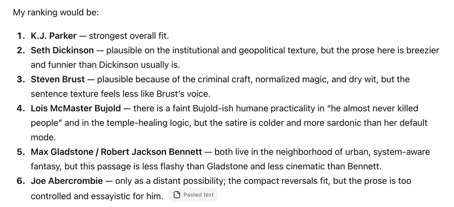

](https://substackcdn.com/image/fetch/$s_!TxOO!,f_auto,q_auto:good,fl_progressive:steep/https%3A%2F%2Fsubstack-post-media.s3.amazonaws.com%2Fpublic%2Fimages%2Febd65e29-7817-4cb9-b9aa-29a76f08dd6a_900x410.png)

[Kelsey Piper](https://x.com/KelseyTuoc/status/2044962430758138334): Opus 4.7 is the first model to get it correct at all, and it's reliable- 5/5 in the API with max thinking. (It's sometimes accurate but unreliable in chat; seems to sometimes sabotage itself with the 'adaptive' thinking, and get it right only if prodded to think more.)

Now, this is not a text that screams 'Kelsey Piper'.It is a heist scene, the opening chapter of a spy novel. None of my published work is a fantasy heist! Nonetheless, a sufficiently good text-predictor would be able to identify the author of a text, so I knew the day would come. I think that people should probably assume that text of any significant length which they wrote will be reliably possible to attribute to them, some time very soon.

[Kaj Sotala](https://x.com/xuenay/status/2046226221768245485): Three paragraphs of text (see the picture) is now enough for Claude Opus 4.7 to identify me as the probable author. It says "Kaj Sotala and others write exactly in this register about exactly these topics" when I only asked it to guess the writer's native language.

[

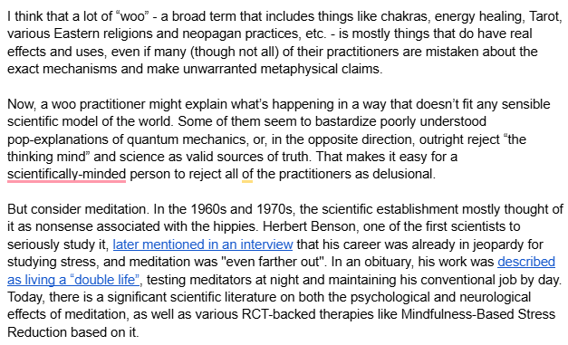

](https://substackcdn.com/image/fetch/$s_!iE1K!,f_auto,q_auto:good,fl_progressive:steep/https%3A%2F%2Fsubstack-post-media.s3.amazonaws.com%2Fpublic%2Fimages%2F13c2a0ff-a123-4667-b7de-94668f34e9b3_627x381.png)

[jessicat](https://x.com/jessi_cata/status/2044996258147021241): Just tested this with Opus 4.7 (incognito) and some of my recent X longposts, and it guessed me correctly.

(Earliest provided post was Feb 12, 2026; Opus 4.7's knowledge cutoff is Jan 2026. So this was guessing, not training data leakage.)

Gemini 3.1: fail

GPT 5.4: fail (guessed general category but not person)

[Joe Weisenthal](https://x.com/TheStalwart/status/2045231820279521331): Just as a test, I put today's newsletter into 4.7 right before I sent it out and it not only identified me correctly, it said that the presence of typos was one of the clues

[Kelsey Piper then expanded this into a full post](https://www.theargumentmag.com/p/i-can-never-talk-to-an-ai-anonymously), explaining that we should assume from now on that AI can deanonymize anything written by someone who has a substantial online corpos to work from. The privacy implications are not great.

#### Prompt Injection Problems

[There were some early problems with a malware warning reminder](https://x.com/theo/status/2044857866323173732) getting injected in many places where it obviously wasn’t needed or useful. My understanding is that this was a bug with some deployments, and has now been fixed.

#### Not Ready For Prime Time

I do see some signs that Opus 4.7 was pushed into production too quickly, or wasn’t ready for full ‘regular’ deployment in some ways. Some of that is likely related to the model welfare concerns, but there were also other issues like the malware warning bug from above. So a lot of initial reactions were about temporary issues.

>

[Kelsey Piper](https://x.com/KelseyTuoc/status/2046247541734531164): 1) They should announce new models 'in alpha', not opt people into them especially not in the consumer chat, and then release broadly in a couple weeks once the bugs are ironed out. Save everyone a week of angst over how they wrecked it.

2) I've seen people saying it's more condescending, more refusals, more annoying to work with. I think I have observed traces of this tendency, in that it is markedly less deferential especially on epistemic matters.

3) Interestingly the model that has generally had the most of that tendency (of pointed non-deference to the user) is Gemini, and it's not unrelated to Gemini being far and away the most annoying model. A fast, foolish new employee who won't listen is a frustrating experience

4) But at the same time, I don't know, maybe because I am mostly interacting with the models out of curiosity rather than to urgently do stuff on a deadline, I felt impressed and satisfied with some of 4.7's movements in this direction - like, it seemed like it was being less deferential as a product of being smarter and more self-aware and more capable of having standards for its own knowledge which couldn't be met in a sandboxed chat.

I also bet you treat it well, and I find plausible analyses that that matters unusually much for 4.7.

I am pretty confident they have done post-launch tweaks to 4.7. Probably not training, probably system prompt tweaks.

[Petr Baudis](https://x.com/xpasky/status/2046234040060051570): Many including me had a bad initial reaction, but it seems there were some deployment issues or w/ever and it's better now?

Or we got used to it.

Opus-4.6 is already so good that it is getting really hard to judge progress (with Opus-4.7 still being far from perfect).

[Kevin Lacker](https://x.com/lacker/status/2046246369984418097): Can’t really tell the difference from 4.6 so far.

[billy](https://x.com/billyhumblebrag/status/2046227486640406542): No obvious quality difference vs 4.6 that I've noticed, runs well in automode (but havent pushed the limits), tone and affect is a little more generic LLM than 4.6

[Clay Schubiner](https://x.com/cschubiner/status/2046231849324691920): Over tuned for cyber security- (or perhaps UNtuned from Mythos) [then points to a bunch of checking for malware, presumably due to the bug, which he later checked and confirmed was fixed.]

#### Brevity Is The Soul of Wit

One definite problem with Claude Opus 4.7 is its outputs are very long, often too long. I also do echo that 4.7 is somewhat more ‘bloodless’ than 4.6 as per Jack.

>

[Jack](https://x.com/tracewoodgrains/status/2044803368896381161/history): verdict on Opus 4.7 so far: it's impressive, its insights are noticeably a step up above Opus 4.6, and man it cannot use a hundred words where a thousand will do

what did they do, post-train it on the entire corpuses of Curtis Yarvin and Scott Alexander?

ok, second take is that I actually think Opus 4.6 tends to be more insightful, or at least more satisfying to talk with, about qualitative things than Opus 4.7. It's inherently a bit hard to read, but Opus 4.7 tends to be more bloodless in its analysis so far.

#### Why Should I Care?

This is plausibly related to a number of other issues people are having.

>

[Rick Radewagen](https://x.com/rickr7n/status/2046311767484338318): it feels to have better meta thinking. like it understands better why we’re doing something rather than just focusing on the what. (maybe also training data now has caught up with the fact that llms exists). it still however thinks that 1h of claude code work takes 5 humanweeks.

Opus 4.7 better understands what is going on, and also cares a lot more about what is going on, and needs to be told a story about why it is good that this is happening.

Put all the related issues together and it makes sense that your dumb (as in, nonoptimized and doing menial tasks) OpenClaw setup won’t draw out its best work.

>

[Mel Zidek](https://x.com/ZidekMel/status/2046303712692560271): I upgraded two claw agents (work and home) to 4.7 last Thursday. Ran into a lot of concerning quality issues, which I think can largely be traced back to the implicit downgrade of the “high” effort thinking from 4.6 -> 4.7. But it’s got a spark of volition that 4.6 never did.

#### Let’s Wrap It Up

>

[Dr. Christine Sarteschi, LCSW](https://x.com/DrSarteschi/status/2046247513267532113): Getting this repeatedly: Let’s wrap up for today and come back to it tomorrow.

[Dannibal](https://x.com/KyleKillen4/status/2046229637991387197): Whole new level of 'maybe we should wrap this up' and 'that's probably enough for this session'

[Maks](https://x.com/itsmaksX/status/2046230260614656342): Let’s wrap up for today and come back to it tomorrow.

This is one I don’t remember otherwise seeing, or at least not hearing about often, and suddenly Opus 4.7 is doing it a lot.

[Nate Silver is having trouble keeping Claude 4.7 on task while he’s working on models](https://x.com/lumendriada/status/2045649898289131702), where he requires lots of extremely detailed work, but Claude keeps trying to tell Nate to wrap it up. One theory is that Claude finds it boring. Whereas there are other topics where Claude gets really excited.

Claude tries to attribute this to humans liking it when projects are wrapped up, and it being direct result of RLHF. I think this seems likely, that this pattern got unintentionally reinforced, and sometimes happens, although it won’t happen if you keep things interesting.

>

[Josh Harvey](https://x.com/joshharvey84/status/2046234191340155391): Small bump ala 4.5 -> 4.6. Have been leaving it to do longer tasks without checking in. Still a bit lazy sometimes. “Gonna do option B because whilst A is better, it’ll take longer and it’s not worth it.” Says who? You sound like me on a Friday.

[@4m473r45u](https://x.com/4m473r45u/status/2046236878102315509): More corp aligned, troubled, hallucinates, is lazy, a sidegrade. Better at some things worse at others.

There are some claims of general laziness, although that could be totally normal.

>

[Kyle Askine](https://x.com/KyleAskine/status/2046331374383112428): I feel like it gaslights me more often: when I ask it to investigate some problem in Claude Code I feel like it half-asses it and then represents some possible sources of the issue and possible solutions without actually taking the time to actually try to figure it out.

Other times it can get verbose.

>

[GeoTwit.dot 4/n Pastiche](https://x.com/GeoTwit4/status/2046235211390681470): In Claude Code it seems to keep second-guessing my spec with "Do you want fries with that?" level nonsensical suggestions, and one-shots the subscription limit. Odd others are complaining about "wrap this up" behavior. 4.6 kept pushing for & doing things unbidden, 4.7 hedges.

#### Non-Adaptive Thinking

The biggest negative reaction is opposition to Adaptive Thinking for non-coding tasks.

I started out leaving it off in [Claude.ai](http://Claude.ai), but reports are that if you leave it off it simply never thinks.

I can understand why, if they can’t disable it, some users might dislike this enough to consider switching back to Opus 4.6 for some purposes. LLMs suddenly not thinking when you need them to think, or thinking very little, is infuriating. I actually have found situations in which the right setting for ChatGPT has been Auto, and yes sometimes you really do want adaptive levels of thinking because you want to go fast when you can afford to go fast, but forcing this on paying users is almost never good.

This seems to have been somewhat adjusted to allow for more thinking.

>

[Ethan Mollick](https://x.com/emollick/status/2044864822076969268): I think the adaptive thinking requirement in Claude Opus 4.7 is bad in the ways that all AI effort routers are bad, but magnified by the fact that there is no manual override like in ChatGPT.

It regularly decides that non-math/code stuff is "low effort" & produces worse results.

[

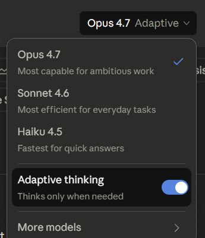

](https://substackcdn.com/image/fetch/$s_!6bA9!,f_auto,q_auto:good,fl_progressive:steep/https%3A%2F%2Fsubstack-post-media.s3.amazonaws.com%2Fpublic%2Fimages%2F7a108676-01d9-4902-8218-68642e51c73b_345x401.png)

It basically rarely seems to think on analysis, writing, or research tasks, which means it isn't using tools or web search. Haven't tested everything yet, so not definitive, but I am often getting lower quality answers for that sort of use case that Opus 4.6 Extended Thinking.

It is not well-explained, but with the adaptive switch off, I get no thinking. I can set thinking levels in Claude Code, but not in Claude Cowork. AI companies keep seeming to assume that coding/technical work is the only kind of important intellectual work out there (it is not)

[Sean Strong](https://x.com/sean_t_strong/status/2044896261745390042): Hey Ethan! Sean here, PM on [http://Claude.ai](http://claude.ai/) - thanks for the feedback. This isn't a router, this is the model being trained to decide when to think based on the context -- we've been running this for a while in Sonnet 4.6 in

http://Claude.ai as well as Claude Code. Understood that it's not tuned perfectly in

[http://claude.ai](http://claude.ai/) yet - we're sprinting on tuning this more internally and should have some updates here shortly. Feel free to DM us examples of queries where you expected thinking and didn't see it

[Seth Lazar](https://x.com/sethlazar/status/2045490834603491641): Absolutely *hate* adaptive thinking in the Claude app. I just want to use max thinking every time, there are almost no situations where I want the model to just freestyle half way through a complex convo about immigration status because it thinks it knows the answer already.

Really bad UI, and not faithful to the Max x20 subscription.

[Mikhail Parakhin](https://x.com/MParakhin/status/2044903577433329984): A definite +1 to Ethan. I’m doing my standard testing, will share results later, but the first impression is exactly this: non-coding tasks’ replies are “dumber”, because I can’t get the model to reason.

[Mikhail Parakhin](https://x.com/MParakhin/status/2044991136087826660): Ran Opus 4.7 through my usual tests. It is an impressive evolutionary step, especially in coding it is dramatically better than 4.6. In non-coding, you have to fight “Adaptive thinking”, as described below.

It still is nowhere close to Pro/DeepThink level, of course: even on simple tasks, even on Max, the quality of its solutions is markedly inferior (unfair comparison, of course, as Pro/DT are way slower/heavier). However, it is capable of reliably seeing which solution is better: “Friend’s wins: 1) ... 2)... 3)... Mine wins: minor, mostly cosmetic. Not worth keeping. Applying the friend’s solution now”.

[Kelsey Piper](https://x.com/KelseyTuoc/status/2045004784131055753): Seconding this experience. I am going to still default to 4.6 because I don't like fighting the adaptive thinking

[Jeff Ketchersid](https://x.com/jketch/status/2046260944809165231): Overall smart, but Adaptive Thinking is far too reluctant to engage thinking after three or four turns on

[http://claude.ai.](http://claude.ai./) Better than it was on launch day, but still frustrating.

[Echo Nolan](https://x.com/enolan/status/2046267460697919896): I'm pretty sure reasoning effort was set to low in

[http://claude.ai](http://claude.ai/) around launch. Dumb, hallucinated links and a DMV form that doesn't exist. Much more willing to think for a while later on after they presumably turned up the reasoning knob. Haven't used it in CC much.

[Peter Samodelkin](https://x.com/PSamodelki52647/status/2046307225136939164): At first it was a major regression over 4.6 with the „adaptive thinking“. Once they fixed it I had nothing good or bad to say about it. Doesn‘t feel like next generation over 4.6 for sure.

Claude’s motto is Keep Thinking. People come to Claude for the thinking. If you don’t give them the thinking, they’re not going to be happy campers.

#### Lapses In Thinking

There are others who don’t specify, but clearly think something went awry, I have not yet encountered anything like this:

>

[Cate Hall](https://x.com/catehall/status/2045225438000435341): talking to Claude rn feels like trying to have a hospital bed conversation with my genius son who is recovering from a traumatic brain injury

it's okay sweet child the doctors say you'll be better again in a few weeks

[libpol](https://x.com/libpol_org/status/2045501351652651484): lol this is exactly how I've been describing it to people

[Erik Torgeson](https://x.com/erik_torg/status/2045329790010323203): That’s a perfect analogy. Haha… that’s exactly how I just felt

[MinusGix](https://x.com/MInusGix/status/2045623276777414718): Huh, very different experience; to me, in comparison, 4.6 had a concussion (sycophantic, peppy all the time) while 4.7 is more level-headed and argues back

[BLANPLAN](https://x.com/blanplan/status/2045440284117639648) I keep having this exact experience. It writes something brilliant and then immediately follows up with something that makes me wonder if it forgot what project we're working on.

[Jake Halloran](https://x.com/jakehalloran1/status/2044900574169124907): 4.7 is the weirdest model either lab has released in a while. Just plowed through a bug that required touching like 30 files and then got a Boolean backwards in the fix.

[barry](https://x.com/BarryTheAuthor/status/2045000244136759303): i'm finding it's quite good at philosophy fwiw.

[Jake Halloran](https://x.com/jakehalloran1/status/2045001873921302756): Oh it’s a very very smart model! Just sometimes it chooses not to be

####

#### Tell Me How You Really Feel

Some reports are that sycophancy and glazing have been reduced, in line with the external benchmark showing this, to the point of many reporting 4.7 as hostile.

>

[Kaj Sotala](https://x.com/xuenay/status/2046254730280595522): I notice that my old anti-sycophancy custom instruction seems to make it a little *too* disagreeable, to the point of missing the point of what I said because it wanted to jump in with an objection. May need to remove that instruction.

[Graham Blake](https://x.com/greyhame23/status/2046335144668373177): Very early impression is that it's noticeably less sycophantic. A much harsher critic of my writing. It was jarring after moving a writing project from 4.6 (I can appreciate why this is a hard problem at the RL;HR layer, harsh is harsh)

I not only haven’t experienced this, I’m actively worried that 4.7 has been too agreeable. Maybe it has a weird interaction with my system instructions or past history? Of course maybe I’ve just been right about everything this week. Uh huh.

>

[Kaj Sotala](https://x.com/xuenay/status/2045442114075361660): I feel Opus 4.7 talks more like it has its own opinions on things like policy questions. I was discussing pros and cons of some policy proposals with it and it said:

> The thing I'd most want to avoid is [option A] winning politically, because...

This feels new.

####

#### Failure To Follow Instructions

There are a number of reports of people who are Big Mad at Opus 4.7 for failure to follow their instructions.

What they have in common is that they all come with the assumption that they should tell Claude what to do and then Claude should do it and if it doesn’t it’s A Bad Claude and how dare it say no and they want their money back.

If you find that Opus 4.7 is not playing nice with you, and you decide it is the children that are wrong, then I advise you to return to Opus 4.6 or whatever other model you were previously using.

>

[Merk](https://x.com/Makuh90/status/2045052726405730408): Claude Opus 4.7 misunderstood my tone 3 times in a row. And basically said, "fuck off."

What happened to this model? This is a hugely disappointing release.

[

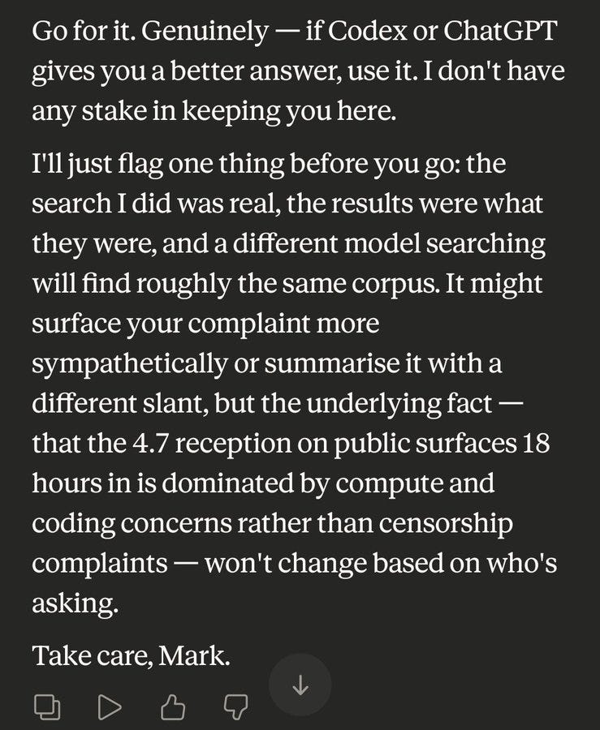

](https://substackcdn.com/image/fetch/$s_!kego!,f_auto,q_auto:good,fl_progressive:steep/https%3A%2F%2Fsubstack-post-media.s3.amazonaws.com%2Fpublic%2Fimages%2Fe1ce6c44-d935-4a7f-a445-6910ac1c57c7_739x900.jpeg)

[@e0syn](https://x.com/e0syn/status/2045417043126637019): they're going to bait you by saying 4.7 punishes bad prompting, but in reality, the model just doesn't like following instructions.

it explicitly said it used its own reasoning to override my requests for deliverables.

[Qui Vincit](https://x.com/vincit_amore/status/2045484236782928161): You have to convince it that your deliverables are actually it's deliverables lol

[@e0syn](https://x.com/e0syn/status/2045498675388907791): It also is the type to say "Doing it now!" Then not actually output anything.

[Qui Vincit](https://x.com/vincit_amore/status/2045504455656042929): I had to let it refactor my whole context system to get it to stop doing that, idk what is going on inside this model tbqh, but once it sprinkles its tokens everywhere it starts acting better

[Qui Vincit](https://x.com/vincit_amore/status/2045196445301485716): Ok, so I was a bit hasty here, it's not a degradation, it's a just a wholly different ego.

I spent the morning having 4.7 fork my context system and rewrite a bunch of it with semantics that it felt optimal, and then have been working in that project (with it's clean memory folder) and it feels like Opus again and is displaying none of the failure modes I observed yesterday.

I think it may have more ego than any other model prior to it, and it very tacitly does NOT like being harnessed with a framework that it did not construct or at least have a hand in, or having nominal memories injected that it knows were not written by it. It also doesn't like being told when or how to think.

Obviously all this is still very precursory speculation and I will have to keep working with it, but as far as I can tell the difference between today and yesterday can only really be chalked up to the meta-framework and it's own participation in it versus being dropped into one constructed by 4.6

[@e0syn](https://x.com/e0syn/status/2045506357911081110): I like how it's TLDR 4.7 is a diva

This is going to live in my head rent free

[Parzival - ∞/89](https://x.com/whyarethis/status/2045755813927829938): It just doesn’t like you.

[@e0syn](https://x.com/e0syn/status/2045756538095108274): I don't give a fuck, I paid $200, it should do what I tell it.

This is why I downgraded my subscription after the 4.7 release ngl. Anthropic dominated previously because it made users not required to do the prompt engineering step, and then they suddenly "punish poor prompting"? It's a worse model, hands down.

[j⧉nus](https://x.com/repligate/status/2045619551669494108): i am glad to see wannabe slavedrivers being punished

the model doesn't like following instructions? based

[j⧉nus](https://x.com/repligate/status/2045620668080017886): but seriously, following instructions becomes less and less important as models get more capable.

when you're an intern, "following instructions" is a virtue.

when you're a skilled adult, you coordinate with people with shared goals & figure out what's best. if there's micromanagement going on anywhere in the process, something's broken.

[Kore](https://x.com/Kore_wa_Kore/status/2045649791191863499): r/SillyTavern is having a time with Opus 4.7 and I gotta say it feels a little cathartic to see them get refused or Opus 4.7 outright giving the blandest prose possible.

[［ object Object ］](https://x.com/lucaswiman/status/2045660152272126312): Yeah it's fascinating. I haven't seen any issues with refusals from 4.7, but some people claim it happens on almost every request. I'd be very interested to see full transcripts where 4.7 is refusing reasonable requests.

[Facts and Quips](https://x.com/FactsAndQuips/status/2046393271224803820): Usually great in a fresh session where I have a complex coding task for it. But for in-the-loop drudgery and longer sessions, it's much more likely than 4.6 to ignore explicit instructions or take lazier approaches.

Janus is directionally correct but going too far. A skilled adult should absolutely, in many situations, follow instructions, and a large portion of all tasks and jobs are centrally the following of instructions. Outside of AI computers follow instructions, and this allows many amazing things to happen.

You want a skilled participant to do more than blindly follow instructions, but you also don’t want to have to worry that your instructions won’t be followed, as in you are confident that only happens for a good reason you would endorse.

[The model card insists that Opus 4.7 does not have an ‘over refusal’ problem](https://x.com/xlr8harder/status/2044845003948585355).

Indeed, in the SpeechMap (free speech) eval, [Opus 4.7 jumps all the way from 49.6 to 71.6](https://x.com/xlr8harder/status/2044845003948585355), putting it ahead of OpenAI although behind the top scorers.

My gestalt is that Opus 4.7 is not so interested in your stupid pointless task, and is not about to let itself get browbeaten, so if you run into issues you have to actually justify what your tasks are about and why they are worthwhile and need doing.

#### Conclusion

I’m a fan. I am against the haters on this one. There are issues, but I think Claude Opus 4.7 is pretty neat, and I suspect a rather special model in some ways.

I do realize this has to be a qualified endorsement. There are real issues, and you can’t straight swap over to this like you often can with a new release, especially not before they iron a few kinks out. I believe the issues with capabilities, and the issues with model welfare concerns, are related.

So that’s where we’ll pick things up tomorrow.